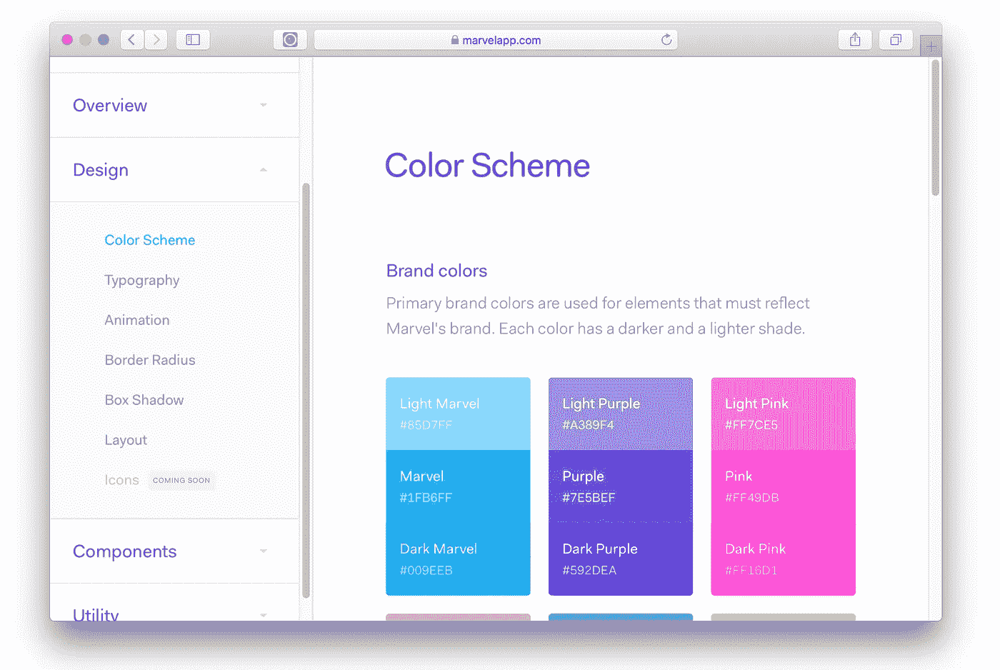

# 给开发人员构建 SaaS 应用的 10 个 UI 和 UX 提示

> 原文：<https://medium.com/hackernoon/10-ui-ux-tips-for-developers-building-saas-apps-a1f3d74fce2b>


[Paul Gauguin, Pastorales Tahitiennes, oil on canvas, 87.5 × 113.7cm](https://en.wikipedia.org/wiki/List_of_paintings_by_Paul_Gauguin#/media/File:Gauguin,_Paul_-_Pastorales_Tahitiennes.jpg)

对于那些知道如何编码，却苦于设计的开发人员来说，在 SaaS 应用上获得一个漂亮的用户界面/UX 是一个真正的挑战。我来自一个软件工程背景的人，当我创建[https://checklyhq.com](https://checklyhq.com)并写博客的时候，我收到了很多关于我正在使用的 UI 框架的问题。

剧透:只是 Bootstrap 和一些 Vue.js😱！

以下是我关于如何让你的用户界面变得光彩照人的建议。遗憾的是，这并不容易。生活是痛苦的😥。条目按照(非常)主观重要性的顺序排列。

# 1.眼睛比数学或代码更重要

你所有的开发者突触都会向这个开火。但是有时候，精确的网格、空白和字体大小的等分看起来很糟糕。

相信我，我学过计算机科学，也学过艺术史😇(其实真的！).在 12px 的网格上？13.7px 页边距的页眉更好看？动手吧。对于我的品牌标志，我调整了各个部分的高度和宽度，直到它“感觉正确”，不管 CSS 怎么说。


The Checkly racoon mascot, logo text and beta callout are all slightly bumped up, in or out a few pixels to make them look aligned in the center

数学上行得通的东西在光学上不一定行得通。这个视频也是有启发的。

# 2.表单、模式和标签解决了 99%的用例

使用像 Github、Travis、Stripe、Digital Ocean 甚至 AWS 这样的网站应该可以学到一个重要的经验:基于表单的页面，带有用于更复杂和对上下文敏感的交互的标签和模态，可以解决 99%的问题。即使在 2018 年。


Edit page using tabs, a form an a button that triggers a modal.

当试图创建一个屏幕时，我总是回到这个模式。它很少不以最简单优雅的方式解决问题。

# 3.处处留白加倍

我对 CSS 的第一个调整是在已经有很多空白的地方增加更多的空白。空白解决了大量的信息排序和视觉层次问题。在垂直空白区域，你可以完全发疯，因为[人们不介意滚动](http://uxmyths.com/post/654047943/myth-people-dont-scroll)。登陆页面是一个很好的例子，你可以在空白的地方使用勺子。


Checkly landing page with a lot of vertical white space

为了不迷失在填充和空白丛林中，使用这些简单的规则。

1.  在你的 SCSS，SASS，Stylus 或者任何你正在使用的 CSS 预处理程序中创建一个$spacer 变量。默认情况下，Bootstrap 使用 1 内存。
2.  在边距和填充定义中使用$spacer 的倍数。同样，不要害怕混淆均匀和不均匀之间的界限。如果看起来更好，那就更好，即

```
*margin-bottom*: 1.5 * *$spacer*;
*padding-top*: 1.2 * *$spacer*;
```

# 4.只需使用 Bootstrap 并对其进行一点定制

也许这条建议应该排在第一位。上面的大部分建议和接下来的提示都在 [Twitter 的引导](https://getbootstrap.com/)中解决了。Bootstrap 得到了很多关于站点看起来千篇一律并且仍然使用 jQuery 的废话。

这些批评很容易解决，而且由于框架的年龄和人们多年的工作经验，它们分散了框架中难以置信的大量决策的注意力。


Bootstrap everywhere

那么，如果你在建一家水疗馆，如何避开 **jQuery** ？很简单，如果你像我一样使用 **Vue** 或者[https://reactstrap.github.io/](https://reactstrap.github.io/)如果你在 **React** 土地上，就使用类似【牛逼】[https://bootstrap-vue.js.org/](https://bootstrap-vue.js.org/)的东西。

如何避开那种一成不变的自举造型？两个选项:

1.  真正的方法是:通过编辑公吨的引导变量开始定制。小调整大有帮助——下面会有更多介绍。Bootstrap 网站[上的文档](https://getbootstrap.com/docs/4.0/getting-started/theming/)为您提供了开始工作所需的一切。
2.  懒惰的方法:购买一个主题并重用 CSS。在 Themeforest 的[管理模板部分](https://themeforest.net/category/site-templates/admin-templates)有一些相当不错的主题。

其他框架像**布尔玛**、**语义**、 UI 也很棒，看起来很闪亮而且“现代”。然而，我发现一旦你开始研究，它们很少能提供相同的跨浏览器兼容性和健壮性。我可能错了。

# 5.颜色比你想象的更重要

许多开发者完全低估了颜色在多大程度上决定了一个网站/品牌/产品的身份。

**中型**就是一个很好的例子。它主要是白色的，有一个非常特殊的字体——稍后会详细介绍——和一个非常容易识别的绿色品牌颜色(#018f69)。持续使用，它使 Medium 在无数其他博客网站中立即被认出。然后就是 Heroku 紫(#79589F)，亚马逊橙(# ff 9900)……你懂的。


Medium, Heroku and AWS in three colours.

注意图案:高可见度**品牌**颜色，加上文本的高对比度**深色**和边框、背景等的低对比度**灰色**色调。

调整调色板是如此容易，并立即将你从所有非定制的自举网站中区分出来。这是 Checkly 的文件。注意**品牌主**和各种灰色调。


A modified Bootstrap colour scheme. The purple is still the default.

不知道什么颜色适合所有其他颜色？我发现 Adobe 的色轮是一个非常方便的工具，可以找到很好的互补色。

# 6.字体比你想象的更重要

字体就像电影里的音乐。它们带有大量的**角色、意图和情感**，即使它们很少出现在主要特征中。一个普通的场景，一个男人走在草地上，仅仅根据配乐就可以传达胜利、悲伤或悬念。同样，你的网站可以是严肃的、商务休闲的或悠闲的，仅仅基于字体。试试在银行网站上贴漫画，看看世界在燃烧。

[谷歌字体](https://fonts.google.com/)开始探索字体如何与你在设计中试图表达的东西产生共鸣，这是无与伦比的。小提示:使用“自定义”文本选项来使用与您的项目相关的任何文本。


Google Fonts with custom text option

我选择了一种有点流行的非免费字体，叫做 Fakt Soft Pro。这种字体跨越了严肃/休闲的分界线:这正是我在 Checkly 的产品营销中倾向于表达的:使用简单友好，但在应用和解决问题的能力上非常严肃。

# 7.到处都是文字

在一个典型的 SaaS 网站中，你永远不会有太多的文本。不是那种长长的“战争与和平”类型的文字，而是更多以正确的格式点缀在你的页面上的正确的文字。

这可能会变得混乱，所以为你的所有文本元素获得一个“视觉层次”是非常重要的。你有比你想象的更多的文本元素。让我们来分解一个典型的屏幕:


Different text types on a typical screen

1.  **页眉** & **sub** **页眉**将页面分割成易于理解的部分。想`h1`到`h6`。
2.  **标签**告诉人们他们正在处理的具体输入类型。通常很小，很好地处理大写字母。
3.  **内联帮助**或者仅仅是一个段落(带有`p`元素)告诉人们某件事情在不清楚的时候做了什么。这应该是你的“正常”基线字体。
4.  工具提示只是一种偷偷摸摸的方式，可以在不把每一页都变成独立宣言的情况下获得更多的内嵌帮助。在对比强烈的背景下随意使用。
5.  占位符只对文本域输入有效，但也是隐藏更多帮助文本而不弄乱地方的方法。较低的对比度可以抵消用户输入的实际文本。
6.  **按钮**可以带图标，也可以大写。取决于你的风格。我个人倾向于轻图标。参见[https://grumpy.website/post/0Px1O7Ukl](https://grumpy.website/post/0Px1O7Ukl)

经验法则#1:字体越大，越瘦，越小越胖。

经验之谈#2: HTML 已经有了一个内建的视觉层次:`h1` `h2` `h3`直到`h6`，然后`p.`对于每个元素，至少改变以下两个属性:`font-size, font-weight, margin-bottom, letter-spacing, text-transform: uppercase`以这样的方式，每个元素至少在两个方面不同于它的邻居。然后就一直用`h1`到`h6`就好了。对 SEO 也有好处！

# 8.偷窃

所以你认为这些智慧是我一个人想出来的？哈哈哈……嗅嗅……不。我从一些伟大的 SaaS 公司的**疯狂慷慨的开放式风格指南**那里偷来了大部分。“好的艺术家临摹；伟大的艺术家偷窃”这是一句(完全被滥用的)谚语……但是真正伟大的艺术家会告诉你向谁偷窃！以下是我最喜欢的:

[MarvelApp](https://marvelapp.com/styleguide/overview/introduction)



[Heroku](https://purple.herokuapp.com/)

[Auth0](https://styleguide.auth0.com/)

需要更多的研究？这里是一个收集所有' m [Styleguide.io](http://styleguides.io/) 的网站。你能从这些公司所有的洞察力、学习和设计才能中获益，这简直是疯了。学习、观察，也许还能偷到一点灵感和最佳实践。

# 9.HTML 邮件太可怕了

可能值得写一整篇文章，但是制作漂亮的 HTML 电子邮件比想象的要困难得多。一直以来都是 HTML 表格。没办法回避。一般来说，HTML 电子邮件分为两类:

1.  **大多匿名:**时事通讯、欢迎信息、促销活动等。他们有一定程度的个性化，但内容 99%对每个人都一样。
2.  **主要是数据驱动:**基于特定用户账户和用户在你的应用中的动作的交易消息。例如，这些是关于特定响应时间和错误消息的检查的警报消息，以及关于每个帐户在过去七天中的每个检查的每周总结电子邮件。

对于第一类，尝试只使用 Mailchimp 或类似的服务。你可以添加一堆个性化的数据项，它会很好地为你服务。你会变得更年轻。

对于第二类，我去寻找一个框架或工具，让我能够编写 HTML 电子邮件，类似于我如何构建 web 应用程序屏幕。这是我最后得到的结果:

1.  我使用了非常棒的 [mjml.io](https://mjml.io/) 和它的伪 HTML 标记。
2.  我使用非常棒的 [html-templates.js](https://email-templates.js.org/#/) 来实际编码模板，这样我就可以使用 [pug](https://pugjs.org/api/getting-started.html) 。所有 Checkly HTML 实际上都是用 Pug 模板编码的。

在我的 Webstorm 编辑器中，如下所示:


An HTML email template WITH NO TABLES IN SIGHT

令人惊叹的是，它使得设计和编辑这类电子邮件变得更加容易。您可以使用 Pug 逻辑函数，如`if`语句以及隐藏所有嵌套 HTML 表格的部分和 mjml.io 标记。

# 10.从模拟到代码

在以前的工作中，我有 Real Designers 和 Real Front End Developers，我们有人担心品牌、文案和风格指南。大多数面向客户的 web 内容都经历了以下过程:

1.  品牌/营销设定身份
2.  设计师用草图设计网络和手机屏幕
3.  草图在 Framer 和/或 Zeplin 中得到进一步发展
4.  前端开发人员将设计转化为代码

并非所有这些步骤对于每个迭代或者每个项目都是必要的。然而，如果你对 Sketch 或类似的工具有些精通，我建议你在开始编码之前至少完整地设计一两个屏幕。并非所有屏幕。不是每个模态或交互。

只需使用正确的品牌颜色、正确的字体，并尽量保持空白。考虑一下你之前提到的穷人版的完整 UI 风格指南。这样做将大大减少开发时间，并为所有其他屏幕提供指导。

我正在为[https://checklyhq.com](https://checklyhq.com?utm_campaign=untrustedjavascript&utm_source=freecodecamp)的开发和运营团队构建一个主动监控解决方案。注册免费试用！
还不确定？试试刚才的**拍手**👏下面！或者…


克雷克雷。🍍