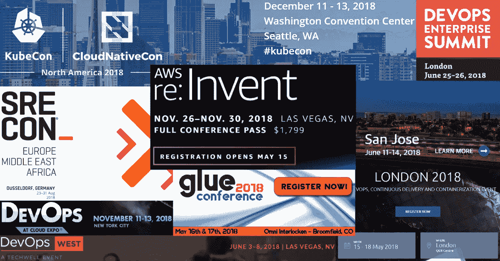

# 10 场即将到来的 2018 年 DevOps 会议

> 原文：<https://medium.com/hackernoon/10-upcoming-devops-conferences-for-2018-5ef95669c5e1>

我们列出了 2018 年 DevOps 大会的名单，其中发言人数最多，合作伙伴最突出，社交媒体关注人数最多。

会议很久以前就不再是获取各行业最新想法、工具和实践的主要方式。然而，在联网和记录自己(和其他市场参与者)的演示方面，它们仍然非常受欢迎，可以在日常工作中用作辅助材料，也是新项目的灵感来源。以下是 2018 年即将举行的 10 个最值得关注的 DevOps 会议。

# 开发天数

[DevOpsDays](http://www.devopsdays.org/) 是一年中多个日期在全球多个城市举行的连续活动。任何有兴趣加深对 DevOps 文化、最佳实践、推荐工作流和顶级工具的理解的人都可以参加此次活动，与来自行业领先公司和当地企业的杰出专家、远见者和从业者交流。

# 持续生命周期伦敦

[持续的生命周期。伦敦会议](https://continuouslifecycle.london/)将于 2018 年 5 月 16 日至 18 日在伦敦举行。主题演讲人将包括来自全球多家公司的专家，如来自亚利桑那州立大学的 **Linda Rising** 或来自 CNCF 的 **Alexis Richardson** ，他们将分享他们在过渡到 DevOps 和采用各种 DevOps 实践、工作流和工具方面的真实经历。CTO、DevOps 专家和 QA 工程师会对持续交付和其他 DevOps 相关主题感兴趣。

# GlueCon

如果你住在大西洋彼岸，你可能会对参加 [GlueCon](http://gluecon.com/) 活动更感兴趣，该活动将于 2018 年 5 月 16 日至 17 日在美国科罗拉多州布鲁姆菲尔德举行。该活动致力于探索最新技术进步的影响，如无服务器计算、微服务、Docker 容器和云无关 API、系统性能监控工具、DevOps 中的区块链应用以及各种其他主题。将会有 50 多位演讲者，分别来自**谷歌**、**微软**、 **Twitter** 和 **Pinterest** 、 **VMware** 和 **RedHat** 的主题演讲。

# DevOps West

[来自 Techwell 的 DevOps West 会议](https://devopswest.techwell.com/)将于 2018 年 6 月 3 日至 9 日在内华达州拉斯维加斯的凯撒宫举行。由创新者赞助，如**德尔福**、**亚特兰蒂斯**、Parasoft 和 Tap。QA，这次活动的演讲者来自**微软**、**易贝**和 **Thoughtworks** 等等。致力于软件交付周期的持续创新，这个年会聚集了来自全球不同国家的演讲者和专家的热情社区。

# 速度

[O'Reilly Velocity](https://conferences.oreilly.com/velocity) 是一个充满研讨会的会议，旨在教导 IT 专家构建高可用性、弹性和性能良好的分布式网站、应用和系统。该活动将于 2018 年 6 月 11 日至 14 日在圣何塞举行。主题演讲和演讲者来自**谷歌**、**微软**、**威瑞森**、 **Salesforce** 、 **Akamai** ，以及全球多家公司。

# DevOps 企业峰会

[DevOps 企业峰会](https://events.itrevolution.com/eur/)是计划于 2018 年 6 月 25 日至 26 日在伦敦举行的活动。这个欧洲最大的 DevOps 会议位于伦敦洲际酒店 O2，将聚集超过 **500 名与会者**，超过 **40 名来自领先 IT 企业的发言人**和来自欧盟的 **23 名赞助商**，围绕 **40 场会议**提供有用的信息。合作伙伴、主题演讲和演讲嘉宾名单包括 **Automic** 、 **GitHub** 、 **New** **Relic** 、 **Chef** 、 **XebiaLabs** 、 **Atlassian** 等等。

# SREcon 德国

[SREcon Germany](https://www.usenix.org/conference/srecon18europe#about) 于 2018 年 8 月 29 日至 31 日在德国杜塞尔多夫举行。Usenix 是主要赞助商和主办方，此次会议旨在聚集 DevOps 和软件开发专家和从业者，就进一步推进欧洲、中东和非洲公司的技术前景交流想法和经验。主题演讲嘉宾包括来自**谷歌**、**微软**、 **LinkedIn** 、 **Udemy** 、**脸书**、 **IBM** 、 **DigitalOcean** 等行业领袖。

# DevOps 峰会西

[DevOps 峰会](http://devopssummit.sys-con.com/) West 将于 2018 年 11 月 6 日至 8 日在加州圣克拉拉会议中心举行。该活动聚集了来自 IT 行业所有 DevOps 相关分支的影响者、思想领袖和聪明的从业者，主题演讲人来自 **Google Cloud、Datera、Codigm** 和 **Akvelon** 等公司。作为今年的闭幕活动之一，本次峰会将总结 2018 年最新的 DevOps 工具、实践和突破。

# AWS re:发明 2018

亚马逊网络服务将于 11 月 26 日至 30 日举办年度 [AWS re:Invent 2018](https://reinvent.awsevents.com/) 活动。这 4 天将充满黑客马拉松，研讨会，讲习班和拉斯维加斯大道的诱惑。超过 30，000 名 IT 专业人员和 DevOps 专家将享受到将向公众介绍的最新 AWS 技术的第一手体验。我们已经介绍了 [AWS re:Invent 2017](https://itsvit.com/blog/new-aws-tech-introduced-aws-reinvent-2017/) 技术新增内容，毫无疑问还将介绍 2018 年的新内容。

# KubeCon + CloudNativeCon

[KubeCon+CloudNativeCon](https://events.linuxfoundation.org/events/kubecon-cloudnativecon-north-america-2018/) 结对活动总结了全年 Kubernetes 和云技术的进步。它将于 2018 年 12 月 11 日至 13 日在美国华盛顿州西雅图举行。该活动主要面向云原生生态系统用户，但对于任何在日常 DevOps 操作中使用 Kubernetes 的人来说，这肯定会很有趣，这对于当今的任何 it 行业专家来说都是有效的。

Kubernetes 应用程序中的最佳实践和最新进展、现实生活中的使用案例以及关于改进这一基础设施管理工具使用的实用建议——所有这些都将在短短 3 天内完成。主讲人将来自 **Google** 、 **GitHub** 、 **Heptio** 、 **RedHat** 等行业大咖，千万不要错过参加的机会！

# 关于 2018 年即将召开的 DevOps 会议的结论

我们列出了 2018 年即将举行的 10 项 DevOps 活动，因此您将能够提前计划，为您的企业创建最方便、最有价值的日程。利用来自行业领先专家的最佳研讨会和小组讨论，为您的企业创造更多价值，获得竞争优势，并为您的客户提供一流的服务！

*最初，这个故事发布在我公司的博客—*[*https://it svit . com/blog/10-upcoming-devo PS-conferences-2018/*](https://itsvit.com/blog/10-upcoming-devops-conferences-2018/)