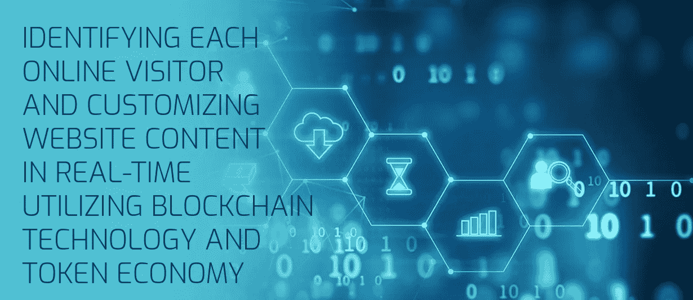

# 区块链的 10 多种用途将改变世界

> 原文：<https://medium.com/hackernoon/10-uses-for-blockchain-that-will-change-the-world-c5b96cf7c976>

# 许多人认为区块链和加密货币是同义词，但事实上这项技术不仅仅是一种支付方式。以下是区块链技术的 10 种用途。

我们的银行交易，我们的购物，我们的交流…今天一切都在网上完成。我们在网上所做的一切都被记录下来，这包括价值交换，每一次数字交易；商品和服务，等等。区块链技术将这些数据收集到永远无法更改或修改的加密块中，并在全球节点或分布式计算机网络中公开这些数据。

> *像*[*behavior exchange*](http://behaviour.exchange/)*这样的尖端数字公司已经在使用区块链科技来彻底改变我们使用互联网的方式。*

区块链是一个维护共享记录列表的分布式数据库。这些记录被称为块。加密的代码块包含该代码块在完成带有时间戳的事务之前的每个细节。把这些积木连在一起就成了区块链。这项技术可以用于许多其他方面，而不仅仅是国家货币的替代品。

# 不仅仅是加密货币背后的技术

因为区块链是一个虚拟的账本，人们可以将这种技术用于除金钱以外的各种事物。Steemit 上的一位作者称，以下是区块链的 10 种潜在日常用途，它们肯定会改变世界。

**1。分散式互联网。**程序员目前正致力于分散式互联网平台，将互联网的所有功能分布在分布式节点上，这将增加万维网的弹性。

**2。智能合同。**智能合同可以建立在分类账之上，并作为分散的应用程序运行。这些程序可以运行越来越复杂的功能，可能会减少对标准法律合同的需求。

**3。分散的市场。比特币等加密货币面临的一个挑战是，需要在可能被关闭或黑客攻击的集中交易所进行交易。分散化的市场允许在不信任第三方的情况下交易。**

**4。分布式云存储。**分布式云存储避免了对大型集中式公司的信任，在这些公司中，个人数据易受攻击，价格可能会上涨以覆盖不断增加的数据服务器数量。

**5。分散的社交网站。**社交网站是集中式的，容易受到信息审查。Steemit 等分散化的社交媒体平台缓解了这一问题，并在经济上奖励了内容创作者。

**6。加密消息。**点对点消息传递可以利用区块链技术对消息进行加密，并在许多不同的计算机上高效地存储数据位，这些计算机只能通过私钥进行访问。

**7。所有权证明。**购买的物品可以在区块链上被追踪，以证明其所有权并防止赃物被出售，这最终有助于减少犯罪。

**8。认证投票。**虽然数字投票容易被篡改，但区块链投票技术是可验证的，它允许任何人审计区块链，以确认投票是合法的并带有时间戳。

**9。证券交易所。在传统的股票市场中，股票和债券的结算通常会延迟 2-3 天。在区块链上交易股票更具成本效益，并提供即时结算。**

**10。房地产。**房产所有权、交易和历史价值可建立在区块链上，提供透明度并减少与房地产交易相关的时间和成本。

这些只是新技术带来的一些可能性。最大的一个，然而，在名单上失踪，这是先进的配置文件和定制网站。

# 最大化广告效率(和用户友好性)的定制内容

或许区块链技术最具革命性的应用是行为交换所正在做的事情。这家初创公司声称，他们能够实时调整公司网站上的内容，并根据每个访问者的个人资料，向每个访问者显示不同的内容。它是如何工作的？请访问他们的网站了解更多信息。

> *跟随大数据团队，通过*[*behavior exchange Telegram group*](https://t.me/behaviourexchange)*和* [*他们的博客*](https://medium.com/behaviourexchange) *！*