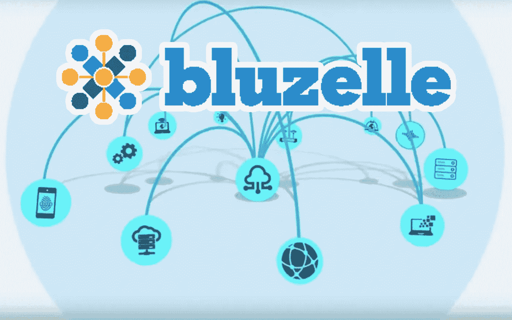
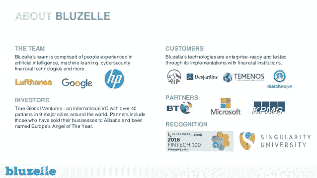
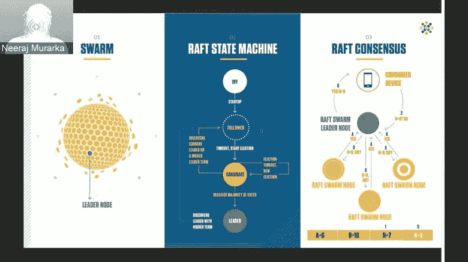
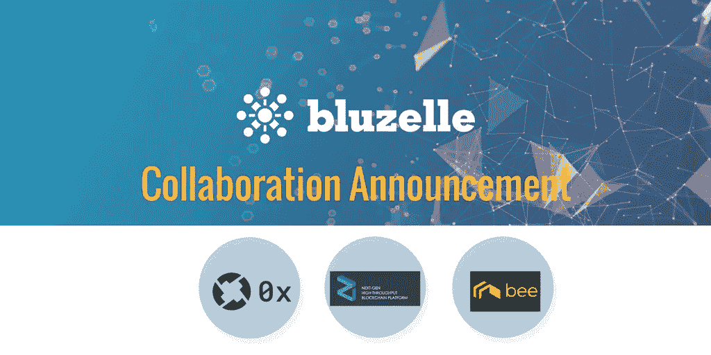

# Bluzelle 构建去中心化互联网的 10 种方式

> 原文：<https://medium.com/hackernoon/10-ways-bluzelle-is-building-the-decentralized-internet-1b8439e98108>

得益于区块链，集成技术正进入数据安全的新阶段。区块链初创公司 **Bluzelle** 希望通过建立分散的数据库系统，创造一种更安全的方式来存储和管理用户信息。当我说数据存储时，我指的不是 Filecoin 和 Storj 之类的文件存储系统，而是数据存储域&管理系统。这些系统是 DApp 开发者所需要的，因为它们足够灵活，可以进行快速简单的数据查询，在分散的互联网上为他们提供全方位的服务。这是去中心化互联网拼图中的一个主要缺失部分，Bluzelle 最近与 JD.com 的****合作获得了 1950 万美元的首轮融资！！**、最近一波**与高调的区块链项目的合作，如 0x & Zilliqa、**和**世界级咨询**委员会，如**以太坊的原始核心开发者** & **Ripple 的原始创造者**这枚硬币可能在 12 个月后以**20 美元的价格交易，而不是今天的 0.30 美元。****

# **基础知识:**

1.  **Bluzelle 项目于 2014 年 7 月左右在加拿大成立，最初只专注于支付系统，但现在已经扩大了范围。然而，它于 2016 年 2 月迁至新加坡，以利用亚洲的增长潜力。**
2.  **Bluzelle 是用于分散式互联网的下一代数据库协议,使数据库更加健壮和可靠。**
3.  **Bluzelle 生态系统将运行在两个令牌经济上，BLZ 和 BNT。生态系统中会有两个参与者。首先是**生产者，**本质上是矿工，他们向 Bluzelle 网络提供计算能力，维护整个分布式信息数据库。Bluzelle 生态系统中的第二个参与者是**‘消费者’，**他们是 dApp 开发者，希望将他们的产品存储在一个不变的、分散的平台上。消费者利用 Bluzelle 数据库网络，用 BLZ 和 BNT 代币支付这些服务。**
4.  ****股票代码:BLZ**
    价格:$ 0.30
    市值排名:151
    市值:4898.553 万美元
    流通供应量:1.65 亿 BLZ
    最大供应量:5 亿 BLZ
    交易量(24 小时):504.71 万美元
    共识:以太坊共识**

****

# **团队:**

1.  **布鲁泽尔团队由帕维尔·贝恩斯领导。除了担任 Bluzelle 的首席执行官，他还是 Bench Accounting 和虚拟现实初创公司 VR Chat 的投资者。帕维尔也是 Storypanda 的联合创始人，story panda 是一个数字图书平台，出版世界上最好的独立作者和媒体品牌的广受好评的书籍。Pavel 曾在视频游戏工作室担任总经理和首席财务官，包括在迪士尼互动工作室工作。**
2.  **蓝精灵的首席技术官是**尼拉杰·穆拉卡**。Neeraj 是一名软件工程师和计算机系统架构师，在尖端技术领域拥有 20 多年的专业知识。他曾为谷歌、IBM、惠普、汉莎航空、泰雷兹航空电子和 Zynga 的项目工作。**
3.  ****BluZelle 团队的顾问**包括:**

*   **布莱恩·福克斯:兰花实验室的首席技术官**
*   **Alex Leverington :原始核心以太坊开发者**
*   **Ryan Fugger:Ripple 的原创者**
*   ****迈克尔·叶戈罗夫**:nucy pher 的首席技术官**

****

# **增长驱动因素:**

1.  **我将从 Bluzelle 最近与 JD.com 的合作说起，按收入计算，它是中国最大的零售商，也是世界第三大电子商务公司！如果这是在牛市中宣布的，Bluezelle 将飙升至每枚 10 美元。回想一下 Tron 爆炸到 0.28 美元只是来自阿里巴巴合作伙伴关系的传言。**
2.  **Bluzelle 可靠的“群”技术将微小的数据存储在遍布全球的节点群(群)上，消除了任何单点故障。**
3.  **Bluzelle 拥有无限的扩展能力，因为他们的算法将数据存储在一个独特的网络模型中，不依赖于数据中心，能够在瞬间扩展数据库服务。**
4.  **Bluzelle 是为**动态性能**而构建的，因为它可以调整节点分片数据的数量和位置，以减少请求时间并提高整体性能。**
5.  **今年早些时候，Bluzelle 宣布与各种**高调的区块链项目合作，其中包括** [**0x**](https://0xproject.com/) **、**[**Zilliqa**](https://www.zilliqa.com/)**和** [**Bee Token。**](https://www.beetoken.com/)**
6.  **Bluzelle 有一个**一流的顾问委员会**，其中包括**兰花实验室的首席技术官**、最初的核心以太坊开发者之一**阿历克斯·勒弗灵顿**、阿帕奇·卡珊德拉的联合创始人**普拉尚特·马利克**以及 Ripple 的最初创造者**瑞安·富格**。该公司令人印象深刻的顾问名单显示了区块链社区对这项技术的重视程度。**
7.  **2017 年 8 月，Bluzelle 在由风险投资公司 Global Brain、LUN Partners Capital 和 True Global Ventures 支持的 A 轮融资中筹集了 150 万美元。**
8.  **2017 年 10 月，Bluzelle 在 **Forrester 的“供应商格局:亚太地区的区块链技术提供商”**报告中被提名，并被**世界经济论坛**评为技术先锋。**
9.  **当 Bluzelle 的网络完全运行时，它的**存储容量将是当前企业 IT** 存储容量的大约 10，000，000 倍，是微软、谷歌和脸书拥有的存储中心每 Tb 存储成本的 0.001 倍。**
10.  **Bluzelle 生态系统将运行在一个**双令牌生态系统，BLZ & BNT** ，类似于近地天体&气体。我相信 BLZ 令牌将作为治理和 BNT 将是气体动力系统。**
11.  **Bluzelle 能够**创建一个高效的加密经济生态系统**，在这里，拥有多余计算资源(CPU 处理能力、内存、永久存储和网络连接)的“生产者”与希望访问额外数据库空间的“消费者”相连。市场需求大。**

****

# **逆风:**

1.  **该产品仍处于开发早期，因此可能会有潜在的障碍，但他们的白皮书和人才应该能够解决任何可能出现的问题。**
2.  **这个项目的成功不仅取决于 Bluzelle 的产品有多好，还取决于它是否对用户友好。**
3.  **由于监管总是会落后于创新，数字货币领域未来可能会受到新监管的约束。**

# **结论:**

**Bluzelle 认为区块链数据库是增强安全性并使合作伙伴组织之间的验证更容易的理想方式。Bluzelle 是在共享令牌经济中增强安全性并使验证更容易的最佳方式，因为 Bluzelle 系统用户能够租用个人的计算机存储空间来获得令牌，而 dApp 开发者使用令牌来存储和管理他们的 dApp 数据。凭借 Bluzelle 与 JD.com 的合作伙伴关系、风投支持、世界一流的顾问委员会以及他们的项目范围，这枚硬币在 12 个月内可能会以每枚 20 美元的价格交易。**

****