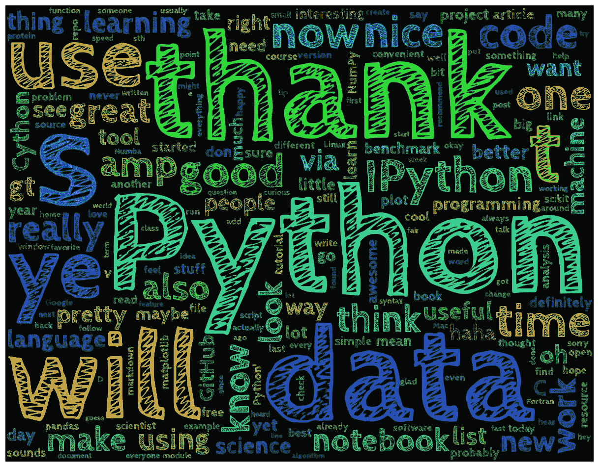

# 二十五年后，人们仍然对 Python 着迷

> 原文：<https://medium.com/hackernoon/10-ways-to-make-python-a-dangerous-language-for-data-science-6b88566ac040>

## …我觉得很难相信。这里有 10 种方法可以让 python 成为数据科学的危险工具。



**def** multiply(x,y):
z = x*y
**return** z#call the function to multiply the numbers 2 and 3
multiply(4,3)

**输出:12 个**

# 2.Python 数据类型和序列

Python 有内置的数据类型来存储数字和字符数据。让我们来看看几种常见的类型。

```
type(' My name is Shimanto')
```

**输出:str**

```
type(5)
```

**输出:int**

```
type(5.0)
```

**输出:浮点**

```
type(**None**) #None signifies 'no value' or 'empty value'
```

**输出:NoneType**

```
type(multiply) #multiply is a function we created previously
```

**输出:功能**

现在，让我们看看如何存储数字和字符的列表，以及如何执行一些基本的操作。


Photo on [Unsplash](https://unsplash.com/search/photos/python?utm_source=unsplash&utm_medium=referral&utm_content=creditCopyText)

# I .元组:它们是不可变的数据结构，不像列表那样可以改变

```
a = (1,2,3,4)
type(a)
```

**输出:元组**

# 二。列表:它们是可变的对象

```
b = [1,2,3,4]
type(b)
```

**输出:列表**

让我们给上面创建的列表 b 添加一个数字。

```
b.append(2.5) *#append to list using this function*
print(b)
```

**输出:[1，2，3，4，2.5]**

遍历列表并打印数字

```
**for** number **in** b: *#looping through list*
    print(number)
```

***输出:***

***1
2
3
4
2.5***

现在，让我们连接两个列表

```
[1,2,3] + [5,'bc','de'] #concatenate lists
```

**输出:[1，2，3，5，' bc '，' de']**

创建包含重复数字的列表。

```
[1,2]*3 *#repeat lists*
```

**输出:[1，2，1，2，1，2]**

检查您正在搜索的对象是否在列表中。

```
3 **in** b #in operator to check if required object is in list
```

**输出:真**

将列表解包到单独的变量中。

```
a,b = ('bc','def')
print(a)
print(b)
```

**输出:bc
def**

# 三。字符串:字符串存储字符对象

```
x = 'My name is Shimanto'
```

从字符串中访问字符:

```
x[0] #Access first letter
```

***输出:‘米’***

```
x[0:2] #Accesses two letters
```

***输出:‘我的’***

```
x[:-1] #Accesses everything except last letter
```

***输出:“我叫希曼”***

```
x[10:] #returns all the characters from 10th position till end
```

***输出:【岛本】***

现在，让我们连接两个字符串。

```
first = 'Harun'
last = 'Shimanto'Name = first + ' ' + last *#string concatenation* print(Name)
```

**输出:哈伦·西曼多**

只显示第一个单词。

```
Name.split(' ')[0] *#Show the first word*
```

**输出:“哈伦”**

现在，只显示字符串中的第二个单词

```
Name.split(' ')[1] *#Show the second word*
```

**输出:“岛本”**

要将数字数据连接为字符串，请先将数字转换为字符串

```
*#for concatenation convert objects to strings*
'Harun' + str(2)
```

**输出:哈伦 2**

# 四。字典:字典是一个集合，它不是有序的，而是有索引的——它们有键和值。

```
c = {"Name" : "Harun", "Height" : 175}
type(c)
```

**输出:字典**

打印包含在字典中的数据

```
print(c)
```

***输出:* { '姓名':'哈伦'，'身高':175}**

基于关键字访问字典值

```
c['Name'] *#Access Name*
```

**输出:“哈伦”**

```
c['Height']
```

**输出:175**

打印字典中的所有关键字

```
*#print all the keys*
**for** i **in** c:
    print(i)
```

**输出:名称
高度**

打印字典中的所有值

```
**for** i **in** c.values():
    print(i)
```

**输出:Harun
175**

遍历字典中的所有条目

```
**for** name, height **in** c.items():
    print(name)
    print(height)
```

**输出:名称
哈伦
高度
175**

# 3.Python 日期和时间

以下模块帮助我们以简单的方式操作日期和时间变量。

```
**import** **datetime** **as** **dt**
**import** **time** **as** **tm**
```

以秒为单位打印当前时间(从 1970 年 1 月 1 日开始)

```
tm.time() *#print current time in seconds from January 1, 1970*
```

**输出:****1533370235.0210752**

```
*#convert timestamp to datetime* dtnow = dt.datetime.fromtimestamp(tm.time()) 
dtnow.year
```

**产量:2018**

获取今天的日期

```
today = dt.date.today()
today
```

**输出:datetime.date(2018，8，4)**

从今天的日期中减去 100 天

```
delta = dt.timedelta(days=100)
today - delta
```

**输出:datetime.date(2018，4，26)**

# 4.地图功能

Map function 将给定函数应用于给定序列的每一项后，返回结果列表。例如，让我们找出两对列表之间的最小值。

```
a = [1,2,3,5]
b = [8,9,10,11]c = map(min,a,b) #Find the minimum between two pairs of lists**for** item **in** c:
    print(item) #print the minimum of the pairs
```

**输出:1
2
3
5**

# 5.λ函数

Lambda 函数用于在 Python 中创建小型、一次性和匿名的函数对象。

```
function = **lambda** a,b,c : a+b+c #function to add three numbersfunction(5,6,8) #call the function
```

**输出:19**

# 6.滤波函数

Filter 提供了一种简单的方法来过滤掉列表中的所有元素。Filter(语法:filter(function，list))需要一个函数作为它的第一个参数，为此可以使用 **lambda** 。例如，让我们从列表中只过滤掉大于 5 的数字

```
x = [0,2,3,4,5,7,8,9,10] #create a list
x2 = filter(lambda a : a>5, x) #filter using filter functionprint(list(x2))
```

**输出:[7，8，9，10]**

# 7.减少功能

Reduce 是一个在列表上执行一些计算并返回结果的函数。它对列表中的连续值对应用滚动计算。举个例子，让我们计算一个列表中所有数字的乘积。

```
from functools import reduce #import reduce function
y = [6,7,8,9,10] #create list
reduce(lambda a,b : a*b,y) #use reduce
```

**输出:30240**

# 8.Zip 功能

Zip 函数返回一个元组列表，其中第 *i* 个元组包含来自每个序列的第 *i* 个元素。让我们看一个例子。

```
a = [1,2,3,4] #create two lists
b = [5,6,7,8]c = zip(a,b) #Use the zip function
print(list(c))
```

**输出:[(1，5)，(2，6)，(3，7)，(4，8)]**

如果 zip 函数中使用的序列不相等，则返回的列表的长度将被截断为最短序列的长度。

```
a = [1,2] *#create two lists*
b = [5,6,7,8]c = zip(a,b) *#Use the zip function*
print(c)
```

**输出:[(1，5)，(2，6)]**

# 9.For 循环

当您有一个代码块需要重复固定次数时，通常使用 For 循环。

让我们使用 for 循环来打印从 1 到 50 的偶数列表。

```
#return even numbers from 1 to 50even=[]
**for** i **in** range(50):
    **if** i%2 ==0:
        even.append(i)
    **else**:
        **None**print(even) #print the list
```

***输出:*【0，2，4，6，8，10，12，14，16，18，20，22，24，26，28，30，32，34，36，38，40，42，44，46，48】**

# 10.列表理解

列表理解提供了一种更简单的创建列表的方法。继续同一个例子，让我们使用列表理解创建一个从 1 到 50 的偶数列表。

```
even = [i for i in range(50) if i%2==0]
print(even)
```

**输出:【0，2，4，6，8，10，12，14，16，18，20，22，24，26，28，30，32，34，36，38，40，42，44，46，48】**

我们看到的特性有助于理解用于数值计算的 Python 的基本特性。除了这些内置函数，还有其他库，如 *Numpy* 和 *Pandas(我们将在接下来的文章中介绍)*，它们在数据科学和机器学习中被广泛使用。

## 资源:

1.  [Python 3.7.0 文档](https://docs.python.org/3/)
2.  [Python 专业化的应用数据科学。](https://www.coursera.org/specializations/data-science-python)

在 LinkedIn 上连接，并查看 Github(如下)以获得完整的笔记本。

[](https://github.com/harunshimanto/Python-The-Dangerous-Tool-For-ML-Data-Science/blob/master/Python%20for%20Data%20Science%20and%20ML%20-%20Part%201.ipynb) [## harunshimanto/Python-用于 ML 数据科学的危险工具

### GitHub 是人们构建软件的地方。超过 2800 万人使用 GitHub 来发现、分享和贡献超过…

github.com](https://github.com/harunshimanto/Python-The-Dangerous-Tool-For-ML-Data-Science/blob/master/Python%20for%20Data%20Science%20and%20ML%20-%20Part%201.ipynb) 

你可以[告诉我](http://harunspeedy1995@gmail.com)你对此的看法，如果你喜欢写作，点击鼓掌👏按钮。

感谢大家。