# 11 个高调展示合作关系和协作的区块链项目

> 原文：<https://medium.com/hackernoon/11-blockchain-projects-flaunting-high-profile-partnerships-collaborations-e41aeb410813>

# **1)总账**

Hyperledger 是企业机构和公司之间的开源合作项目，旨在支持[技术](https://hackernoon.com/tagged/technology)的发展，迄今为止 HyperLedger 已经拥有[250 多个成员](https://www.hyperledger.org/members)，包括*埃森哲、德勤、富士通、日立、华为、英特尔、IBM、莫斯科交易所、SAP、三星 SDS、小米、思科以及更多*。HyperLedger 的目标是形成一个联盟，旨在支持企业级和跨行业平台的开发，以利用开放的分布式分类帐技术。Hyperledger 可以被认为是一个伞式项目，旨在提供必要的框架、标准和必要的支持，以构建被广泛采用的开源区块链。

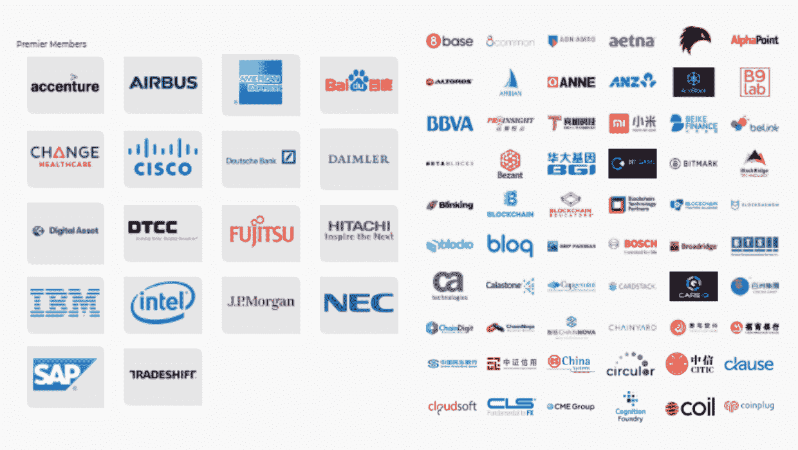

**2)以太坊**

以太坊是一个由以太坊企业联盟(EEA)支持的分散化项目，该联盟由埃森哲、BlockApps、BNY 梅隆、CME Group、ConsenSys、IC3、英特尔、摩根大通、微软、Nuco、Banco Santande 等公司和机构组成。自 2017 年 EEA 成立以来，该财团已将*三菱 UFJ、DTCC、德勤、三星 SDS、印孚瑟斯和加拿大国家银行*加入他们的竞争。EEA 的目标是将财富 500 强公司、创业公司和政府机构与以太坊开发者和专家联系起来，如今该组织已有超过 300 名成员。

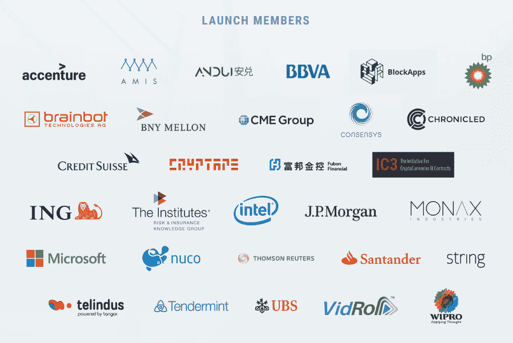

**3)恒星**

Stellar 是区块链的一个项目，致力于将支付提供商、银行和人们连接在一起。凭借与 IBM 的战略合作伙伴关系，Stellar 已成为 Ripple 的热门竞争对手，Ripple 是另一个领先的银行和金融服务相关的区块链项目。Stellar 背后的团队一直在忙着[拓展他们的客户](https://www.stellar.org/about/directory)，到目前为止已经与超过 **48 个组织**合作，包括: *SHIFT Markets、Lightyear、STRIPE 和万向集团*。Stripe 是 Stellars 最感兴趣的合作伙伴，因为该支付系统为包括 OpenTable 和 Warby Parker 在内的 100，000 多家企业提供支持。

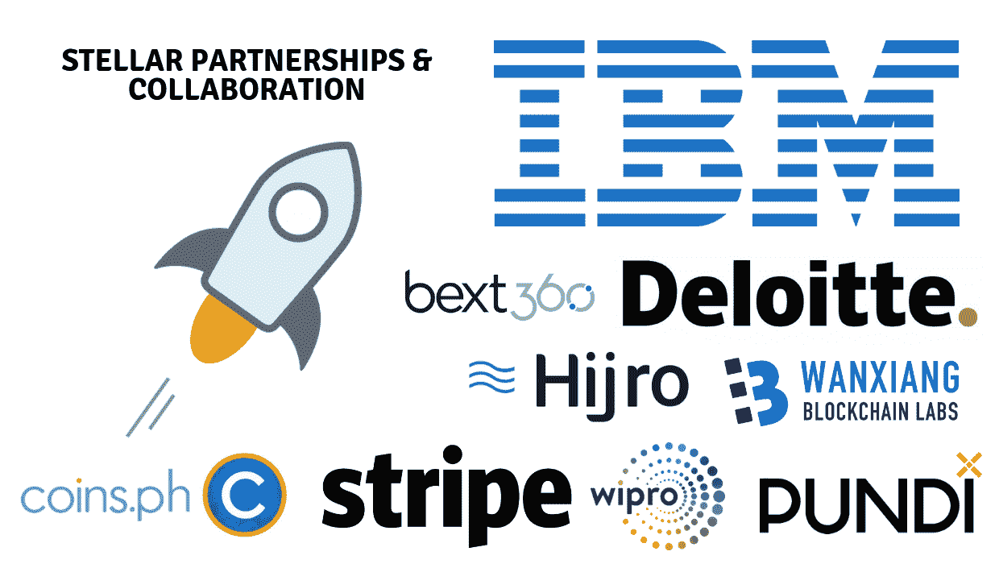

**4)波纹**

Ripple 是区块链的一个项目，旨在将银行、支付提供商、数字交易所和企业连接在一起。Ripple 是一个领先的项目，与世界各地的许多银行合作并建立战略伙伴关系，如；*澳洲联邦银行、CBW 银行、Cross River Bank、桑坦德银行、UniCredit、瑞银集团、ReiseBank、CIBC、阿布扎比国家银行(NBAD)、渣打银行、澳洲国民银行(NAB)、暹罗商业银行、上海华瑞银行*。由于专注于增加银行客户，Ripple 还开始与支付处理商、交易所和汇款服务机构(如西联汇款)建立紧密联系。

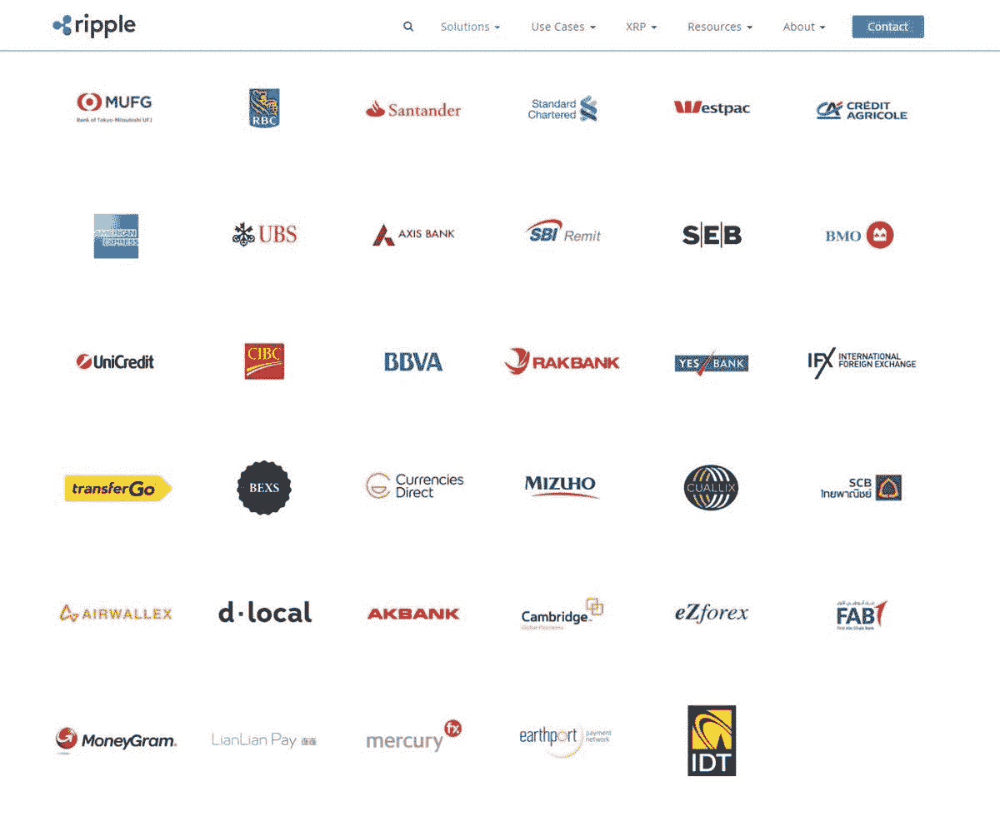

**5)阿尔戈**

即将推出的区块链平台 Aergo 旨在为企业、大公司和机构等提供企业级解决方案。Aergo 得到了区块链商业初创公司 Blocko 的支持，Blocko 是公认的韩国第一大商业私人区块链系统提供商，随着时间的推移，它已经建立了一系列令人印象深刻的合作伙伴关系。值得注意的是，公司不仅测试区块链技术，而且实际上已经实施并正在运营中使用该技术，因此 Blocko 被认为是该领域最活跃、最先进的企业区块链解决方案提供商之一。

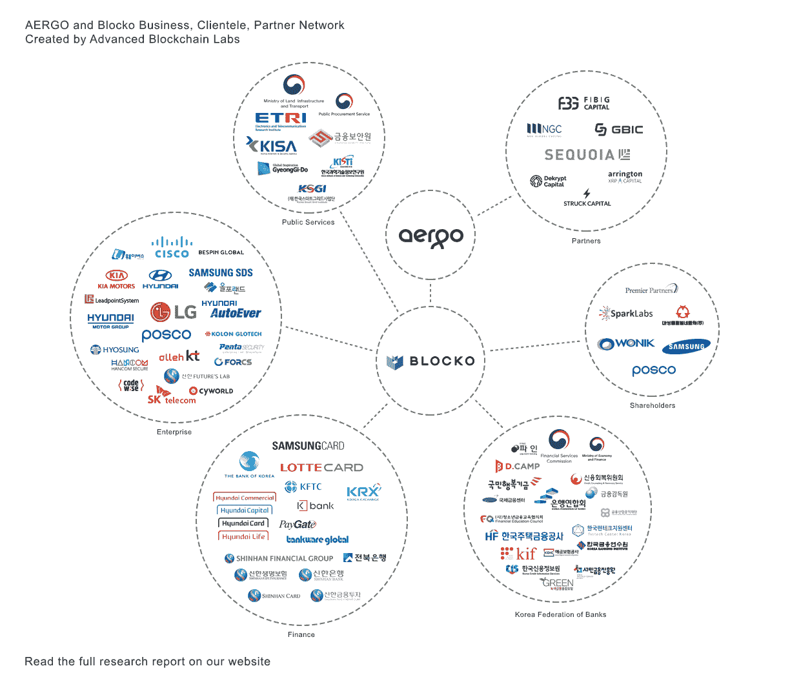

**6) Vechain**

Vechain 是一个区块链即服务(BaaS)平台，专注于缓解供应链管理中的问题。Vechain 自 2015 年以来一直在发展，并设法与 24 家公司合作，其中包括德勤、微软、雷诺、普华永道、DB Schenker、TCL 通讯、中国联通、宝马和 LV 中国。该项目还与中国最大的保险公司中国人民保险公司(PICC)建立了合作伙伴关系。这是 VeChain 合作伙伴的完整列表

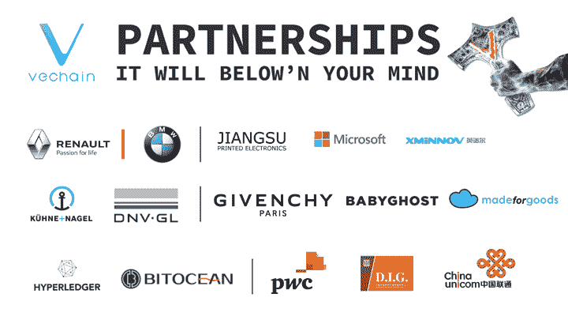

**7)图标**

一个基于南韩的区块链项目，计划通过开发一个由金融机构、保险、大学和医院组成的分散式社区网络来超级连接私人和公共机构。ICON、万和在 2017 年 12 月宣布，这三个独立的项目将合并成项目，这是一个倡导组织，致力于促进不同网络之间的互操作性。迄今为止，ICON 最大的合作伙伴是 Line，这是一款流行的日本消息应用程序，拥有超过 2 亿用户注册该社交平台

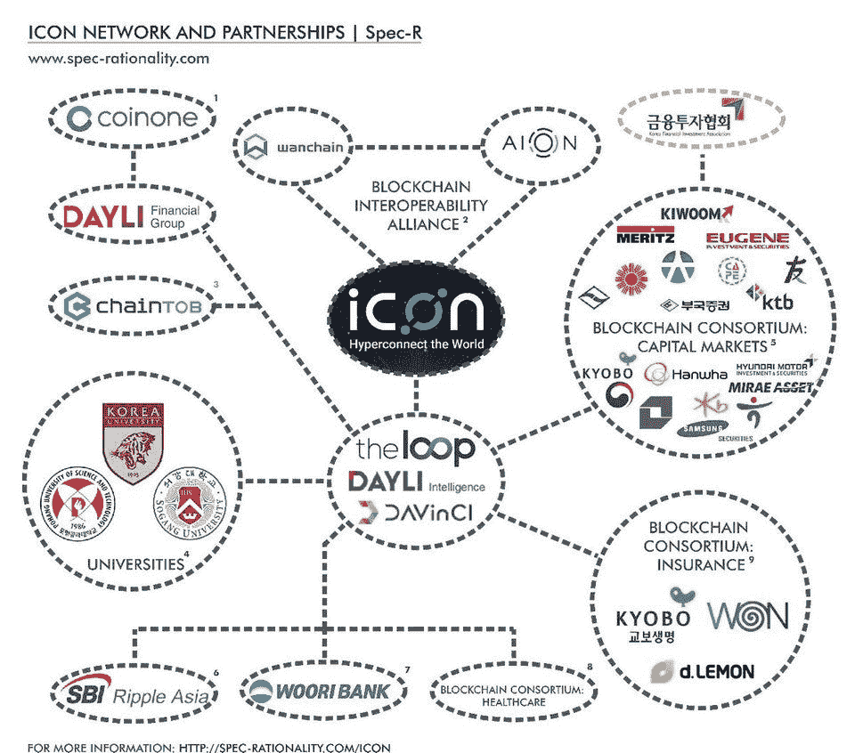

**8) Qtum**

Qtum 与中国亚马逊网络服务(AWS)部门建立了战略合作伙伴关系。这种合作将允许 AWS 用户使用亚马逊机器映像(AMI)开发和启动智能合同。QTUM 和 AWS 之间的战略合作伙伴关系将允许区块链的初创公司利用亚马逊的托管服务来开发智能合同。QTUM 将能够访问亚马逊的数据库，从而在初创公司之间共享重要数据，如营销、销售数据和技术资源。

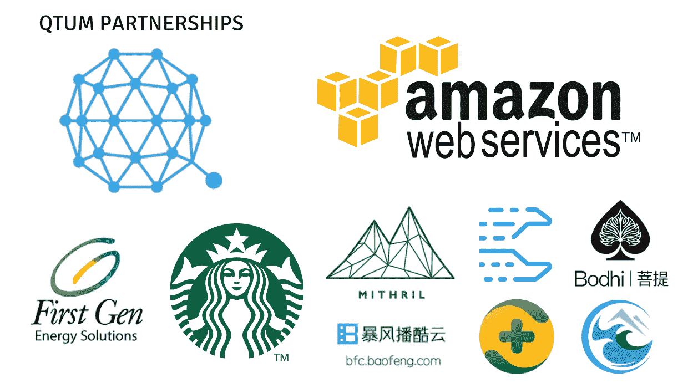

9)奥米塞戈

OmiseGo 总部位于泰国，是一家计划提供开源支付平台的公司，该平台具有建立在以太坊之上的分散式交易所。基本上，与 OmiseGo 母公司 Omise 建立合作关系的公司将为泰国、日本和新加坡提供支付网关。Omise 和 OmiseGo 是独立的实体，但由于母公司 OmiseGo 实力雄厚，因此有大量商家对利用其区块链支付服务感兴趣。

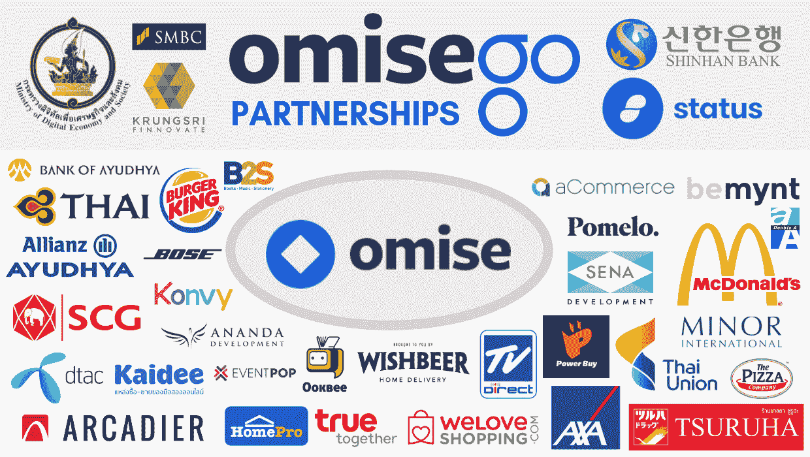

**勇敢**

Brave software 是一款网络浏览器，它计划用一款广告屏蔽私人浏览器来彻底改变互联网，这款浏览器还会奖励读者和内容发布者。2018 年 4 月 18 日，道琼斯媒体集团宣布与 Brave 达成战略合作。像 *Barron 的*和 *MarketWatch* 这样受欢迎的网站成为了认证出版商，它们打算利用 Brave 的基本注意力令牌(BAT)平台，这是一个总部位于区块链的系统，允许消费者，最终，广告商直接为他们的内容向出版商付费。

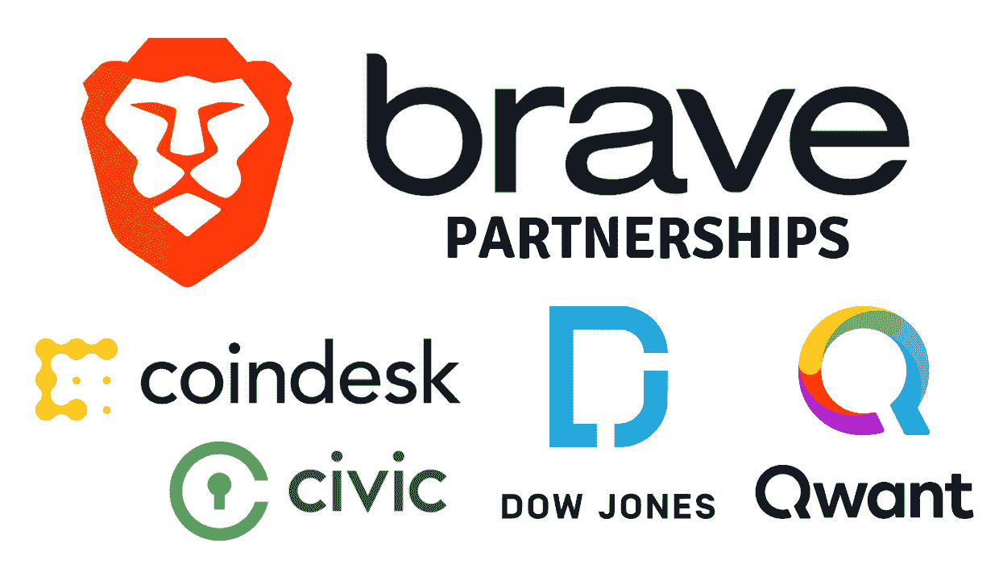

**11) PowerLedger**

可再生能源交易平台 Power Ledger 与泰国电力公用事业公司 BCPG 合作，允许用户通过使用安全的银行界面交易太阳能电池板的可再生能源。该项目已经宣布，它还将与硅谷电力公司、圣克拉拉市、Helpanswers 和美国电力公司合作。这一绿色倡议也得到了澳大利亚政府的支持，最近得到了亿万富翁理查德·布兰森的认可，当时该团队赢得了在布兰森的内克岛举行的 2018 年极限技术挑战。

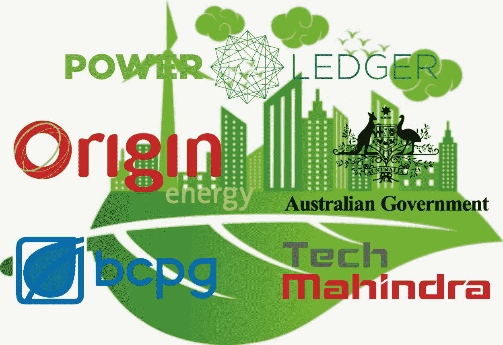

如果你知道任何进一步的项目有强大的企业伙伴关系和协作，请随时在下面留下评论，这样我就可以将它们添加到列表中！