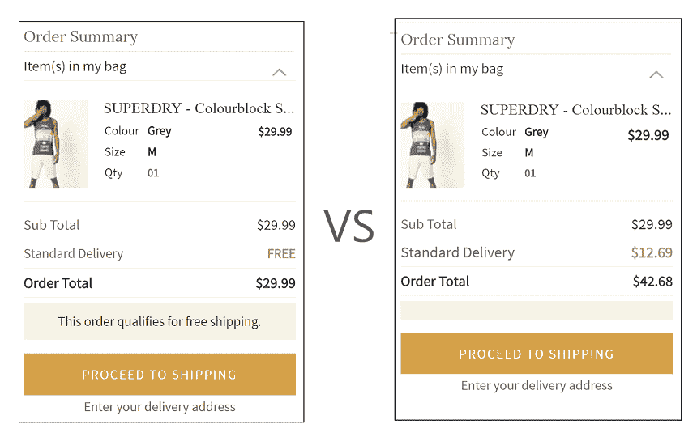
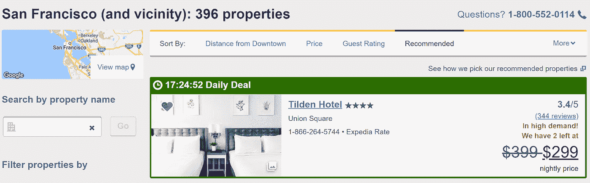

# CRO 的 11 招将提升你的电子商务销售

> 原文：<https://medium.com/hackernoon/11-cro-hacks-that-will-boost-your-ecommerce-sales-ec1a7ae5c9b5>

# 什么是电子商务中的转换？

电子商务网站的转换可以分为两类:

1.  **初级转化/主要转化:**这是一种直接影响你的底线的转化类型，即当用户在网站上完成购买时。
2.  **二次转换:**二次转换可以有多种类型。这些转换是间接转换，因为它们不会直接影响交易，但会在将来影响交易。

**示例:**简讯订阅、退出弹出窗口、添加到购物车、添加到意愿列表、应用安装/下载等。

在这篇博客中，我将谈论如何优化你的主要转化，即当用户完成购买时。

然而，其中一些优化也可以帮助你的二次转换。

# 怎么计算转化率？

转换率是在你的网站上完成预期目标的人数除以访客总数。

总转换率:

初级转换率:

次级转换率:

在你开始优化之前，知道你当前的转化率是非常重要的。

这为您提供了一个基线，您可以比较并查看您的优化是否有效。

让我们来看看 11 个转化率优化技巧，你今天可以用它们来促进你的交易。

# CRO 黑客#1:提供免费送货

让我们从所有购物者都喜欢的东西开始。

是的，免费送货。

最大的卸货发生在结帐过程中。结帐过程的一个关键因素是运费。

让我们看看下面的例子:

Ajio 强调为用户提供免费送货服务。这是对用户完成结账的又一次提醒。

送货费给用户造成了负面心理。

惊人的商业报价

*“在选择零售商时，免费送货、保证准时交货是前五名中的两个决定性因素。”*

**免运费有多重要？**

统计大脑的一项广泛调查显示了以下结果:

*   36%的人不会购买没有它的东西
*   我积极寻找免费送货服务——42%
*   我想找到它，但不是必需的— 12%
*   对我的购买决策影响很小— 1%
*   不管运费如何，我都会购买——2%
*   不知道/不确定— 6%

我知道不是每个电子商务商店都可以提供免费送货。这会影响你的利润率。

**你也可以试试下面的:**

*   将运费加到产品价格上。
*   提供免费送货的几个选择类别。
*   只收取低于一定订单价值的运费。**例如:**超过 50 美元的订单可以享受免费送货。

总是 A/B 测试这些，以下哪种方法为您提供更好的利润空间。

# CRO 黑客#2:速度，速度和更多的速度

走吧。我们都知道当网站运行缓慢时，用户体验是多么糟糕。手机上的情况更糟。

是的，网站速度确实影响了 CRO。

你可能会问速度如何影响转换优化？这到底有多重要？

你的网站越慢，你的 UX 就越痛苦。此外，你带动的网站流量越大，你从性能优化中获得的好处就越多。

网站速度提升的好处是它不仅限于 CRO。快速的网页加载时间也有助于用户参与、客户满意度以及搜索引擎排名。

但是它到底有多大的影响呢？

OnlineGraduatePrograms research(美国)对网站速度的容忍度有一些令人大开眼界的结果。

> 40%的移动购物者会放弃一个不能在 3 秒内加载的网站。

Amazon.com 每天的销售额约为 6700 万美元。

亚马逊发现，由于网页延迟 1 秒钟，他们每年可能会损失高达 16 亿美元。

**速度也影响谷歌:**

> 每天有超过 30 亿次谷歌搜索。每秒回答 34000 个问题。

但是当问题得不到快速回答时，人们会问得更少。

谷歌发现，仅仅将搜索结果减慢**0.4 秒**就会减少一天 800 万次搜索！

# CRO 黑客#3:害怕错过(FOMO)

害怕错过(FOMO)是提高网站转化率最有效的策略之一。

FOMO 与我们息息相关。害怕错过某项活动、聚会、晋升。这是我们前进的动力。

你如何在电子商务中使用 FOMO 来提高转化率？

根据您在线销售的产品和您的客户角色，您可以定制并尝试以下 FOMO 实践:

## **1。FOMO |这个人是从 XYZ 市买的:**

在逛网店的时候，我们都至少见过一次上面这样的信息。

这类信息既可以与你网站上的实际购买同步显示，也可以汇总显示。

您可以自定义性别、城市和产品类别，以便向用户显示更多个性化信息。

## 2.FOMO |展示限量版

展示有限数量的产品会增加 FOMO。Expedia.com 在这方面做得非常好。

如果你看到右下角，你会看到醒目的红色“**需求旺盛！我们在**还剩 2 个。”

“需求量很大！”这条信息显示了这家酒店在游客中的受欢迎程度。“我们还剩 2 英镑”提醒用户尽快完成交易。

## 3.FOMO |通过闪购将你的库存货币化

闪购非常受欢迎。他们限制产品打折的时间。

智能手机制造商小米在 24 小时内售出了超过 211 万部手机，创造了新的吉尼斯世界纪录。

仅这一项销售就购买了超过 3.35 亿美元！

亚马逊是另一个很好的例子。他们采取时间闪购和限量展示相结合的方式。

亚马逊称之为“闪电交易”。

他们在有限的时间内以折扣价提供固定数量的产品。

# CRO 黑客#4:优化你的结账流程

你的用户喜欢你的网站。他们在购物车里增加了一些产品。他们点击结账按钮进行最后的购买。

但是感觉有些不对劲。一旦他们到达结账流程，就会出现严重的脱节。

这是大多数电子商务商店的故事。

废弃手推车仍然是各种规模零售商的一个问题，平均废弃手推车率为 69%。

优化你的结账过程是至关重要的，这里有一些关于你如何做的快速提示。

**结帐技巧 1 |重新排序您的表单，实现渐进式流程**

网上商店经常从账单信息开始结账过程。

对最终用户来说，这只是“给我你的钱”。

应该首先显示被认为入侵性较小的表单字段。示例:姓名、电子邮件、地址，后跟账单详情。

这不仅能提高你在结账过程中每一步的转化率，还能减少顾客在最后一步离开的机会。

为什么？

因为用户不太可能填写他们已经提供的所有细节&重新开始结帐过程。

**结帐技巧 2|优化表单字段的数量。**

不要用 10-12 个不同的表单字段来轰炸你的顾客。

这不仅是不好的 UX，而且也是不必要的。这里要遵循的最佳实践之一是只向您的客户显示必需的表单字段，不显示其他任何内容。

您还应该在多个步骤中一次显示多个表单域。

一次只显示 2-3 个表单字段。当客户进入下一步时，其余的表单字段可以以类似的方式显示。

您还可以在表单卡的顶部添加一个进度条，让用户知道还剩多少步骤。

这有助于用户了解他还需要完成多少步骤。此外，如果用户在结帐过程中中途退出，他们不太可能退出，因为他们将不得不重新开始整个过程。

**结帐技巧 3|自动化表单域信息。**

这是一个快速简单的方法，可以让你的表单填写变得不那么麻烦。

您可以根据用户以前填写的内容自动处理表单字段。

**例如:**

用于填写运输细节。首先询问用户他/她的 pin 码以便发送。

根据用户填写的密码，您可以自动填写国家和城市表单字段。这个简单的“黑客”基本上为您减少了两个表单字段。

# CRO 黑客#5:通过再营销广告把浏览变成购买

你知道吗，超过 90%的人在第一次访问电子商务后没有转化就回来了。

平均而言，超过 49%的人在购物前至少访问过两次网站！

超过 70%的情况下，在线购物车会被废弃。[来源](https://onlinesales.ai/blog/dynamic-remarketing-must-e-commerce/)

再营销是电子商务的圣杯。再营销帮助你优化网站外的转化。

谷歌和脸书都通过各自的平台提供再销售。

[谷歌动态再销售](https://onlinesales.ai/cross-channel-marketing-platform/google-advertising-ecommerce)和[脸书动态产品广告](https://onlinesales.ai/facebook-ad-platform-ecommerce/facebook-dynamic-product-ads/)是最受欢迎和最有效的渠道。

延伸阅读:[脸书动态产品广告的 10 个最佳实践](https://onlinesales.ai/blog/best-practices-facebook-dynamic-product-ads/)

**重新定位/重新营销有多种优势:**

*   与其他渠道相比，每次点击费用通常只是成本的一小部分。
*   再销售广告可以是高度个性化的，因为你只针对那些对你的产品感兴趣的用户。
*   展示再销售广告在网络上有最广泛的影响力，确保无论你在哪里购物，你的广告都会出现。
*   再营销活动具有最高的转换率，确保了巨大的投资回报率。

你也可以通过创建一个你在网站上捕获的电子邮件列表来锁定购物者。

您可以将此电子邮件列表上传到谷歌/脸书。一旦谷歌/脸书对这些邮件进行定位，它就会向这些用户投放你选择的广告。

如果你是广告新手，或者想要有效地扩展你的广告活动，你应该探索使用工具/平台的选择。

虽然市场上有各种工具可以做到这一点，但我推荐使用 OnlineSales.ai

OnlineSales.ai 通过广告帮助零售商以更高的利润率获得购物者。它们不仅仅局限于再销售，还能帮助零售商在脸书、谷歌和亚马逊做广告。

# CRO 黑客#6:提供客人结账的选择

我在这篇文章的前面已经提到过这一点，我还会再重复一遍，结账流程占了最大的比例。

有各种结帐接触点，您可以在那里优化转化率。

优化和减少结帐过程中的掉包的一个方法是让客人选择结帐。

**什么是客人结账？**

客人结帐允许用户在您的网站上购物，而无需注册。购物时，购物者只需填写发货和账单细节，就可以开始购物了。

**为什么这很重要？**

我们都在数不清的网站上注册过。注册每个网站后，会有大量的电子邮件，这很烦人。

用户不喜欢注册他们必须购买产品的每个网站。对于第一次购买的顾客来说尤其如此。

客人结帐消除了枯燥的注册过程，使购买产品更加容易。

对于购物者来说，以客人身份结账也被认为是不太“投入”，也消除了你想要私人用户数据的潜在印象。

对于首次购房者来说尤其如此。

# CRO 黑客#7:建立信誉和社会证明

建立信誉的关键是让人们购买你的网站。购物者不会购买他们不信任的东西。

建立信任和可信度需要时间，但是你现在可以做一些事情来帮助你加速这一过程。

**可信度&社交证明技巧 1:提升你的顾客评价**

在寻找新产品时，您在购买产品前阅读在线评论的频率如何？

几乎每次都是。这是因为很少有什么比产品评论更能建立社会证明。

> 86%的消费者喜欢在购买前至少阅读 3 篇评论。
> 
> 87%的购物者表示评论会影响他们的购买决定。

> **来源:**输卵管通液

这个问题是苏格拉底在进行广泛调查时提出的。

**你可以做以下事情来提升你的顾客评价:**

在用户从您的网站购买产品后，自动发送电子邮件请求评论。

下次订购时提供 10%的折扣券

**可信度&社会证明提示 2:提供免费退款**

免费退款有助于购物者在购买你的产品时实现信心的飞跃。

根据 BigCommerce 的数据，68%的美国购物者受到免费退款的影响。

当购物者犹豫是否购买时，免费退款通常是促使购买发生的最后一步。

你的顾客更有可能购买有免费退款的商品。免费退款还会让第一次在你店里买东西的人产生信任感。

如果在你的整个目录上保持免费退款是不可行的。你也可以在选择的类别上保持免费退款。

明确地告诉你的用户你提供免费退款也很重要。您可以在产品页面上添加这条消息&在结账时。

**可信度&社会证明提示 3:有一个容易理解的退货政策**

就成本和物流而言，退货对零售商来说可能是一场噩梦。但是在电子商务中，回报是不可避免的。

产品被退回有各种各样的原因。发货错误、产品损坏、产品在网上看起来可能不同等。

**你是如何确定退货的？**

Source: UPS Pulse of the Online Shopper

来源:在线购物者的 UPS 脉动

除此之外，你的商场还要有一个清晰易懂的退货政策。

在产品页面上明确提及你的退货政策。

**可信度&社交证明提示 4:联系信息可见性**

很少有什么能比电话更快地解决购物者的疑问。

让您的联系信息在您的网站上可见。如果顾客对你的产品有任何疑问，这为他们提供了一个联系你的简单方法。

**信誉&社会证明提示 5:安全徽章**

在线零售商可以使用徽章来建立信誉。这里有几个徽章，你应该考虑在你的网站上实现。

# CRO 黑客#8:优化 CTA

CTA 在你的用户转化路径中是必不可少的。有几种方法可以优化您的 CTA。

获得对你来说最好的结果通常需要大量的 A/B 测试。

优化 CTA 时，您需要记住以下几点

**CTA 优化技巧 1:写利益驱动的 CTA 内容。**

我们都见过这样的 CTA:

*   签约雇用
*   进入
*   继续
*   使服从
*   [计] 下载

这些很无聊，而且没有传达 CTA 提供的好处。始终让您的 CTA 内容以行动为导向，以利益为导向。

**以下是这种 CTA 的一些例子**

*   下载我的免费电子书
*   免费开始
*   我们谈谈吧
*   立即开始免费试用
*   加入俱乐部

当你写面向行动的关键词时，确保你不会走极端。还是 CTA，就不写段子了。

**CTA 优化技巧 2: CTA 颜色**

CTA 应该从整个网站的配色方案中脱颖而出。为此，您需要使用高对比度的 CTA。

你应该总是 A/B 测试 CTA 颜色，看看哪种最适合你。

**CTA 优化技巧 3:大小很重要**

你的 CTA 应该在整个页面和内容中脱颖而出。拥有一个好的 CTA 大小很重要，这样才能吸引用户的注意力。

但是不要走极端，因为这可能会分散你的注意力，让你觉得碍手碍脚。

> 你还应该探索测试 CTA 位置、CTA 微交互、两个 CTA 对一个 CTA 等。

# CRO 黑客#9:愿望清单提醒

吸引“数字橱窗购物者”的一个好方法是添加一个“愿望清单”，即购物者只是浏览你的网站。

Ajio 做得很好。它们允许用户将项目保存到他们的“壁橱”中。

H&M 称之为“最爱”。

不管你怎么称呼它。该功能为购物者提供了保存他们真正喜欢但还不准备购买的东西的选项。

这与添加到购物车是不同的，添加购物车比购买意愿清单需要更多的承诺。

然后，你可以通过电子邮件或广告锁定目标用户，完成购买。

# CRO 第十招:优化产品描述

我再怎么强调产品描述的重要性也不为过。

写产品描述可能很难。这是 Jumpseller 的一篇很棒的文章，关于如何写销售用的[产品描述](https://jumpseller.in/learn/description-of-your-product/)。

如果你不相信产品描述的重要性。

以下是一些支持我的数据:

> *87%的购物者在决定购买时认为产品内容极其重要或非常重要。*
> 
> *50%的人因网购商品与商品描述不符而退货。*

你的产品描述应该能够打动你的顾客。他们也应该回答顾客的痛点。

一个好的产品描述不仅仅是机智和好的内容，还有它的呈现方式。我说的是文本格式。

如果你像这样写长篇大论，没有人会去读你的产品描述:

不要犯在产品描述中写大段文字的错误。

总是用简短的单词、简单的句子和小段落来描述你的产品。尽可能使用要点和符号来突出产品的具体优势。

这是一份你在写产品描述时应该遵循的清单。

Product Description Checklist

# CRO 黑客#11:优化你的 A/B 测试

A/B Testing in E-Commerce

尽管这是本文的最后一个“技巧”,但绝不是最不重要的。事实上，这是重要的黑客。

> A/B 测试是成功的 CRO 流程的基础。

您可以通过 A/B 测试 CTA、登录页面内容、产品描述、结账流程等来优化转换。

然而，许多营销人员未能正确使用分割测试。

是的，你可能使用“统计显著性”来决定你的 A/B 测试的成功，但是你使用的方法正确吗？

好吧，提醒你一下！这对一些人来说可能有点乏味。

**什么是统计意义？**

据 Investopedia 报道

> 统计显著性用于接受或拒绝零假设，即假设测量变量之间没有关系。当一个数据集大到足以准确代表正在研究的现象或人口样本时，这个数据集就具有统计意义。
> 
> 如果随机现象的概率小于 1/20，导致 p 值为 5%,则数据集通常被视为具有统计显著性。当测试结果超过 p 值时，接受零假设。当测试结果小于 p 值时，零假设被拒绝。

过分简化的意思是，你的测试变体实际上是否比原始版本表现得更好，反之亦然。

它告诉营销人员，你的变体之间是否真的存在有意义的差异。

我经常看到营销人员成为“重复统计意义”的牺牲品

埃文·米勒有一篇很棒的文章解释了如何不参加 A/B 测试。

他解释了营销人员是如何被你的 A/B 测试工具仪表板上显示的统计意义所迷惑的。

这主要是由于窥视偏见。

这意味着，当营销人员看到“统计意义”或“击败的可能性”时，他们就会停止测试。

**如何解决这个问题？**

当您运行 A/B 测试时，请提前决定您的样品组。在样品组完成之前，不要在中间“偷看”寻找统计显著性。

提前决定样本量，即在开始测试之前。

你的样本量应该是多少？

其中， ***δ*** *是您希望在测试中检测到的最小效应&****【σ2】****是您期望的样本方差。*

> 如果你不像我一样对数学感兴趣，别担心，我会帮你搞定的。这里有一个[在线工具可以帮你计算这个。](http://www.evanmiller.org/ab-testing/sample-size.html)

这种类型的 A/B 测试模型的替代方法是贝叶斯 A/B 测试。

贝叶斯 A/B 测试的优点是，你不必为了得到有意义的结果而收集预先决定的样本量。

你甚至不需要大量的数据来检验你是否有有意义的结果。

它可能最适合电子商务网站需要的那种网络测试。

营销人员现在每天都需要快速的结果，贝叶斯方法提供了这一点，甚至更多。

贝叶斯模型被 VWO、谷歌优化等 A/B 测试软件使用。

如果你是一个刚刚起步的零售商，我会推荐谷歌优化，但对于大型电子商务公司，我会建议 VWO 或优化，因为他们提供更多的复杂性和功能。

**结论。**

说到 CRO，永远记住:

1.  找出你的痛点。
2.  优先考虑那些需要紧急关注的问题。
3.  假设你的解决方案。
4.  优化。
5.  最重要的是验证。

实际上，有数百个 CRO 黑客可以帮你优化你的在线商店。

了解你的商场最薄弱的地方，并从那里着手，这一点很重要。

你可以从小处着手，测试你的假设，然后进行更大的实验。

在电子商务行业，你的网站是你业务中最重要的部分。

优化 it 将不仅在短期内，而且在长期内回报您的业务。

我错过了任何重要的 CRO 黑客吗？请在评论中告诉我！

# **作者:**

Udayan Walvekar

[Udayan](https://www.linkedin.com/in/udayanw/) 是 [OnlineSales.ai](http://onlinesales.ai) (原 Sokrati)的产品营销经理——专门负责产品发布策略、加速用户增长、增加日活跃用户、产品参与度&功能采用。当他不工作时，你会发现他在骑自行车或玩桌上足球。