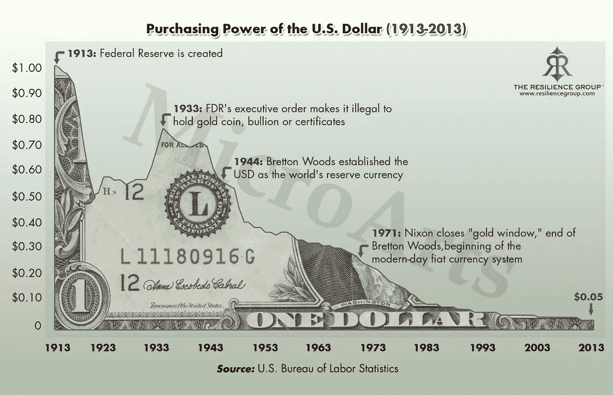

# 关于比特币的 11 个神话

> 原文：<https://medium.com/hackernoon/11-myths-about-bitcoin-3c206e9dd096>

## 让我们炸点东西，好吗…

关于比特币有很多“神话”，这并不奇怪。

人类(智人)已经进化了几千年，成为一个会讲故事的物种——也就是说，对我们来说最重要的事情；复杂的交流，交换和交易价值的能力，共享的虚构，如宗教、金钱、神、国王、一般知识等等——它们都通过故事进行了阐述，这些故事通常成为神话。

自从我们在文明早期开始建立复杂的法律以来，比特币可以说是人类达成共识的方式中最重要的进步之一。

我喜欢把它描述为:

> ***“一个带有政治分歧的社会问题的技术解决方案”。***

我让你考虑一下。

与此同时，让我们回顾并打破和/或驱散一些围绕比特币的常见神话。

## 1.比特币已死

许多人都这样认为。事实上，有一个网站致力于所有有人声称“比特币已死”的时代:

【https://99bitcoins.com/bitcoinobituaries/ 

网络，尤其是有机增长的网络，是去中心化的，由参与者拥有，在敌对的环境中发展，因此具有内在的抗脆弱性。

只要人们相信它，就比特币而言，只要我们相信数学，比特币就会存在——除非发生核灾难，我们会把自己炸飞——在这种情况下，你钱包里的纸币或你“认为”你存在银行的钱也不会值多少钱；)

## 2.比特币挖矿使用“大量”电力

这个很简单。

相比什么？

如果要衡量维持对当前货币体系的信任所需的能量，那是令人难以置信的。

让我们考虑一下，好吗？

*   你相信银行里的美元数字或钱包里的纸币的唯一原因是，你相信银行或政府会信守承诺。
*   你只相信，由于法律、法院、法官、政治和数百年来创造的多层社会控制，它们在那里维持着“秩序”。那是一个昂贵的系统。

支付处理器呢？

你为什么相信 VISA 或 Mastercard 提供的服务是可靠的？

Sheldon Square — One of VISA’s HQs

嗯，因为我上面提到的所有社会结构，加上这两家公司每年都在人员、服务器、办公室、旅行、技术和运营上花费数十亿美元，以提供您可以使用的服务。

再乘以世界各地的支付提供商、中间人、当局、监管机构等的数量，它们都在一个复杂的结构中一起工作，旨在将整个事情保持在一起。

哦——那么政府和银行花了多少钱/时间/精力来印刷、运输、储存、保护货币等呢？

那只是针对现金和数字货币。

黄金怎么样？

想想所有的能源，资源，时间和努力不仅需要开采，而且需要储存，运输和维护所有这些。

太多了。

相比之下，比特币要小得多，而且它提供了一个热力学安全的网络，作为一种潜在的储备资产，可以在此基础上建立更多的基础设施，从而在全球范围内节省大量能源。

## 3.比特币“慢”

比特币(主要)做一件事，而且做得很好。

它在一个全球分散的数字网络(有点像互联网)中，在彼此不认识的参与者之间，就交易状态达成一致(共识)。

这使得它成为一个极其安全的存储“价值”的地方，比特币“上市时间”越长，同时保持其跟踪记录，它就越被信任(就像任何品牌、安全系统或货币形式一样)，成为这样做的地方。

允许上述情况的体系结构是故意“慢”设计的。这是一个特性，不是一个 bug。

比特币的基础(核心链)层是一个结算层——而不是吞吐量层——作为一个结算层，它有其安全属性，是迄今为止地球上最快的。

这让我想到了第二点。

使用目前的银行系统，从澳大利亚向摩洛哥转账 100 万美元或 1 美元要多快？

或者……在周五晚上给你的朋友 100 美元怎么样？

或者……在周末给某人 10 美元？

比特币——基本上是即时的。

随着第 2 层解决方案的推出，这只会变得更好(超出了本文的范围)。

## 4.使用比特币很贵

这是另一个常见的误解，是在 2017 年底比特币经历了一些成长的烦恼时，由几个不明白这一点的白痴(以及错过这一点的主流媒体)推动的议程。

比特币的全球去中心化验证基础设施(采矿、节点等)专注于安全性和最大限度的审查阻力(即；谁也控制不了)。因此，它的“基础层”每天最多只能处理 100 万笔交易。

在媒体狂热的推动下，2017 年底出现了投机和资本流入加密货币的 ALOT-结果，它在几个月内使基础层的交易能力超载。

这在一个成长中的网络中是完全正常的——互联网在其整个生命周期中经历了同样的成长烦恼。

我们在互联网上处理的数据量比我们 10 年前，尤其是 20 年前所能想到的要多得多。

比特币也是如此，随着“第二层”解决方案的出现，每天的交易量从 100 万笔增加到 10 亿笔、100 亿笔、1000 亿笔甚至更多。

随着网络的发展，这种情况会发生。眼下，比特币正处于“积累”阶段。

根据记录，目前的情况是，没有去年的狂热，比特币交易的每笔交易成本在 3c-50c 之间，无论你是向世界任何地方的任何人发送 5 美元还是 500 万美元，大约 98%的交易都是如此。

***世界上再没有什么比这更像了。***

## 5.比特币不是“可扩展的”

和上面很像；比特币并没有被设计成在基础层拥有“可扩展”的吞吐量。

基础层被设计成不易腐蚀的。

因此，它可以作为真实/储备层的来源。

如果比特币继续证明它是有史以来最安全的数字网络(确实如此)，那么我们可以在它的基础上建立“第二层”解决方案，并拥有一个我们可以随时锚定的真理来源。

这就是比特币的规模，同时保持其核心安全性&去中心化。

所以比特币**非常非常具有可扩展性。**

## 6.你必须购买“一个”完整的比特币

这不是真的。

就像 1 美元可以分解成 1c(即；可以被 100 整除)，1 个比特币可以分解成 1 个 satoshi，这是一个比特币的极小分数(一个比特币的 0.0000000001)。

这意味着，作为一种“货币”形式，它更容易分割，也更有用，因为它可以用于非常非常小、非常大以及介于两者之间的任何交易。

作为比特币的持有者，你可以最大限度地灵活选择购买、持有、花费、发送或出售的数量。

这是一种真正现代的数字货币形式。

## 7.比特币是匿名的

嗯……没有。

比特币在一个开放的公共账本上运行，任何人都可以随时查看或查询。

它就像一个交易列表，任何人都可以看到。那不是很匿名。

但是…比特币*化名。*

这意味着它与您个人无关，而是一个公钥(如地址)，您持有私钥(如密码)。

如果公钥(地址)可以与您相关联，那么很容易看出您是从哪里得到它的，以及您在哪里花费/发送了它。

对于一个透明度很重要的世界来说，这是一个很好的属性，但也是人们在考虑可替代性时需要理解的东西。

## 8.比特币是毒贩的钱

比特币在早期可能被用于犯罪，但现在不再是这样了。

不到 1%的比特币交易与所谓的“非法”活动有关*

事实上，当你计算在“正常”世界中通过正常美元被诈骗、使用/滥用或用于非法目的的金额时，这就像是将一只蚂蚁与太阳系进行比较。

安然、伯尼·麦道夫、巴拿马文件、华尔街之狼(乔丹有趣地称比特币为骗局..哈哈)，华尔街银行家，CBA & ANZ 在澳洲这里:

 [## 前花旗和德意志银行负责人在卡特尔案件中受到指控

### 花旗集团驻澳大利亚的前国家负责人斯蒂芬·罗伯茨和德意志银行的迈克尔·奥玛切亚都在…

www.afr.com](https://www.afr.com/business/banking-and-finance/anz-criminal-cartel-case-former-ceo-of-citigroup-among-bankers-charged-20180605-h11076)  [## CBA 因洗钱违规支付创纪录的 7 亿美元罚款

### 更新 2018 年 06 月 04 日 23:30:35 联邦银行已同意支付澳大利亚企业史上最大一笔罚款…

www.abc.net.au](http://www.abc.net.au/news/2018-06-04/commonwealth-bank-pay-$700-million-fine-money-laundering-breach/9831064) 

据估计，美国的“影子经济”占 GDP^.的 12%这是每年 2 万亿美元。这比比特币一生中发生的任何非法活动加起来都多

此外，当你比较使用现金进行的犯罪数量时，它远远超过比特币所代表的任何东西。

最后，要记住的一点是，每一种具有显著优势的新技术通常最初都会被犯罪精英所采用。汽车首先被银行劫匪采用——但是我们没有看到世界试图禁止汽车。如果明天第一次发明了鞋子，我打赌罪犯也会第一个使用它们——然后他们会袭击你，拿走你的钱包，然后更快地逃跑..

技术是不可知的。重要的是人类如何使用它——当我们开始将其作为一个社会，并通过公平、可及和平等的监管使其合法化时，用于犯罪目的的比例大幅下降。

## 9.以太坊是更好的比特币

这个总是让我发笑。

这就像把法拉利和坦克相提并论，因为它们都是交通工具。

比特币的设计功能类似于数字黄金。它的主要功能是成为一个全球性的数字网络，每 10 分钟就交易状态达成共识(协议)，任何人都无法操纵或控制。

它的属性使它成为一种巨大的价值储存手段，从长远来看，它是一种新型“货币”的绝佳候选。

以太坊的成名主张完全不同。

他们试图使用比特币的相同“配方”，并将其作为人们构建程序的基础，任何中央政党都无法操纵或控制。

这意味着以太坊有一个大得多的变量集要应对，也是谁会更多地“出错”。它更像是一个实验平台，人们可以在上面“建造东西”。

理论上，它比比特币用途更广，但它们的使命绝对不是成为价值储存手段。

比特币做一件事，而且做得非常非常好:

*“确保网络保持运行，并且网络上保存的价值永远不会被泄露。”*

比特币不能做以太坊能做的一切——这是理所当然的。

你越是篡改某样东西，越是让它“做”，它就变得越不安全。

这里有一篇短文进一步解释了这些差异:

 [## 比特币 VS 以太坊

### 到底有什么区别？

medium.com](/@AleksandarSvetski/bitcoin-vs-ethereum-5992553fc663) 

## 10.比特币“没有任何后盾”

比特币有数学做后盾。

这是货币的最新版本——一种人类独有的共享虚构，随着时间的推移，从易货到贝壳，再到金属、黄金、硬币、黄金支持的纸币、政府支持的“法定”纸币、塑料，以及最近存储在银行数据库中的数字。

现代货币是由政府和银行的承诺支持的——纵观历史，他们一直表明他们不是最值得信赖或最有能力的一群人(恕我直言)。这不完全是他们的错。(a)人类是有缺陷的，以及(b)人类试图集中管理金钱&有如此多变量的经济实在是太难了——而且我们弄错了。看看津巴布韦，委内瑞拉，德国威玛，甚至 2008 年。

事实上，自 2008 年以来的过去 10 年里，创造了比以往任何时候都多的信贷，为了修复之前的灾难，世界上的“资金管理者”在全球金融史上更多的资产类别中创造了泡沫。

比特币是自由市场“货币”的唯一形式，不受中央管理，不能由任何一个集团控制，并具有现代、全球化、互联世界所需的所有属性。

我建议阅读这篇文章，进一步理解其中的基本原理:

[https://hacker noon . com/homo-sapiens-evolution-money-bit coin-33f 69701 de](https://hackernoon.com/homo-sapiens-evolution-money-bitcoin-33f69701de)

## 11.购买比特币有风险

投资组合理论中有一个概念叫做“有效边界”，这基本上是一个比率，通过分析不同资产类别的相关性、它们的波动性和它们的历史回报得出，以便判断如何最好地构建投资组合。

事实证明，将比特币加入多元化投资组合(价值的 1% — 5%)可以降低整个投资组合的风险，因为它是一种不相关的资产。

再加上作为一个新兴的资产类别，供应有限，每年都有更多的全球资本流入——这实际上为现代投资组合创造了一个智能、低风险的投资机会。

## *奖金神话:埃隆·马斯克发明了比特币*

极不可能。埃隆是一个聪明的人&一个了不起的人(可能是…人类)——但我不认为他在那个时候有能力解决这个问题——我也不认为这是他的核心专业领域。

Elon is definitely not Satoshi…let’s cut the conspiracy theories shall we

对于“谁”或“什么”发明了比特币，我有自己的理论——但总的来说，我真的不在乎——因为关于它的赌注是，这无关紧要。

不管 Satoshi 是谁，我们知道的越少越好。

这是比特币与众不同的部分原因，也是有史以来最有机的货币形式(自黄金以来……因为我猜我们也不知道黄金是如何‘创造’出来的)。

# 结论

所以你有它的乡亲。

比特币比看起来要多得多，尤其是乍一看。

这不仅仅是互联网假钞，事实上，不仅仅是“钱”。它代表了一种新的方式，让我们这种奇怪的轻度多毛类人猿以数字形式在全球层面上达成共识。

互联网是一种方式，使最基本的人类属性，即；复杂的沟通，全球性和反脆弱。

比特币是我们社会结构下一个最基本的方面:价值转移和交换的一种方式。

它很可能会被更好的东西取代，但我认为这不会很快发生。

我希望你喜欢这篇文章，并且能够从中学习到一些重要的东西。

阿列克斯·斯维茨基

首席执行官@ Amber

[www.amber.app](http://www.amber.app)

**_ _ _ _ _ _ _ _ _ _ _ _ _ _ _ _ _ _ _ _ _ _ _ _ _ _ _ _ _ _ _ _ _ _ _ _ _ _ _ _ _ _ _ _ _ _ _ _ _ _ _ _ _ _ _ _ _ _ _ _**

**不要脸的塞**

我们在 Amber 的目标是向人们介绍这个全新的、天然的数字世界，让他们在个人和财务生活中有更多的选择。✊

我们已经将小额投资与数字货币交易所和钱包相结合，因此您每次交易的零钱都会自动转换为比特币，就像一个数字存钱罐一样。🤯

我们相信这是开始积累数字资产的最简单方式，我们希望您能加入我们的旅程！

Amber 将于 2018 年 10 月在 App Store & Google play 上架。

在此之前，请关注并通过 [www.amber.app](http://www.amber.app) 找到我们。

 [## 琥珀#stackingsats ⚡️

### amber # stackingats⚡️的最新推文(@theamberapp)。通过在自动驾驶仪上叠加 sat 让比特币变得简单。美元…

twitter.com](https://twitter.com/theamberapp) 

**你可以在这里找到更多我的作品:**

** [## 亚历山大·斯维茨基—中等

### 琥珀实验室的首席执行官+decentralizedpodcast.com.au 的共同主持人。比特币、金钱、哲学、商业、初创企业和企业家精神的出口

medium.com](/@AleksandarSvetski)  [## 亚历山大·斯维茨基——黑客正午

### 阅读《黑客正午》中亚历山大·斯维特斯基的文章。CEO @ www.getamber.io + Co 主持人@decentralizedpodcast.com.au…

hackernoon.com](https://hackernoon.com/@AleksandarSvetski) 

您可以在这里联系我:

 [## 亚历山大·斯维特斯基|职业简介| LinkedIn

### 查看 Aleksandar Svetski 在 LinkedIn 上的职业简介。LinkedIn 是世界上最大的商业网络，帮助…

www.linkedin.com](https://www.linkedin.com/in/alekssvetski/)  [## 亚历山大·斯维茨基(@亚历山大·斯维茨基)|推特

### Aleksandar Svetski 的最新推文(@AleksSvetski)。对金钱、BTC、人类学感兴趣的无毛黑猩猩…

twitter.com](https://twitter.com/AleksSvetski) 

# 资源

 [## 新的研究发现不到 1%的交易所比特币交易是非法的——Bitcoinist.com

### 一份新的报告分析了在区块链进行的非法交易，确定不到 1%的交易…

bitcoinist.com](https://bitcoinist.com/study-identifies-less-than-1-of-bitcoin-transactions-to-exchanges-are-illicit/)  [## CBA 因洗钱违规支付创纪录的 7 亿美元罚款

### 更新 2018 年 06 月 04 日 23:30:35 联邦银行已同意支付澳大利亚企业史上最大一笔罚款…

www.abc.net.au](http://www.abc.net.au/news/2018-06-04/commonwealth-bank-pay-$700-million-fine-money-laundering-breach/9831064)  [## 想要多样化你的投资组合吗？方舟公司的克里斯·伯恩斯克和比特币基地的亚当·怀特说，试试比特币吧

### 今年早些时候满七岁的比特币似乎正在走向成熟。在达到每股 1，000 多美元的峰值后…

www.forbes.com](https://www.forbes.com/sites/laurashin/2016/07/12/want-higher-returns-invest-in-bitcoin-say-arks-chris-burniske-and-coinbases-adam-white/#5d01d5ff4dd2)  [## 加密资产的 10 大要点:比特币及其他创新投资者指南…

### 如果你完全是投资新手，但你对加密货币感兴趣，加密资产:创新…

hackernoon.com](https://hackernoon.com/10-key-takeaways-from-cryptoassets-the-innovative-investors-guide-to-bitcoin-and-beyond-59114336dd7e)  [## 比特币:不相关资产，投资组合配置的“圣杯”。- Crypto 来了

### 当涉及任何类型的投资时，了解相关资产与其他资产之间的关系非常重要…

cryptoiscoming.com](https://cryptoiscoming.com/bitcoin-uncorrelated-assets-the-holy-grail-of-portfolio-allocation/)**