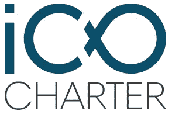
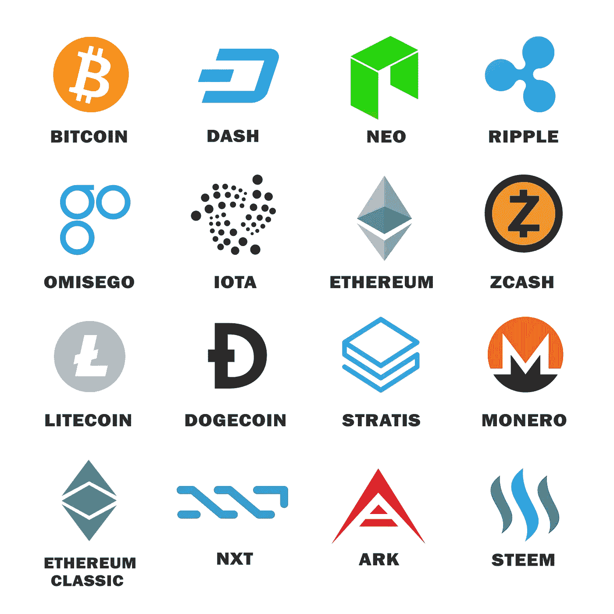
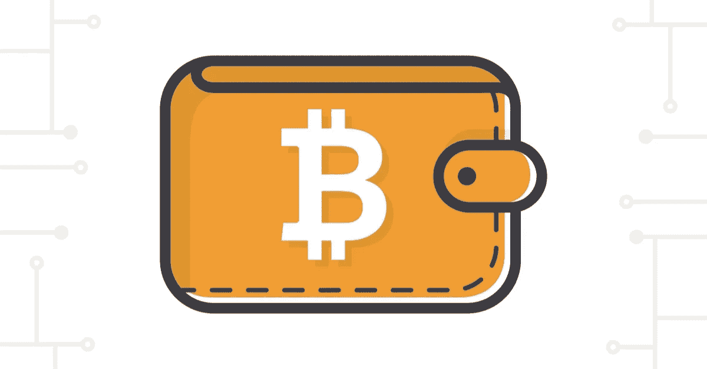

# 分析投资组合的 11 个步骤:投资者指南(2/3)

> 原文：<https://medium.com/hackernoon/11-steps-to-analyse-an-ico-the-investor-view-2-3-83be2a056dc5>

[在上一篇文章](https://hackernoon.com/initial-coin-offering-a-complete-guide-1-3-bd2535702be6)中，我们已经介绍了 ICO 及其基本机制。我们现在将描述投资者应该如何分析 ico 以避免骗局。

**如何评价一个 ICO？**

每天都有越来越多的 ICO 向公众提出，因此很难评估该项目的潜力和严重性。

[ICO 评级](https://icorating.com)是了解一个项目严肃性的良好起点。风险相关分数越高，可用于评估项目的信息就越少。

另一个加深你对项目理解的方法是在网站上发表你自己的看法[bitcointalk.org](Https://bitcointalk.org/index.php?board=159.0)。这是关于加密货币的主要论坛之一。如果你访问公告的专用部分，你将能够找到你的项目以及用户的评论，它们通常信息非常丰富。

一些倡议也开始出现，以指导投资者(和企业家)寻找。“ [ICO 章程](http://www.icocharter.eu/)”就是其中之一，它将帮助你挖掘更多的细节。我们希望用它来组织我们的指南，并插入额外的信息/想法来澄清一些概念。

ICO Charter

**1-ICO/ITO 项目提供的信息**

*   **ICO/ITO 项目的详细和详尽介绍**

每个严肃的 ICO 都必须有一个网站，你可以在上面找到有用的信息，但你也需要自己做研究。ICO 网站应该给你很多关于项目、商业模式和团队的信息。没有网站或网站不完整的 ICO 不是一个好兆头，应视为危险信号。

*   **完整的白皮书**

分析的起点必须是阅读白皮书。您通常可以在 ICO 的网站上下载这份文件。如果没有，通常只需在搜索引擎中输入项目名称，然后输入“白皮书”,就可以找到 PDF 版本的文档。

白皮书是项目、其操作和目标的解释性文档。因此，为了评估项目，正确地阅读它是至关重要的。然而，这些白皮书并不总是容易理解，因为它们涉及到与密码学、密码经济、网络计算(共识)或复杂的数学概念相关的概念。

然而，你不需要成为这些领域的专家来理解和评估一个项目。你仍然需要对围绕区块链组织的网络的工作方式有一个基本的了解。

所有严肃的项目都有白皮书。该文件的缺失或不精确表明项目背后的团队缺乏严肃性或准备。

*   **赞助 ICO/ITO 项目的团队、市场、产品和法律实体的详细信息**

这是不言自明的，将在下面的章节中详细说明。

*   **章程、公司章程和股权结构**

这些是为支持 ICO 而创建的法律实体的组成文件。如下文第 11 点所述，该实体应在“合规国家”注册，以确保在 ICO 揭露骗局时，您能够提起法律诉讼。

*   ****提供用于确定筹集的目标加密货币的信息****

**项目的创始人应该澄清他们打算在 ICO 期间筹集的资金/加密货币的数量。**

**了解为交换这些资金而发行的代币总数也很重要。您还应该能够确定可供公众使用的令牌是否受到限制。在没有限制的情况下，你的投资可以很快淹没在可用代币的增加中。因此，除了项目固有的特定原因之外，令牌的总数必须由协议确定。**

*   ****ICO/ITO 项目路线图****

**项目的方向，以及开发的阶段，应该出现在白皮书中或者在项目的网站上描述。如果项目还没有发布可供您尝试的原型(“beta preview”)，了解项目负责人想去哪里、在哪些日期以及在 ICO 期间筹集的资金是非常重要的。**

*   ****从事 ICO/ITO 项目的主要参与者/员工的简历。****

**你必须分析负责该项目的团队成员的经验。一般认为团队的组成对项目的成功有 50%的责任。**

****领导**:他们之前有没有参与过加密货币相关的项目？他们在以前的项目中失败的事实不应该被认为是一个缺点。一个严肃项目的网站必须有一个网页专门介绍团队，并提供他们的经验总结。缺乏此类信息应被视为一个负面信号。确定项目是否受益于业内公认能力的外部顾问的支持也很重要。**

****开发人员**:即使你没有编程知识，也有可能评估开发人员对项目的参与程度。为此，你可以在谷歌中输入“Github”和项目名称，进入你感兴趣的项目的 Github 页面。例如，这是斯提米特的页面:【Https://github.com/steemit/steem/graphs/contributors **

**然后，您只需点击“代码”选项卡，就可以看到“提交”的数量及其历史记录，以及参与代码起草的“贡献者”的数量。“提交”是对项目源代码执行的更改/添加的次数。**

**也可以参考授予项目的星级数来判断其在社区的受欢迎程度。**

**[CoinGecko](https://www.coingecko.com/en) 网站也是评估开发者参与项目的优秀网站。他们分析了几个网站，开发人员可以在那里存放他们对协议源代码的改进，并据此对项目进行评级。**

**这些信息很重要，因为它们会让你对开发团队和他们的活动历史有一个清晰的认识。**

*   ****独立检查关键人员/员工的良好声誉(“合适和适当”)以及顾问的合适性和独立性。****

**你应该检查项目创始人提供的所有信息是否都经过了独立第三方的验证和认证。这个聚会的名称和细节应该在网站上提及，理想情况下，你应该能够访问它的报告。**

****2-对 ICO/ITO 令牌及其发行者的独立法律审查****

**任何严肃的项目都必须指定一家律师事务所，以确保 ICO/ITO 不违反任何财务规定。律师将参与创建发行代币和接收资金的法律结构。他们还将决定代币是否可以被归类为证券，在这种情况下，它们将受到与 IPO 相关的所有金融法规的约束。**

****

**protocole**

****3-白皮书功能****

*   ****发行代币的基础法律实体及其最近的财务状况。****

**这一点已经在“内部规章制度、公司章程和股权结构”中描述过了。**

*   ******ICO/ITO 项目的简要说明。******

****如果白皮书起草正确，任何人都应该能够理解项目的基础和目标。如上所述，您需要对基于区块链的分散式网络的运行机制有所了解，以确定项目如何改进技术。对于任何投资来说，你都不想把钱投入到你不了解的项目中。****

*   ******项目 ICO/ITO 商业计划书。******

****在购买令牌之前，您需要了解的最重要的事情之一是，该令牌将如何与创建它的协议进行交互。分散式账本技术开发的商业模式确实与我们目前熟悉的商业模式非常不同。****

****该协议的目的是通过其用户和开发者社区来解决问题(例如，比特币提议解决互联网上的价值转移问题)。所有参与协议开发的人通常会得到由协议颁发的令牌作为奖励。如果协议和团体成功地解决了他们想要解决的问题，令牌的价值(当在加密交换中交换时)将会增加。****

****因此，分散式项目的商业模式将取决于协议想要解决的问题、社区在协议开发中的作用以及社区因其影响而获得回报的方式。代币是生态系统的货币，可以在密码交易所兑换国家货币或其他加密货币。在任何情况下，令牌必须在项目的开发中发挥重要作用，因为协议的价值受到这些令牌的速度(即流通)的影响。****

****您需要理解为什么您将要获得的令牌对于协议的开发是必要的。如果您对此不清楚，请再次搜索！****

*   ******寻求加密货币的数量。******

****在这一部分中，您需要明确总共将发行多少代币，何时发行，以及这些代币中有多少将由项目的创始人保留。****

******多少代币？******

****非常重要的一点是，协议确定了将要发行的令牌总数，这样项目的创始人就不会决定在未来发行更多的令牌，从而稀释您在 ICO 期间获得的令牌的价值。****

********

******tokens******

****代币什么时候发放？****

****令牌可以预先开采，也可以在项目生命周期内开采。令牌是“预先挖掘的”，它们都是在项目开始时发布的。这种类型的发行通常被爱好者社区认为是负面的，他们认为这是开发者保留很大一部分代币的机会。****

****如果协议被编程为在网络开发期间发布令牌，则是优选的。比特币协议就是一个例子，每当区块链中增加一个区块，就会产生新的比特币，以奖励未成年人的工作。然而，将要发行的比特币总数是由协议本身决定的。这就是为什么我们谈论比特币是一种不会引发通货膨胀的货币。****

****创始人保留了多少代币？****

****对于 ripple 的开发者来说尤其如此，为了避免批评，他们被迫将相当一部分令牌抵押了 10 年。****

*   ******收益的使用******

****这一点将在下面详细说明，但重要的是，白皮书要准确描述 ICO 应该如何进行。应该有一个指南，解释从转移您的私钥到接收 ICO 令牌的所有步骤。****

*   ******项目技术介绍******

****这一部分可能会深入到项目技术方面的细节，并描述它如何改进技术。例如，如果该项目提出了一种新型的区块链(如 IOTA 与 Tangle 所做的)，白皮书将必须解释与现有类型的区块链有何不同，它将如何存储交易，谁将成为矿工，他们将如何获得报酬，表明这种模式是安全的…****

****如果项目打算改进共识方法，情况也是一样的(例如，Steemit、Eos 和 Bitshares，以及委托的股权证明)。****

****了解项目是实现自己的区块链并发布本机令牌，还是构建在另一个协议(例如以太坊)之上并发布非本机令牌，这一点非常重要。正如我们在描述加密货币革命性商业模式的文章中所述，这两种类型的令牌具有不同的功能，它们的估值也将随着时间的推移而发生不同的变化。****

*   ******特定项目 ICO/ITO 的令牌结构、机制、发行(主要)和发布 ICO/ITO(次要)功能******

****正如我们刚刚提到的，理解令牌结构是很重要的，例如，它们是否是本地的，以及它们在项目运行中的角色是什么。****

*   ******风险披露/警告和免责声明/法律规则以及 EEA(欧洲经济区)的主管法院******

******4-ICO/ITO 智能合同代码和技术规格
项目宣言 V1******

******智能合同或访问代码或任何详细说明令牌交付流程的技术数据，以及后续影响******

****代码必须是“开源”的，即对所有人开放。这是开发这些分散式协议的基础。如果代码在没有明显原因或项目本身固有的情况下不对所有人开放，那么这一点在我们看来是一个会吓坏社区并影响生态系统发展的问题。****

******5-KYC、反洗钱和反恐怖主义流程******

****这些都是非常标准的检查，需要进行，以确定投资资金的来源，并确保它们不是非法的。所有银行和金融机构都要接受这些检查，即使法律尚未要求，也应由 ICO/ITO 进行检查。这些检查是:****

*   ****自然人的护照、身份证或国家签发的任何形式的身份证件。****
*   ****具有授权签字官员的法人实体的公司章程投资者的纳税居住权。****

****在项目网站上注册 ICO 时，您可能会遇到这些检查。****

******6-代币和加密货币募集流程******

****以下各点不言自明，应在 ICO 网站上提供的指南中予以澄清:****

********

****bitcoin wallet****

*   ****披露不同类型的“钱包”，为 ICO/ITO 实时追踪收集的加密货币(和/或法定货币)****
*   ****披露支付给顾问的代币费用****
*   ****售前机制/规则和提供折扣规则的披露****
*   ****所有加密交易的可追溯性****
*   ****披露 ICO/ITO 前和实际 ICO/ITO 过程中使用的所有费用****

******7-使用 ICO/ITO 收益******

*   ******如果没有达到 ICO/ITO 目标金额，加密货币进行归还的过程:******

****这一部分应在 ICO 网站上的指南中明确解释。如果没有，您应该联系项目的创始人以获得澄清。****

*   ******创建用于加密货币的 ICO/ITO 托管钱包******

****检查由第三方管理的托管钱包是否组织起来以收集投资者发送的代币是很重要的。否则，如果 ICO 是一个骗局，代币的接收者将没有义务(甚至没有法律义务)归还代币。****

*   ******ICO/ITO 项目收益发放的规则和条件******

******8-ICO/ITO 安全和安保******

*   ****在 ICO/ITO 期间，IT 主管持续在场，以监控 ICO/ITO 网站、黑客攻击和纠正错误****
*   ****推荐 ISO 27001 认证****

******9-接受第三方审计来衡量项目的风险******

******10-POST ICO******

****如前所述，ICO 网站应提供一个指南，详细说明 ICO 的所有步骤，尤其是 ICO 后，即何时以及如何交付您的令牌。****

*   ****披露 ICO/ITO 流程和历史，以及结果和结果****
*   ****披露新发行的 ICO/ITO 代币的交易市场:如果你想在收到硬币后尽快出售，尽早获得这些信息是很重要的。如果你想在二级市场上参与 ICO，即通过在交易所购买代币，这也很重要。****
*   ****向社区定期提供项目更新的顺序和方式****

******11-对上市国家法律的承诺******

****符合本章程的 ico 不得:****

*   ****由根据一个国家的法律成立的发行人进行，该国家在根据经合组织税务透明度和信息交换全球论坛公布的 EOIR 名单标准进行同行审查后，在最新版本的总体评级中被列为“不合规”，可在以下地址查阅:[http://www . OECD . org/Tax/Transparency/Exchange-of-Information-on-request/ratings/(一个](http://www.oecd.org/tax/transparency/exchange-of-information-on-request/ratings/(a)不合规国家)；或者****
*   ****受不服从的州的法律管辖。****
*   ****如果 ICO 由根据上述 OECD 名单中被列为“临时部分合作”或“部分合作”的国家(“部分合作国家”)的法律成立的发行人执行，或受部分合作国家的法律管辖，发行人应在白皮书中明确承诺以完全透明和合作的方式回答外国税务行政、司法或监管机构提交的税务信息请求****

****如果你喜欢这篇文章，请毫不犹豫地分享到你最喜欢的社交媒体上！！谢谢你****