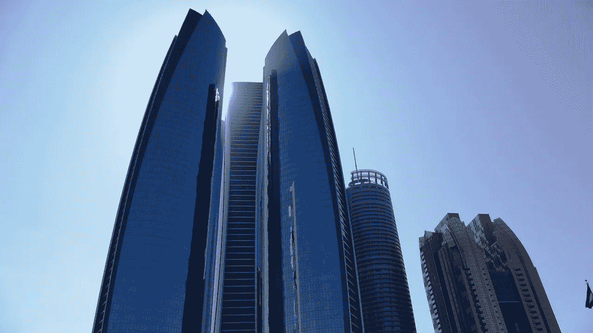

# 2018 年 12 月 2 日:神秘领域最大的故事

> 原文：<https://medium.com/hackernoon/12-02-2018-biggest-stories-in-the-cryptosphere-e2aaeef85a12>

**1。在迪拜，50 套豪华公寓已经用比特币售出**

Ultimo 内衣品牌创始人 baroness Michelle Mone 和她的亿万富翁合伙人 Douglas Barrowman，Knox 的创始人和董事长，刚刚在 T2 出售了位于迪拜的 50 套豪华公寓。有趣的是:买家用比特币支付。这些公寓是豪华开发项目阿斯顿广场和住宅的一部分，价值 3.25 亿美元。该开发项目由阿斯顿开发公司[建造](https://www.ccn.com/lingerie-tycoon-sells-50-luxury-dubai-apartments-bitcoin/)，其母公司是诺克斯集团旗下的阿斯顿房地产投资公司。公寓从 BTC 15 号到 BTC 41 号不等。此外，这对组合还将推出一款价值 7500 万美元的 ICO，这是一款 Equi 令牌，将在 Equi 平台上使用。

**2。直布罗陀:世界首个 ICO 法规**

直布罗陀可能成为世界上第一个为 ico 建立监管框架的国家。直布罗陀政府与直布罗陀金融服务委员会(GFSC)一起，正在审查使用这种新筹资方法的公司必须遵守的规则。[规则](https://www.reuters.com/article/us-gibraltar-markets-cryptocurrencies/gibraltar-moves-ahead-with-worlds-first-initial-coin-offering-rules-idUSKBN1FT1YN)将涵盖在该国发生的代币促销、销售和分销。新引入的将是“授权赞助商”的概念，以及公司需要向其买家提供的信息量。ico 的增长速度促使政府采取措施。该行业从 2016 年的€8200 万美元增长到 2017 年的 37 亿美元。

**3。阿布扎比金融监管机构将考虑加密监管框架**

周六 11 日，阿布扎比全球市场(ADGM)金融服务监管局(FSRA)宣布，加密货币交易所和中介机构的可能监管框架目前正在制定中。这意味着它们将成为[金融区](https://www.ccn.com/bitcoin-regulation-abu-dhabi-financial-regulator-considers-cryptocurrency-framework/)的一部分。该项目将与行业参与者和专业机构合作进行。阿拉伯联合酋长国(UAE)的首都此前在去年 10 月采用了一种通用方法，宣布 ICOs 是一种证券，加密货币是一种商品。然而，它现在决定采取一种更狭隘的方法。考虑到阿联酋中央银行[拒绝](https://www.reuters.com/article/emirates-bitcoin/abu-dhabi-financial-regulator-may-create-framework-for-virtual-currencies-idUSL8N1Q10OU)将加密货币视为法定货币，并将其贴上风险标签，这可能会令人惊讶。

**4。CME 集团希望促进区块链修改**

去年 12 月，CME 集团为一个[系统](https://www.coindesk.com/cme-patent-application-describes-modifiable-blockchain/)申请了一项[专利](http://appft.uspto.gov/netacgi/nph-Parser?Sect1=PTO2&Sect2=HITOFF&u=%2Fnetahtml%2FPTO%2Fsearch-adv.html&r=14&f=G&l=50&d=PG01&s1=blockchain&p=1&OS=blockchain&RS=blockchain)，该系统将通过消除网络节点达成共识的需要，为开发者修改区块链规则提供便利。航空公司常旅客计划是作为为什么需要这种系统的一个例子提出来的。如果有必要制定新的 KYC/反洗钱计划，并且大多数节点拒绝同意该变更，则需要分叉。区块链有很大的潜力，但试图修改和升级它时所涉及的[难度](https://cointelegraph.com/news/cme-plans-to-develop-new-system-to-more-easily-modify-blockchain-protocols)使得这项技术对商业用途的吸引力降低。[隔离见证](https://www.investopedia.com/terms/s/segwit-segregated-witness.asp) (SegWit)就是花了几个月才实现升级的一个例子。

> 要在您的邮箱中收到我们的每日新闻综述，请在此注册:[*【http://bit.ly/BlockExNewsRoundup】*](http://bit.ly/BlockExNewsRoundup)