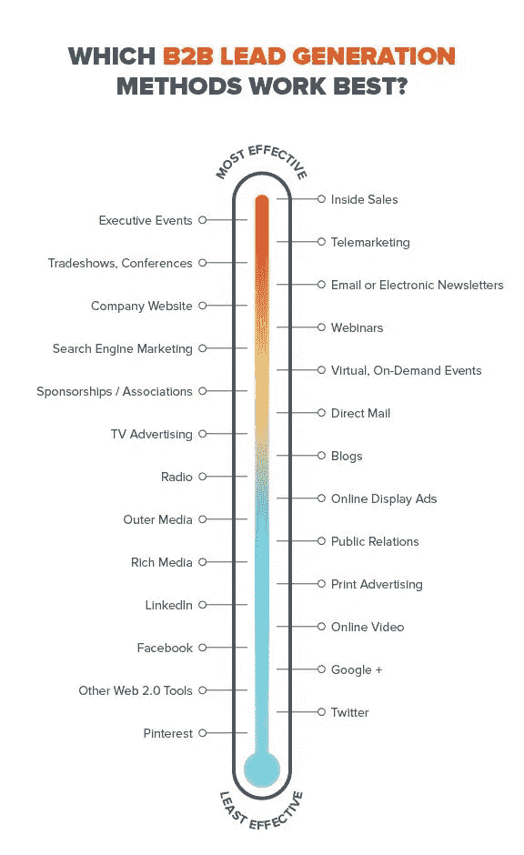
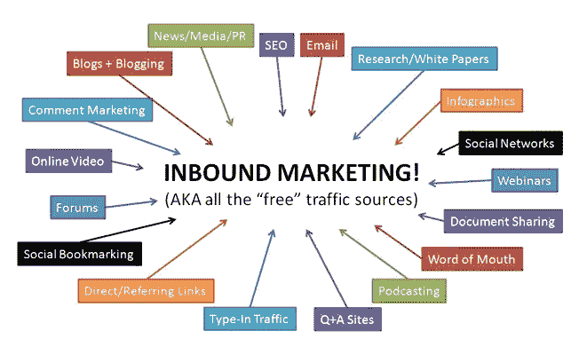
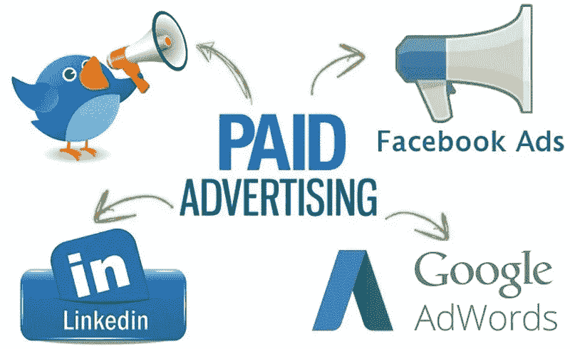
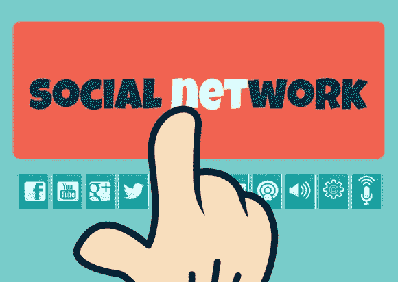
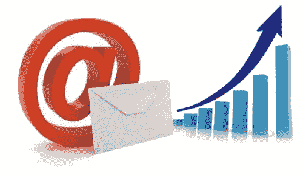

# 12 种挖掘潜在客户的 B2B 营销技巧

> 原文：<https://medium.com/hackernoon/12-b2b-marketing-techniques-for-lead-generation-f80277062865>

****61%的营销人员表示，产生优质业务线索是他们最大的挑战。这表明所有的企业都需要花费大量的精力来吸引潜在客户。为了让事情变得简单一点，重要的是要清楚一些简单但行之有效的营销策略——如果你想知道如何更有效地吸引客户，这 12 个技巧是必不可少的。****

**这个博客着眼于吸引一群对你的产品或服务感兴趣的潜在客户的方法。重要的是，要正确鉴定你的业务线索与你的业务的良好对应关系，转化为*潜在客户*的潜力，或者换句话说，是值得努力销售的重要线索。**

**让我们深入探讨将您的企业转变为销售线索生成机器的技术:**

****

# **直接营销:亲自联系你的潜在客户**

****直接营销**是一种用于直接与潜在客户沟通的技术，例如，在电话或电子邮件中或面对面的即时消息。直接营销信息几乎总是包含具体的行动号召，旨在引发目标客户的直接反应。这些响应的范围可以从单击订阅链接到拨打电话号码或访问网站。强烈的行动呼吁甚至可能促使目标直接购买产品。直接营销信息可以是潜在客户与你的品牌的第一个接触点 ****A)知道有些人觉得这种形式的营销令人生厌。**由于你经常在没有预约的情况下联系你的潜在客户，因此调整你的沟通方式，并强调对他们有什么好处。****

****目标明确的直接营销活动总是有很大的好处，因为它可以让你:****

******B)接触难以接触的目标的能力******

****例子:老一代人对数码产品不太感兴趣，但如果你打电话给他们，他们可能会对你的提议感兴趣。****

****测试你的产品或服务的吸引力，因为潜在客户必须立即做出回应****

****例子:你设计了一个新产品，但你不确定人们会有什么反应。为什么不打电话给一个测试观众，看看他们的反应，然后再扔出去呢？****

******D)取得清晰、可衡量的结果******

****你可以很容易地评估你的直接营销活动的影响。如果你直接给 100 个潜在客户发电子邮件，邀请他们免费下载你的产品目录，其中 20 个成功了，那么你会得到 20%的肯定回复率。然后，您可以确定他们的资格，并让他们稍后签署交易…确切地知道有多少销售线索已成为客户。非常方便地衡量成功和计算从这次活动中获得新客户的成本。****

## ******1。冷招揽:在实时对话中说服你的潜在客户******

****跳过对潜在客户不请自来的电话，或者****冷打电话*** *“，*以前是最受欢迎的技巧之一，但是人气下降了。这是可以理解的，因为如果人们以前从未听说过你的公司，给他们打电话可能会很累，很乏味，而且他们可能也不太感兴趣。*****

*****这并不意味着这种形式的电话营销总是坏主意。与潜在客户进行实时对话可以在说服他们的过程中发挥重要作用。如果你把精力放在决策者身上，你就大大增加了说服他们的机会。*****

*****通过精心准备的脚本，关注明确的目标受众，并比较关于您的**业务**(致电次数和持续时间)**质量**(您联系了多少决策者，您有多少销售线索)合格的统计数据？)和**转换率**(有多少演示或购买跟随了该通话？)来确定这是否是一种你应该投资的技术。你可以为此购买通话清单，或者自己建立清单，例如通过活动或在线搜索。*****

## *******2。直接邮寄:确保你的目标受众看到你的信息*******

*****如果你想有效地锁定特定的受众，无论是通过电子邮件还是邮寄，直接邮寄也是一种很有价值的方法。用有创意和有趣的信息让人们知道你的品牌或抓住他们的注意力。例如，高层管理人员可能是你公司的重要潜在客户，但他们没有太多时间浏览网页获取信息。确保他们不会错过你的内容，直接给他们发一封电子邮件，附上你专门为他们准备的信息。*****

## *******直销:优势与劣势*******

*****为什么直接营销是一种受欢迎的营销策略的原因很清楚:**它允许个人接触，帮助你接触到可能很难接触到的受众**，并为你提供关于你通过邮件联系过的人的准确数字。*****

*****然而，以个性化的方式给所有这些潜在客户打电话或发邮件需要很多时间。和**有时你的努力甚至不被欣赏，**因为不是每个人都喜欢被意外联系，或者发现你的消息有点太紧急。*****

*****不要担心:直接营销永远是一个有价值的策略，尤其是当与其他营销技巧相结合的时候。最重要的是，你可以自己轻松完成，无需任何外界帮助。*****

# *******集客营销:分发有趣的内容来吸引客户的注意力*******

**********

*****我们已经指出，如果你通过直接营销联系潜在客户，你应该与他们分享有价值的内容…但内容到底是什么？*****

*******内容**是向观众呈现可以以不同格式共享的信息。有很多可能性:除了电子邮件，你还可以写博客、电子书或产品目录、制作视频等等。*****

*****内容在**集客营销**中起着关键作用。通过播放信息性、教育性或娱乐性的内容，你与你的观众建立了一种真正的关系。向潜在客户提供内容有助于他们找到所需，并表明你的企业值得信赖。无需直接与他们交谈，您就可以帮助您的潜在客户评估他们的情况，找到解决方案并做出决定。*****

*****通过集客营销，你可以给潜在客户提供他们正在寻找的准确信息。非常适合喜欢在面对面交谈之前(甚至不面对面交谈)仔细了解情况的买家。*****

*******3。内容:你所有营销活动的基本组成部分*******

*****据 Forrester 称，营销人员或销售人员每发送一条内容，购买者就会在其他地方阅读三条内容。买家的自我信息是真实的，我们的环境让我们接触到很多内容。尽管有噪音，你的工作是让别人听到你的声音，找到新的方法让潜在客户找到你，并为他们提供他们正在寻找的信息。*****

*****请记住，从电子邮件到社交网络，内容是所有营销活动的核心组成部分。高质量的内容可以帮助你打破互联网上的信息超载，并帮助你赢得潜在客户的信任。*****

*****您已经知道您可以创建各种格式的内容…但是一旦您创建了内容，该将它发布到哪里呢？嗯，你的网站是发布独家内容的最重要的地方之一。这似乎有点争议，但你甚至应该为免费的做这件事。*****

*****你的内容是吸引访客的第一步。现在是时候考虑把他们变成潜在客户了。你的内容可能是免费的，但这并不意味着你不应该从中获得一些东西:如果你向他们要联系方式会怎样？*****

*****使用 web 表单上传您的内容是收集潜在客户信息的好方法。为什么不让他们订阅你的博客呢？博客能给你的网站带来很多价值，因为它能让你的读者保持兴趣，并有希望让他们再次光顾。此外，高质量的书面内容对提高你的自然搜索引擎排名也起着重要的作用…*****

## *******4。SEO:通过睡觉吸引潜在客户*******

*****SEO(搜索引擎优化的“SEO”)是一组提高你在搜索引擎上排名的行为。假设你销售办公用品——如果人们通过输入“购买办公用品”作为搜索找到你的网站，那就太好了。*****

*****人们一直在使用搜索引擎，尤其是谷歌。通过搜索引擎优化，**你可以确保你创建的内容与人们正在寻找的相匹配。*******

*****你的网站优化的越多，它在搜索引擎结果页面或“SERPs”(搜索*引擎页面排名*)上的排名就越高。这正是你想要的，因为它会大大增加找到你并点击指向你网站的链接的机会。*****

*****如果你想优化你的网站，试着增加它的相关性和权威性，因为谷歌重视信息内容，并让网页与你的目标客户使用相同的词汇，并回答他们可能提出的任何问题。*****

*******- >** 简单来说，相关性指的是**回答你的听众的问题的能力。例如，页面底部的相关搜索词可能会告诉你你的客户在寻找什么。如果你能为搜索提供清晰的答案，谷歌会给你的网站更高的分数。*******

*******- >** 权威是由来自其他网页的链接的数量和质量来衡量的——首先你可以通过创建相关的内容，其次**让客座专家为你的博客投稿(“客座博客”)。*******

*****假设您销售各种各样的游泳池。当人们考虑这种类型的购买时，他们可能会寻找不同的选择。一个关于混凝土泳池、乙烯基泳池和玻璃纤维泳池的区别的博客可以回答他们的一些问题，从而增加你的相关性。*****

*****你的一些供应商也发现你的博客非常有用，所以他们放了一个链接到你的网站。当一个园林设计师注意到这一点时，他建议你们一起工作。你写的内容，他们会张贴在他们的网站上，这将使他们的访客接触到你的业务。这些到你网站的链接会增加你的权威，帮助你获得新的受众。*****

*******想投资 SEO 就选择:*******

*******->-**获得**一致的结果。出现在搜索引擎的第一页需要一段时间，但一旦你在那里，你将享受到流量的显著增加。*******

*******- >打造权威网站。这是一个成熟的资源或网站，人们可以通过它找到特定的利基市场。一个权威的网站会以可持续的方式为你的页面带来流量，并帮助你的企业建立声誉，直到你足够受欢迎以主导市场——这只有通过智能内容和良好的 SEO 规划才有可能。*******

*******增加你网站的价值，获得更多的搜索流量**因为你在搜索引擎中出现的位置更高。*****

## *******集客营销:利弊*******

*******你所做的搜索引擎优化工作会产生长期的影响，而且你几乎不需要付出任何代价**——只要你不考虑优化和创建你的内容所花费的资源。所有这些一开始听起来可能有点可怕，所以联系专家来指导你完成基本步骤是个好主意。许多外部机构和自由职业者可以优化您的网站或创建有效的 SEO 内容。*****

*****你不能忽视每个人都在线的事实，所以你也必须在线。人们也在积极寻找信息，所以你应该向他们提供信息。通过集客营销和搜索引擎优化，**你的企业成为受人尊敬的思想领袖和信息来源。这也让你的网站更容易找到。如果你的潜在客户意识到你的存在，当你联系他们时，他们不再感到惊讶，所以在网上吸引潜在客户，然后通过亲自联系他们来跟进，这是一个很好的主意。*******

# *******付费网络广告:更快地接触到更有针对性的受众*******

**********

*****在线广告是接触更多目标受众和寻找商机的好方法。让我们来看看一些最常见的技术。*****

*******5。网络广告&重新定位:聚焦你的目标市场*******

*****网络广告是网站上的广告。它们看起来像经典的杂志广告，但有一个重要的区别:你完全知道结果。在网上跟踪广告是可能的:谁点击了它？感兴趣者的人口统计学特征是什么？你对你的目标了解得越多，你就能更好地定制你的广告。*****

*****在线广告有助于锁定具有不同人口统计或行为特征的受众。例如，如果您的业务活跃在全国不同的城市，那么只针对住在这些地方的人可能会很有意思。你也可以**选择你想让你的广告可见的地方:**选择一个你的潜在客户花时间的在线发布空间。想象一下销售汽车:你希望你的横幅出现在一个比较汽车价格的网站上。*****

*******如果你不知道哪些网站会访问你瞄准的潜在客户，或者如果你想分发你的付费股份，利用**重定向广告**可能是个好主意。这些广告通过 cookie 跟踪访问者到您的网站，然后在他们访问的其他网站上重新出现。一旦潜在客户准备好做出决定，这些关于你的业务的提醒有助于将他们带到你的网站。*******

*******6。搜索引擎广告(SEA):按点击付费，立即获得高质量的线索*******

*****你可能已经注意到，当你有东西的时候，谷歌上第一个点击的是广告。点击付费广告(PPC)是搜索引擎广告(SEA)的一种形式，在搜索引擎中显示广告**。广告商对关键词列表中的关键词进行竞价。例如，如果你是一名管道工，你会试着使用“管道工程”、“锅炉维修”或“抱怨”这样的关键词。**当有人点击显示的广告时，广告客户只显示国家。*********

## ***付费在线广告:利弊***

***使用 PPC 技术吸引潜在客户，如果你想:***

*****- >** 获得**立竿见影的效果**在短时间内加速流量，比如产品发布会或者季节性促销。***

*****->-**生成**高针对性流量。**PPC 还允许你根据潜在客户的人口特征来减少他们的数量。这意味着你定义了哪些潜在客户有兴趣看你的广告，这导致了高质量的线索。***

*****- >尝试新事物。用新产品或新优惠来拓展这个领域，并更多地了解人们如何通过减少预算来应对。如果你注意到你的想法起作用了，那就更进一步，在你不同的营销渠道上发起一场运动。*****

***当我们谈论搜索引擎广告时，一切都围绕着谷歌。利用他们的视频教程，自己组织一次活动，或者咨询专家。如果付费广告是你使用的主要营销策略之一，它会让你付出很大代价。相反，最好将其用于小规模测试，或者作为你其他营销策略的补充。***

# *****社交网络:结合社区动画和销售线索生成*****

******

***66%的营销人员每周只花 6 个小时在社交网络上，注意到他们的领导一代有了**的积极变化。**是时候创建一个帐户了，通过定期发布内容保持可见和活跃，并回复问题和表达兴趣。甚至在某人的帖子上放一个“赞”或者评论他们的照片都有助于用户记住你的品牌。***

*****7。LinkedIn:你会建立新的关系来增加销量吗*****

***通过 LinkedIn 寻找潜在客户可能非常简单，但也需要时间。检查向您提出的连接建议，并评估它们是否符合您的提议。LinkedIn 也提供大量的群组。加入一个可能对你的业务感兴趣的专业团体，并向他们发送登录请求。***

***一旦他们接受了这种联系，就与他们交谈，并使用正确的销售技巧来达成交易。这很简单——如果你花时间跟进并跟踪你的连接请求和消息。***

***如果你愿意付费获得一些新的潜在客户，你也可以使用 LinkedIn 广告。**可选的销售线索收集功能会将点击您广告的会员重定向到您的登录页面，**他们可以在那里填写联系请求。这对用户来说非常简单，它可以帮助你快速建立一个潜在客户列表。***

*****8。脸书:接近你的目标受众*****

***脸书还能帮助你在社交网络上创造更多的商机。例如，使用直接链接到你的网站的能力。**该平台还允许您直接在网络上订阅时事通讯，**因此您可以快速获得对您的时事通讯感兴趣的访问者的联系方式。***

***当谈到广告，脸书提供了简单的方法来达到你的目标受众。***

******- >自定义受众*** :第一种方法是下载邮件列表，将邮件匹配给用户。您现在已经为您的广告创建了自定义受众。**自定义受众由执行了您指定的操作的人组成，**如访问您的网站或下载您的应用程序。它们通常用于跟踪当前用户***

******- >相似受众*** :您也可以从客户电子邮件列表中创建相似受众，这将创建与您当前客户数据库相似的人群。有很多方法可以建立你的数据库，比如为 [B2B 数据服务](http://emaildatabase.marketing/)雇人，选择加入表格，从销售部门收集数据。换句话说，**你利用客户的人口统计数据来接触到可能对你的服务感兴趣的更广泛的人群。如果你想调整你的广告规模并找到大量新线索，类似的受众是有用的。*****

## *****社交网络:优势和劣势*****

***你在社交媒体上的影响力越大，你不用花钱就能吸引越多的潜在客户。罗马不是一天建成的，你的 LinkedIn 和脸书账户也不是。**积极发布有吸引力的内容，收集更多的赞和评论。**这将增加新受众在他们的新闻源中看到您的内容的机会。***

***当涉及到吸引大量潜在客户时，**诸如“LinkedIn 线索收集”或“脸书广告”等付费选项将会产生更多的线索。明智的做法是将它们作为一种策略，来补充你的其他营销行动。当然，你应该出现在社交网络上，因为它们不仅对吸引或说服潜在客户有价值，而且对取悦你的客户并让他们了解信息也有价值。*****

# *****电子邮件营销:因此，你的潜在客户会记住你的品牌*****

******

***电子邮件应该是你主要的交流方式之一，因为它可以帮助你和你的听众保持联系。创建有针对性的信息，将相关内容发送给潜在客户并记住他们。为什么不**对不同类型的受众进行细分，并向他们发送定制内容**？***

***一封自动化的通用电子邮件是发现谁对你的业务感兴趣或不感兴趣的另一种简单方法，只需简单地问一下你的潜在客户。让他们有机会轻松回复你的信息(例如，点击行动号召按钮或订阅表格)，并利用这个机会列出你应该每天拜访的潜在客户。**了解更多请看这篇文章** - [如何建立一个有针对性的邮件列表](http://www.emaildatabase.marketing/targeted-list-building/)***

***想了解更多关于电子邮件营销的知识吗？我们列出了一整套将你的潜在客户转化为客户的技巧——点击这里查看。***

## ***电子邮件营销:优势与劣势***

***电子邮件营销不贵。你不需要昂贵的软件或硬件，也不必浪费时间分别给所有客户发邮件。相反，您可以针对细分的潜在客户群体标准化您的沟通方式。***

***跟踪结果也很容易。**通过最少的跟踪，你可以知道哪些邮件已经收到，**哪些人已经退订，打开率(打开你邮件的人)和点击率(打开你邮件并点击其中链接的人)。***

***记住，人们每天都会看到大量的内容。**如果你的潜在客户收到大量电子邮件，你将如何脱颖而出？**想好你要发什么，要发给谁。使用原创物品标题已经可以帮助提高你的打开率。如果你想让电子邮件营销为你所用，就要使每个活动适应特定的目标受众，并给他们发送他们感兴趣的内容。***

# *****联盟营销:让其他商家帮你销售*****

***在联盟营销中，**有人推荐你的产品。每当根据这一建议进行采购时，大使都会得到奖励。**在最传统的形式中，联盟营销是通过伙伴关系建立的。你的合伙人每给你介绍一个新客户，他都会收到一笔佣金。最现代的联盟营销是**在合作伙伴网站上放置横幅和 URL。*****

***通过使用跟踪网址，你可以通过不同的促销技巧来保持对你所产生的所有流量和销售额的完美概述。联盟营销类似于谷歌的在线广告(展示网络)，但不同的是，你自己建立合作关系，而不是必须从谷歌的标准中选择。***

## *****联盟营销:利弊*****

***与第三方建立可靠的合作伙伴关系需要时间和精力，尤其是当你考虑到就佣金金额和设置费用达成一致的讨论时。此外，佣金自然会蚕食你的利润。***

***但如果你做得好，联盟营销增加了你的产品和服务的知名度，是一个获得额外收入来源的好方法。***

# *****11。推荐计划:利用口碑获得新客户*****

******

***满意客户的推荐和分享经验是以经济高效的方式吸引潜在客户的绝佳方式。人们喜欢有社会证明和具体结果。口碑也不贵:满意的顾客通常更愿意免费推广你的业务。***

***考虑你的目标客户是谁，你有哪些类似的客户。接近这些客户，直接询问他们的建议，或者考虑鼓励他们这样做的激励措施。当他们对你的客户支持有了非常积极的体验，或者对你的业务给予很高的评价时，向他们寻求建议……或者只是接近你最忠实的客户。让他们给你写推荐信变得容易:不要让他们写长信，而是写一封他们可以分享的简短而愉快的信。***

***推荐营销有点类似于联盟营销，合作伙伴网站和杂志会照看你的广告并推广你的业务。重要的区别在于，一个推荐项目**投资于可以向朋友和家人推荐你的品牌的大使**——口碑可能是世界上最古老的营销渠道，但它仍然是有价值的。***

## *****推荐方案:优缺点*****

***推荐营销帮助你**缩短你的销售周期**。你通过推荐项目联系的人很少会对你感兴趣，因为冷淡的潜在客户可能会对你感兴趣，打电话给热情的潜在客户可以帮你省钱。***

***但是不要太着急。让人们决定是否要推荐你的企业。即使是满意的顾客也可能不想推荐，因为推荐一个品牌对一些人来说是个大问题，因为这会影响他们的声誉。***

***建立一个推荐项目，让人们来找你。不要试图做尽可能多的交易，而是感激你收到的推荐。***

# *****12。事件营销:面对面说服你的潜在客户*****

***既然没有比分享满意顾客的体验更好的广告形式，为什么不试着在活动中取悦他们呢？这是宣传你的品牌所代表的东西、展示你提供的一些解决方案以及与参与者建立个人关系的绝佳机会。通过个人接触，可以更容易地将潜在客户转化为真正的潜在客户，同时传达企业的关键理念并提高品牌知名度。***

## *****事件营销:利弊*****

***事件需要大量的时间和精力。他们很努力，经常回来牺牲晚上和周末。你需要付出很多努力，但这是值得的:有机会进行严肃的对话，结识那些可能从未听说过你的公司的人……好的人的活动是值得的，因为你投入时间——走出去！***

## ***你准备好吸引你的潜在客户了吗？***

***这些技术没有一个能保证你拥有无限的潜在客户，但是，如果你把它们结合起来，它们能显著提高你的潜在客户数量。尝试在线上和线下行动、个人联系和数字信息、优化和创造之间找到平衡。测试不同的东西，整合和应用营销技巧，这将有助于你吸引许多优质的前景。***