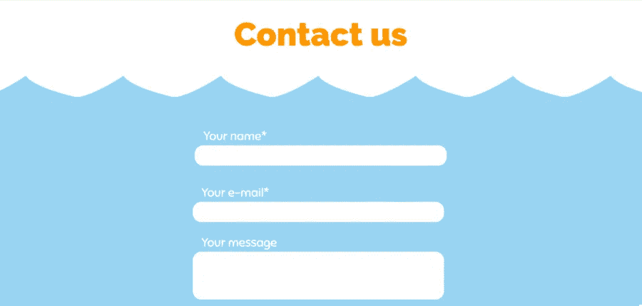
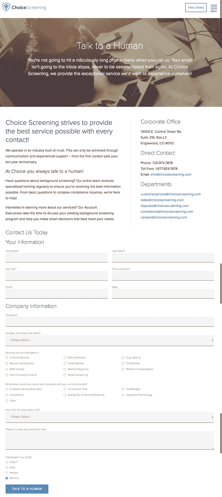
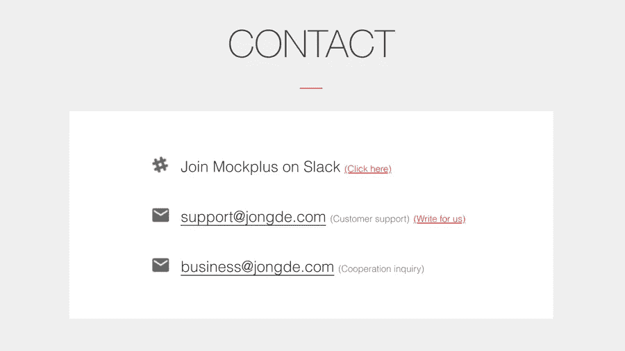

# 2018 年 12 个最佳免费 Html5 联系表单和联系我们页面模板

> 原文：<https://medium.com/hackernoon/12-best-free-html5-contact-form-contact-us-page-templates-in-2018-3d15cf8869b8>

联系页面是网站访问者联系您的最佳方式。以下是 2018 年 12 个最好的免费 HTML5 联系表单&联系我们页面模板和示例。

越来越多的人在网上做生意。网站是展示你的产品或品牌的最好方式之一。让你的访问者能够通过联系页面方便地联系到你，这对于良好的客户服务非常重要——网页设计者必须重视联系页面的设计。联系页面是访问者联系你的最好方式。

但是如何设计一个漂亮的联系我们页面，让网站访问者更容易联系到你呢？在这里，我提供了 2018 年最好的免费 HTML5 联系表格&联系我们页面模板 **12 个，供你启发。**

# 2018 年 8 个最佳免费响应 HTML5 联系表格和联系我们页面模板

# 1.一般查询联系表单—回复联系我们页面设计布局

**设计师:埃尔顿克里斯**

**模板功能:**

*   简单的白色接触形式
*   完全响应的联系人表单设计
*   支持定制
*   适用于任何网页侧边栏
*   克隆了 15547 次

一般查询联系表是最适合您的移动响应网站的响应联系表模板。它拥有出色的布局和响应能力，在所有设备上都很好看。

通过其简单的白色界面，您可以收集客户提供的姓名、电子邮件、联系电话、网站、信息和其他信息。这是你的网站的一个典型的移动响应联系表格。

**使用模板:**[https://www.jotform.com/form-templates/responsive-...](https://www.jotform.com/form-templates/responsive-layout-general-inquiry-contact-form)

# 2.联系人表单 15——最好的标题奇特的联系人表单设计

**设计师:Colorlib**

**模板功能:**

*   谷歌地图背景
*   花式，简洁，令人愉快的标题
*   自定义样式的提交按钮
*   CSS3 和 HTML5
*   出色的配色方案

Contact Form 15 是一个基于 CSS3 和 HTML5 的简单联系人表单，可以在任何网站上使用。您可以使用这个联系我们页面模板为您所在的几乎任何行业创建一个高级联系页面。

它包含一个谷歌地图背景，提供了贵公司位置的准确参考。此外，它带有有用的表单字段和一个别致的标题。图像和文字可以鼓励访问者与你取得联系。这是一个快速和易于使用的形式，包括姓名，电子邮件，信息领域。

**使用模板:**[https://colorlib.com/wp/template/contact-form-v15/](https://colorlib.com/wp/template/contact-form-v15/)

# 3.联系表单 v10——基于 CSS3 和 HTML5 的简单联系表单，可以在任何网站上使用。

**设计师:Colorlib**

**模板功能:**

*   纯色按钮
*   自定义样式的提交按钮
*   大型文本框
*   完全响应任何屏幕
*   圆形边缘

联系形式 v10 是简单的，免费的 HTML5 联系形式模板。它有一个自定义风格的按钮，纯色方案和圆形的表格空间，这使得它可以完美地显示在任何网络和移动屏幕上。联系表单 v10 于 2018 年 5 月发布，遵循设计趋势，为您的所有用户提供一个与您自由联系的奇妙解决方案。

【https://colorlib.com/wp/template/contact-form-v10/】使用模板:

# 4.海底联络表—互动联络表

**设计者:匿名 CodePen 用户**

**模板功能:**

*   HTML，CSS，JS，JavaScript
*   圆形边缘
*   干净的配色方案
*   交互式布局
*   整页联系表单
*   一致动画
*   优秀的字体

海底联系人表单是一个交互式的联系人表单，它基于 JavaScript 和 CSS3 提供了最漂亮的交互式设计。这是一个整页的联系表单，可以在任何大小的屏幕上显示，但特别适合以动画为特色的儿童网站。这个模板也使用了优秀的字体。

**使用模板:**https://codepen.io/anon/pen/OMMOaO/

# 5.认识我们的团队—关于我们的响应引导页面模板

**设计师:莫比里斯**

**模板功能:**

*   手机友好型设计
*   独特的风格
*   一致动画
*   关于我们的页面设计
*   完整的网站页面
*   完全响应

满足我们的团队是一个关于我们的网页模板的响应引导，它包含了网页需要的每一个元素。该模板包含 3 个主要部分:团队介绍、联系我们表格和客户介绍。

如果您需要一个设计完整的包含干净的联系我们表单的联系我们页面模板，这是您的最佳选择。反馈表单很简单，有一个大的文本框，为您的客户留下反馈提供了足够的空间。

**使用模板:【https://mobirise.com/bootstrap-template/about-us-p...】T22**

# 6.Bootstrap 3 联系表——最佳网站联系页面

**设计师:reusableforms**

**模板特征:**

*   HTML 代码
*   视频演示
*   定制/使用指南
*   CSS 样式
*   jQuery 表单提交
*   表单验证
*   服务器端处理
*   图像背景

Bootstrap 3 联系表是一个完全响应的网站联系页面。这个模板和普通的有着奇妙的全屏图像背景的模板完全不同。深色背景和白色联系表格之间出色的配色方案和对比肯定会鼓励反馈。它有一个大的文本框来接收用户的信息。

**使用模板:**【http://reusableforms.com/d/e2/bootstrap-3-contact-...】T2

# 7.联系人表单 HTML/CSS 模板——带有醒目背景图像的免费联系人页面设计

**设计师:reusableforms**

**模板功能:**

*   自定义样式的提交按钮
*   一致动画
*   交互式页面设计
*   图标+文本
*   HTML，CSS 模板
*   背景图像

联系形式 HTML/CSS 模板是另一个来自 reusableforms.com 的最好的联系我们的网页之一。有一个吸引游客的醒目背景图像。动画非常出色，并提供了与用户的互动。

**使用模板:**http://reusableforms.com/d/o3/contact-form-css-tem...

# 8.HTML5 联系人表单—html 5 构建的全角联系人表单

**设计师:codepen**

**模板功能:**

*   CSS3 和 HTML5
*   用户化
*   全幅接触形式
*   明亮的配色方案

HTML5 联系表单是一个简单的联系我们页面模板，使用 CSS3 和 HTML5。该模板提供了实现步骤，便于您根据自己的项目对其进行定制。只需复制 HTML 和 CSS 代码，并将其粘贴到您的网站。默认颜色是粗体，但是可以通过一些 CSS3 修改来快速调整。

**使用模板:**https://codepen.io/codeconvey/pen/rgiLB/

# 2018 年 4 个最佳免费响应 HTML5 联系表单和联系我们页面示例

# 9.选择筛选—具有优秀标题的联系表单示例

为什么这个例子很好:

*   简洁、令人愉快的“与人交谈”标题
*   布局清晰，易于使用
*   提供多种联系方式
*   图像用得不错
*   包含联系人详细信息
*   写得好的文案
*   应答的

这个联系我们页面是一个组织良好的页面，包含每个部门的联系信息，包括电子邮件。它显示了详细的联系方式，让访问者明白这些信息。联系表格非常详细，提供了联系业务的所有必要信息。

请看这里的例子:【https://www.choicescreening.com/contact-choice-scr... 

# 10.威菲尔德集团承包——手机友好的联系我们页面设计

**为什么这个例子很好:**

*   包括 3 个相关图标
*   手机友好型
*   显示导航
*   大 CTA 按钮
*   颜色用得不错
*   简单而有用的设计
*   短小精悍的形式

威菲尔德集团的联系页面是一个移动友好，简单和有用的联系我们的页面示例。它包括一个有用的导航，简短的联系形式，和大 CTA 按钮。即使在小尺寸屏幕上，您也可以轻松点击按钮。

请看这里的例子:[http://www.weifieldcontracting.com/contact/](http://www.weifieldcontracting.com/contact/)

# 11.mock plus——带有松散链接的不同联系页面

**为什么这个例子很好:**

*   访问者可以快速找到联系页面上的链接
*   提供设计师社区链接
*   非常简单和简洁的布局
*   干净和平静的配色方案

Mockplus 是国内的[快速成型工具](https://www.mockplus.com/)。联系页面非常简单。它不使用表单，而是为用户提供了一种更直观的方式来根据他们不同的需求联系业务。Mockplus 特别在联系页面上添加了 Slack 链接，方便用户找到 Mockplus 专属社区。如果你想连接你的整个产品设计工作流程，可以试试 [Mockplus iDoc](https://idoc.mockplus.com/) ！

**看看这里的例子:**[https://www.mockplus.com/support](https://www.mockplus.com/support)

# 12.Helloinnovation —电子邮件联系表单

为什么这个例子很好:

*   鼓励游客打招呼
*   友好和有用的设计
*   使用大胆的调色板

这个联系页面是我最喜欢的设计之一。它包括一个 CTA 来鼓励访问者“打招呼”色彩的运用非常明亮，再加上大胆的排版，营造出美丽的对比，激发用户的情感。

请看这里的例子:[http://www.helloinnovation.com/contact/](http://www.helloinnovation.com/contact/)

以上是 **12 个最佳免费 HTML5 联系表单&联系我们页面模板和示例**。如果你喜欢它，只需下载并应用到你的下一个项目中。