# 2018 年 Sketch & PSD 最佳免费材质设计 UI 套件 2 个

> 原文：<https://medium.com/hackernoon/12-best-free-material-design-ui-kits-for-sketch-psd-in-2018-52bcdf1c0eb8>

材料设计以其干净直接的效果给用户提供了真实的体验。这里有 12 个最好的免费材质设计 UI 套件&模板，用于 Sketch 和 Photoshop。

材料[设计](https://hackernoon.com/tagged/design)从 2014 年开始形成了自己独特的设计风格。由 Google 创建并发布，成为包括 [Android](https://hackernoon.com/tagged/android) Mobile、Android Tablet、桌面 Chrome 等在内的全平台设计语言规范。材料设计可以在谷歌的所有移动应用中看到，包括 Gmail、收件箱、日历、YouTube 甚至桌面网站。

**材料设计以其干净直接的效果给用户提供真实的体验。许多 UX/用户界面设计师在他们的设计工作中追随了这一趋势。我想分享 11 个优秀的材质设计 UI 包，大部分都是免费的，希望能给你带来一些启发。**

# 1.免费材料设计 UI 套件

格式:PSD

价格:免费

特别之处:

*   在 Photoshop CS6+中工作
*   使用的免费字体系列
*   分组图层
*   可自定义的矢量形状
*   材料设计用户界面样式

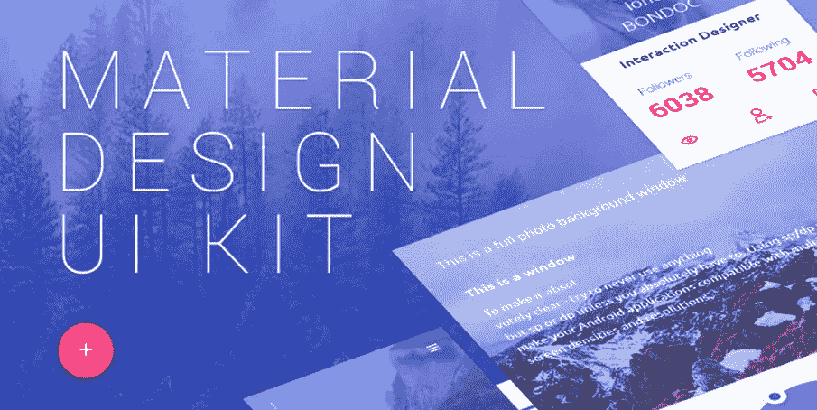

这个免费的用户界面工具包的设计目的是让你可以很容易地快速启动你的下一个材料设计项目。套件中的每个元素、小部件、按钮和表单都可以根据您的要求进行完全定制。它以 PSD 格式提供，你可以完全自由地在你的个人和商业设计项目中使用它。

在这里下载。[http://www.designtory.net/free-psd/free-material-d...](http://www.designtory.net/free-psd/free-material-design-ui-kit/)

# 2.材料设计工具包

格式:PSD，草图

价格:每位用户 99 美元

特别之处:

*   兼容 Sketch 40+和 Photoshop CC 15+
*   兼容 iOS 和 Android
*   250 多个应用用户界面模板
*   材料设计指南

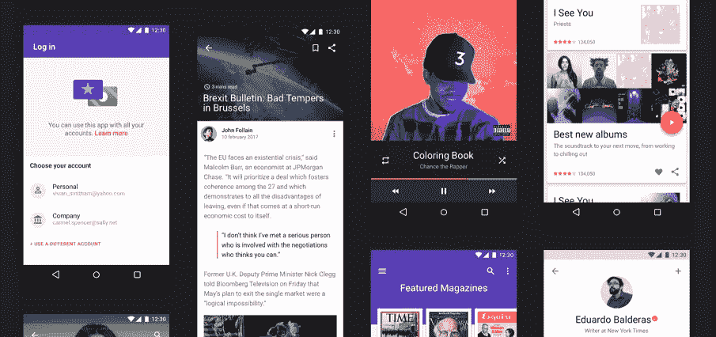

Material Design UI Kit 是 UI 元素、应用程序模板和样式指南的终极库，结合到 Sketch & Photoshop 的高质量源文件中。为 Android n 设计时，您需要更快的工作流程和更好的结果的一切都在这里。

在这里下载。[https://materialdesignkit.com/](https://materialdesignkit.com/)

# 3.Android 材质设计 UI 套件草图资源

格式:草图

价格:免费

特别之处:

*   兼容安卓系统
*   移动应用程序 UI 元素

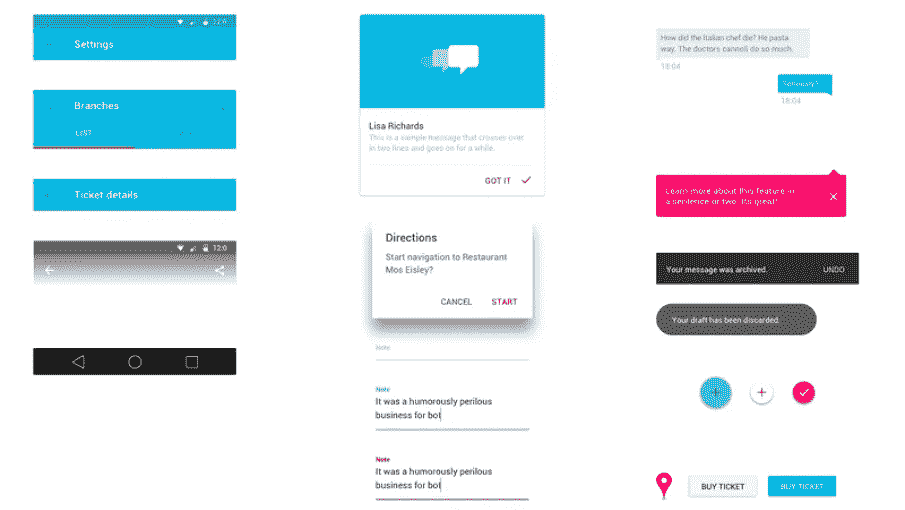

这个用于草图的 Android 材质设计 UI 套件是由 Ivan Bjelajac 设计的。这个伟大的草图库包含大量的移动应用程序 UI 元素，下载次数超过 30000 次。

在这里下载:[https://www.sketchappsources.com/free-source/852-a...](https://www.sketchappsources.com/free-source/852-android-material-design-ui-kit-sketch-freebie-rsource.html)

# 4.谷歌材料设计界面草图资源

格式:草图

价格:免费

特别之处:

*   由谷歌设计
*   谷歌材料设计布局

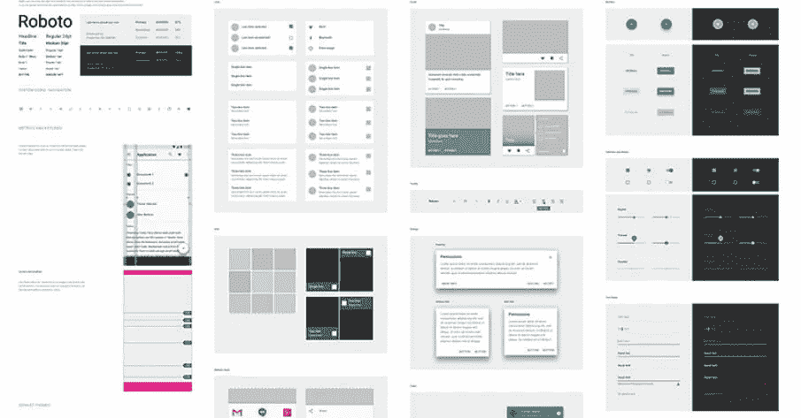

Google Material Design 布局包含状态栏、应用程序栏、底部工具栏、卡片、下拉菜单、搜索栏、分隔线、侧导航、对话框、浮动操作按钮和其他组件的浅色和深色符号。

在这里下载:[https://www.sketchappsources.com/free-source/597-g...](https://www.sketchappsources.com/free-source/597-google-material-design-ui-sketch-app.html)

# 5.材料工具包

格式:SD 元素和 HTML/CSS/JS 实现

价格:免费

特别之处:

*   终身更新和定期支持
*   60 个手工组件
*   2 个定制插件
*   3 个示例页面

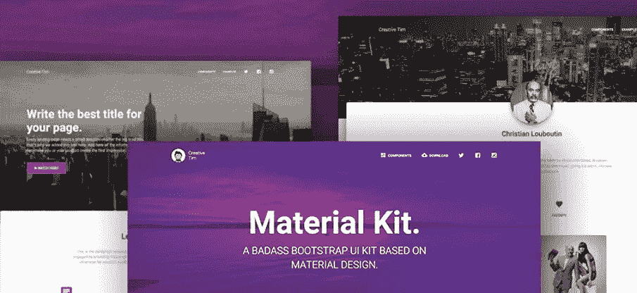

Material Kit 是一个免费的 Bootstrap UI 工具包，其设计灵感来自 Google 的 material design。这是一个很高兴向您介绍一个易于使用和美丽的组件集的材料概念。随着 Bootstrap 元素的重新设计，您将发现三个完全编码的示例页面，以帮助您设计下一个项目。

在这里下载:【https://www.creative-tim.com/product/material-kit 

# 6.Bootstrap 4 免费材料设计

格式:HTML/CSS/JS

价格:免费

特别之处:

*   400 多种基本组件
*   8 个基本插件
*   基础教程
*   详细文件
*   BrandFlow —引导自动化软件

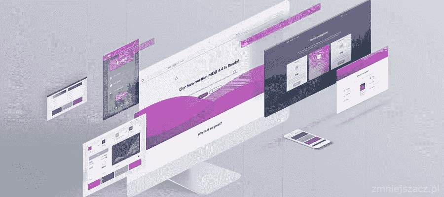

世界上最受欢迎的框架，用于构建响应迅速、移动优先的网站和应用。由于 MDB，您可以利用最新的 Bootstrap 4 的所有功能。它给你详细的用户友好的文件在你的处置，并帮助你实施你的想法很容易。

在这里下载:【https://mdbootstrap.com/material-design-for-bootst... 

# 7.材料工具包专业版

格式:PSD 元素和 HTML/CSS/JS 实现。

价格:79 美元

特别之处:

*   材料工具包专业版
*   1000 个手工组件
*   7 个定制插件
*   11 个示例页面:+文档、+ SASS 文件、+ Photoshop 文件
*   基于自举
*   完全响应

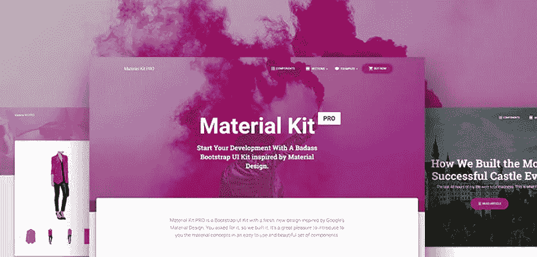

从受材料设计启发的 Badass Bootstrap UI 套件开始您的开发。如果你喜欢谷歌的材质设计，你会喜欢这个套件的！它的特点是大量的组件组装在一起，看起来很棒。

在这里下载:[https://www.creative-tim.com/product/material-kit-...](https://www.creative-tim.com/product/material-kit-pro)

# 8.Lora 材质设计 UI 套件

格式:PSD，草图

价格:30 美元

特别之处:

*   兼容素描 App $ Photoshop
*   独特的屏幕:80 多种不同的屏幕
*   材料设计指南
*   已组织和命名的组和层
*   免费的谷歌字体和照片
*   购买前免费试用
*   丰富多彩的现代设计

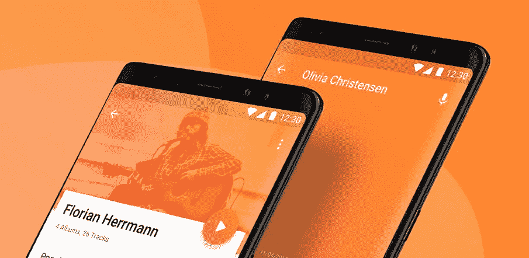

原型，设计或开发任何材料设计手机 app！Lora Material Design 是一个巨大的 UI 工具包，有 12 个类别的 80 多个材质设计屏幕。每个屏幕都可以完全定制，非常容易使用，并在 Sketch 应用程序和 Adobe Photoshop 中仔细分层和分组。这是你在 Sketch 或 Photoshop 中快速原型化、设计和开发任何材料设计应用程序所需的一切。您可以使用它来设计社交网络应用程序、仪表板和统计应用程序、媒体和新闻应用程序(博客、视频、画廊……)、电子商务应用程序(商店、商店)、预订应用程序、音乐等等……尽情享受吧！

在这里下载:[https://ui8.net/products/lora-material-design-ui-k...](https://ui8.net/products/lora-material-design-ui-kit)

# 9.材料设计 UI 套件免费赠品

格式:PSD

价格:免费

特别之处:

*   与 Photoshop 兼容
*   材料设计指南
*   6 个文件类别

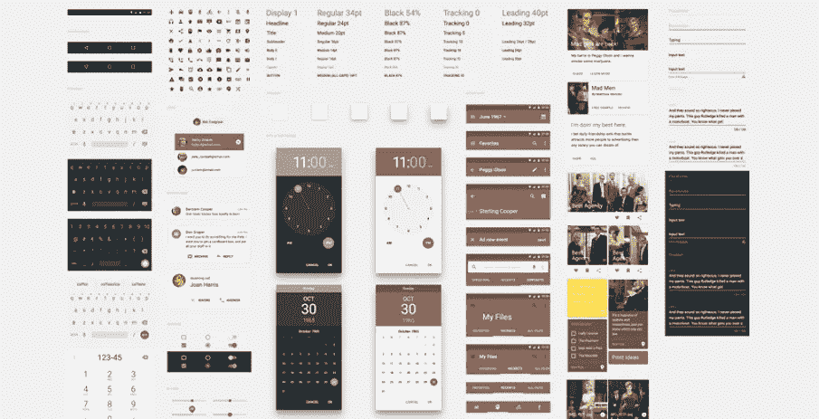

这个材质设计 UI 工具包有一小组与材质设计指南一致的基本元素。对了，还有《广告狂人》节目的照片，大家应该会欣赏。

在这里下载。https://dribbble.com/shots/2064912-Material-Design...

# 10.免费材料 UI 套件 PSD

格式:PSD

价格:免费

特别之处:

*   现代谷歌材质风格
*   完全可编辑的 PSD 文件(完全分层的文件)
*   组织良好的层
*   现代设计

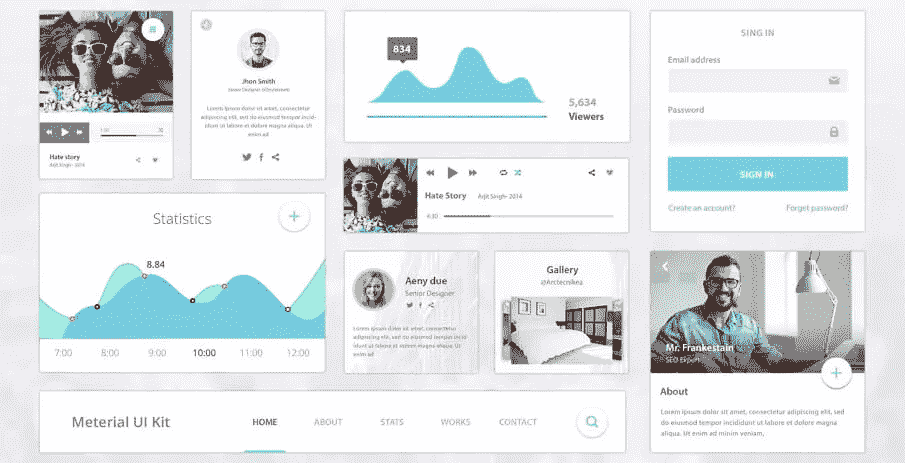

这个 UI 工具包包含许多有用的元素，包括个人资料、音乐播放器、统计数据、图表、按钮、导航菜单、页面中的歌曲等等。它是基于谷歌材料设计设计的。创建网站和手机应用程序。你可以找到一些关于材料设计的小元素和想法，这个 PSD 给你免费的 UI 模板和元素。您可以在网页设计或移动应用程序的用户界面设计中使用这些 UI 元素。

在这里下载。【http://psdboom.com/downloads/free-material-ui-kit-... 

# 11.Android UI 设计套件 4.4

格式:PSD

价格:免费

特别之处:

*   操作栏—下拉刷新
*   动作栏—不无聊
*   全息图书馆
*   滚动条
*   搜索操作栏
*   上下文动作栏

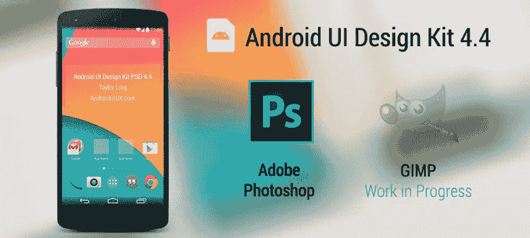

以前版本中的每个构建模块都包含在这个材料设计 UI 工具包中，使它成为迄今为止最完整的设计工具包。2 提示:在使用设计工具包之前，您必须首先安装 Roboto 和 Roboto Slab 字体。开始设计的推荐方法是使用快速入门文件，然后按住 Shift 键并从构造块文件中拖动所需的 UI 元素

在这里下载:[https://androiduiux.com/2014/01/10/android-ui-desi...](https://androiduiux.com/2014/01/10/android-ui-design-kit-for-photoshop-4-4-free-download/)

# 12.生动-软材料用户界面套件

格式:PSD，草图，JPG

价格:48 美元

特别之处:

*   基于引导网格构建— 12 列— 1170px 引导网格系统
*   6 大类 170+组件:导航— 43 个组件；标题和滑块— 8 个组件。

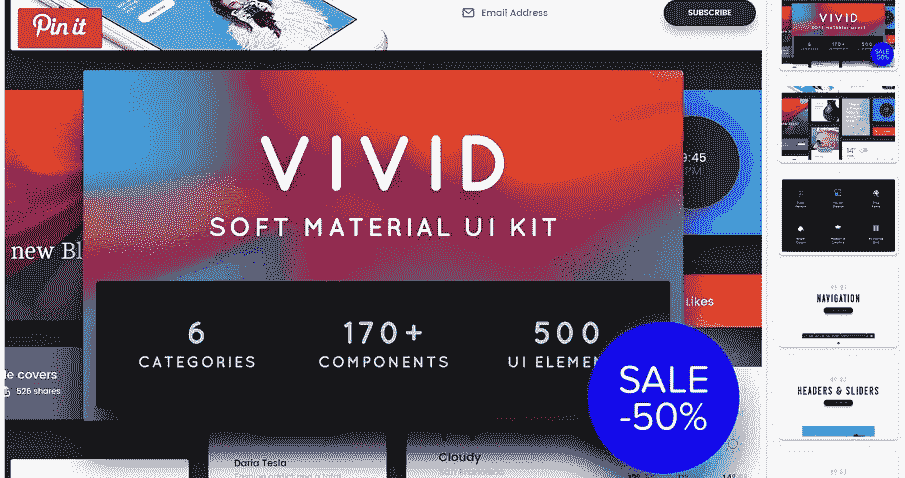

生动是一个软材料 UI 套件，结合了干净的排版和像素完美的元素，为您提供了一个完美的工具来创建任何类型的网站或网络应用程序。6 个类别包括部件——55 个组件，表单——26 个组件，购物——20 个组件，博客——20 个组件，风格指南——包括调色板、排版指南、图标和 UI 元素，一切都是基于矢量的。一切都被很好地命名和分组，帮助您快速找到想要的元素并在几分钟内创建项目。

在这里下载:[https://creativemarket.com/TheUIShop/414366-Vivid-...](https://creativemarket.com/TheUIShop/414366-Vivid-Soft-Material-UI-Kit?u=dribbble)

[自动交付具有准确规格、资产和代码片段的设计](https://idoc.mockplus.com/?hmsr=mockplusblogm)

[免费上手](https://goo.gl/otVypm)

# 以上 12 个材质设计 UI 套件有什么共同点？

# 1.设计构思

抛弃了多余的杂质和无序，材料设计只需要保留其最原始纯粹的形态、空间关系、变化和过渡，借助虚拟世界的灵活自然，还原最真实的体验，达到简单直观的效果。

# 2.色彩设计

没有乱七八糟的颜色，一般选择一个主色搭配一个底色。使用颜色变化创造更多的多种颜色。较暗的颜色变化是通过降低亮度和增加饱和度来实现的。更明亮的色彩变化是通过增加亮度和降低饱和度实现的。”查看这里的资源:[如何在 UI 设计中明智地运用色彩，打造完美的 UI 界面？](https://www.mockplus.com/blog/post/how-to-use-color-in-ui-design)

# 3.图标

一般来说，桌面图标尺寸是 48dp X 48dp，小图标尺寸是 24dp X 24dp。最好的区域应该是中央 20dp X 20dp。

# 4.字体

Roboto 用于字体，Noto 用于中文。

以上是由顶级设计师和开发者打造的 11 款最佳材质设计 UI 套件。

# 材料设计 UI 套件的更多免费资源:

# 1.材料 UI 套件

[https://psdrepo.com/free-psd/material-ui-kit-freeb...](https://psdrepo.com/free-psd/material-ui-kit-freebie/)

兼容素描应用和 Photoshop。

# 2.音乐应用程序 UI 套件—材料

[https://dribbble.com/shots/3374439-Music-App-ui-ki...](https://dribbble.com/shots/3374439-Music-App-ui-kit-Material)

兼容 Photoshop。

# 3.材料设计 UI 套件 PSD 免费下载

[https://dribbble.com/shots/1803843-Material-Design...](https://dribbble.com/shots/1803843-Material-Design-UI-Kit-PSD-Free-Download)

兼容 Photoshop。

# 4.材料 UI 套件

【https://dribbble.com/shots/3363887-Material-UI-Kit... 号

Forma: Sketch，PSD，xd Photoshop，Sketch 和 Adobe XD。

作为首拍，很荣幸和大家分享这个赠品 Photoshop，Sketch，Adobe XD 的材质设计 UI 套件。

# 5.材料设计部件 UI 套件— PSD

【https://dribbble.com/shots/2128765-Material-Design... 

格式:PSD。桌面/手机材质设计工具包。

# 6.材料设计

[https://dribbble.com/shots/1629860-Material-Design...](https://dribbble.com/shots/1629860-Material-Design-sketch)

格式:素描。Web、Android 和 iOS 项目。

如果你喜欢这篇文章，请在下面留下你的评论。谢谢你。