# 来自硅谷顶级科技公司的 12 篇“经理读本”

> 原文：<https://medium.com/hackernoon/12-manager-readmes-from-silicon-valleys-top-tech-companies-26588a660afe>

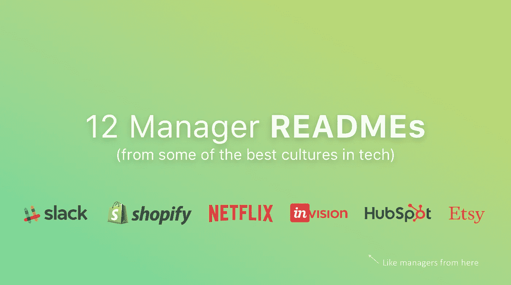

## Slack、HubSpot、网飞、Etsy、Shopify、InVision 等公司的技术管理有什么共同点？很明显，很多！

当我们推出我们的第一个[肥皂箱英雄](https://soapboxhq.com/modern-managers/heather)时，我惊讶地发现了一份用于向她的团队介绍她的工作风格的文件。我以前从没见过，太棒了！

其他人有这些吗？我需要知道。最终，我发现了一个宝库，里面有一些来自拥有最佳科技文化的公司的工程领导者的例子。

他们称之为经理手册或经理用户手册。他们很有礼貌地让我与你分享。

**点击图片阅读阅读材料。**最后，我附上了我的笔记，以防你打算自己制作。

但是首先，灵感！👀 🎁 🎉

# [迈克尔·洛普](https://twitter.com/rands)(又名兰德斯)，工程副总裁。在[松驰](https://slack.com) ~~~~~~~~

[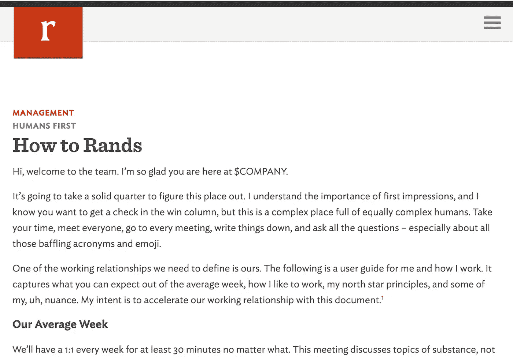](http://randsinrepose.com/archives/how-to-rands/)

[http://randsinrepose.com/archives/how-to-rands/](http://randsinrepose.com/archives/how-to-rands/)

## 我最喜欢的部分:

*   “我们的平均周”涵盖了迈克尔的典型工作周是怎样的，以及如何让他参与其中。
*   他可能会在周末和你聊天。周一你可以随意阅读。
*   他是一个内向的人(“不要把我的安静和缺乏参与混淆。”)
*   流言蜚语是他的导火索。

# [Ben Morris](https://twitter.com/bnmrrs?lang=en) ，高级开发人员领导 [Shopify](https://shopify.com) ~~~~~~~~

[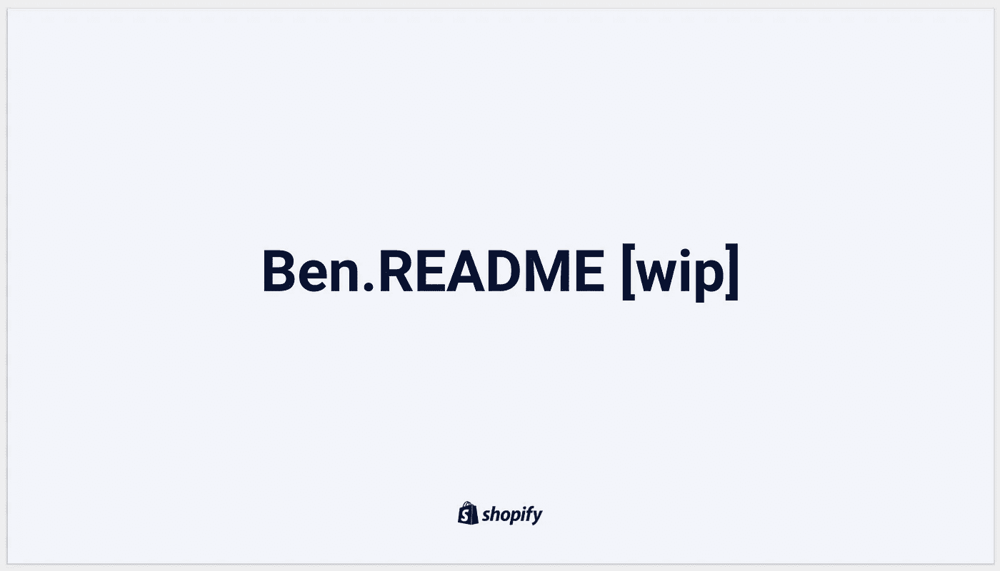](https://docs.google.com/presentation/d/1LGL7fh5zWx8XqHRBra51LcMIHCUluqrdXZ_-XBTXqlg/edit#slide=id.g23dc7fe4e1_2_85)

[https://docs.google.com/presentation/d/1LGL7fh5zWx8XqHRBra51LcMIHCUluqrdXZ_-XBTXqlg/edit#slide=id.g23dc7fe4e1_2_85](https://docs.google.com/presentation/d/1LGL7fh5zWx8XqHRBra51LcMIHCUluqrdXZ_-XBTXqlg/edit#slide=id.g23dc7fe4e1_2_85)

## 我最喜欢的部分:

*   对他的角色和目标的描述非常清晰。
*   明确说明他可以如何帮助你(以及你可以如何帮助他完成他的工作)。
*   特别是他如何将 Shopify 的价值观融入到他的角色中。

# [罗伊](https://twitter.com/royrapoport)，[懈怠](https://slack.com)导演(弗莱·Netflix.com)~ ~ ~ ~ ~ ~

[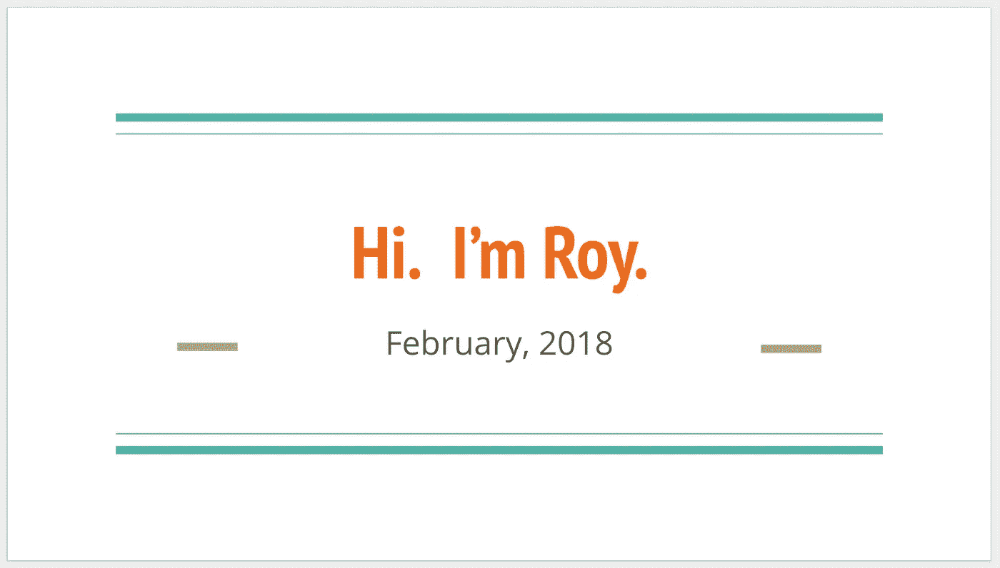](http://bit.ly/roy-slack-readme)

[http://bit.ly/roy-slack-readme](http://bit.ly/roy-slack-readme)

## 我最喜欢的部分:

*   这是工作和生活的结合。他有三只山羊。很好。一些可以聊天的话题。
*   “我不相信性格冲突”至少作为一名经理在工作中不会。
*   我很久以来读到的对经理工作的最好描述之一。

[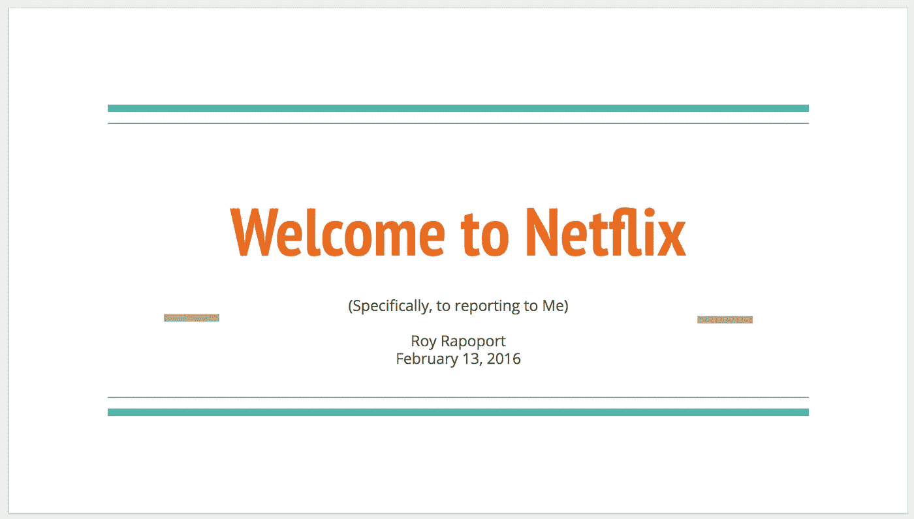](https://bit.ly/welcometonetflixandme)

[https://bit.ly/welcometonetflixandme](https://bit.ly/welcometonetflixandme)

罗伊的第一部自述文件是在网飞制作的。我认为看到 Roy 的文档在两家公司之间的变化非常好。这是一个很好的提醒，一个经理要适应他们所处的环境。

这是你能在网上找到的第一本读物。许多人从罗伊那里获得了灵感。

# 柳文欢，工程副总裁。在[福特](https://forter.com)(+[SoftwareLeadWeekly.com](http://softwareleadweekly.com/))

[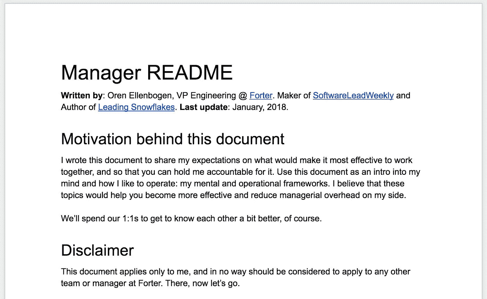](https://docs.google.com/document/d/1sx5ssYb_xMrmwPpyjD5xP7RvQ7cHweDYlRGn2SXztKw/edit#heading=h.g1q7u9cc1uha)

[https://docs.google.com/document/d/1sx5ssYb_xMrmwPpyjD5xP7RvQ7cHweDYlRGn2SXztKw/edit#heading=h.g1q7u9cc1uha](https://docs.google.com/document/d/1sx5ssYb_xMrmwPpyjD5xP7RvQ7cHweDYlRGn2SXztKw/edit#heading=h.g1q7u9cc1uha)

## 我最喜欢的部分:

*   链接、图片、视频——如果你有兴趣，还可以找到更多的材料来加深理解！
*   个人怪癖(特指他不喜欢自己的那些！)
*   通信渠道的预期响应时间(尤其对远程团队有帮助)。

# [亚伦](https://twitter.com/aaronlerch)，英格。[vision](https://invisionapp.com)经理~ ~ ~ ~ ~ ~ ~ ~ ~ ~ ~ ~ ~ ~ ~ ~ ~ ~ ~ ~ ~ ~ ~ ~ ~ ~ ~ ~

[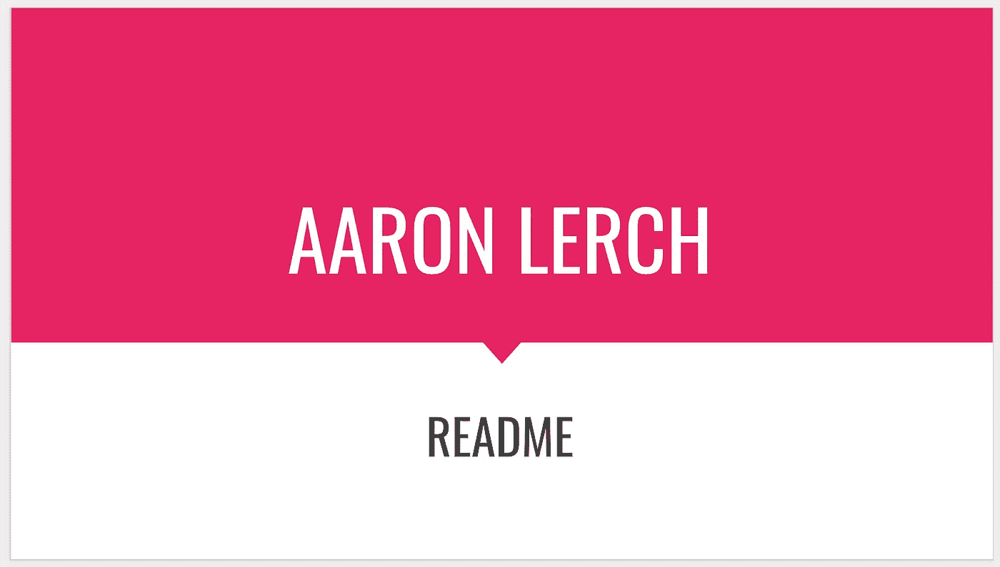](https://docs.google.com/presentation/d/1F2PWxQ-sKJ1uAlrhU9ULXOVmH-CW6dw_ufMzbFLAWHA/edit#slide=id.p)

[https://docs.google.com/presentation/d/1F2PWxQ-sKJ1uAlrhU9ULXOVmH-CW6dw_ufMzbFLAWHA/edit#slide=id.p](https://docs.google.com/presentation/d/1F2PWxQ-sKJ1uAlrhU9ULXOVmH-CW6dw_ufMzbFLAWHA/edit#slide=id.p)

## 我最喜欢的部分:

*   他作为 InVision 经理的个人目标。
*   一个理想的团队成员在他的团队中是什么样的？
*   一个透明的编辑，评论他的反应能力。

# [Molly](http://www.mollywhite.net/) ，HubSpot[的技术负责人](https://hubspot.com)~ ~ ~ ~ ~ ~ ~ ~ ~ ~ ~ ~ ~ ~ ~ ~ ~ ~ ~ ~ ~ ~ ~ ~

[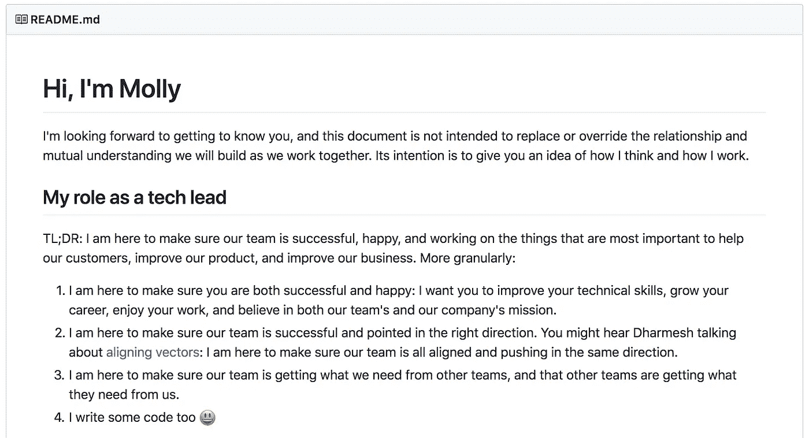](https://github.com/molly/manager-README)

[https://github.com/molly/manager-README](https://github.com/molly/manager-README)

## 我最喜欢的部分:

*   在 github 上！超级酷。
*   “我对团队做出的决定负责，即使大多数时候我并不是决策者。”
*   特别呼吁多元化和心理健康。

# [马特](https://matthewnewkirk.com/)，高级工程师。 [Etsy](https://etsy.com) 的经理~ ~ ~ ~ ~ ~ ~ ~ ~ ~ ~ ~ ~ ~ ~ ~ ~ ~ ~ ~ ~ ~ ~ ~ ~ ~ ~ ~ ~ ~ ~ ~ ~ ~

[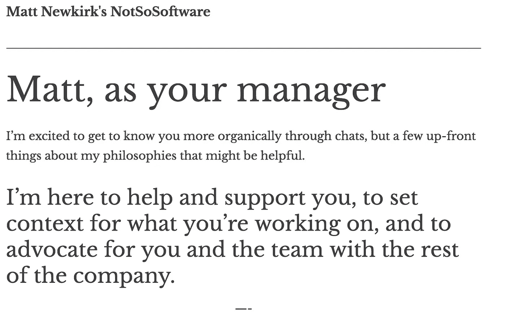](https://matthewnewkirk.com/2017/09/20/share-your-manager-readme/)

[https://matthewnewkirk.com/2017/09/20/share-your-manager-readme/](https://matthewnewkirk.com/2017/09/20/share-your-manager-readme/)

## 我最喜欢的部分:

*   客人可以默认编辑他的日历事件！
*   人员>过程(不管使用什么方法)。如果敏捷/scrum 对团队不起作用，让我们看看什么会起作用。
*   他非常重视工作与生活的平衡…这意味着你可能永远不会在周末听到他的消息，除非这是一件大事！

# 斯科特，工程副总裁。在[斯特拉塔桑](https://stratasan.com)~ ~ ~ ~ ~ ~ ~ ~ ~ ~ ~ ~ ~ ~ ~ ~ ~ ~ ~ ~ ~ ~ ~ ~ ~

[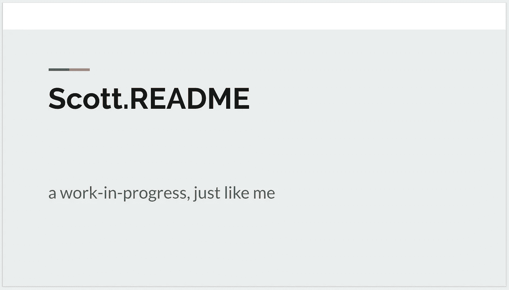](https://docs.google.com/presentation/d/1PE2OmkVykdZYF2QzmJ-ZUHqBAxnnsbnMsd19z3qLWNI/edit#slide=id.gcb9a0b074_1_0)

[https://docs.google.com/presentation/d/1PE2OmkVykdZYF2QzmJ-ZUHqBAxnnsbnMsd19z3qLWNI/edit#slide=id.gcb9a0b074_1_0](https://docs.google.com/presentation/d/1PE2OmkVykdZYF2QzmJ-ZUHqBAxnnsbnMsd19z3qLWNI/edit#slide=id.gcb9a0b074_1_0)

## 我最喜欢的部分:

*   "我认为经理为他们的直接下属工作."
*   关于深度工作:“收件箱(电子邮件、Slack、社交媒体等)的维护不是你的本职工作。注意力是一种宝贵的资源”并非对所有的角色都是如此，但对 Scott 的团队来说却是如此。

# [埃利奥特](https://github.com/elliottcarlson)，[renttherrunway](https://renttherunway.com)的经理~~~~~~~~~~~~~~

[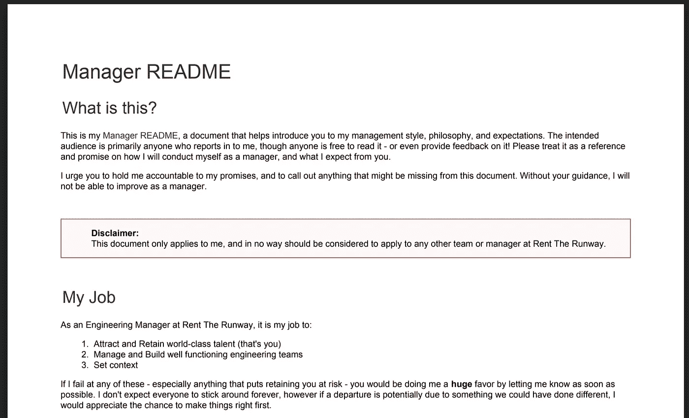](https://drive.google.com/file/d/1mxUR69VBVBGPy-rq13jsgsgr67HosZOx/view)

[https://drive.google.com/file/d/1mxUR69VBVBGPy-rq13jsgsgr67HosZOx/view](https://drive.google.com/file/d/1mxUR69VBVBGPy-rq13jsgsgr67HosZOx/view)

## 我最喜欢的部分:

*   他将这份文件视为“关于我作为经理将如何行事的承诺”，并要求对此负责。
*   他是一个内向的思考者，有时在大群体中会比较安静。
*   他可能有取悦他人的倾向。

# [艾伦](http://angryweasel.com/blog/)、[联合导演](https://unity3d.com/)~ ~ ~ ~ ~ ~ ~ ~ ~ ~ ~ ~ ~ ~ ~ ~ ~ ~ ~ ~ ~ ~ ~ ~ ~ ~ ~ ~ ~ ~ ~ ~

[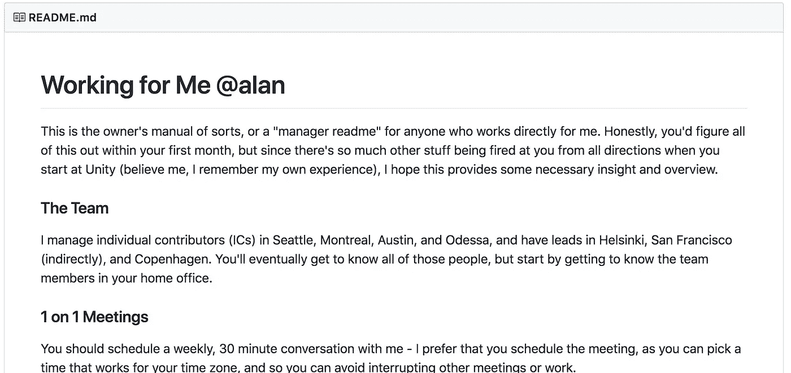](https://github.com/angryweasel/managerreadme)

## 我最喜欢的部分:

*   喜欢它在 github 上——检查编辑的提交！
*   他的集成电路如何成为他们组织中的领导者。
*   参考进一步阅读他的管理影响！

# [**D**D**R**责任**I**n](https://medium.com/u/d0849441a93f#1c3bdb35194c)原则，但如果你是，它会非常强大。不过，首先，你需要设定一个期望值，让他们对此负责。

# 完成了吗？装运它！

怎么会？与我交谈过的作者的共识似乎是:

1.  交付文档的最有效方式是一对一地带领员工阅读。
2.  最容易开始的时间是员工入职时。他们的或你自己的(如果你继承了一个团队)

# 你坚持到了最后！

> **我的问题是:**我在笔记中遗漏了什么吗？他们的文件中遗漏了什么吗？你的文件里有哪些必备的东西？

感谢阅读，
布伦南

另外，你应该至少每两周和你的团队进行一次这样的对话。**如果你的对话陈旧、前后矛盾或者毫无条理，你现在就应该尝试**[**soap box**](https://soapboxhq.com/?utm_source=hackernoon&utm_medium=referral&utm_campaign=manager-readmes)**。**

## 布伦南是加拿大最佳工作场所[肥皂盒](https://soapboxhq.com/?utm_source=hackernoon&utm_medium=referral&utm_campaign=manager-readmes)的首席执行官兼联合创始人。 [SoapBox](https://soapboxhq.com/?utm_source=hackernoon&utm_medium=referral&utm_campaign=manager-readmes) ，是一个应用程序和助手，帮助经理们与他们的团队进行更好的一对一、团队会议、市政厅等。

如果你喜欢这篇文章，你应该给它 12👏(每个自述一个)帮别人找！👇