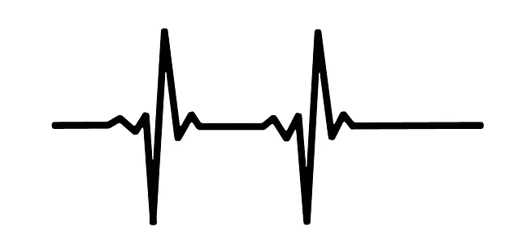
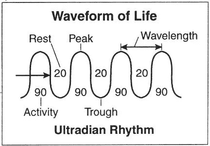

# 管理你的能量和提高你的生产力的 12 个技巧

> 原文：<https://medium.com/hackernoon/12-tips-to-manage-your-energy-and-skyrocket-your-productivity-15ee79fe0186>

你想更上一层楼吗？你想做得更多吗？在更短的时间内？你想有更多的能量吗？更健康？更多的快乐？

什么事？然后你会爱上托尼·施瓦茨和吉姆·罗尔的《全力投入的力量》。

前提很简单: ***表现、健康和快乐都根植于对能量的巧妙管理。***

我个人从这本[书](https://hackernoon.com/tagged/book)中获益良多，在我如何安排我的生活和优化我的生产力方面，它对我来说是一个真正的游戏规则改变者。

在这篇文章中，我将揭示我从这本书中学到的 12 条关键经验。

# 1.精力，而不是时间，是高绩效的基本货币

> “表现、健康和快乐都基于对能量的巧妙管理。一天中的小时数是固定的，但我们所能获得的能量的数量和质量却是不变的。这是我们最宝贵的资源。我们对我们带给世界的能源承担的责任越多，我们就变得越有力量和生产力。”

这是本书的基本前提。

如果我们想发挥出最佳水平，我们必须首先管理好自己的精力，而不是时间。

这与我们社会“越多越好”的信念形成了鲜明的对比。

当一些事情在我们 24/7 的世界里不能正常工作时，标准的建议是加倍你投资的时间。

*   工作项目没有进展？多劳多得。
*   想和家人有更好的关系？多陪陪他们。
*   想变得更健康？多花点时间在厨房，多锻炼。
*   感觉筋疲力尽？多休息几天。

看到问题了吗？

不可能做更多的事情…我们一天只有 24 小时…迟早我们会用完时间。

此外，这不仅仅是你在某件事情上投入的时间的数量，而是你投入的精力的质量。

如果你有一个 3 小时的会议，但在第一个小时后几乎无法集中注意力或保持清醒，这不会帮助你发挥出最佳水平。

如果你下班回到家，想和家人共度美好时光，但是工作让你疲惫不堪，烦躁不安，那么这无助于你发挥出最佳水平。

如果你在一个工作项目上连续工作了 5 个小时，但在 2 个小时后已经失去了注意力，那么这不会帮助你发挥出最佳水平。

优化我们的表现、健康或幸福不是关于时间的数量，而是关于能量的质量。

底线是:以最佳状态生活的关键是优化你的精力，而不是你的时间。

# 2.优化你能量的最佳方式

快讯:我们是人，不是超级计算机。

我们不应该长时间、持续地高速奔跑。

相反，当我们在消耗能量和间歇地更新能量之间移动时，我们表现得最好。

我们生活在一个所谓的振荡宇宙中，其特点是在活动和休息之间有节奏的波动。

> “自然本身就有脉搏，是活动与休息之间有节奏的波状运动。想想潮汐的涨落，季节之间的运动，以及每天太阳的升起和落下。同样，所有生物都遵循维持生命的节奏——鸟类迁徙，熊冬眠，松鼠采集坚果，鱼产卵，所有这些都在可预测的时间间隔内进行。因此，人类也受节奏的指引。”

我们受节奏的指引。

我们坚持的最著名的节律是昼夜节律。我们以 24 小时为周期生活。我们醒着 16-18 个小时(消耗能量)，然后睡 7-9 个小时(补充能量)。

一段时间的活动之后是一段时间的休息。一段时间的能量消耗(活动)之后是一段时间的能量更新(休息)。

我们的能源不是无穷无尽的。我们不能在 10-20 秒内 100%冲刺。我们无法连续几个小时集中注意力。在我们的表现直线下降之前，我们不能保持清醒超过 18-20 个小时。

迟早我们需要补充能量。

所以:如果我们想达到最佳状态，我们需要过有节奏的生活，一段时间剧烈运动，一段时间剧烈休息。我们需要像一系列短跑一样生活，而不是永无止境的马拉松。

我们需要要么全面参与，要么战略性地退出…

# 3.你要么全力投入，要么战略性地退出

> “最富有、最快乐和最有成效的生活的特点是能够充分参与手头的挑战，但也能定期脱离并寻求更新。相反，我们许多人的生活就像是在跑一场没完没了的马拉松，让自己远远超出了健康的努力水平。”

想象一下一个典型的长跑运动员的样子:骨瘦如柴，面色蜡黄，形容憔悴，身体不健康，精力不太充沛。

现在想象一下像尤塞恩·博尔特这样的短跑运动员:强壮、健康、强壮、精力充沛、意志坚定。

短跑运动员看起来好多了。

为什么？因为他在振荡。他开了又关了。他全力以赴，然后休息一段时间。他要么完全投入，要么战略上不参与。他遵循大自然的节奏。

像短跑运动员一样，我们希望我们的生活是一系列的短跑，在激烈的参与和同样激烈的更新之间摇摆。

完全说得通，对吧？

然而，这并不是我们大多数人的生活方式。

相反，我们大多数人都处于能量不断保存的状态。我们从来没有完全，也从来没有完全关闭。从未完全投入，也从未完全脱离。

我们过着线性的生活，而不是振荡的生活(这是完全相反的)。

以一个典型的工作日为例。你曾经完全放松过吗？你曾经完全脱离你白天正在做的事情吗？你经常休息吗？你曾经完全集中精力，把你所有的 100%都投入到一个特定的任务中吗？

很可能你什么都不做。

例如，我们大多数人认为休息是虚弱的标志，相反，我们会连续几个小时保持精力充沛的状态。即使我们很累，几乎无法集中注意力，我们还是继续前进…

…直到最后时钟指向下午 5 点，我们才可以回家(在那里我们看电视，直到一天结束)。

(顺便说一下，看电视既不能算作完全投入，也不能算作完全脱离。这只是一种低能量的状态。)

这既不是我们自然的也不是我们理想的生活方式。

所以请记住:当你在活动和恢复之间摇摆时，比你一直踩着刹车线性生活时，你会过得更好。

你要么完全投入，要么战略性地脱离。

(我们将在本文后面看到实现这一点的方法……)

# 4.网球运动员&休息的力量

> “像短跑运动员一样生活就是将生活分成一系列可管理的区间，这些区间符合我们自己的生理需求和大自然的周期性节奏。当吉姆与世界级的网球运动员一起工作时，这种洞察力首次具体化。作为一名行为心理学家，他的目标是理解将世界上最伟大的竞争者与其他竞争者区分开来的因素。吉姆花了数百个小时观察顶尖选手，研究他们的比赛录像。让他越来越沮丧的是，他几乎没有发现他们在得分时的竞争习惯有什么明显的不同。只有当他开始注意到他们在点与点之间做了什么时，他才突然看到了不同。虽然他们中的大多数人并没有意识到这一点，但最好的球员在得分之间都建立了几乎完全相同的套路。这些包括他们在一个点后走回基线的方式；他们如何捧着自己的头和*的肩膀；他们把目光聚焦在那里；他们呼吸的模式；甚至他们自言自语的方式。”*

想知道顶级网球选手和一般网球选手的区别？

好吧，一个区别是顶级玩家在振荡。

他们优化每个点之间的其余部分。Tony Schwartz 和 Tim Loehr 发现，顶尖选手能够在两次得分之间降低心率，最高可达每分钟 20 次。一般球员的心率保持不变，是因为他没有优化自己的恢复/休息期。

如果一场比赛进入第四或第五回合，猜猜谁会有更多的精力？

是的，这是一个顶级球员，他在整场比赛中都在振荡和恢复他的一些能量。

这就是平衡能源消耗和能源再生的力量。

这是高性能和一般性能之间的主要区别之一。

# 5.超节奏

> “这些超日节律有助于解释我们一天中能量的消长。在周期的第一阶段，心率、荷尔蒙水平、肌肉紧张度和脑电波活动等生理指标都会增加——警觉性也是如此。大约一小时后，这些指标开始下降。在 90 到 120 分钟之间，身体开始渴望一段时间的休息和恢复。信号包括想打哈欠和伸懒腰，饥饿感，紧张感增加，注意力难以集中，有拖延或幻想的倾向，以及更高的出错率。

超日节奏是一个在一天中重复无数次的循环。

大约 90 分钟内，你处于高性能模式。你的警觉性、专注力、创造力、情绪恢复力和精神耐力都在他们的游戏中名列前茅。

然后，在大约 20 分钟的时间里，你的身体需要时间休息和补充能量。

Source: [http://www.deeperdish.com/90-minute-energy-advice-i-cant-usealone](http://www.deeperdish.com/90-minute-energy-advice-i-cant-usealone)

同样，这只是你的身体在日常生活中遵循的许多不同节奏之一，但根据托尼·施瓦茨和吉姆·罗尔的说法，这是一个重要的节奏。

他们的建议很明确:为了最大限度地利用你的工作日，全力以赴 90-120 分钟*(完全投入)，然后休息 15-20 分钟(战略性地放松)。

(*在 90-120 分钟的冲刺工作中，休息 2-3 次，每次 1-5 分钟，这很好，甚至是个聪明的主意。)

(**注意:**我们能够通过召唤战斗或逃跑反应，让我们的身体充满压力荷尔蒙来超越这些自然周期，这些荷尔蒙旨在帮助我们处理紧急情况。然而，从长远来看，这是一个糟糕的想法。毒素和压力荷尔蒙将在我们的系统中积累，并随着时间的推移对我们的身体造成损害。

过度依赖咖啡因、尼古丁、可卡因和安非他命不是长久之计。)

好的，那么当我们每隔 90 分钟左右就要休息一下的时候，在这段时间里我们到底应该做些什么呢？

补充我们的能量(咄！).

好吧，但是怎么做？作者建议能量仪式:

# 6.使用能量仪式来补充你的坦克

所以你工作 90-120 分钟，然后你需要休息一下。

这些休息的目的是更新你的能量。潜在的能量更新活动包括散步、与工作伙伴交谈、快速锻炼、冥想、做一些呼吸练习、小睡一会儿或其他任何事情。

所有这些都可以让你在接下来的 90-120 分钟的工作或全性能部分恢复精力并优化表现。

现在这些能量更新活动的关键是:你想把它们变成仪式…

> “我们有目的地使用‘仪式’这个词来强调一种精心定义的、高度结构化的行为的概念。与需要迫使自己做出特定行为的意志和纪律相反，仪式会吸引你。想想像刷牙这样简单的事情。这不是你通常需要提醒自己去做的事情。刷牙是一件你一直想做的事情，因为它有明显的健康价值。你在很大程度上是自动驾驶，没有多少有意识的努力或意图。仪式的力量在于，它们确保我们在非绝对必要的地方尽可能少地使用有意识的能量，让我们自由地以创造性的、丰富的方式战略性地集中可用的能量。”

重点是:当你进行一项能量更新活动时，你通常需要用一些意志力和一些具有讽刺意味的思考能量来进行这项活动。(你可能要“强迫”自己冥想或者去散步)。

另一方面，当你进行能量仪式时，你不需要任何有意识的能量或意志力。

这就是仪式的美妙之处:

*   它们自动发生
*   他们不会耗尽意志力
*   他们不会耗尽意识能量

因为我们试图优化我们一天的能量，通过使用仪式来保存能量是一个好主意。

能量仪式有两个好处。它们(1)补充你的能量，而(2)不消耗任何能量或意志力。

一句话:仪式是强大的。利用它们成为你的优势。

(**注:**你也可以创造*每周*(不仅仅是每天)的精力仪式，比如每周四和你的配偶出去吃饭。或者每周一早上和你的工作伙伴打网球。)

让我们看看坚持这些原则的典型一天是什么样子的:

*   07:00–08:30:**工作冲刺**(全身心投入)
*   08:30–08:50:**能量仪式**(战略脱离)
*   08:50–10:30:**工作冲刺**(全身心投入)
*   10:30–11:00:**能量仪式**(战略脱离)
*   11:00–12:30:**工作冲刺**(全身心投入)
*   12:30–13:00:**午餐**
*   13:00–13:30:**小睡**(也是一种能量仪式和战略脱离)
*   13:30–15:00:**工作冲刺**(全身心投入)
*   15:00–15:15:**能量仪式**(战略脱离)
*   15:15–17:00:**工作冲刺**(全身心投入)

(是不断的分分合合。紧接着休息的全速冲刺。一段时间的全面接触，然后是一段时间的战略脱离。一段时间的能量消耗之后是一段时间的能量更新。那就是振荡。这就是我们在日常生活中优化能量的方式。)

是的，这可能看起来你比平时工作得少。

但是根据这本书的研究(以及我自己的经验)，你用这种方式工作会比用更老式的线性方式工作得到更多。

请记住，在这种情况下，当你真正在工作时(我称之为工作冲刺)，你会全力以赴。你完全耗尽了自己，努力工作，因为你可能从来没有在一个常规的能量保存模式下工作。

这些冲刺会让你完成更多的工作。

无论如何…

那么我们如何知道在这些能量仪式中要做什么呢？那要看你个人需求了。让我解释一下…

# 7.能量的四种来源

> "全身心投入需要利用四种独立但相关的能量来源:身体、情感、精神和心灵."
> 
> “为了充分参与，我们必须身体上充满活力，情感上相互联系，精神上专注，精神上与超越眼前私利的目标保持一致。”

我们已经确定，我们想要在我们的每一天和整个生命中间歇地更新我们的能量。

可以说，我们的燃油箱由 4 种不同的能源组成，有助于提高燃油性能:

*   你的身体怎么样？你的肌肉脂肪比怎么样？你的营养状况如何？你有足够的高质量睡眠吗？你经常锻炼吗？
*   **感情:**你的感情生活怎么样？你会定期感受到积极的情绪吗？你情绪稳定吗？还是你的负面情绪在作怪？
*   **心理:**你的大脑怎么样了？你能长时间集中注意力吗？还是你很快就失去了注意力，变得心烦意乱？
*   精神上:你的动力怎么样了？你有人生目标吗？以及驱动你行动的一套清晰的价值观？

如果你想发挥出最高水平，你必须优化这四种能量来源。

根据你个人的长处和短处，你会希望专注于优化不同的能源。

如果你的身体能量很低，那么你会想在营养、睡眠和锻炼方面下功夫。如果你的情绪能量很低，那么你会想要努力改善。

在接下来的 4 个关键理念中，你将学习如何优化 4 种不同能源。

现在，也要理解所有的 4 种能量来源是相互依赖的。

例如，当你的身体能量很低，并且你一直都很累，那么你的精神能量以专注的形式也会受到影响。这就是为什么只有当你充分利用你的四种能量来源时，高绩效、健康和快乐才是可能的。

让我们一个一个地检查它们。

# 8.体力

> “体能是燃料的根本来源，即使我们的工作几乎完全是久坐不动的。它不仅是机敏和活力的核心，还会影响我们管理情绪、保持注意力集中、创造性思维的能力，甚至会影响我们对任何任务的承诺。”

物理能量就是我们通常理解的能量。如果你经常感到疲劳，那么你就缺乏体能。

正如作者所说，这不仅在你从事体力工作时很重要，而且在你大部分时间都在用大脑工作时也同样重要。

如此这般…

我们如何优化我们的体能？简单:通过优化我们的营养、睡眠和锻炼。

你的营养、睡眠和锻炼越好，你的身体能量就越多。

关于如何优化你的营养和睡眠的具体建议(还没有太多关于运动的)，请查看我们的博客。

**补充体能的势能仪式:**

*   每天散步/慢跑(也许在你第一次工作休息的时候)
*   安排每周一次的网球课
*   定期锻炼(力量训练或间歇训练)
*   深呼吸(也许在你第二次工作休息的时候)
*   瑜伽(可能一周一次，或者在你下午休息的时候)
*   每天的睡眠习惯可以让你更快入睡，并保持整夜睡眠
*   整天健康饮食
*   只是尽可能地移动你的身体

# 9.情感能量

> “为了达到最佳状态，我们必须获得愉快和积极的情绪:享受、挑战、冒险和机遇。源于威胁或缺陷的情绪——恐惧、沮丧、愤怒、悲伤——对它们来说有一种明显的毒害感，并与特定压力荷尔蒙的释放有关，最明显的是皮质醇。”

简而言之:积极的情绪会提高表现。负面情绪伤害表现。

我喜欢提醒自己这个真理:快乐创造成功(而不仅仅是相反)。

你经常感受到的积极情绪越多，你的情绪能量就越大，你的表现也会越好。

那么，如果你没有足够的积极情绪呢？然后，你必须问问自己，你是否每周花足够的时间参加活动，纯粹是为了这些活动带来的快乐和更新。

如果不是这样，安装能量仪式来补充你的情绪能量罐。

**补充情绪能量的潜在能量仪式:**

*   每周一次舞蹈/瑜伽/烹饪课
*   每周和你的配偶共进晚餐一次
*   早晨的第一件事就是冥想(或者在超节奏的休息时间)
*   每周至少三次与家人共进晚餐
*   和朋友一起看足球比赛
*   读一本关于沟通的书(以减少争论)

# 10.心理能量

> “没有什么比无法专注于手头的任务更能影响工作表现和参与度了。要发挥出最佳水平，我们必须能够保持专注，并在广泛和狭窄以及内部和外部焦点之间灵活移动。”

你的精神能量主要是你的注意力——你专注于你想要的东西、你想要的时间和你想要的时间的能力。

这非常重要。如果你的注意力持续时间太短，或者只是不能很好地集中注意力，那么你需要安装能量仪式来提高你的精神能量。

补充精神能量的潜在能量仪式:

*   每天冥想 20 分钟
*   坚持每天练习瑜伽
*   玩一些提高注意力的脑力游戏，比如 [lumosity](http://www.lumosity.com/)
*   [沟多任务](http://www.njlifehacks.com/multitasking/)
*   锻炼(这对大脑有好处)
*   散步(如果可能的话，在大自然中)
*   获得足够高质量的睡眠
*   健康饮食([低碳水化合物饮食](http://www.njlifehacks.com/high-fat-diet/)是最好的)

# 11.精神能量

> “我们在任何特定时刻消耗的能量反映了我们的身体能力。我们花钱的动机很大程度上是一个精神问题。从根本上说，精神能量是一种独特的力量，在我们生活的各个方面都起作用。它是我们动力、毅力和方向最强大的源泉。我们对“精神”的定义不是宗教意义上的，而是更简单和基本的术语:与一套根深蒂固的价值观和超越我们自身利益的目标的联系。

精神能量给我们行动的动力。

我们可以拥有世界上所有的能量(身体上的)，但是如果没有“为什么”的原因，我们就不知道如何利用它。

想想看:你可以拥有完美的营养，完美的锻炼方式，完美的睡眠……你会精力充沛……

然而，这会神奇地让你有动力吗？不，不会的。

当你不知道自己作为一个人的立场是什么，也没有任何努力的目标时，你就不会感到尽可能有动力。如果你没有任何人生目标，那你为什么还要在早上起床呢？你还不如呆在床上…

另一方面，当你知道你想成为什么样的人，你的立场是什么，你的目标是什么，那么突然间你就有了采取行动的理由和让事情发生的理由。这时你会感到动力十足。

这就是精神能量的来源。作者将精神定义为:

*   一套价值观
*   超越我们自身利益的目的

因此，为了优化我们的精神能量，我们需要有一套强有力的价值观，以及我们为什么做我们所做的事情的目的。

我们如何发现我们的目的和价值观是什么？这当然是一个难题，可能需要几年时间才能真正找到答案。

幸运的是，托尼·施瓦茨和吉姆·罗尔为我们提供了一个简单的练习来弄清真相:

> “跨越文化、宗教和时代本身，人们钦佩并渴望同样的普遍价值观——其中包括正直、慷慨、勇气、谦逊、同情、忠诚和毅力——同时拒绝其对立面——欺骗、贪婪、怯懦、傲慢、冷酷、不忠和懒惰。为了开始更深入地探索对你最有吸引力的价值观，我们建议你留出不受干扰的时间来回答以下问题:跳到你生命的尽头。你学到的最重要的三课是什么，为什么它们如此重要？想想你非常尊敬的人。描述这个人身上你最欣赏的三个品质。你最好的时候是谁？你希望在你的墓碑上看到什么一句话的碑文，能抓住你生命中真正的自己？”

这个练习可能听起来很傻…

但是研究实际上支持这个观点。当你有一套清晰的价值观和所谓的“超越自我的目标”时，你会对自己感觉更好，更有动力、更自信、更有效率等等..

(不信你谷歌一下。)

所以，做上面的练习。它会释放你体内神奇的动力。补充精神能量的潜在能量仪式:

*   瑜珈
*   沉思
*   大自然中的散步
*   阅读一本励志书籍
*   听励志老师讲课
*   祈祷
*   重新找到你的目标和价值观

# 12.如何在你的生活中建立能量仪式

要发挥出最佳水平，你需要巧妙地管理你的精力。

为了尽可能熟练地管理你的能量，你必须依靠积极的能量仪式，它会自动发生，不需要你使用任何意志力。

所以最后一个问题是…

你如何将这些能量仪式融入你的生活？托尼·施瓦茨和吉姆·罗尔给了我们一些工具来帮助解决这个问题。我最喜欢的想法是他们所谓的精确性和特异性:

> “一系列广泛而有说服力的研究证实，时间的特异性和行为的精确性极大地增加了成功的可能性。解释再次在于我们有意识的自我控制能力是有限的，而且很容易耗尽。通过确定一个行为将在何时、何地以及如何发生，我们不再需要考虑如何完成它。一系列的实验已经证实了这种模式…
> 
> 在也许是最戏剧性的实验中，一组吸毒者在戒断期被研究——此时控制吸毒冲动所需的能量严重损害了他们从事几乎任何其他任务的能力。作为帮助他们在康复后找到工作的努力的一部分，一组人被要求在某一天下午 5 点之前写一份简短的简历。没有一个人成功。第二组被要求完成同样的任务，但也要说出他们写简历的确切时间和地点。该组 80%的人成功了。"

最后一项研究太棒了。

简单地为你将要做的事情设定一个确切的时间和地点会极大地增加你真正去做的机会。

假设你想在下班回家后安装冥想的能量仪式。在这种情况下，您只需定义:

“**当**我下班回到家，**然后**我立即去我的卧室冥想。”

恭喜你。光是这个承诺就会大大增加你坚持能量仪式的机会。

(注意:在你的生活中建立新的习惯本身就是一个大话题。我发现建立新仪式的最好方法是使用[实现意图](http://www.njlifehacks.com/implementation-intentions/)和一个叫做 [WOOP](http://www.njlifehacks.com/woop-goal-setting-method/) 的心理工具。如果你在安装能量仪式上有困难，你可以看看这些文章。)

# 结论

表现、健康和幸福首先是基于对精力的巧妙管理，而不是时间。

由于我们不是高速计算机，我们无法长时间高速、持续地完全投入。相反，当我们在消耗能量和间歇地更新能量之间移动时，我们表现得最好。

换句话说:我们是摇摆不定的人类，应该像一系列短跑一样生活，而不是一场永无止境的马拉松。

我们要么全面介入，要么战略性地脱离。我们应该开或关。我们应该全力以赴或者休息一下。一段时间的能量消耗(活动)之后是一段时间的能量更新(休息)。

为了优化我们一天的能量，我们应该遵循超日节奏，每 90-120 分钟休息 15-20 分钟。

我们可以通过能量仪式来补充我们的身体、情感、心理或精神能量，从而最大限度地利用休息时间。

建立能量仪式是优化你的能量和表现的圣杯。(因为他们更新能量，而不会耗尽自己的能量或意志力。)

想想你可以在自己的生活中安装什么样的能量仪式。

日常锻炼怎么样？还是日常冥想？还是每天在公园散步？还是午饭后小睡一会儿？还是和家人一起吃饭？

还是…？

# 又及:想要更多吗？

想要额外的策略来提高效率吗？然后点击下面的链接下载我的一些顶级生产力秘诀:

[我的 7 大提高效率的方法](http://www.njlifehacks.com/lp/our-top-7-productivity-hacks/)(免费 PDF)

*最初发表于*[T5【www.njlifehacks.com】](http://www.njlifehacks.com/power-full-engagement-book-summary/)*。*