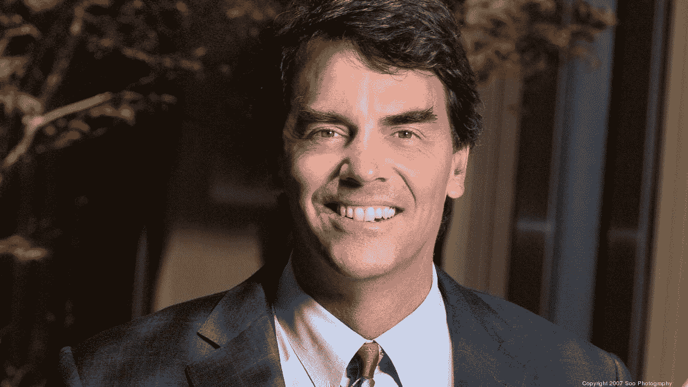
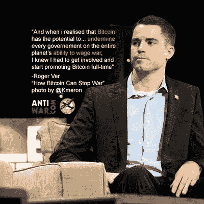
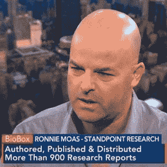
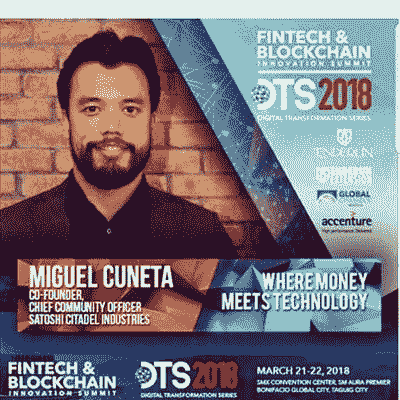

# 12 位顶级加密影响者分享对未来的看法

> 原文：<https://medium.com/hackernoon/12-top-crypto-influencers-share-thoughts-on-the-future-6ee161bd6d30>

互联网上充斥着垃圾邮件前 10 名名单。不幸的是，clickbait 似乎是所有人对发布感兴趣的东西。

我决定深入调查。信息就是力量，尽管到处都有“影响者”分享他们的观点，但从该领域真正的领导者那里获得明智的决策可能是一项挑战。这就是这篇文章的目的——直接来自领导区块链运动的人们的信息、推测和分享。

因此，如果你把领先的密码创造者、投资者和创新者聚集在一个房间里，你会问他们什么？

以下是一些问题:

1.  在区块链，什么让你兴奋？什么时候？为什么？
2.  什么时候会有超过 50%的美国人在日常生活中以某种方式使用(或通过)加密？
3.  区块链最不为人知/意想不到的使用案例是什么？
4.  你有什么建议可以分享给刚开始进入兔子洞的新手？
5.  如果你必须把你所有的钱投入一种资产(股票、黄金、美元、特定的密码等等)，你会选择哪一种？
6.  对整个区块链做一个大胆的 10 年预测…

现在，我们的影响者(排名不分先后)。

# 12 位真正的加密思想领袖:

## 蒂姆·德雷珀

蒂姆·德雷珀是[德雷珀联合公司](https://medium.com/u/a99e840244a1?source=post_page-----6ee161bd6d30--------------------------------)和 [DFJ](https://medium.com/u/4cd69d7151aa?source=post_page-----6ee161bd6d30--------------------------------) 的创始合伙人，被公认为世界上最杰出的风险投资和企业家领袖之一。他在最杰出的哈佛校友中排名第 46 位，在福布斯 Midas 榜单中排名第 7 位。蒂姆一直是比特币和区块链的直言不讳的支持者，并被视为该领域的首批风投之一。

推特: [@timdraper](https://twitter.com/timdraper)

在区块链，什么让你兴奋？什么时候？为什么？

2006.我遇到一个韩国人，他所有的空闲时间都在虚拟世界里度过。他花了 40 美元给他儿子买了一把虚拟的游戏剑。从那以后，我一直在寻找一种虚拟货币。比特币出现的时候，我支持 CoinLab，然后从他们那里买了一些比特币。我还让他们用这些钱去开采。采矿开始了，比特币被 MtGox 偷走了。不过，我相信这种去中心化、无摩擦的货币会很重要，所以后来我从美国马歇尔办公室买下了丝绸之路比特币。

**什么时候会有 50%的美国人在日常生活中以某种方式使用加密技术(或通过加密技术互动)？**

已经有 40%的韩国人拥有比特币钱包。我预计美国将很快跟进。最多三年。

**区块链最不为人知/意想不到的用例是什么？**

对于比特币来说，它必须是一种出色的价值储存手段，比你的银行存款更安全，但对于区块链来说，最大的惊喜是它如何改变政府。最好的还在后头。

**你有什么建议可以分享给刚刚开始工作的新手？**

HODL。但是一些比特币在比特币基地，一些其他的加密技术(Tezos，Bancor，Credo)在账本上。看看它让你感觉多么有力量。不再向银行业/监管机构卑躬屈膝。

**如果你必须把所有的钱都投入到一项资产中(股票、黄金、美元、特定密码等)，你会选择哪一项？**

100%比特币。然后我会用比特币资助那些用比特币支付员工和供应商的公司。

**对整个区块链做一个大胆的 10 年预测…**

比特币和区块链将比铁器时代、文艺复兴、工业时代和互联网时代加起来还要大。它将改变一切，从我们如何彼此打交道(商业、银行)，到我们如何照顾自己(医疗保健)，再到我们如何治理自己(虚拟竞争治理)。

直播圆桌会议[**Tim Draper、Jimmy Song 和 Kyle Samani 谈加密网络的价值和网络效应**](https://getcorl.typeform.com/to/ibpDTr?utm_source=matt%20medium)

收听时间:太平洋标准时间 5 月 8 日上午 10 点

## 吉米·宋

[Jimmy Song](https://medium.com/u/4acb12744ff8?source=post_page-----6ee161bd6d30--------------------------------)2013 年开始从事比特币开发，曾参与比特币核心、btcd、军械库、pycoin、彩币等众多比特币项目。他现在是风险合伙人[区块链资本](https://medium.com/u/9737c5ab2ab1?source=post_page-----6ee161bd6d30--------------------------------)(领先的加密基金)，并在十几家初创公司担任开发人员和程序员。最近，他担任了 [Paxos](https://medium.com/u/f2ac5c463d5b?source=post_page-----6ee161bd6d30--------------------------------) 的首席架构师和 Amory Technologies 的工程副总裁，在那里他管理企业级比特币钱包软件的开发。Jimmy 也是热门博客、比特币技术对话和 YouTube Off Chain 的编辑和作者，Jimmy Song 开办了一个区块链编程研讨会，教开发人员在区块链上构建。

推特: [@jimmysong](https://twitter.com/jimmysong)

在区块链，什么最让你兴奋？什么时候？为什么？

区块链本身实际上并没有让我那么兴奋。作为一项技术，它只比数据库稍微有趣一点。实际上有趣的是比特币，因为比特币是去中心化的，也就是说，没有一个可以监管的单一瓶颈。早在 2011 年，我就对比特币感到兴奋。

**什么时候会有 50%的美国人在日常生活中以某种身份使用(或通过加密互动)？**

我想在大约 20 年后，大多数人都会以某种方式将价值储存在比特币中，不管他们是否知道。交换媒介是另一个故事。

**区块链最不为人知/意想不到的使用案例是什么？**

到目前为止，价值储存。几乎所有其他用例都被夸大了，站不住脚(区块链的医疗保健！区块链愚蠢的网络想法！).这些用例中的大部分本质上并不是真正的创新，只是用“区块链”这个词来表示一个允许公共审计的数据库。很像“人工智能”或“云”这些词，这是一种让枯燥的技术听起来更令人印象深刻和有趣的方法。

**你有什么建议可以分享给刚刚开始工作的新手？**

去了解比特币到底是什么，以及它为什么有价值。太多的人只是把比特币作为一种合法的赌博方式。了解你投资的是什么，并据此采取行动。如果你对自己的投资没有信心，你会在波动(上涨或下跌)时卖出。真正的收益来自持有，这需要信念，尤其是在价格下跌的时候。

如果你必须把所有的钱都投入到一种资产中(股票、黄金、美元、特定的密码等等)，你会选择哪一种？

比特币。它最有可能成为长期价值储存手段。一般来说，这就是你想从投资中得到的东西，能长期保值的东西。过去 9 年，比特币已经证明了它可以做到这一点。

## 罗杰·韦尔

[罗杰·弗](https://medium.com/u/6d5e25448edf?source=post_page-----6ee161bd6d30--------------------------------)，通常被称为比特币的耶稣，是比特币最早的投资者和支持者之一。他从投资中赚了数亿，如果不是数十亿的话，也是 bitcoin.com、blockchain.com、Zcash、 [BitPay](https://medium.com/u/ec0207055232?source=post_page-----6ee161bd6d30--------------------------------) 和北海巨妖的早期投资者。他领导了一个名为比特币现金的比特币分支，以解决比特币基础设施和核心团队的规模问题，这引起了不小的轰动…

推特 [@rogerver](https://twitter.com/rogerver)

在区块链，什么最让你兴奋？什么时候？为什么？

比特币的发明将给世界带来额外的经济自由，这一前景让我兴奋不已。

2011 年 2 月(一个比特币不到一美元)

**什么时候会有 50%的美国人在日常生活中以某种方式使用加密技术？**

我不知道。也许还要 10 年。

**区块链最不为人知/意想不到的使用案例是什么？**

钱！人们没有意识到拥有不受审查的钱对这个世界有多重要！

**你有什么建议可以分享给刚刚开始工作的新手？**

访问[Free.bitcoin.com](http://free.bitcoin.com/)开始并获得一些免费的 BCH。

**如果你必须把所有的钱投入一种资产(股票、黄金、美元、特定密码等)，你会选择哪一种？**

尽管加密货币很有吸引力，但它们具有高度的投机性。为了确保我和我的家庭的长期繁荣，如果我只限于单一资产类别，我会选择房地产作为长期安全的投资。

当然，拥有多样化的投资组合对每个人都是好建议。

对整个区块链做一个大胆的 10 年预测…

我们将会把比特币的发明视为人类历史上最重要的发明之一。

## 罗尼·莫阿斯

Ronnie Moas 是来自华尔街的一名经验丰富、备受尊敬的交易员，目前在 2008 年至 2017 年的表现中，他在 TipRanks 的准确度排名前 20 位，而 tip ranks 的分析师超过 4500 名。他在比特币和区块链领域非常活跃，为加密社区带来了坚实的基础和技术分析。他经常向 Bad Crypto 播客投稿，并经营着自己的研究公司:position Research，其他人可以在这里订阅内部预测。

推特: [@ronniemoas](https://twitter.com/ronniemoas)

**在区块链，什么让你兴奋？什么时候？为什么？**

大约一年前，我第一次听说了区块链，并很快意识到这将是一个游戏规则的改变者，并将影响从赌场和银行到物流和服装公司的每个行业……以及介于两者之间的所有行业。

**什么时候会有 50%的美国人在日常生活中以某种方式使用加密(或通过加密互动)？**

我不知道我们需要多长时间才能达到 50%的美国人在日常生活中以某种身份使用密码或通过密码进行互动的地步……我猜测我们距离这一点至少还有 7 到 10 年的时间。

**你有什么建议可以分享给刚刚开始工作的新手？**

至于给刚入门的人的建议…我会推荐我的服务。这是一项获奖服务。在这一年中，我每周几次通过电子邮件发布每日笔记，并推荐几十种股票和密码。与我所在行业的 4000 多人相比，我在过去 10 年的表现排名前 20。我 600 条建议中的每一条都被至少三家不同的通讯社打上了当天的时间戳。

**如果你必须把所有的钱都投入到一项资产中(股票、黄金、美元、特定密码等)，你会选择哪一项？**

如果我告诉你我会把所有的钱投入哪种资产类别，那是不负责任的。每个人都有不同的情况。我建议分散投资…这是经济学 101 …不要把所有的鸡蛋放在一个篮子里，也不要下一个你输不起的赌注。

**对整个区块链做一个大胆的 10 年预测…**

我觉得我们有 60%-70%的机会在三年内看到$BTC $50，000。

## 凯尔·萨马尼

凯尔·萨马尼(Kyle Samani)是 [Multicoin Capital](https://medium.com/u/1ac059405a76?source=post_page-----6ee161bd6d30--------------------------------) 的联合创始人和管理合伙人，这是一家风险投资式的加密对冲基金，管理着至少 2 . 5 亿美元的资产(AUM)。在创办 Multicoin Capital 之前，凯尔曾担任首席执行官(外科医生用谷歌眼镜公司),筹集了 500 万美元，最终被收购。Kyle 的写作和思想领导力使他成为不断发展的行业中值得效仿的人。

推特: [@kylesamani](https://twitter.com/kylesamani)

在区块链，什么让你兴奋？什么时候？为什么？

我发现自己在 2016 年 1 月失业，此前我的第一家初创公司 Pristine 为谷歌眼镜开发了供外科医生使用的软件。在玩了 2 个月电子游戏后，我在 2016 年 3 月发现了以太坊。我被以太坊吸引有两个原因:首先，因为底层平台是开放和中立的。在我使用谷歌眼镜的经历之后，我对一个不能从我脚下被拽出来的平台感到兴奋。其次，我意识到这个星球上的每一个主要金融机构都只是一个巨大的智能合同。那时我这将是一个大事件。

**什么时候会有 50%的美国人在日常生活中以某种身份使用(或通过加密互动)？**

不知道。未来 10 年不会，至少不会直接。十年之内，每个美国人都将使用由区块链提供后端支持的服务。

**区块链最不为人知/意想不到的使用案例是什么？**

用户共享信息的开放式数据库的机会。想想一个完全开放的脸书。

**你有什么建议可以分享给刚刚开始工作的新手？**

阅读空间中最聪明的人。代币经济是一个很好的起点。

**如果你必须把所有的钱都投入一项资产(股票、黄金、美元、特定密码等)，你会选择哪一项？**

Multicoin 基金:)

**对整个区块链做一个大胆的 10 年预测……**

10 年后，全球所有的数字货币都将由某种区块链来管理。

## 彼得·麦科马克

作为“比特币做了什么”播客的主持人和关于比特币和加密货币的多产作家， [Peter McCormack](https://medium.com/u/79b96a130697?source=post_page-----6ee161bd6d30--------------------------------) 的交易和区块链对社区的贡献不容忽视。他已经建立了一个相当大的追随者，在 Twitter 上仍然非常活跃，在创业和数字媒体领域的职业生涯结束后，他似乎已经找到了自己作为加密创造者和交易者的职业。

推特: [@whatbitcoindid](https://twitter.com/whatbitcoindid)

**在区块链，什么让你兴奋？什么时候？为什么？**

比特币最初让我对区块链感到兴奋。整个买下来没有中介发给别人的过程很爽。

什么时候会有 50%的美国人在日常生活中以某种方式使用加密技术？

可能需要 10 年以上。

**区块链最不为人知/意想不到的使用案例是什么？**

选举。

**你有什么建议可以分享给刚刚开始工作的新手？**

慢慢来，尽量多读书，获利了结。

**如果你必须把所有的钱都投入一项资产(股票、黄金、美元、特定密码等)，你会选择哪一项？**

密码。

**对整个区块链做一个大胆的 10 年预测……**

将会有一个国家将比特币作为主要货币。

## 肯尼斯·阿梅杜里

作为《粉碎华尔街》的主持人和《KnowMoneyTrends.com》的所有者，肯尼斯围绕他的交易和预测专业知识建立了强大而忠诚的追随者。Crush The Street 的 Youtube 频道已经建立了令人印象深刻的 34k+订户，并成为非常规金融新闻、顶级加密采访和来自所有金融领域的可行建议的来源。

推特: [@crushthestreet](https://twitter.com/CrushTheStreet)

在区块链，什么让你兴奋？什么时候？为什么？

我在 2012 年对比特币产生了兴趣。早期投资者。了解了它的货币方面。进一步深化了我对金钱的概念，以及这种去中心化的环境如何给人们带来真正的自由。2013 年，我制作了《微文件银行家最大的恐惧》,我们说比特币就是这样。2017 年，随着杰米·戴蒙(Jamie Dimon)等人的评论以及监管机构对加密货币的狂热，我认为我们肯定会看到这种情况的发生…

什么时候会有 50%的美国人在日常生活中以某种方式使用加密技术？

采用率只是推测。然而，技术的采用正在超过摩尔定律，所以如果世界在 3-5 年内与加密互动，就像人们访问互联网一样，我不会感到惊讶。没有历史先例可以与这种采用相比较，因为技术每天都在进步，但我可以保证，当人们事后回顾在短时间内事情会发展到什么程度时，他们会感到震惊。

**区块链最不为人知/意想不到的使用案例是什么？**

离婚前向你的妻子或丈夫隐瞒钱财。😉但真的，我认为我们大多数爱好者有它相对较好。我们所处的社会在很大程度上没有经济崩溃和银行倒闭等问题。(我认为它正在到来，但还没有大规模到来。)但实际上，从百分比来看，最大的受益者是那些像委内瑞拉或阿根廷等国家的人。他们看到自己的资金被银行冻结，或者不得不眼睁睁地看着自己的存款在当地法令下蒸发。这确实是 cryptos 最不被重视的优势。

**你有什么建议可以分享给刚刚开始工作的新手？**

这是一次激动人心的冒险。慢慢开始。投资顶级密码，我会从比特币和以太坊开始。现在是建仓的好时机，因为我们已经修正了，修正可能会持续一段时间，所以是积累的好时机。

**如果你必须把你所有的钱投入一种资产(股票、黄金、美元、特定密码等)，你会选择哪种？**

很难。有趣的意想不到的答案将是迪士尼超过 50 年的时间线。这是嵌入全球所有儿童结构中的核心业务。50 年后，我认为比特币仍然会非常有价值，但从长远来看，它仍然是技术，理论上可以被取代。如果我需要投资 1000 年，我会选择黄金。(也是地理位置优越的房地产。)

对整个区块链做一个大胆的 10 年预测… 我认为区块链将会与人工智能紧密结合。我相信，在 10 年的时间里，美国 50%的工作岗位将面临风险，如果在这段时间内没有完全被取代的话。

## trent Lapinski——密码破解

[Trent Lapinski](https://medium.com/u/138c86887e95?source=post_page-----6ee161bd6d30--------------------------------) 是一名旧金山的企业家、开发者和成长型黑客。他的热门 Wordpress 主题获得了数百万次的下载，使 CyberChimps 的收入达到了 100 万美元以上。今天，他共同主持了加密扰乱播客，运行 Medium.com 顶级加密博客之一，是区块链的大人物。另一段时间，他与 Myspace 的两位创始人一起在一家初创公司工作，帮助《花花公子》进行互联网营销和网络开发。

推特: [@TrentLapinksi](https://twitter.com/trentlapinski)

**在区块链，什么让你兴奋？什么时候？为什么？**

我从小就对分布式计算系统感兴趣，第一次读 Neal Stephenson 的书《冰雪奇缘》。在这本书里有一个类似元宇宙的基于分布式计算和网状网络的矩阵。

比特币被开发出来后，我在 2010 年开始关注它，并在 2015 年开始跟踪它。然而，我直到 2017 年才开始投资。

我在 2015 年左右意识到它有可能扰乱银行业，并在 2017 年决定专注于它，作为一种可能的职业道路。

**什么时候会有 50%的美国人在日常生活中以某种方式使用(或互动)密码？**

3 至 10 年。这取决于一家大型银行或公用事业公司何时离散地实施区块链技术，并用区块链技术替换现有系统。

**区块链最不为人知/意想不到的使用案例是什么？**

游戏。区块链有可能彻底改变游戏行业，使玩家能够随身携带数字资产，并以以前不可能的方式在市场上出售它们。

**合法。智能合同将取代大多数律师。**

自动化。区块链将成为各行各业未来供应链管理解决方案的基础软件层。

**你有什么建议可以分享给刚刚开始工作的新手？**

只投资你能承受的损失。如果你不能理解白皮书，你可能不应该投资它。

**如果你必须把所有的钱都投入一项资产(股票、黄金、美元、特定密码等)，你会选择哪一项？**

今天，比特币。这在不久的将来可能会改变。

**对整个区块链做一个大胆的 10 年预测……**

区块链作为一项技术现在令人兴奋，但在未来它将无处不在。它将为供应链管理、视频游戏、加密货币甚至法定货币等一切事物提供动力。我们正处于区块链目前所处的 Myspace 阶段，我们还需要几年时间才能看到一家主要的分布式计算公司上升到集中式技术公司的水平，但这最终会发生。

## 哈苏卜·库雷希

[Haseeb Qureshi](https://medium.com/u/8bc4e5f8b505?source=post_page-----6ee161bd6d30--------------------------------) 是一名退休的职业扑克玩家，也是世界上最好的无限注德州扑克玩家之一。他从公元 16 岁开始，到 21 岁已经退休，成为白手起家的百万富翁。他是一本关于扑克哲学的畅销书的作者，在 23 岁时，他决定捐出他所有的钱，大约 50 万美元，重新开始。他加入了一个代码训练营，成为一名令人生畏的开发人员，并被挖到 Airbnb 工作。

今天，Haseeb 花了大部分时间追逐区块链——编写代码以创造下一波创新。他是 Earn.com 大学的校友，也是 Medium 和自由代码营出版物的频繁撰稿人。

推特:@hosseeb

**在区块链，什么让你兴奋？什么时候？为什么？**

我第一次对区块链感到兴奋，是在 Airbnb 做支付欺诈检测的时候。与传统金融体系的所有不规则边缘密切合作，我意识到它的设计是多么糟糕。我们当前的金融体系运行在 50 年前的齿轮上，而且设计不适合现代世界。所有漂亮的界面，比如信用卡、Paypal 和 Venmo，都是对一个相当破碎的系统的抽象。

作为一名工程师，当你有一个蹩脚的代码库时，你的第一反应是:我们应该扔掉它，重新写一遍。我对区块链了解得越多，我意识到这正是比特币——金融体系的首要原则重写。把我送进了兔子洞。

**什么时候会有 50%的美国人在日常生活中以某种方式使用加密技术？**

我猜这至少需要 10-15 年。大约 40%的美国人年龄在 50 岁以上，大约 20%的人生活在农村地区，因此在很长一段时间内，使用加密技术不会深入人心。但像 Venmo 这样的其他金融科技服务也是如此。

**区块链最不为人知/意想不到的使用案例是什么？**

Underhyped 肯定是密码菲亚特。几乎没有人谈论它，但这是最有可能的主要结果，一旦非国家支持的加密货币最终流通，它可能会主导这些货币。

**你有什么建议可以分享给刚刚开始工作的新手？**

专注于技术。技术才是最重要的，营销主要是噪音。如果听起来好得不像真的，那很可能就是真的。

如果你必须把所有的钱都投入到一种资产中(股票、黄金、美元、特定的密码等等)，你会选择哪一种？

比特币，毫无疑问。

**对整个区块链做一个大胆的 10 年预测…**

嗯，如果我要大胆一点的话…我预测比特币和以太坊将是 10 年后仅有的仍有可观市值的加密货币。比特币会让以太坊相形见绌一大倍数。各国央行将持有比特币作为储备的一部分，但以太坊将被广泛用于支付和智能合约，世界看起来不会特别分散。最终，一个国际密码系统将在主要经济大国之间协商，这将取代大多数以太坊用例。但我怀疑这将需要 10 年以上的时间。

## 布莱恩·法比安·克里安——震中

[Brian Fabian Crain](https://medium.com/u/37d2972d16e3?source=post_page-----6ee161bd6d30--------------------------------) 是 [Tendermint](https://medium.com/u/aa134d2d5140?source=post_page-----6ee161bd6d30--------------------------------) 的首席运营官，这是一家区块链公司，致力于构建有价值的去中心化协议，为世界的区块链带来简单、安全和速度。Brian 还是柏林区块链会议(Berlin Blockchain Meetup)的创始人，也是区块链行业播客[震中](https://medium.com/u/1e0bbff6a5dd?source=post_page-----6ee161bd6d30--------------------------------)的联合创始人和主持人，该播客每周有 1 万名听众。Brian 之前在企业区块链公司 Monax 负责业务开发。他拥有芝加哥大学、伦敦经济学院和伦敦大学学院的经济学、哲学和认知科学学位。

推特: [@crainbf](https://twitter.com/crainbf)

在区块链，什么让你兴奋？什么时候？为什么？

我第一次对比特币感到兴奋是在 2013 年的夏天。我发现去中心化的全球电子支付和金融系统的概念非常吸引人。从那以后，我几乎把所有的工作时间都花在了这个领域。

**什么时候会有 50%的美国人在日常生活中以某种身份使用(或通过加密互动)？**

我估计还需要 5 年时间才能看到这种大规模采用。

**区块链最不为人知/意想不到的使用案例是什么？**

感觉目前几乎没有不被炒作的东西！我确实认为去中心化治理是一件巨大的事情，它将在无数的方向上产生影响。这将包括从管理协议升级到网络，到运行整个组织，再到创建新的政治结构和流程。

你有什么建议可以分享给刚开始工作的新手？

花大量时间学习技术，而不是考虑买什么代币或如何投资。当然，我们的播客中心将是一个潜在的资源。但是去聚会也很棒，我喜欢纳撒尼尔·波普的书《T2 数字黄金》,讲述了比特币的早期历史。

**如果你必须把你所有的钱投入一种资产(股票、黄金、美元、特定密码等)，你会选择哪种？**

我不确定这个问题对我有多大意义。幸运的是，分散风险的能力是世界运转的基础。因此，如果这种武断的选择强加于我，我会选择股票 ETF。例如在 SP500 最大限度地实现多样化。

对整个区块链做一个大胆的 10 年预测…

-与传统基础设施相比，分散式网络支持的金融交易将会更多。

很难想象没有区块链的世界会是什么样子，就像今天很难想象没有智能手机的世界一样。

-比特币每枚价值 20 万美元。(或者不是…)

## 米格尔·库内塔

Miguel Cuneta 是 Satoshi Citadel Industries(sci . ph)的创始人，这是一家金融科技公司，在区块链为菲律宾制造未来的工具。他们的投资组合包括菲律宾在外汇、汇款、支付处理、移动钱包等领域的领导者。除了他的商业冒险，他还是一名经验丰富且固执己见的作家，他专注于揭穿加密神话，并为加密货币和区块链的未来提供案例。

推特: [@MiguelCuneta](https://twitter.com/MiguelCuneta)

在区块链，什么让你兴奋？什么时候？为什么？

2013 年初，我听说了比特币。像大多数人一样，我认为这是一场投机性的赌博，看起来像庞氏骗局。直到同年 10 月左右，比特币已经成为新闻焦点之后，我才决定再看一眼。我以 100 多美元的价格买了我的第一批比特币，以便在游戏中有所涉猎，然后就掉进了加密和区块链世界的兔子洞。就在几个月后，我和一些志同道合的朋友共同创立了 SCI Ventures Inc .([www . SCI . ph](http://www.sci.ph/))，从此一往无前。比特币协议及其向世界释放的技术的承诺和潜力很难被夸大——我真的相信，自万维网诞生以来，没有比比特币和区块链技术更令人兴奋的技术和机会了。

**什么时候会有 50%的美国人在日常生活中以某种方式使用密码(或通过密码互动)？**

我认为在美国，加密技术的发展是惊人的。只要看看比特币基地的用户(超过 2000 万)超过了成立于 70 年代的股票经纪公司查尔斯·施瓦布(超过 1100 万)，你就可以看到年轻的千禧一代宁愿把钱作为投资的趋势。我认为在未来 3 到 5 年内，随着行业和市场的成熟，我们将会看到更多的主流投资者进入这个领域。

但我来自菲律宾，在那里的 1 亿公民中，只有 3%的人拥有信用卡，大约 80%的人没有任何形式的正规银行服务。超过 1，000 万菲律宾人在国外工作，每年向国内汇款 300 亿美元，每笔交易被榨取约 10%。对美国人来说，比特币和区块链技术的前景并不那么明显，因为他们拥有健全金融体系的基础设施，人们参与数字经济是日常生活的一部分。在这里，没有那么多。问题是，尽管我们缺乏金融基础设施，但我们拥有亚洲最快的智能手机普及率增长，那里几乎 70%的人已经在使用智能手机和互联网。人们渴望更具包容性的金融应用，我们认为这是全球范围内采用加密技术的完美风暴。据估计，如今菲律宾的比特币钱包应用用户约有 400 万，并且还在增长。未来 3 到 5 年将会是采用这项技术的有趣时期。

**区块链最不为人知/意想不到的用例是什么？**

人们总说“钱只是区块链的第一个应用”，但我相信钱是一件相当大的事情。可以说，金钱让世界运转，如果区块链技术，特别是比特币，可以将金钱变成本质上可编程的软件，让价值转移像信息转移在互联网上流动一样容易，那么可能性是无穷的。目前，整个全球经济都建立在一个陈旧过时的网络上，这个网络由速度缓慢、效率低下的中间商和机构组成，几十年来没有受到任何挑战。有了比特币和其他区块链的货币方面，它们现在有了自由市场竞争。下一代将永远不会理解为什么跨境“转移”资金需要 3 到 5 个工作日，或者为什么金融服务只在工作日的办公时间提供。借助区块链技术，价值将像信息一样自由流动，并以指数形式加速全球电子商务的增长。

你有什么建议可以分享给刚开始工作的新手？

我总是说“投资教育，而不是投机”比特币的价格是它最没意思的地方！从 www.lopp.net/bitcoin.html 的[等一些很棒的资源开始。你不需要经济学学位或理解软件来欣赏区块链技术。了解技术，使用密码，看着整个行业的诞生和一种新的货币形式在你眼前展现。参与这项技术的开发真是一个激动人心的时刻。比特币打开了技术和创新的潘多拉魔盒。想参与还是旁观，由你决定。](http://www.lopp.net/bitcoin.html)

**如果你必须把你所有的钱投入一种资产(股票、黄金、美元、特定密码等)，你会选择哪种？**

我已经把我的钱用在了我的嘴上，在 SCI(我们的比特币初创公司)投入了四年时间，数着血汗和泪水。如果我必须选择一种长期投资的资产，我会轻松地选择比特币。我的个人投资组合已经大部分是比特币，因为我自 2013 年以来一直在定期积累。

对整个区块链做一个大胆的 10 年预测…

上周，我在这篇博文中做出了我的 10 年预测。我总是用比特币作为基准，因为作为第一种区块链和加密货币，它是标准。如果比特币失败，将很难为其他区块链或加密技术找到理由。话虽如此，我相信在 10 年内，加密货币将成为一个数万亿美元的全球市场，ETF 和受监管的金融机构将像我们交易黄金和其他商品一样交易它们。在区块链作为一种技术，没有金融机构不会有区块链战略或不使用区块链技术的一种或另一种方式。我们将在一个以区块链为基础的世界里“流动资金”。就在十年前，Airbnb、优步和其他应用程序是不可想象的，同样，建立在区块链协议之上的新层将被开发出来，我们将无法想象没有它们的生活。代币、加密、比特币和区块链将成为我们日常生活的一部分，但主要是因为它们嵌入在主流应用程序中，没有我们今天遇到的复杂性。区块链协议将成为货币互联网。

## 朱利安·扎维斯托斯基——假人

[Julian Zawistowski](https://medium.com/u/20aca97d36b2?source=post_page-----6ee161bd6d30--------------------------------) 是[假人项目](https://medium.com/u/8b0d088e8160?source=post_page-----6ee161bd6d30--------------------------------)的创始人兼首席执行官，这家分散式超级计算机公司在 30 分钟内通过众筹/ICO 筹集了 860 万美元。朱利安的公司现在价值 2.8 亿美元，他坦率地谈到了建立一家加密公司、管理投资者和建立一项改变游戏规则的颠覆性技术。

推特: [@julianzawist](https://twitter.com/julianzawist)

在区块链，什么最让你兴奋？什么时候？为什么

2014 年以太坊。因为那时我意识到它有多强大，不仅仅是转移价值。

**什么时候会有 50%的美国人在日常生活中以某种身份使用(或通过加密互动)？**

超过 50%的发展中国家使用 crypt。

**区块链最不为人知/意想不到的使用案例是什么？**

治理。

**你有什么建议可以分享给刚刚开始工作的新手？**

无视市场和价格。了解为什么人们对技术如此感兴趣。了解分散技术背后的意识形态/世界观。了解为什么技术领导者认为这可以有所作为。

如果你必须把所有的钱都投入到一种资产中(股票、黄金、美元、特定的密码等等)，你会选择哪一种？

我不提供投资建议。

**对整个区块链做一个大胆的 10 年预测…**

分散技术将帮助我们重塑我们的经济和社会，以应对 21 世纪的挑战。集中的公共组织是存在的，但在许多领域，它们被分散的、不可信的系统所取代。传统企业在一定程度上使用分散化技术，但更重要的是，越来越多的企业/组织的角色是促进生产者/消费者的互动，切断中间商。

# 结束语

有时候最好闭上嘴听，尤其是在高智商的人面前。希望这篇文章将顶级投资者、企业家、开发者、内容创作者和思想领袖聚集在一起，分享见解，更好地理解，围绕区块链的未来进行头脑风暴。

那你呢。你会怎么回答。期待在下面的评论中看到您的回复:

1.  在区块链，什么让你兴奋？什么时候？为什么？
2.  什么时候会有超过 50%的美国人在日常生活中以某种方式使用(或通过)加密？
3.  区块链最不为人知/意想不到的使用案例是什么？
4.  你有什么建议可以分享给刚开始进入兔子洞的新手？
5.  如果你必须把你所有的钱投入一种资产(股票、黄金、美元、特定的密码等等)，你会选择哪一种？
6.  对整个区块链做一个大胆的 10 年预测…

记住，让现任者下台需要时间、金钱、牵引力和一点好运气。该去工作了…

## 学到了什么还是喜欢这篇文章？单击👏说“谢谢！”并帮助他人找到这篇文章。

*如果你喜欢内容，请按住鼓掌按钮！它帮助我获得曝光率。*

***鼓掌 50 次在推特上关注我:***[***@ itsmattward***](https://twitter.com/itsmattward)

# 由[科尔](https://corl.io/?utm_source=roundtable&utm_medium=description)带给你

[Corl](https://corl.io/?utm_source=roundtable&utm_medium=description) 是区块链上全球首款收入共享令牌。我们通过允许初创企业和中小企业获得非稀释性的按需增长资本，打破了传统的初创企业融资模式

如果你有兴趣了解更多，请阅读我们的白皮书并与我们联系。