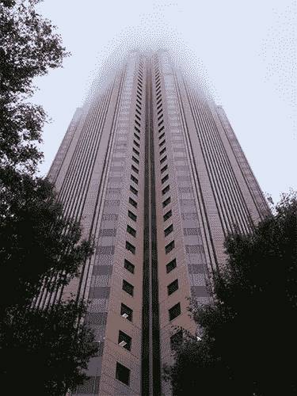

# 2018 年 4 月 13 日:神秘领域最大的故事

> 原文：<https://medium.com/hackernoon/13-04-2018-biggest-stories-in-the-cryptosphere-13b12d2272a3>

**1。《阿联酋区块链战略 2021》发布**

[迪拜媒体办公室报道](http://www.mediaoffice.ae/en/media-center/news/11/4/2018/uae-blockchain-strategy.aspx)阿联酋副总统兼总理、迪拜统治者 Sheikh Mohammed bin Rashid 启动了一个名为“阿联酋区块链战略 2021”的项目。该项目是他们“未来产业”发展计划的一部分，旨在让他们走在创新技术应用的最前沿。政府希望到 2021 年，50%的联邦交易通过区块链技术进行。人们希望这项新技术能节省时间，降低成本。这一改变有助于减少目前每年花费在文件交易和文件上的 110 亿阿联酋迪拉姆。此外，政府还将发起一项倡议，对公民进行区块链教育。

**2。美国银行希望用区块链改进其数据共享系统**

美国银行已经向美国专利商标局申请了一项基于区块链的数据共享系统的专利。该机构于 4 月 12 日发布了这份文件，但该银行最初是在 2016 年 10 月提交的。[新系统将协助数据验证，并确保安全的数据共享流程](https://docs.google.com/document/d/17kwPl85bDT73d9SU_6kBCyCI55lWP4SIhmK1SzEY6H4/edit)。加密密钥将用于私人区块链，这将有助于解决数据跟踪和共享的问题。在这份文件中，还讨论了当前的数据共享系统如何带来风险，这些风险将随着区块链支持的系统而消失。这一消息是在英格兰银行与创业链合作并发布了一份概念证明文件之后发布的。

**3。百慕大继续推行加密监管计划**

我们之前[报道过](https://hackernoon.com/22-03-2018-biggest-stories-in-the-cryptosphere-c5fc484fc1e1)百慕大总理兼财政部长 David Burt 计划创建一个对加密友好的监管框架，并确保该行业繁荣发展。百慕达金融管理局(BMA)现已[发布了一份咨询文件](http://www.royalgazette.com/assets/pdf/RG384038411.pdf)，讨论潜在的反洗钱(AML)法案。金融监管机构希望制定足够广泛的法规，以涵盖密码行业的各种活动。根据该提案，参与代币销售和首次硬币发行的公司将被要求收集和维护消费者数据。推出 ico 的公司不会受到该法案的影响，因为随后会创建一个单独的 ico。百慕达国家安全部长韦恩·凯恩(Wayne Caines)甚至[表示，监管对于该行业的发展是必要的。最后，一个类似沙盒的许可计划也正在研究中。](https://www.coindesk.com/bermuda-wants-crypto-regulation-fuel-phenomenal-business-growth/)

**4。雅虎日本将购买 40%的加密交换股份**

雅虎日本将购买当地加密交易所 BitARG 40%的股份。此次收购将通过全资子公司 Z 公司进行。BitARG Exchange Tokyo 也在其网站上发布了这一消息。该交易所表示，此次收购将使他们获得更多的资源，特别是在技术和知识方面。官方数字尚未公布。然而，据熟悉此次收购的消息人士称，雅虎日本可能会支付 20-30 亿日元(1850-2780 万美元)。雅虎日本的声明是在经纪公司 Monex 决定以 36 亿日元(3340 万美元)收购 Coincheck 所有股份一周后发布的。

> 这是由 BlockEx 为您带来的新闻综述。

> *要想在你的邮箱里收到我们的每日新闻综述，请在这里注册:*[*http://bit.ly/BlockExNewsRoundup-Updates*](http://bit.ly/BlockExNewsRoundup-Updates)