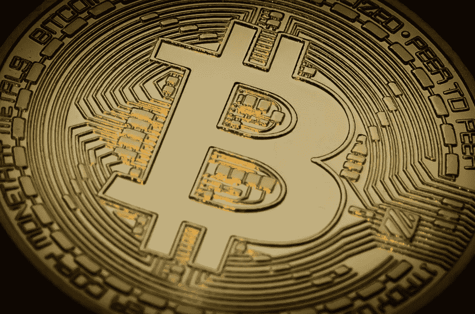
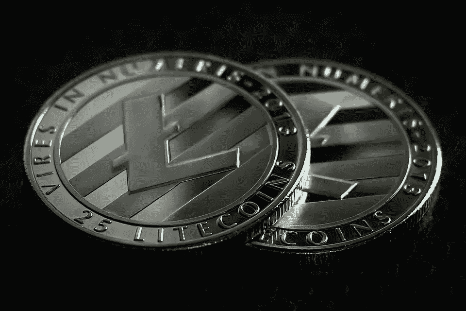
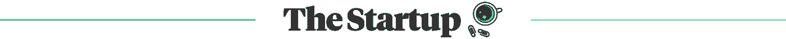

# 2018 年 6 月 13 日:神秘领域最大的故事

> 原文：<https://medium.com/hackernoon/13-06-2018-biggest-stories-in-the-cryptosphere-920e910f7dd9>

通过 BlockEx

1.  **银行正在为区块链做预算——更多的资金、员工和项目**

2017 年，金融服务业在区块链发展上花费了 17 亿美元。美国市场情报公司 Greenwich Associates [周二公布了他们的研究。在此期间，专门负责区块链的员工数量也翻了一番，各大银行现在有大约 18 名全职员工专门负责区块链。同时，14%的人表示他们已经部署了区块链解决方案。其中 75%以上的项目将在未来两年内从概念验证转向实际生产。然而，超过 50%的受访高管表示，实施这项技术“比他们预期的要难。”](https://www.greenwich.com/press-release/financial-service-industry-spends-17b-year-blockchain)

**2。空头仍在比特币市场游荡**

在今天触及四个月低点后，比特币可能会进一步上涨。这支撑了看跌情绪，并提高了跌破 6000 美元的可能性。从长远来看，这似乎是一个明确的可能性。只有收盘高于 10 天移动平均线(目前为 7214 美元)才会削弱看跌情绪。

**3。莱特币下沉至 2018 年新深度**

对于整个加密市场来说，这是一个熊市。所有加密货币的总市值自 4 月 12 日以来首次跌破 3000 亿美元。Litecoin (LTC)今天在 Bitfinex 跌至 97.04 美元，这是自 2017 年 12 月 8 日以来的最低水平，此前曾创下 379 美元的历史新高。自年初以来，价格已经下跌了 60%。在创造者查理·李宣布卖掉莱特币后，价格下跌。

**4。汤森路透现在追踪前 100 种加密货币**

通过实时监控 2000 多条全球新闻和 800 个社交媒体网站，汤森路透能够在 3 月份与 MarketPsycho Data LLC 一起创建比特币日期馈送。他们能够利用这一点来衡量密码市场的情绪。这项技术现在将与其他 99 种加密货币一起使用，以帮助投资者做出战略决策。加密货币的数字本质意味着在线情绪可能是市场走向的一个特别相关的指标。

> 这是由 BlockEx 为您带来的新闻综述。

> *要想在你的邮箱里收到我们的每日新闻综述，请在这里注册:*[*http://bit.ly/BlockExNewsAndUpdates*](http://bit.ly/BlockExNewsAndUpdates)

## 这篇文章发表在《初创企业》杂志上，这是 Medium 最大的创业刊物，有 333，853 人关注。

## 订阅接收[我们的头条新闻](http://growthsupply.com/the-startup-newsletter/)。