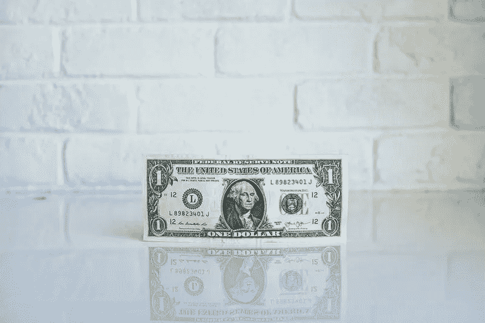

# 2018 年 8 月 13 日:神秘领域最大的故事

> 原文：<https://medium.com/hackernoon/13-08-2018-biggest-stories-in-the-cryptosphere-292028c49b8>

通过 BlockEx

**1。对冲基金不确定如何为加密利润缴税**

越来越多的对冲基金正在向比特币等加密货币投资数十亿美元。然而，鉴于[缺乏监管透明度](https://www.bloomberg.com/news/articles/2018-08-13/for-hedge-funds-bitcoin-investing-is-creating-tax-predicaments)，他们不确定在对加密货币投资产生的利润纳税方面应该遵循什么程序。尽管美国国税局(IRS) [在 7 月宣布](https://www.lexology.com/library/detail.aspx?g=ca12609a-8a8a-4a3f-bc1b-ba08ca8b4d36)，称其将关注一个为加密投资者纳税的系统，但仍存在不确定性。许多人希望的是，一些税务公司将承担起赋予对冲基金监管透明度的责任。纽约的律师事务所 Seward Kissel 就是一个例子。一些人更希望主流社会采纳 CFTC 关于虚拟货币是商品的定义。

**2。土耳其里拉的下跌证明了加密货币的潜力吗？**

2017 年 9 月至今，土耳其里拉从 0.3 美元跌至 0.15 美元。这意味着下降 50%。[尽管比特币的跌幅更大，但与当地货币相比，提取比特币仍然更容易。事实上，在总统采取行动后，企业和个人将土耳其货币兑换成外币变得越来越困难。这使得货币更加贬值。另一方面，比特币等加密货币更容易兑换，也更分散，这意味着它们不受政府举措的影响。这将有利于共识货币市场和分散的金融网络。JP 摩根分析师 Kerry Craig 表示，这种情况不仅是由于经济因素，也有政治因素。](https://www.newsbtc.com/2018/08/13/does-50-decline-in-the-turkish-lira-prove-bitcoin-is-better-than-fiat/)

**3。Lambonomics:加密货币价格指数**

一个新的[网站](http://lamboindex.com/)引入了蓝宝指数，这是一种相当于[巨无霸指数](https://www.investopedia.com/ask/answers/09/big-mac-index.asp)的加密技术。如果一个巨无霸在美国价值 5 美元，但在南美价值 20 美元，那么两种货币的汇率应该是 1:4。蓝宝指数也遵循同样的原则。该网站向[展示了使用各种加密货币](https://thenextweb.com/hardfork/2018/08/13/lambonomics-cryptocurrency-theory/)购买一枚价值 20 万美元的兰博基尼 Huracan 要花多少钱。它们之间的差异揭示了汇率应该是什么，以及评估它们的估价是否正确。目前只报比特币，莱特币，以太坊。接收关于各国设定的不同价格的数据将有助于提高这一系统的准确性。

> 本新闻综合报道由 [BlockEx](http://bit.ly/BlockEx_) 为您带来。

> 要想在你的邮箱里收到我们的每日新闻综述，请在这里注册:[*http://bit.ly/BlockExNewsAndUpdates*](http://bit.ly/BlockExNewsAndUpdates)