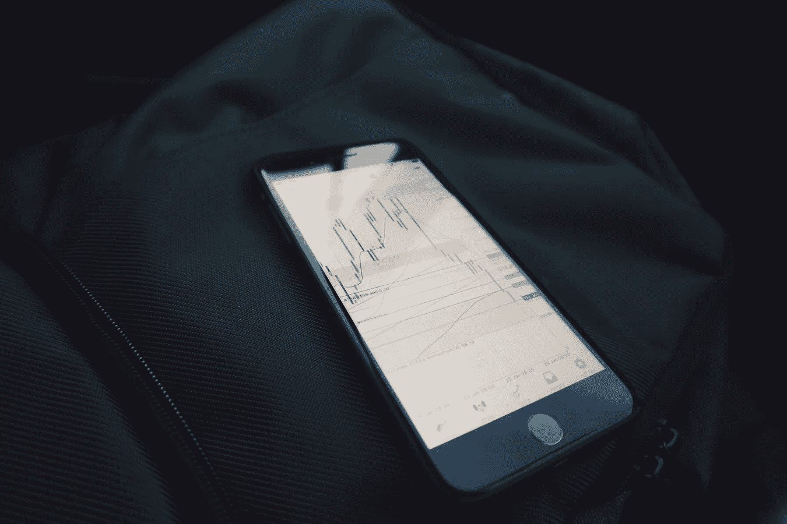
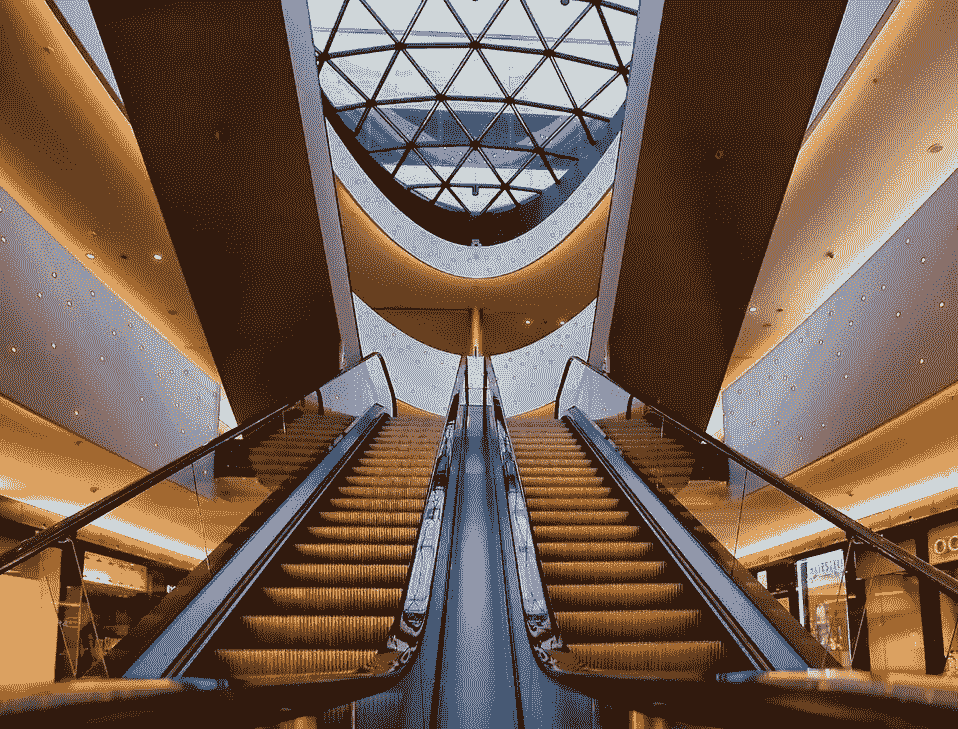

# 2018 年 13 月 9 日:神秘领域最大的故事

> 原文：<https://medium.com/hackernoon/13-09-2018-biggest-stories-in-the-cryptosphere-d1b7c75a8763>

通过 BlockEx

**1。摩根士丹利将推出比特币掉期交易服务**

摩根士丹利可能是最新一家致力于为客户开发利用加密货币的方法的华尔街公司。据[报道](https://www.bloomberg.com/news/articles/2018-09-13/morgan-stanley-said-to-prepare-bitcoin-swap-trading-for-clients)，这家美国银行将推出一项服务，允许投资者交易与比特币期货合约相关的“复杂衍生品”。客户将有权获得授予比特币表现“合成敞口”的合约。通过价格回报互换，可以做多或做空加密货币；而摩根士丹利将通过收取利差获利。报道称，从技术角度来看，该银行已经做好了准备。然而，它更愿意等待更大的需求以及内部批准过程的发生。

**2。WEF 研究公司称，区块链有助于缩小贸易融资赤字**

世界经济论坛(WEF)发布了一份白皮书研究报告，这份报告是由供应链和运输行业以及塑造国际贸易和投资未来的系统倡议合作完成的。在该文件中，据报道，区块链等技术可能有助于缩小目前 1.5 万亿美元的贸易融资缺口。根据该报告，新兴技术正在促进全球贸易。由于数字化和先进的技术，加工时间和成本都可以大大减少。在高风险发展中国家经营的小企业和公司将从中受益最多。事实上，跨国转移货物会容易得多；而文件将会电子化。贸易壁垒也会降低。区块链和分布式账本技术(DLT)作为一个整体正在被用来实现贸易和供应链流程的自动化。它们尤其可能带来 1.1 万亿美元的新贸易额。我们以前曾多次报道过政府将区块链纳入其行动。

**3。由于高需求，日本监管机构需要额外的劳动力**

我们多次讨论了日本金融厅(FSA)针对加密市场采取的举措。现在有[报道](https://cointelegraph.com/news/japans-financial-regulator-expands-to-handle-influx-of-crypto-exchange-license-demand)由于加密交易所对许可证的高需求，监管机构希望在其团队中增加 12 人。FSA 负责政策协调的副专员 Kiyotaka Sasaki 表示，审查许可证申请只是其中一项任务，该小组目前有 30 人。但是佐佐木强调需要额外 12 个人的加入和帮助。他还提到，目前有 160 家公司正在等待审查。监管机构希望完善其风险评估流程。特别是反洗钱和防止恐怖融资。这个信息是在一个秘密交流学习小组中分享的。到目前为止，FSA 已经审查了 16 起案件。尽管有一人被拒，12 人被要求退出。三份目前正在等待答复。

**4。苏黎世地区自称是最大的区块链中心**

我们之前[报道过](https://hackernoon.com/19-07-2018-biggest-stories-in-the-cryptosphere-5c66ec60b123)瑞士担心失去其在加密项目前沿的地位。这是因为列支敦士登、直布罗陀和开曼群岛等国家吸引了越来越多的项目。监管者的回应是专注于创建对加密友好的规则。总部位于苏黎士的 Trust Square 现在已经宣称是世界上最大的区块链中心。共同工作空间目前正在扩大。到今年年底，预计该空间将覆盖 3000 平方米，初创企业和研究人员将获得 300 个工作站。他们目前受益于高需求。这是该国成为区块链创新领导者计划的一部分。Trust Square 可以夸耀 NEO 和 Circle 等备受瞩目的客户，它已将租约续签至 2019 年底。然而，它已经在寻找更长期的解决方案。

> 本新闻综合报道由 [BlockEx](http://bit.ly/BlockEx_) 为您带来。

> *要想在你的邮箱里收到我们的每日新闻综述，请在这里注册:*[*http://bit.ly/BlockExNewsAndUpdates*](http://bit.ly/BlockExNewsAndUpdates)