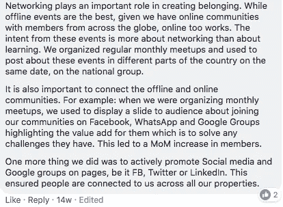

# 建立社区面临的 13 大挑战|专家综述

> 原文：<https://medium.com/hackernoon/13-major-challenges-faced-while-building-a-community-experts-roundup-e3a59aa28fbf>

打算建一个社区？在开始之前，先了解一下社区专家在构建它时所面临的挑战。

在建设社区的过程中，我们会面临很多挑战。有些问题严重到足以减缓一个社区的发展。但是，我们有没有把它们列出来，并试图找到它们的解决方案呢？

我们的社区成员之一 Utkarsh Singh Bhardwaj 提出了这一点，并询问了一个人在发展社区时面临的最大挑战。

因此，在一次大讨论之后，我们得出了以下几点，所有的社区专家讨论了他们在建设社区时所面临的挑战-

1.  **缺乏动力-** 接受挑战来经营/发展社区很容易，但实际上继续这样做的步伐/奉献/动力是最困难的部分。—by[**Milan Singh tha kur**](https://www.facebook.com/milan2377?fref=gc&dti=1680349932274080) 很多时候，我们会跟不上一开始前进的步伐，从而与社区成员产生沟通上的隔阂，偏离了轨道。

**2。内容实验**——让人们通过好的内容相互交流并展开讨论是一种破冰方式。
如果我们清楚用户寻找的内容类型，我们就能克服一个巨大的挑战。很多时候，作为社区管理者，我们在尝试不同类型的内容时会遇到惰性。有时，我们不断发布某种类型的内容，以为只有这种内容有效，但一种内容会引发很多反应，有些内容可能会胜出。因此，试验并弄清楚用户类型和他们的需求是有帮助的。
——由 [**普拉尼迪普里**](https://www.facebook.com/pranidhi.puri) **，** [**普内特阿格瓦尔**](https://www.facebook.com/Ayurvedic?fref=gc&dti=1680349932274080) **，** [**马哈维尔穆特哈**](https://www.facebook.com/mahaveermuttha?fref=gc&dti=1680349932274080)

**3。成员产生的参与-** 需要关注社区成员之间的互动，以促进其发展和加强。重要的是要确定那些独特的思考者，他们希望在与其他成员的想法融合时有所作为，并通过能力建设对讨论产生影响。此外，通过头脑风暴和破冰会议来解决社区平台的问题，也能为该问题创造解决方案。— by [**阿希娜亚·巴拉德瓦吉**](https://www.facebook.com/Chowti.Abhinay?fref=gc&dti=1680349932274080)

**4。成员的积极参与**——根据我的经验，如果发展一个社区很难，找到前 10 个不需要任何刺激的每日活跃用户要困难 100 倍。—by[**Anuj ad hiya**](https://www.facebook.com/anuj.adhiya?fref=gc&dti=1680349932274080) 新成员一般不会参与，因为犹豫或对社区的重要性认识不足。普拉尼迪说，让新成员在群体中感到舒适是一项挑战。
根据 [**Asha Chaudhry**](https://www.facebook.com/asha.chaudhry?fref=gc&dti=1680349932274080) 的说法，为了让新用户以一种有意义的方式做出贡献(除了新手竞赛)并增加高级用户的数量，很少有黑客会使用简单的 CTA 帖子、每日问题、TA 感兴趣话题的民意调查或重温新人的第一个问题。这清楚地表明了社区的意图——真诚地帮助&支持。
[**Utkarsh Singh Bhardwaj**](https://www.facebook.com/utkarsh.s.bhardwaj?fref=gc&dti=1680349932274080)**补充说，如果我们对社区人群的兴趣有一个公平的认识，我们总是可以使我们的内容多样化，以便每个人在一些或其他帖子中成为讨论的一部分！此外，将实习生作为内容研究的专用资源是解决这一问题的最佳方式。— [**阿莎·乔杜里**](https://www.facebook.com/asha.chaudhry?fref=gc&dti=1680349932274080)**

****

****5。专门团队&领导**——一个好的专门团队需要运行任何任务可以委托给多种资源的社区。尽管社区经理被称为一个人的军队，但由同一个人完成所有事情会延迟整个流程的流动。- [**普拉尼迪普里**](https://www.facebook.com/pranidhi.puri)
因此，团队应该有足够的能力接受所有的挑战，团队成员之间的凝聚力应该很强，补充
[**马哈维尔穆特哈**](https://www.facebook.com/mahaveermuttha?fb_dtsg_ag=AdzXWxlcrN6oWmg6qK-hEF48EThUH3RcOnMPLkun0M9AAQ%3AAdxHXVnnap9hvVvPnjJI74TzHd-eUEdxzbkOF8_J-6LLXw) **。****

****6。一致性**——与内容保持一致是一个巨大的挑战。一旦我们开始为会员构建有用的内容，他们之间的好奇心就会产生。举个例子，在任何一个社区中，最初的参与度都比较低。但是当内容的发布变得有规律时，参与度会自动增加。成员开始对即将到来的内容和学习产生好奇心。— **Pranidhi Puri**
不仅是社交媒体，其他方面也需要持续的参与和传递价值观。例如，当我们从角色和需求相当多样化的合作视角谈论社区时，它需要一致的事实发现、试验和跟踪价值/参与来交付它。——[**米顿谢蒂**](https://www.facebook.com/mithun.shetty.75?fref=gc&dti=1680349932274080)**[**阿瓦尼帕瑞克**](https://www.facebook.com/avanipb?fref=gc&dti=1680349932274080)****

****7 .**。保持个人风格&在社区中的独特性-** 社区不是商品。它由独特的人组成，这些人可以在一定程度上被一个共同的特征所束缚，但在其他方面却有不同的行为。因此，根据不同层次的需求进行定制是一项挑战。随着社区规模的扩大，平衡个人风格和标准规范成为一个挑战。由 [**普瑞索德**](https://www.facebook.com/priya.sood.9028?fref=gc&dti=1680349932274080)
同样，成员可以随时变为非活动状态。随着成员数量的增加，确认每个人的反馈成为一项大工作-[**Pranidhi Puri**](https://www.facebook.com/pranidhi.puri)****

******8。社区的货币化模式** -另一个问题是找到社区的货币化方式。没有人创建一个社区是为了让它成为一个全职的追求，但找到一种方法并管理周围的流程是一个不同社区的挑战。— [**泰贾·比特拉**](https://www.facebook.com/teja.bitra?fref=gc&dti=1680349932274080)****

******9。了解线上渠道之外的成员**——线下将人们聚集在一起并不容易，因为必须在成员之间建立信任，并对品牌建立信任，才能将他们聚集在一起。——[**Pranidhi Puri**](https://www.facebook.com/pranidhi.puri)
据 [**Teja Bitra**](https://www.facebook.com/teja.bitra?fref=gc&dti=1680349932274080) 说，最初几天很难带人。他尝试了几种技术，如技术研讨会、小组讨论、现场测验等。然后，他遵循了赛斯·戈丁的最小可行观众概念，这个概念更注重质量而不是数量。从那时起，他不太关心数字，并试图建立人际关系。****

****按****—********

************

******10。在成员中建立归属感 —正如 [**阿巴布·乌斯马尼**](https://www.facebook.com/arbabusmani?fref=gc&dti=1680349932274080) 所说，对任何社区建设者来说，最艰难的挑战是心理上的，通常，社区领导人拒绝接受这一点，因为这在某种程度上打击了他们的自我。此外，这条道路的失败多于成功，这里最大的挑战是在他们的成员中建立“社区意识”。******

********

****Venkatrangan Gokul 补充道，创造一种归属感会自动带来参与感。它有时不仅仅是发布相关内容，因为它也可能变成单向广播。更多的是在情感上吸引人，创造一种关系。还有，他们的贡献得到认可。****

********

******11。找到有共同目标的相关人员** —在添加新成员时，一个挑战是找到与社区兴趣一致的相关人员。Deepak Sahoo 试图通过联系 LinkedIn 上的人来解决这一问题(并不真正有效)，并要求活跃的成员推荐他们志同道合的朋友(稍微有效一些)。另一种方法是确保您的内容和活动在公共订阅源上可见，这样人们可以发现您的社区。例如，定期会面、事件列表、在流行论坛上发布内容等。****

******12。面对市场竞争**——据 [**曼努埃尔·辛格**](https://www.facebook.com/manmeetsinghraina?fref=gc&dti=1680349932274080) 称，占领已经被其他公司占领的相同市场是一项真正的挑战。例如:如果一个应用程序想要占领音乐的市场，它必须通过现有的应用程序，如 clip，vigo，tiktok 等已经进入短视频社区。因此，为了占领已经占领的市场，走独特路线是必要的。****

****13。找到版主——最难的部分是得到更多的推手。如今，社区建设者们忙于关注当前的推动者，以至于他们忽略了那些能够让社区朝着正确方向发展的潜在推动者。— [**莫希特·马哈詹**](https://www.facebook.com/momahan?fref=gc&dti=1680349932274080)****

****因此，找到挑战的解决方案是让你的社区朝着健康的方向发展的唯一途径。这些是我们小组讨论的要点。分享观点的成员本身就是社区的建设者。他们在建设各自社区的同时实现了这些好处。我们要感谢他们所有人分享这些宝贵的社区经验。****

****我们是否遗漏了什么重要的一点？这是一个社区驱动的博客，如果你有什么要补充的，请在评论区写下你的想法，它会在这里更新。****