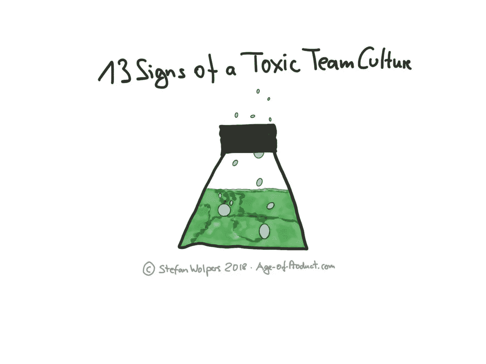

# 有毒团队文化的 13 个迹象

> 原文：<https://medium.com/hackernoon/13-signs-of-a-toxic-team-culture-6af458dbe9f3>

# TL；博士:有毒团队文化的 13 个迹象

在 20 世纪 90 年代看起来不错的想法——外包，例如，将软件开发作为一个非必要的业务领域——与此同时，对于许多传统组织来说，却产生了巨大的适得其反的效果。然而，他们仍然不明白如何建立一个体面的产品/工程文化。了解更多典型的反模式，它们是组织有有毒团队文化的标志。

13 Signs of a Toxic Team Culture

# 有毒的团队文化:内部与外部

20 年前，许多大公司追随杰克·韦尔奇的理念，将非核心业务领域——如软件开发——外包给第三方。今天，他们发现很难在产品和工程人才的战争中与 GAFAs 和其他敏捷和技术型组织竞争。软件终于要吃掉这个世界了。

在那些遗留组织中缺乏产品/工程文化通常会导致雇佣大量的承包商和自由职业者来完成至少一些项目。这反过来经常导致一些典型的反模式，因为内部发现很难与外部合作:

**不平等:**团队成员之间有尊卑之分。这个顺序不是基于一个人的贡献或能力，而是基于这个人是否有报酬。

**车间外部人员:**外部人员应交付工作项目。接受责任和培养产品所有权意识被认为会阻碍这一目标的实现。

**职业问题:**内部人员专注于通过其他方式推进他们的职业发展，而不是打造一个优秀的产品，例如，通过参与组织的政治游戏。

雇佣爪牙:内部人员声称对雇佣谁有最终决定权，并倾向于用它来选择顺从的爪牙。(俗话说:B 人雇 C 人。)

**孤独的决策:**内部人员认为他们对产品负责，因此坚持自己做所有的决策——通常是独自一人，没有团队的参与，或者推翻团队的决策。

**分配任务:**内部人员将工作项目分派给外部人员或下级人员。(当外部人员接受这种情况并询问内部人员他们的下一个工作项目是什么时，情况会更糟。)

**没有 WiFi:**外部设备不能使用“内部”基础设施，例如 WiFi 和日历应用。

# Scrum 反模式指南

这本电子书涵盖了 160 多种 Scrum 反模式，可以在这里免费获得。[立即下载“Scrum 反模式指南”!](https://age-of-product.com/scrum-anti-patterns/)

## 请点击“拍手”👏，如果你觉得这篇文章有用——它对我来说意义重大！

***如果你更喜欢邮件通知，请*** [***注册我的每周简讯***](https://age-of-product.com/subscribe/?ref=Food4ThoughtMedium) ***，加入 14178 位同行。***

# 有毒的团队文化:平等和多样性

此外，除了内部与外部问题之外，还有其他一些问题可能会阻止一群碰巧在同一时间处于同一地点的人成为一个团队:

**并非所有的开发人员都是平等的:**合并需要被请求，并被用作超出合理水平的代码质量关卡。

**外包给初级员工:**高级团队成员认为编写测试、修复 bug 或文档是低于他们工资级别的次要任务。因此，它被外包给初级团队成员。

**远程爪牙:**远程团队成员没有被完全包括在内，例如，他们从未亲自见过同处一地的团队成员。

**沉默对待:**团队成员故意忽略沟通，只是为了在以后的阶段指出明显缺乏沟通。

**没有多样性:**团队成员基本看起来都差不多，大概都是二三十岁的白人公子哥儿。

用脚投票:这个团队的成员波动很大。

# 结论:

难以理解的是，遗留组织抱怨他们不能雇用顶级工程人才。另一方面，他们没有从一开始就投资让公司成为一个很好的工作场所。我说的“棒极了”并不是指现场的寿司厨师或者冰箱里来自八个不同国家的苏打水。

对于努力建立产品/工程文化甚至变得敏捷的组织来说，创建一个平衡的、多样化的团队是至关重要的，在这个团队中，rank 没有特权——准备好并愿意接受责任。他们的投资回报将在很大程度上取决于在过渡时期尽早实现这一目标。

你观察到了有毒团队文化的哪些迹象？请在评论中与我们分享。

# ✋，你想读更多这样的书吗？

好吧，那么:

*   📰*加入 14178 同行和* [*报名我的每周简讯*](https://age-of-product.com/subscribe/?ref=Food4ThoughtMedium)
*   🐦*关注我的* [*推特*](https://twitter.com/stefanw) *并订阅我的博客* [*产品时代*](https://age-of-product.com)
*   💬*或者，免费加入* [*Slack 团队【动手敏捷】的 2400 多位同行。*](https://goo.gl/forms/XIsABn0fLn9O0hqg2)

有毒团队文化的 13 个迹象首次发表在《产品时代》杂志上。