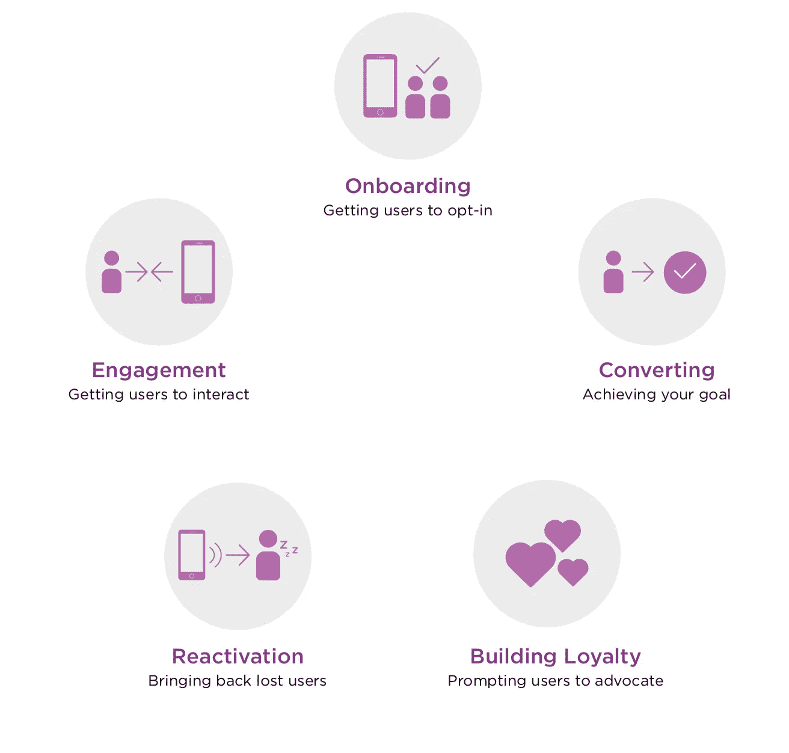
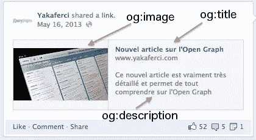
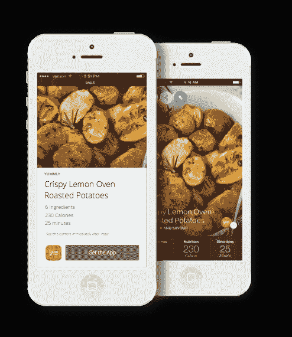
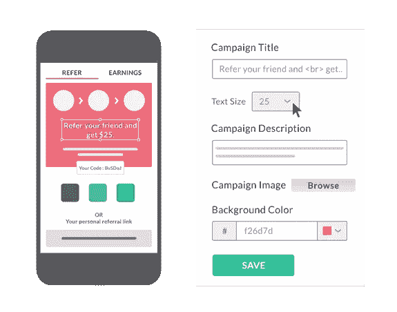

# 实现移动应用增长的 13 种方式

> 原文：<https://medium.com/hackernoon/13-ways-for-achieving-app-growth-marketing-for-mobile-applications-growth-engineering-as-a-b1d061a4f06f>

Mobile Apps Growth Engineering as a Service — Achieving growth by making programming or engineering changes in mobile apps

应用增长& [营销](https://hackernoon.com/tagged/marketing)是应用业务最关键的一块。大多数产品负责人在用户体验、用户界面、功能&上花了很多时间来完善阴影&的圆角半径。很少有人考虑移动应用的可持续有机增长。产品所有者&营销人员通常不具备关于增长的知识或正确的工具&方法论。

原因之一可能是营销公司以及。大多数营销商和代理商都将移动应用营销局限于网络搜索引擎优化、内容、博客和 ASO(应用商店优化)。

在 MobileFirst，我们正在探索创新且易于实施的应用增长和营销方式。这是来自 [MobileFirst](https://mobilefirst.in/) 的 Arpan，我们是移动应用开发&增长机构。

Ideal Mobile App Growth Lifecycle — Ref. LeanPlum

> *应用营销不仅仅是投放广告。仍然有有机的方法来增加你的应用程序*

引用一个名为 LeanPlum 的应用程序增长平台的图片。一般来说，产品所有者和应用程序开发者应该计划以下 4 个步骤。

*   使用收购(有机和付费)
*   用户保留和减少流失
*   营销自动化
*   应用商店优化

> *“95%的选择加入的用户，如果在最初 90 天内没有收到推送通知，将会流失”——这使得用户保留成为建立用户基础的一个最重要的方面。*

在这篇文章中，我们将介绍促进应用增长的策略。例如，使用 branch [DeepViews](https://branch.io/deepviews/) 您可以创建应用程序内容预览。从轻松的角度来说，温斯顿·丘吉尔曾引用这句名言来进行有效的演讲。这个非常适用于 App 内容预览。

> *“App 内容预览像女人的裙子一样管用；长到足以涵盖主题，短到足以引起兴趣。”*

# 实现应用增长的 13 种简单方法:

*   让你的移动应用程序内容有意识:你可以通过你的应用程序内容获得有机增长。我们建议您使用 SearchAPI、NSUserActivity、Spotlight Search，为 Android 创建内容索引。这将在搜索引擎优化和你的内容链接生成的长期影响。
*   让移动应用程序具有社交意识:我们建议您在通过应用程序分享时使用正确的社交工具。open graph &[Schemas.org](http://schemas.org/)可以成为在社交媒体上创建沉浸式帖子的优秀工具。当用户从你的移动应用程序分享时，这将帮助你创建内容丰富的社交媒体帖子。我们为德克萨斯州的体育平台整合了 OpenGraph 这带来了 5%以上的有机用户。右 app [工程](https://hackernoon.com/tagged/engineering)的一大奖励。

Open Graph tags make your applications Social Aware — By adding open graph tags, you are improving CTR by 40%.

*   使移动应用程序能够感知位置:利用 SDK 了解用户的位置，为用户提供量身定制的体验。有时你不需要他们提供准确的位置。
*   通过通用链接和深度链接改进发现:服务器上的应用程序到站点的关联，以提供返回到应用程序的链接。
*   通过在您的网站上为应用程序下载添加智能横幅来提高转化率。这是将网站访问者转化为应用程序下载的最简单的方式。苹果和谷歌提供了工具，或者你可以使用 Branch.io 来做这件事。
*   Firebase & Branch 的深度链接 SDK 非常受欢迎，你可以利用这一点将更多用户转化为应用程序下载。我们将深入分析深层链接&它如何影响您的客户参与。
*   D [eepViews](https://branch.io/deepviews/) 按分支来说，它们就像一个迷你网站，将你的访客转化为应用下载。这是 app 下载最有效的方式之一。使用 DeepViews，您可以创建内容预览网站。

DeepViews by Branch — Cost Effective ways to promote & grow your user base.

*   借助 Mixpanel、Localytics、Firebase、CleverTap 或 Branch 了解用户旅程。有很多框架，根据你的需求你应该选择一个。我们将在接下来的文章中介绍比较分析。
*   脸书&古尔重新营销活动，以激活用户。激活获得的用户可以提高 15%到 20%的转化率。只有少数 SDK 提供这一功能。这非常有效，因为用户已经知道你的应用和价值。作为应用程序所有者，你可以通过一些激励措施重新激活闲置用户。这是对已获取用户更有针对性的激励。
*   通过电子邮件或推送通知自动修复漏斗泄漏，对电子商务相关应用非常有效。什么是漏斗漏？假设一位客户在电子商务应用程序上访问了某个特定产品，将该产品添加到购物车中，但尚未完成交易。通过电子邮件或推送通知的简单提醒可以帮助您修复漏斗泄漏。
*   应用推荐计划或忠诚度计划。您也可以创建深层链接。通过正确的策略，你可以有机地扩大你的用户群。例如优步——每个人都记得他们的第一次免费乘车&他们如何利用忠诚度计划来吸引新用户。正确执行的推荐计划会激励你的现有用户在你的平台上进行更多的交易。我们为新加坡的一个客户建立了忠诚度计划，这使得有机用户增加了 20%。

App Referral & Loyalty Programs are most efficient & scalable method to build your audience

*   ASO(应用商店优化)通过跟踪和监控您的关键字。您可以利用 SplitMetrics、SearchAds、SensorTower 进行关键字跟踪。
*   运行应用程序商店广告和谷歌通用广告来了解这些地区。有时一些地区对你申请的重视程度超出了你的预期。你可以利用谷歌广告和苹果广告来了解基于地理位置的转换。例如，我们早期的一款应用在台湾和印度尼西亚很受欢迎。我们认为这些市场不会大幅增长。最终，我们改变了策略，为这些客户提供了新功能&针对该地区的翻译。

我们有一套详细的资料&为我们的客户创建的几个案例研究，很乐意在个人电子邮件上分享。

问候，Arpan Desai(Arpan @ Mobile first . in， [MobileFirst](https://www.mobilefirst.in/app-growth-marketing-service) 的移动战略与增长顾问)。[了解更多](https://www.mobilefirst.in/app-growth-marketing-service)，如果你正在为你的 app 业务寻求帮助。

#移动#营销#增长#分支#智能#发展#参与#保持#精益