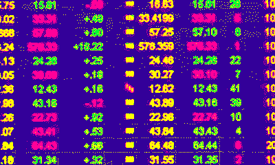

# 2018 年 2 月 14 日:神秘领域最大的故事

> 原文：<https://medium.com/hackernoon/14-02-2018-biggest-stories-in-the-cryptosphere-232957e0f1d7>

**1。韩国官方回应此前请愿**

韩国政府[正式回应](https://www.coindesk.com/korean-government-firm-on-crypto-kyc-mandate-in-petition-response/)近 30 万人签名的[请愿书](https://www1.president.go.kr/petitions/76020?navigation=best-petitions)，呼吁当局不要禁止加密交易。尽管如此，仍将把重点放在制定法规上，使市场更加透明，并处理非法活动。政策协调办公室主任洪南基通过网上发布的视频公布了这一决定。然而，尽管有关于潜在禁令的积极消息，政府也传达了官员之间的意见分歧。一些人同意政府应该监管加密市场，而另一些人认为应该禁止。最后，进一步发展国内区块链产业的战略也正在制定之中。

**2。迪拜贸易公司获得中东首张许可证**

周一，我们[报道了](/@BlockEx/12-02-2018-biggest-stories-in-the-cryptosphere-e2aaeef85a12)位于迪拜的大约 50 套豪华公寓正在以比特币出售。现在，更多的秘密消息来自城市。黄金投资和交易公司 Regal RA DMCC 是[第一家获得中东加密货币交易许可证的](https://www.reuters.com/article/us-emirates-gold-bitcoin/gold-trader-gets-dubai-license-to-trade-and-store-cryptocurrencies-idUSKBN1FX0R2)。这项授权是由迪拜多种商品中心(DMCC)授予的，该中心昨天在 T4 发布了公告。该公司将被允许在位于 DMCC 总部的金库中储存加密货币。它们将被保险，并且保险库将不会连接到任何网络。DMCC 做出这一决定的动机是希望利用技术和创新来彻底改变人们做生意的方式。

**3。加拿大证券交易所将推出代币筹资平台**

加拿大证券交易所(CSE)最近[宣布](https://thecse.com/en/about/publications/cse-news/cse-unveils-canadas-first-platform-for-clearing-and-settling-securities)推出基于[以太坊的](http://www2.thecse.com/blockchain)证券清算和结算平台。公司将能够通过发行债券和股票，使用有价证券来筹集资金。投资者将通过证券代币发行(“sto”)获得这些证券。根据证券委员会的指导方针，这一过程将受到全面监管。这将是北美第一辆此类汽车。总部位于温哥华的 3D 打印公司 Kabuni Technologies Inc .已经签约成为其第一个客户。它将发行证券代币，然后在 CSE 进行交易。

**4。莱特币可能是下一个值得关注的加密货币**

在支付处理初创公司 LitePay 宣布将于 12 天后推出后， [Litecoin 的价格上涨了约 30%](https://www.ccn.com/litecoin-price-leaps-to-200-ahead-of-litepay-launch/),达到 200 美元，为三年来最高。这种加密货币的市值为 111 亿美元，目前排名第五。推出 LitePay 的决定是因为比特币支付服务提供商 Bitpay 缺乏接受莱特币的意愿。两者的主要特征将是相似的。然而，一些人认为推出背后的真正原因是[即将到来的硬分叉](http://uk.businessinsider.com/litecoin-price-surging-as-first-hard-fork-date-approaches-2018-2?r=US&IR=T)(2 月 19 日)，这将创造莱特币现金，因为加密货币将被空投到 LTC 所有者的钱包中。

> 【http://bit.ly/BlockExNewsRoundup】[*要想在你的邮箱里收到我们的每日新闻综述，请在这里注册*](http://bit.ly/BlockExNewsRoundup)