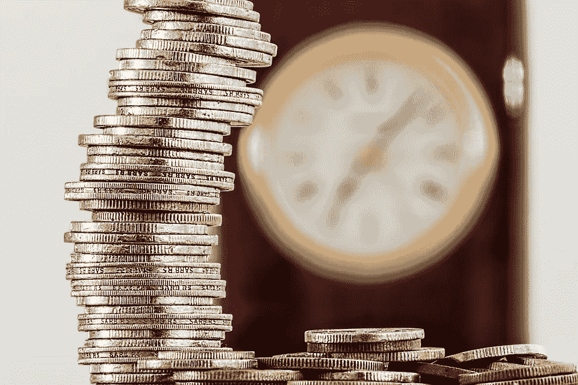
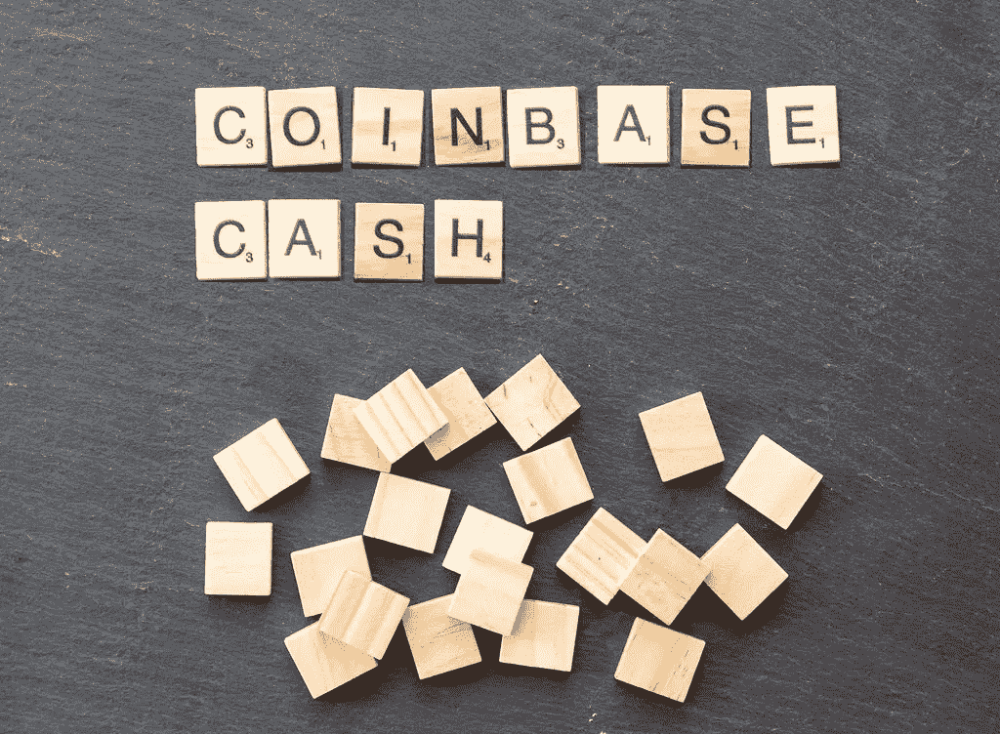

# 2018 年 3 月 14 日:神秘领域最大的故事

> 原文：<https://medium.com/hackernoon/14-03-2018-biggest-stories-in-the-cryptosphere-5e8137898f4d>

**1。印度尼西亚投资密码的人可能很快就会超过股票**

印度尼西亚数字资产交易所，该国最大的加密货币交易所，可能很快就会有比印度尼西亚证券交易所更多的参与者在[注册。后者目前比前者多 4 万名成员。然而，据预测，这个以前被称为 Bitcoin.co.id 的加密平台到今年年底将拥有 150 万加密投资者。首席执行官奥斯卡·达尔马万(Oscar Darmawan)透露，该交易所每天都会收到 3000 份新注册。大多数交易都是用比特币完成的，但以太坊也在增长。该国的中央银行印尼银行没有禁止加密交换，但](https://www.bloomberg.com/news/articles/2018-03-14/indonesian-bitcoin-investors-set-to-outnumber-stock-participants)[对风险发出了强烈警告。](https://www.reuters.com/article/us-markets-bitcoin-indonesia/indonesia-central-bank-warns-over-cryptocurrencies-idUSKBN1F20A7)

**2。比特币基地与巴克莱银行合作**

比特币基地是世界上最大的加密交易所之一，它已经与巴克莱银行建立了银行业务关系，并在巴克莱银行开设了账户。考虑到许多英国银行采取的谨慎态度，这可能会令人吃惊。这个消息是由密码交易所在周二发布的。此举意味着，与比特币基地与爱沙尼亚银行合作时相比，现在比特币基地的成员将受益于更顺畅的交易处理。以前，顾客可以很容易地用英镑存款，取款则是一个漫长的过程。此外，英国监管机构金融行为监管局(FCA)已经[向比特币基地颁发了涵盖 23 个欧盟国家的电子货币许可证](https://www.cnbc.com/2018/03/14/coinbase-cryptocurrency-exchange-opens-bank-account-with-barclays-in-uk.html)。

**3。华为的新技术可以对区块链进行压力测试**

中国科技巨头[华为正在开发一个框架](https://www.coindesk.com/huawei-building-tech-can-stress-test-blockchains/)，它将使[在各种区块链上进行压力测试](http://searchsoftwarequality.techtarget.com/definition/stress-testing)。它已经被命名为[项目 Caliper](https://github.com/Huawei-OSG/caliper) ，并将提交给由 Linux 基金会领导的 Hyperledger 联盟。Hyperleger 织物、Hylerledger 锯齿和 Hyperledger Iroha 已经可以使用该工具进行检查。但是，将来还会添加更多。项目背后的想法是通过将它们整合到这个框架中来简化区块链的比较。这项技术的核心是一个[适配层](https://github.com/Huawei-OSG/caliper/blob/master/docs/Architecture.md#benchmark-engine)，它充当现有区块链和卡钳之间的连接器。

**4。美国 46 个州现在可以享受 Circle 的加密货币投资应用**

高盛支持的创业公司 [Circle 向美国市场推出了其加密货币投资应用](https://blog.circle.com/2018/03/13/circle-invest/)。46 个州将享受无佣金的即时加密交易。不包括纽约、明尼苏达、怀俄明和夏威夷。周二，参加由 Circle Invest 进行的[测试项目](https://www.ccn.com/circles-coinbase-like-cryptocurrency-investing-app-enters-closed-beta/)的人收到了一封电子邮件，宣布其应用程序的新版本[可在苹果商店和谷歌 Play](https://www.coindesk.com/circle-opens-access-to-investment-app-in-46-states/) 上使用。用户可以交易任意数量的主要加密货币。该应用程序并不收取佣金，而是从价差(即买价和卖价之间的差价，约为 1.5/2%)中获利。该公司也渴望收到对早期版本的反馈。

> 这是由 BlockEx 为您带来的新闻综述。

> *要想在你的邮箱里收到我们的每日新闻综述，请在这里注册:*[【http://bit.ly/BlockExNewsRoundup-Updates】T21](http://bit.ly/BlockExNewsRoundup-Updates)