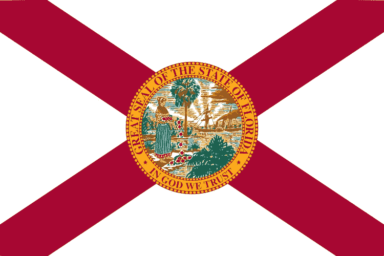

# 2018 年 5 月 14 日:神秘领域最大的故事

> 原文：<https://medium.com/hackernoon/14-05-2018-biggest-stories-in-the-cryptosphere-9d97239b0a69>

## 通过 BlockEx

1.  **比特币基地发布 2018 年 Q1 区块链状况报告**

[比特币基地区块链状况报告](https://www.coindesk.com/research/state-blockchain-q1-2018/)展示了关于公共区块链、分布式账本技术(DLT)、财团链、首次发行硬币(ico)、交易和投资以及监管的数据。它也显示了比特币基地广泛的情绪调查的结果。根据这个[总结](https://www.coindesk.com/coindesk-releases-q1-2018-state-of-blockchain-report/)，有 6 个主要趋势。1)它确定了加密货币的熊市，加密货币在 2017 年底后大幅下跌，但比特币基地的调查显示受访者仍然乐观。2)随着第四季度比特币期货市场的推出，以及 Q1 期间该领域活动的稳步增长，该市场已经日趋成熟。3)矿商似乎仍未受到价格下跌的影响，市场活动似乎没有像预期的那样影响他们的采矿活动。4)税收是许多投资者关注的一个领域，据估计，去年加密货币带来了 700 亿美元的全球税收。许多人表示，他们很难理解自己的纳税义务。5)ico 仍然是一个非常活跃的领域，在 Q1 筹集了 63 亿美元。6)比特币网络的交易费用从 2017 年第四季度的畸高水平下降，大多数其他加密货币的降幅为 60%至 90%。

2.**佛罗里达州收税员接受比特币和比特币现金**

塞米诺尔县税收官与 BitPay 合作，接受比特币和比特币现金，用于支付与驾照、身份证、汽车标签、头衔和财产税相关的费用。做出这一决定是为了“将政府服务从 18 世纪带入 21 世纪”，并使收费更容易，降低身份盗窃和欺诈的风险，增加支付的透明度和准确性。这是 BitPay 的第一次政府合作。

3.**以太坊区块链追踪金枪鱼从“鱼饵到盘子”**

在 Ethereal 峰会上，与会者在观看一部记录片时，吃到了一条在斐济海岸捕获的巨型金枪鱼。这部名为《从鱼饵到盘子》的纪录片，追踪了鱼从被捕获到被包装，再到被运送到与会者的盘子里的全过程。许多人指出了区块链在供应链管理方面的潜力，它正在大量产品中接受测试。峰会期间，总部位于以太坊的供应链管理初创公司 Viant 专注于金枪鱼。