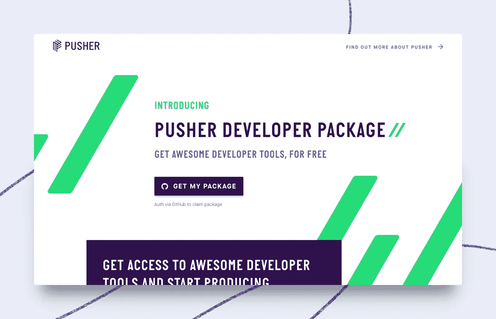

# 一个开发者捆绑包中的 14 项免费服务

> 原文：<https://medium.com/hackernoon/14-free-services-in-one-developer-bundle-6b17106bd48f>

在 [Pusher](https://pusher.com/?utm_source=hackernoon.com&utm_medium=referral&utm_campaign=devpack) ，我们已经为开发者构建实时基础设施超过 7 年，我们知道创建应用程序是一项繁重的工作。你不仅要专注于构建应用的核心工作，还要担心从认证到托管、日志软件和数据存储的组件。构建这些需要大量的时间和精力，使用第三方服务可能会很昂贵。

因此，我们构建了 [**Pusher 开发者包**](https://pusher.com/developer-package?utm_source=hackernoon.com&utm_medium=referral&utm_campaign=devpack)——这是一个旨在让您立即开始运行应用程序创建的精选软件！为了让您获得最佳体验，我们与 14 家优秀的公司合作，在[开发人员](https://hackernoon.com/tagged/developer) [工具](https://hackernoon.com/tagged/tools)领域为您提供最佳解决方案——订阅和积分最长一年免费！该捆绑包价值 10，000 美元，可在整个 6 月申请:

以下是您在捆绑包中获得的内容:

[Algolia](https://www.algolia.com/) → Algolia 提供强大的托管搜索引擎 API，Algolia 为产品团队提供创建快速相关搜索所需的资源&工具。

[Auth0](https://auth0.com/) → Auth0 允许您对在任何设备或云上的任何堆栈上运行的任何身份提供者的应用和 API 进行认证和授权。

ButterCMS 允许你在几分钟内将一个 CMS 博客添加到你的网站上。使用他们的无头 CMS，你可以专注于更有趣的问题。

[Chargebee](https://www.chargebee.com) → Chargebee 可让您自动执行定期计费、管理大规模订阅并访问重要指标。

[Cloudflare](https://www.cloudflare.com/) → Cloudflare 提供内容交付网络服务、DDoS 缓解、互联网安全和分布式域名服务器服务。

CodeShip → Codeship 帮助快速、自动、一天多次发布软件。它缩短了开发周期，从而降低了错误的风险，增加了创新。

[DataDog](https://www.datadoghq.com) → Datadog 是一种针对云规模应用的监控服务，它将来自服务器、数据库、工具和服务的数据汇集在一起，以呈现整个堆栈的统一视图。

[digital ocean](https://www.digitalocean.com/)→digital ocean 提供最简单的云平台来部署、管理和扩展任何规模的应用程序，消除基础设施摩擦并提供可预测性，以便开发人员及其团队可以花更多时间来构建更好的软件。

[Instabug](https://instabug.com/) → Instabug 为移动应用提供 bug 报告、崩溃报告、应用内聊天和用户调查。

[MongoDb](https://www.mongodb.com/)→如果你想专注于构建 app，花更少的时间在数据库管理工作上，那么 MongoDb 的云数据库服务应该是你的选择。使用 MongoDB Atlas，您可以以最小的操作开销获得一个完全弹性的、安全的数据库。

[Mux](https://mux.com/) → Mux Video 是一个视频托管和流式传输的 API，由数据驱动，由视频专家设计，旨在为每个开发团队提供精美的视频。

[Nexmo](https://www.nexmo.com/) → Nexmo 允许您提供虚拟号码，以便在世界任何地方发送和接收消息和电话。

[Pusher Channels](https://pusher.com/channels)→Pusher Channels 通过我们托管的发布/订阅消息 API，帮助开发人员构建可扩展的应用内通知、聊天、实时图表、地理跟踪和更多网络移动应用&。

[SendGrid](https://sendgrid.com/) → SendGrid 是一个用于交易和营销电子邮件的客户交流平台。SendGrid 每天为优步、Airbnb、Pandora、Spotify 和 FourSquare 等互联网和移动客户成功发送超过 10 亿封客户参与电子邮件。

要兑换您的免费套装优惠 [**请前往此登录页面**](https://pusher.com/developer-package?utm_source=hackernoon.com&utm_medium=referral&utm_campaign=devpack) 并登录 GitHub——就这么简单！