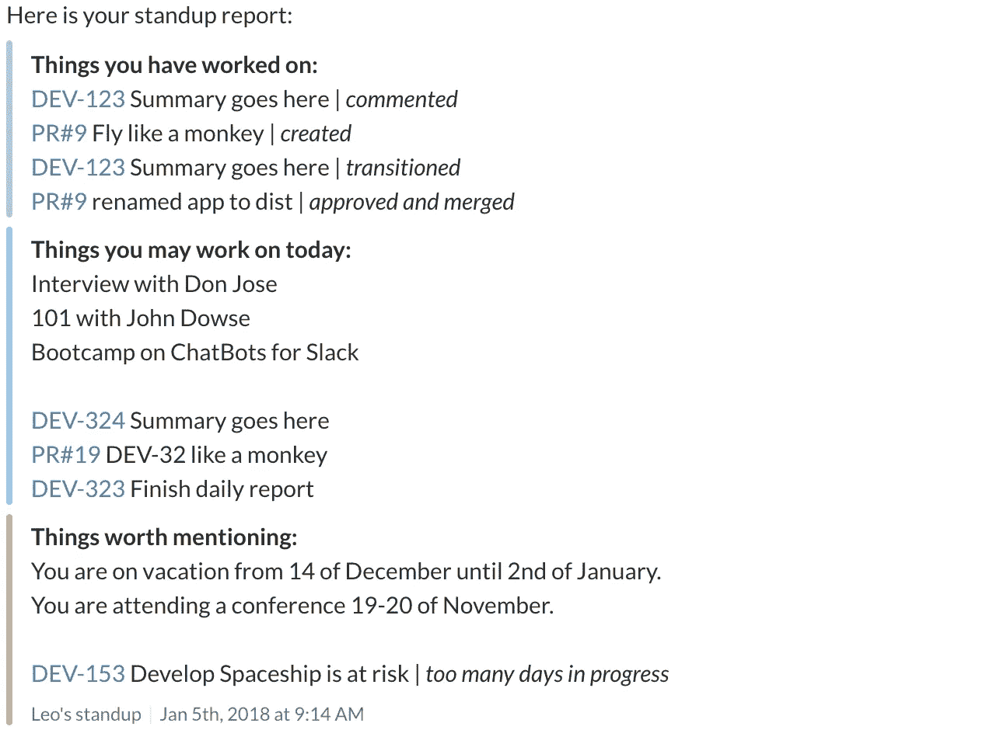
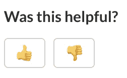

# 改善站立姿势的 14 种方法

> 原文：<https://medium.com/hackernoon/14-ways-to-improve-standup-e5e3d76251da>

Standup — so simple and so important

1.  知道你在说什么，尤其是你没在说什么。例如，在你的[站立](https://hackernoon.com/tagged/standup)区域附近的白板上写下你希望每个人都提到的要点，其余的应该离线记录。
2.  每个人都应该按照对团队的重要性来说话。想象一下，如果你随时可能被打断，你就没有机会继续了。
3.  每个人的时间盒。一点时间压力不会让任何人感到害怕。
4.  使用在团队成员之间随机传递的人工制品，将随机性带入起立鼓掌，让每个人都更加注意。我喜欢一把小吉他。
5.  让起立完全异步，让每个人都记录一个视频，记住上面的第 2 点。
6.  如果您是分布式团队的一员，或者您的一些团队成员偶尔会远程办公，请购买高质量的设备，如麦克风和网络摄像头。
7.  游戏化单口相声，给点有用的更新。制作一个排行榜，每季度发一次奖。起立时检查手机也要受到处罚:)
8.  整合反馈循环，以便团队成员可以轻松地提供关于其他人更新的建设性反馈。和往常一样，应该是及时和明确的，但不能有任何冒犯的意思。
9.  站立时支撑。我相信你会更快更健康。
10.  不要每天都做。对你的团队来说，每周 2 到 3 天可能就够了。
11.  如果你的团队分布在不同的时区，并且想让每个人同步，那就一天站两次。
12.  使用吉拉、Github 或 Trello 板来想象你的站立，但我反对这样做，因为每个人都可以随时查看板，这只会分散站立本身的注意力。
13.  就如何有效地领导单口相声，组织一个小型训练营(培训课程)。
14.  自动化站立，让你使用的工具为你做。您的大多数更新都可以从用于项目管理、代码管理、构建和部署系统的服务中检索到。

你可以混合以上几点来[提高](https://hackernoon.com/tagged/improve)你的单口相声。

请在下面的评论中提供你改善站立姿势的方法。还有别忘了鼓掌；)

