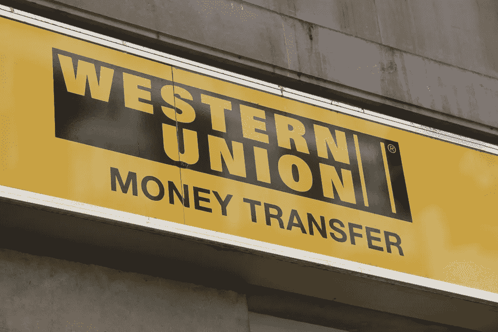

# 2018 年 2 月 15 日:神秘领域最大的故事

> 原文：<https://medium.com/hackernoon/15-02-2018-biggest-stories-in-the-cryptosphere-88af496c0e3c>

1.  **加密货币排队加入闪电网络**

闪电网络最初是为了解决比特币的可扩展性问题而创建的，比特币是第一种采用该系统的加密货币。在区块链之上引入额外的一层将会降低交易成本并节省时间。然而，[其他加密货币](https://www.coindesk.com/bitcoin-isnt-crypto-adding-lightning-tech-now/)现在也面临同样的问题。计划测试闪电的货币有 Ripple、Ethereum、Litecoin 和 Zcash。Litecoin 是最接近实现自己版本的，因为它目前正在与 Lightning Labs 合作。此外，以太坊目前正在开发[雷电](https://raiden.network/)，而 [NEO 拥有三位一体](https://steemit.com/cryptocurrency/@pandorasbox/trinity-lightning-network-for-the-neo-blockchain)。比特币核心贡献者杰里米·鲁宾(Jeremy Rubin)甚至表示，闪电网络已经成为加密货币的必要组成部分。鲁宾目前负责启动 Stellar 的闪电网络。

**2。西联汇款测试 Ripple 的 XRP 汇款服务**

美国金融服务和通信公司[西联公司正在测试 Ripple](http://fortune.com/2018/02/14/ripple-xrp-western-union-money-transfers/) 以改进其汇款服务。首席执行官希克迈特·埃尔塞克(Hikmet Ersek)周二在公司财报电话会议上宣布了这一举措。实施区块链技术将有助于降低成本，改善买卖双方的交易体验。此外，对 XRP 的审判也正在进行。尽管加密货币的价格在下降，但 Ripple 已经在全球范围内建立了各种合作关系。就在最近，它宣布与包括阿联酋交易所和 SBI 瑞波亚洲在内的实体结盟。最后，在过去的 24 小时里，XRP 增长了 10%。

**3。菲律宾欢迎 Visa 提供的区块链支付平台**

菲律宾的五家银行正在建立合作关系，以便使用 Visa 提供的区块链支付平台。目标是[通过一个基于](http://www.pna.gov.ph/articles/1025304) [Visa 的 B2B 连接系统](http://uk.businessinsider.com/visa-partners-with-banks-for-cross-border-b2b-payments-2017-11)的平台来改善他们的支付系统。主要银行菲律宾联合银行也将向其他四家未具名的农村银行提供援助。必须指出的是，联合银行将是该国第一个采用 B2B 连接的银行。此外，将来会有更多的银行加入这一伙伴关系。

**4。南非中央银行将采用区块链技术**

该国的中央银行南非储备银行(SARB)宣布推出由区块链以太坊支持的概念验证(PoC)。该项目名为“霍哈项目”，由以太坊编码器集体委员会合作实施。摩根大通的法定区块链将用于这一银行间清算和结算项目。PoC 将由未来央行支持的令牌提供动力，之前央行副行长称其风险太大。此前，南非多家银行表示有意大规模使用区块链。

> 要想在你的邮箱里收到我们的每日新闻综述，请在这里注册:[http://bit.ly/BlockExNewsRoundup](http://bit.ly/BlockExNewsRoundup)