# 2018 年 15+最佳元素或主题和模板[+5 个插件]

> 原文：<https://medium.com/hackernoon/15-best-elementor-themes-and-templates-for-2018-5-plugins-fe3f5b750ed3>

没有人喜欢在网站定制上花费额外的时间。毫不奇怪，视觉网站建设者今年很热。他们让你通过简单地移动块和添加内容来完成一个网站项目。这就是为什么有了 Elementor 这样的构建器，你可以在创建你的网站时节省几天甚至几周的时间，并且摆脱许多麻烦和头痛。

随着 Elementor editor for WordPress 变得如此热门，Elementor 主题/模板进一步推动了简单性。

这些现成的设计集是 100%元素或兼容，并节省你从头设计网页或整个网站。哪里是寻找这种奖金的最好地方？要了解这一点，你必须查看全新的[**Elementor market place**](https://www.templatemonster.com/elementor-marketplace/?aff=hackernoon&utm_campaign=blog_site_hackernoon&utm_source=article&utm_medium=elementor)，它为你带来顶级开发者的最佳 Elementor 资产。

在这篇文章中，我们很高兴地展示了一些目前为 Elementor builder 构建的最好的模板和主题。一旦你检查了它们，你会对设计的低价格和高质量感到惊讶。

作为奖励，我们还为您带来了一套 5 个最受欢迎的 Elementor 插件，这些插件旨在为您提供更多的网页设计自由，并通过额外的 UX 提升来取悦您网站的访客。

为了您的方便，我们已经按类型整理出了 15 个以上的主题和模板元素。首先，决定你想要的产品类型。然后，选择最符合您需求的设计，并带着它走向成功！

# WordPress 主题的元素

你刚刚开始你的项目吗？你还没有决定用哪个主题吗？别担心！获得一个成熟的元素或主题对你来说是最明智的。

这样的主题给你带来了大量的页眉和页脚选项，以及主页面布局。此外，它们还附带了一些额外的插件，为一个完美的网站用户界面提供动力，并制作一个令人难忘的 UX。

Elementor WordPress 主题目前正处于网络创新的浪潮中。这些响应式模板的设计者从不错过为主题提供急需的利基相关功能。

此外，他们知道网站所有者多么喜欢有机会在不同的设计之间来回切换。这就是为什么许多 Elementor 主题都带有许多杂色的皮肤，让您获得最充分地代表和加强您的项目的设计。

# 24.storycle——多用途新闻门户元素或 WordPress 主题

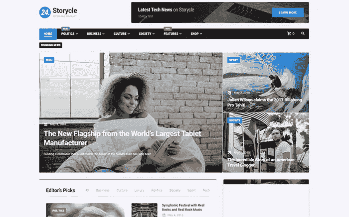

[Details](https://www.templatemonster.com/wordpress-themes/24-storycle-blog-multipurpose.html?aff=hackernoon&utm_campaign=blog_site_hackernoon&utm_source=article&utm_medium=elementor) | [Demo](https://www.templatemonster.com/demo/69580.html?aff=hackernoon&utm_campaign=blog_site_hackernoon&utm_source=article&utm_medium=elementor)

# Johnny go——多功能家庭服务主题杂工

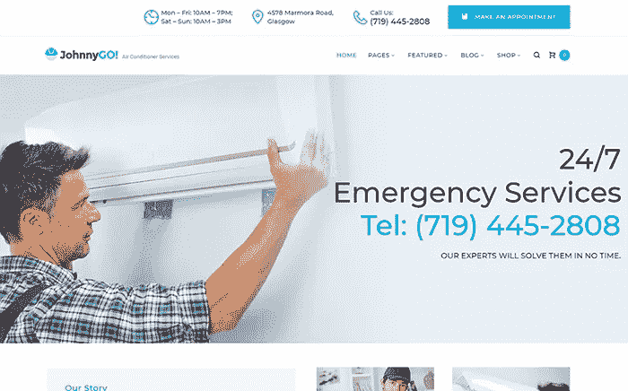

[Details](https://www.templatemonster.com/wordpress-themes/johnnygo.html?aff=hackernoon&utm_campaign=blog_site_hackernoon&utm_source=article&utm_medium=elementor) | [Demo](https://www.templatemonster.com/demo/62555.html?aff=hackernoon&utm_campaign=blog_site_hackernoon&utm_source=article&utm_medium=elementor)

# proje xon-Bright 建筑公司 WordPress 主题

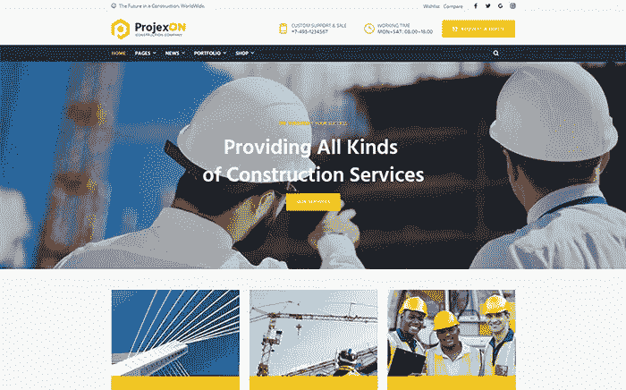

[Details](https://www.templatemonster.com/wordpress-themes/projexon-bright-construction-complany-wordpress-theme-67927.html?aff=hackernoon&utm_campaign=blog_site_hackernoon&utm_source=article&utm_medium=elementor) | [Demo](https://www.templatemonster.com/demo/67927.html?aff=hackernoon&utm_campaign=blog_site_hackernoon&utm_source=article&utm_medium=elementor)

# 摄影工作室 WordPress 主题

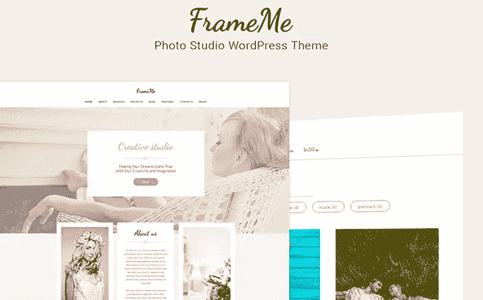

[Details](https://www.templatemonster.com/wordpress-themes/frameme-photography-studio-wordpress-theme-66179.html?aff=hackernoon&utm_campaign=blog_site_hackernoon&utm_source=article&utm_medium=elementor) | [Demo](https://www.templatemonster.com/demo/66179.html?aff=hackernoon&utm_campaign=blog_site_hackernoon&utm_source=article&utm_medium=elementor)

# 空调服务 WP 主题

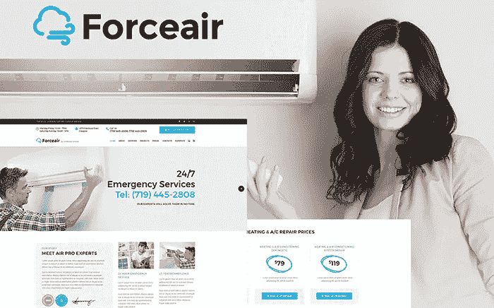

[Details](https://www.templatemonster.com/wordpress-themes/64814.html?aff=hackernoon&utm_campaign=blog_site_hackernoon&utm_source=article&utm_medium=elementor) | [Demo](https://www.templatemonster.com/demo/64814.html?aff=hackernoon&utm_campaign=blog_site_hackernoon&utm_source=article&utm_medium=elementor)

# JET 元素或 WordPress 模板

Elementor 主题是成熟的解决方案，如果你是从零开始创建网站，效果最好。相反，如果你已经在网站上做了一些工作，但需要重新设计，Elementor 模板可以帮你摆脱困境。此外，如果你想在一个已经存在的网站上添加几个页面，或者你只需要一个单页页面，那么它们是理想的选择。

JET Elementor 或 WordPress 模板由于与 JET 插件的集成而拥有非常漂亮的用户界面。创建这些插件是为了让 Elementor builder 更加强大和有效。毫无疑问，他们出色地完成了工作。如果你选择一个 Jet Elementor 主题，你不仅可以利用定制的简单性，还可以在你的网站页面上给人留下深刻的视觉和功能上的印象，而不需要为此付出额外的努力。很棒，不是吗？

# vallees-Spa 沙龙喷射元素模板

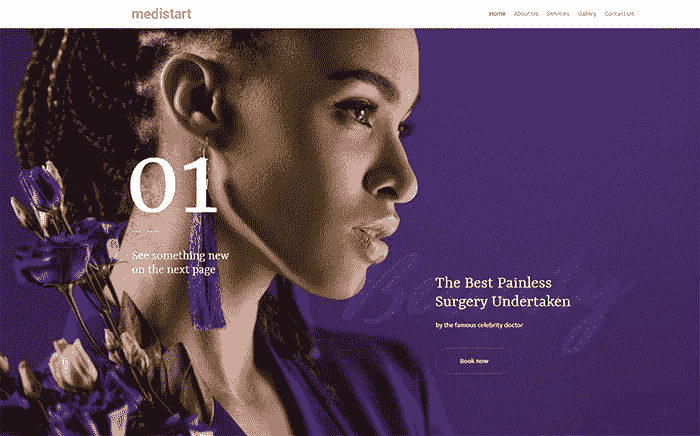

[Details](https://www.templatemonster.com/elementor-templates/vallees-spa-salon-jet-elementor-template-70186.html?aff=hackernoon&utm_campaign=blog_site_hackernoon&utm_source=article&utm_medium=elementor) | [Demo](https://www.templatemonster.com/demo/70186.html?aff=hackernoon&utm_campaign=blog_site_hackernoon&utm_source=article&utm_medium=elementor)

# champio-Crossfit Studio Jet Elementor 模板

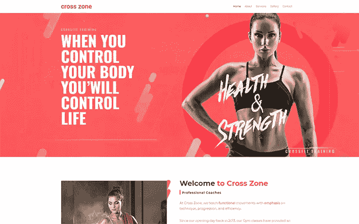

[Details](https://www.templatemonster.com/elementor-templates/champio-crossfit-studio-jet-elementor-template-70182.html?aff=hackernoon&utm_campaign=blog_site_hackernoon&utm_source=article&utm_medium=elementor) | [Demo](https://www.templatemonster.com/demo/70182.html?aff=hackernoon&utm_campaign=blog_site_hackernoon&utm_source=article&utm_medium=elementor)

# Hottrip 旅行社 Jet Elementor 模板

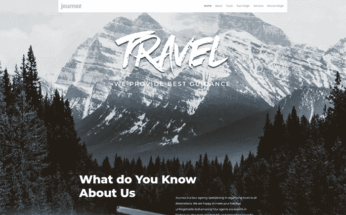

[Details](https://www.templatemonster.com/elementor-templates/hottrip-travel-agency-jet-elementor-template-70184.html?aff=hackernoon&utm_campaign=blog_site_hackernoon&utm_source=article&utm_medium=elementor) | [Demo](https://www.templatemonster.com/demo/70184.html?aff=hackernoon&utm_campaign=blog_site_hackernoon&utm_source=article&utm_medium=elementor)

# 精湛——创意最小喷射元素或模板

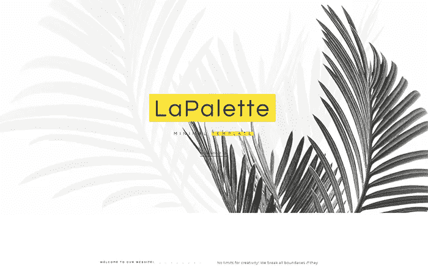

[Details](https://www.templatemonster.com/elementor-templates/masterity-creative-minimal-jet-elementor-template-70151.html?aff=hackernoon&utm_campaign=blog_site_hackernoon&utm_source=article&utm_medium=elementor) | [Demo](https://www.templatemonster.com/demo/70151.html?aff=hackernoon&utm_campaign=blog_site_hackernoon&utm_source=article&utm_medium=elementor)

# Shootex —摄影师 Jet Elementor 模板

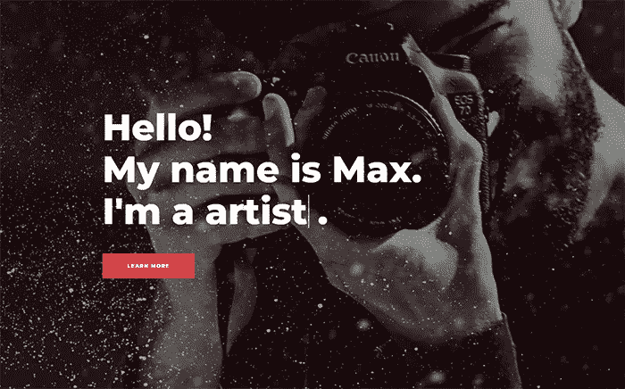

[Details](https://www.templatemonster.com/elementor-templates/shootex-photographer-jet-elementor-template-70167.html?aff=hackernoon&utm_campaign=blog_site_hackernoon&utm_source=article&utm_medium=elementor) | [Demo](https://www.templatemonster.com/demo/70167.html?aff=hackernoon&utm_campaign=blog_site_hackernoon&utm_source=article&utm_medium=elementor)

# PRO Elementor WordPress 模板

如果你对网页设计很认真，你可能已经有了一个专业的元素或计划。很有可能你打算在不久的将来过渡到专业版。在这些情况下，考虑使用 PRO Elementor 或 WordPress 模板。这些模板使用更高级的布局和设计，这些布局和设计依赖于 Elementor PRO 的功能，因此，让您创建一个看起来远高于平均水平的网站。

如果你使用 PRO Elementor 或 WordPress 模板，你可以在不到一分钟的时间内安装好它，并且可以完美地用于你喜欢的任何主题。浏览收藏，你有机会挑选与你的主题完美匹配的模板。然后，享受由模板和 Elementor 提供的免编码专业定制。

# Graffis —创意蒙德里安主义专业元素模板

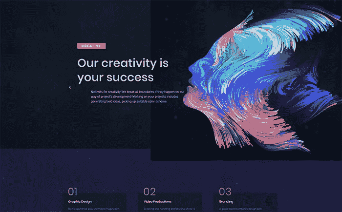

[Details](https://www.templatemonster.com/elementor-templates/graffis-creative-mondrianism-pro-elementor-template-70274.html?aff=hackernoon&utm_campaign=blog_site_hackernoon&utm_source=article&utm_medium=elementor) | [Demo](https://www.templatemonster.com/demo/70274.html?aff=hackernoon&utm_campaign=blog_site_hackernoon&utm_source=article&utm_medium=elementor)

# studio ex—IT courses Pro Elementor 模板

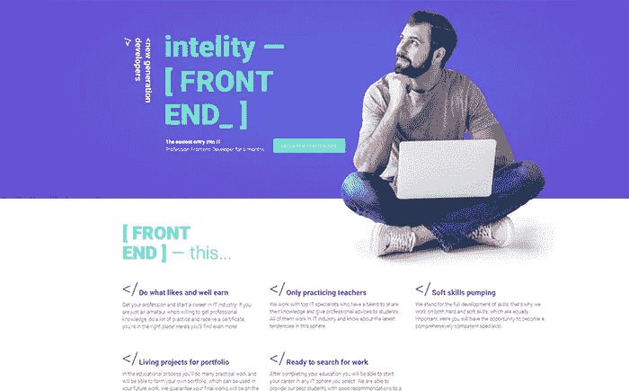

[Details](https://www.templatemonster.com/elementor-templates/studiex-it-cources-pro-elementor-template-70217.html?aff=hackernoon&utm_campaign=blog_site_hackernoon&utm_source=article&utm_medium=elementor) | [Demo](https://www.templatemonster.com/demo/70217.html?aff=hackernoon&utm_campaign=blog_site_hackernoon&utm_source=article&utm_medium=elementor)

# 小说家-作家作品集 Pro Elementor 模板

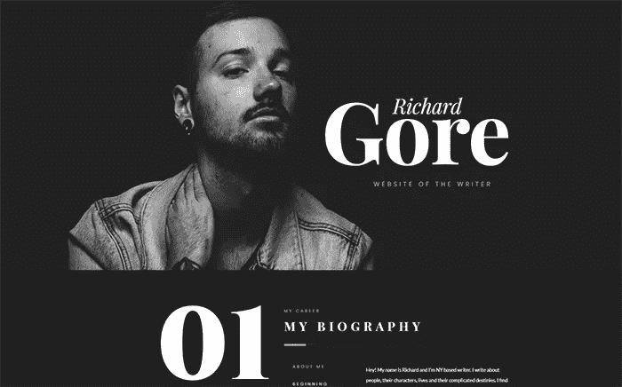

[Details](https://www.templatemonster.com/elementor-templates/novelistic-writer-portfolio-pro-elementor-template-70278.html?aff=hackernoon&utm_campaign=blog_site_hackernoon&utm_source=article&utm_medium=elementor) | [Demo](https://www.templatemonster.com/demo/70278.html?aff=hackernoon&utm_campaign=blog_site_hackernoon&utm_source=article&utm_medium=elementor)

# Marketz —数字代理 Pro Elementor 模板

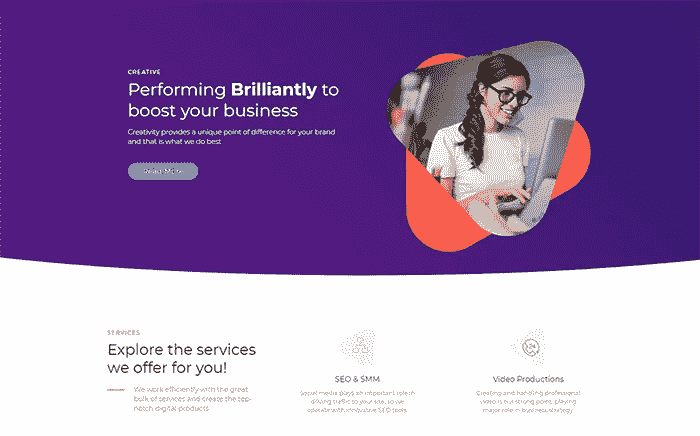

[Details](https://www.templatemonster.com/elementor-templates/marketz-digital-agency-pro-elementor-template-70276.html?aff=hackernoon&utm_campaign=blog_site_hackernoon&utm_source=article&utm_medium=elementor) | [Demo](https://www.templatemonster.com/demo/70276.html?aff=hackernoon&utm_campaign=blog_site_hackernoon&utm_source=article&utm_medium=elementor)

# imagix—Lite Portfolio Pro Elementor 模板

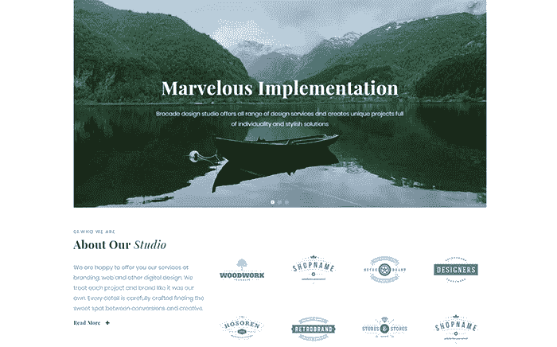

[Details](https://www.templatemonster.com/elementor-templates/imagix-lite-portfolio-pro-elementor-template-70218.html?aff=hackernoon&utm_campaign=blog_site_hackernoon&utm_source=article&utm_medium=elementor) | [Demo](https://www.templatemonster.com/demo/70218.html?aff=hackernoon&utm_campaign=blog_site_hackernoon&utm_source=article&utm_medium=elementor)

# 奖金！WordPress 插件的顶级元素

要创建一个令人印象深刻的网站，你必须注意网站的所有部分及其外观。Jet 插件是帮助你完成这项任务的最佳工具。这些插件中的每一个都控制着你的网站的某个功能或部分，并重新发明了它的工作/出现方式。Jet 插件有效省去你去别处找第三方插件，完美互补。

为了说明这几点，让我们快速回顾一下一些特色插件。例如，Jet Blocks 插件可以让你完全控制你的网站的页眉和页脚的外观。有了它，当你可视化地定制网站部分时，你会有更多的选择，这是一个非常棒的选择。Jet Parallax Plugin，顾名思义，赋予你的网站视差效果，促进沉浸感和参与度。Jet 菜单插件可以让你在你的站点导航中使用大菜单面板，从而更有效地让你的用户转化和提升 SEO。

# jet blocks——Elementor 页眉和页脚小部件 WordPress 插件

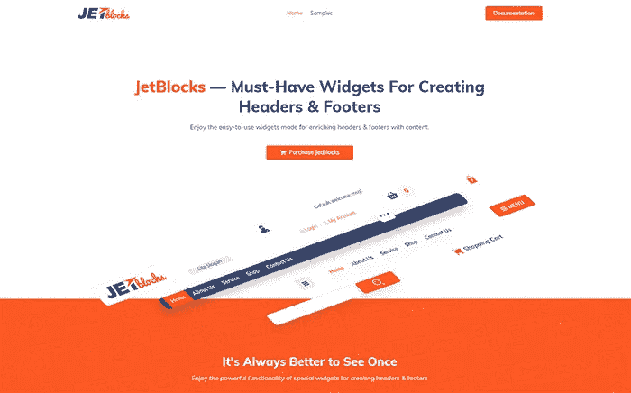

[Details](https://www.templatemonster.com/wordpress-plugins/jetblocks-elementor-header-footer-widgets-wordpress-plugin-69867.html?aff=hackernoon&utm_campaign=blog_site_hackernoon&utm_source=article&utm_medium=elementor) | [Demo](https://www.templatemonster.com/demo/69867.html?aff=hackernoon&utm_campaign=blog_site_hackernoon&utm_source=article&utm_medium=elementor)

# jet parallax——Elementor 页面生成器插件插件

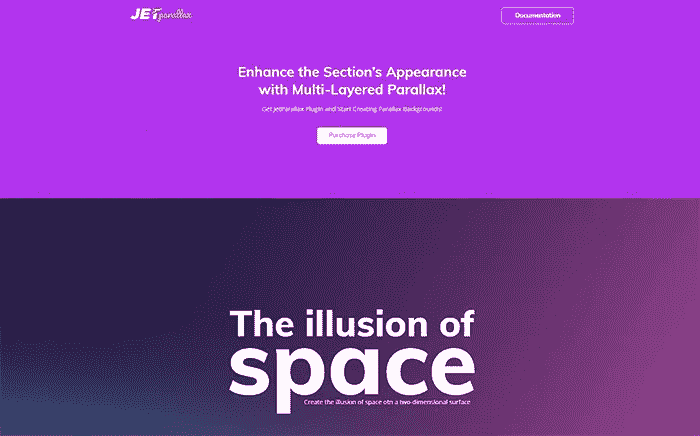

[Details](https://www.templatemonster.com/wordpress-plugins/jetparallax-addon-for-elementor-page-builder-wordpress-plugin-69511.html?aff=hackernoon&utm_campaign=blog_site_hackernoon&utm_source=article&utm_medium=elementor) | [Demo](https://www.templatemonster.com/demo/69511.html?aff=hackernoon&utm_campaign=blog_site_hackernoon&utm_source=article&utm_medium=elementor)

# jet Tabs——Elementor 页面生成器 WordPress 插件的选项卡和折叠

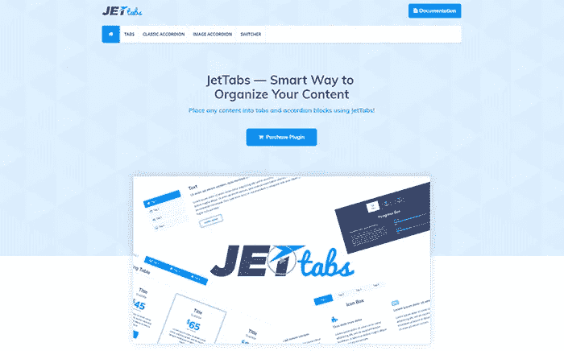

[Details](https://www.templatemonster.com/wordpress-plugins/jettabs-tabs-and-accordions-for-elementor-page-builder-wordpress-plugin-69512.html?aff=hackernoon&utm_campaign=blog_site_hackernoon&utm_source=article&utm_medium=elementor) | [Demo](https://www.templatemonster.com/demo/69512.html?aff=hackernoon&utm_campaign=blog_site_hackernoon&utm_source=article&utm_medium=elementor)

# jet Reviews—Elementor 页面生成器 WordPress 插件的评论小部件

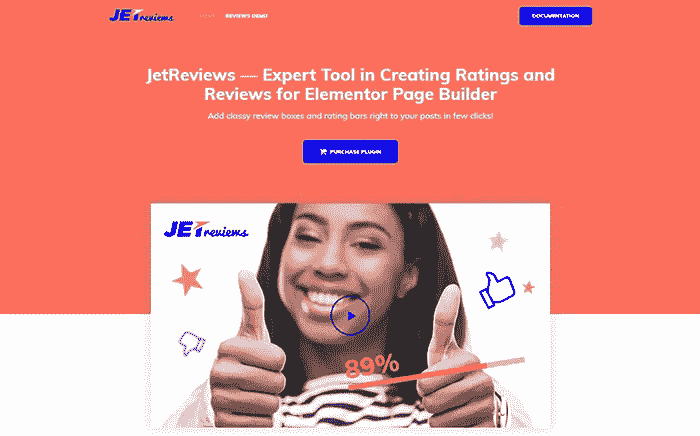

[Details](https://www.templatemonster.com/wordpress-plugins/jetreviews-reviews-widget-for-elementor-page-builder-wordpress-plugin-69510.html?aff=hackernoon&utm_campaign=blog_site_hackernoon&utm_source=article&utm_medium=elementor) | [Demo](https://www.templatemonster.com/demo/69510.html?aff=hackernoon&utm_campaign=blog_site_hackernoon&utm_source=article&utm_medium=elementor)

# jet Menu——Elementor 页面生成器 WordPress 插件的大菜单

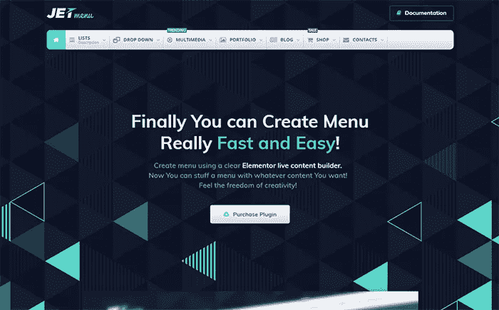

[Details](https://www.templatemonster.com/wordpress-plugins/jetmenu-mega-menu-for-elementor-page-builder-wordpress-plugin-69509.html?aff=hackernoon&utm_campaign=blog_site_hackernoon&utm_source=article&utm_medium=elementor) | [Demo](http://www.templatemonsterpreview.com/69509.html?aff=hackernoon&utm_campaign=blog_site_hackernoon&utm_source=article&utm_medium=elementor)

恭喜你。你已经熟悉了一些顶级的元素、主题和模板。你觉得它们热吗？你喜欢他们和 Elementor 一起带来的网站创建方式的改变吗？我们希望您对所有这些问题的回答都是肯定的。如果你不确定，你可以尝试用元素或主题/模板来增强你的网站。很有可能，你会变成一个真正的元素迷！

无论如何，我们祝你好运，用 Elementor 主题/模板为你的网站提供动力，用无与伦比的网络形象将你的竞争对手推到一边！

敬请期待！