# 15+学习 WordPress 并成为专家的最佳地点！

> 原文：<https://medium.com/hackernoon/15-best-places-to-learn-wordpress-and-become-a-pro-ac86b904c85f>

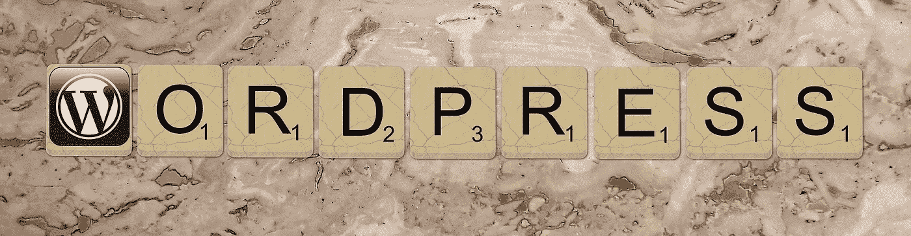

WordPress.org

一年半前，当我在 [WordPress](https://wordpress.org/) 开始我的职业生涯时，我对什么是 [WordPress](https://hackernoon.com/tagged/wordpress) 只有一个模糊的概念，以前我只是为了写博客而使用它。直到去年，我还不知道这个开源工具的巨大潜力。我立刻意识到我实际上是在利用 WordPress.com 的 T4，而我要开始对付的是 WordPress.org。

对于那些刚刚进入 WordPress 的人，你可以阅读我在 quora 上关于 WordPress.org 和 WordPress.com 区别的回答

现在你可能会问，*我为什么要学 WordPress？*

原因很明显，它是免费的、开源的和高度可定制的。此外，用 WordPress 建立一个正常运行的网站并不需要你有编码方面的专业知识。但是，如果你希望建立一个具有高级功能的网站，或者希望成为一名 WordPress 网站开发者，甚至是一名 WordPress 插件开发者，从长远来看，拥有良好的指导会对你有所帮助。因此，我将记下过去一年半以来帮助我学习 WordPress 的一些网站。

这些网站都有自己在 WordPress 上传播知识的方式。希望你和我一样喜欢这些网站！

## 1.[WP 初学者](http://www.wpbeginner.com/)

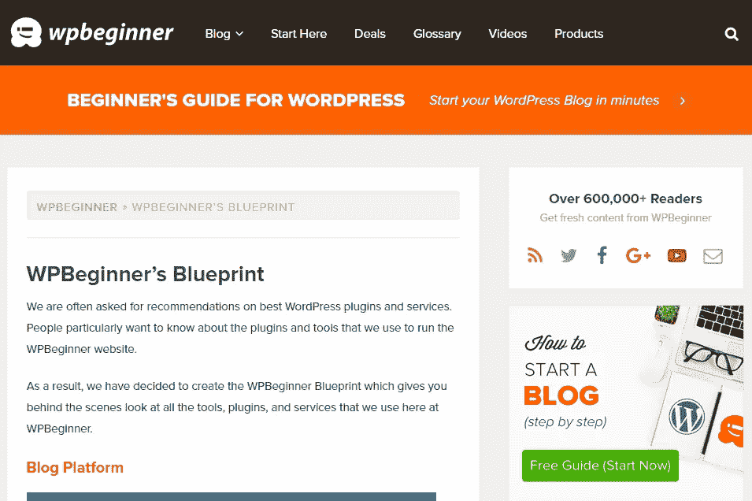

wpbeginner

WordPress 的圣杯。永远免费，为初学者量身定做。这个网站可能会给你在 WordPress 上想要的所有答案(至少我是这样)。从[学习](https://hackernoon.com/tagged/learning)在 localhoast 建立你的 WordPress 站点到创建和销售你自己的 WordPress 插件，这个网站将会是一个很好的伙伴。在谷歌上键入任何与 WordPress 相关的查询，我敢打赌来自 WPBeginner 的一篇文章会是前三个链接之一。

“如何做”的文章是它的亮点。研究充分、内容全面的博客会让你明白为什么 WPBeginner 会名列前茅。他们有一些端到端的教程，比如“**如何开博客**”、“**如何建网店**”。但是，到目前为止，我最喜欢的是“**WP 初级蓝图**”。WP 初学者从 2009 年开始，从那以后就没有回头过。另外一个好处是，如果你通过 WPBeginner 购买，你可以获得各种插件的独家优惠。WPBeginner 适合新手，内容写手，营销人员，网站开发者。

## 2.[WordPress.org 法典](https://codex.wordpress.org/)

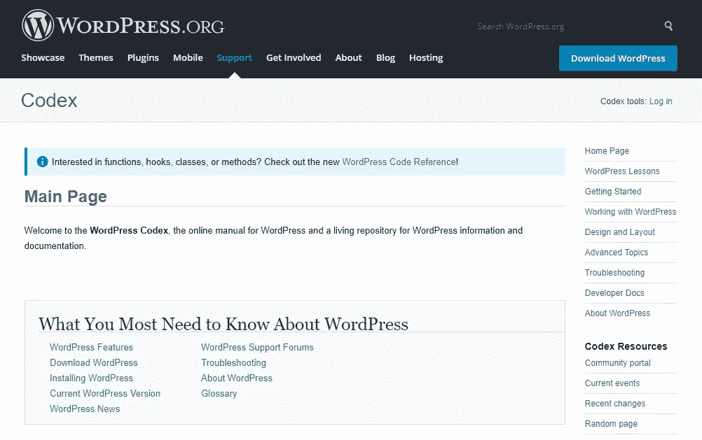

WordPress Codex

如果你是一个插件开发者，你的目的只是开发 WordPress 插件，那么你应该去这个网站。这也是免费的。这是一个为开发人员创建的内容丰富的文档，我担心它对非开发人员来说不是一个非常友好的网站。如果你真的不期待创建 WordPress 插件，那么你可以跳过这个网站，转而去其他网站。

不言而喻，这个地方基本上有与 WordPress 术语相关的所有问题的答案，你可以盲目地相信它。WordPress Codex 适用于 WordPress 插件开发者，内容作者，他们希望了解一些 WordPress 的核心特性，比如钩子，过滤器，动作等等。这不是一个帮助你在 WordPress 上创建网站的好网站。

## 3. [WP101](https://www.wp101.com/)

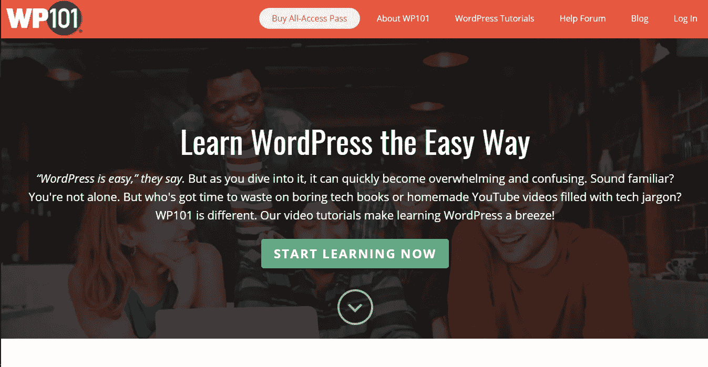

wp101

除了博客，教程内容也不是免费的。然而，他们承诺让你成为专家。与 WP 初学者不同，他们为每个级别的 WordPress 学习者量身定制了课程。他们甚至有一些顶级插件的完整课程，如 JetPack、Yoast 等。他们有许多“即将推出”模式的教程！因此，你可以不时地查看这个网站，或者订阅他们的网站，以便在你需要的教程出版后得到通知。WP101 只专注于教育。他们有一种创新的教学方法。WP 101 插件只是一个插件，可以放入你的仪表盘，帮助你在使用 WordPress 的同时学习 WordPress。

## 4.[环境图+](https://code.tutsplus.com/categories/wordpress)

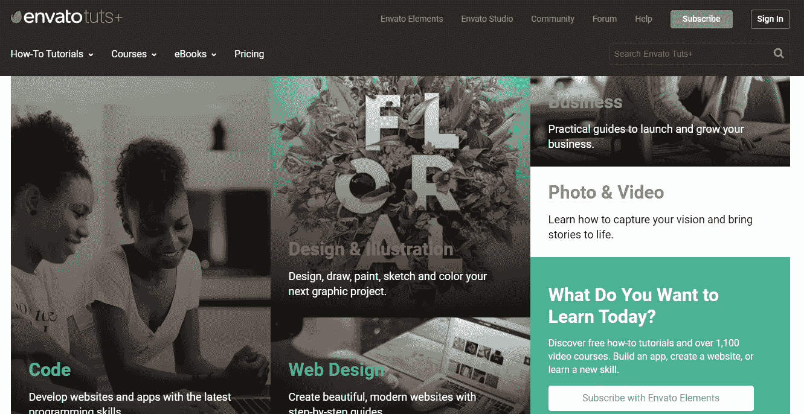

envatotut+

Envato 为网站开发者赢得了最通用的市场之一的美誉。一个地方，你可以得到你的网站所需的所有工具，还推出了超过 21，000 免费教程的教育图书馆。

这个网站有许多有用的博客、课程和电子书。而博客是免费的，部分课程也是免费的。但是为了获得完全的访问和利用它的全部潜力，你需要付费订阅。

## 5. [Wpmudev](https://premium.wpmudev.org)

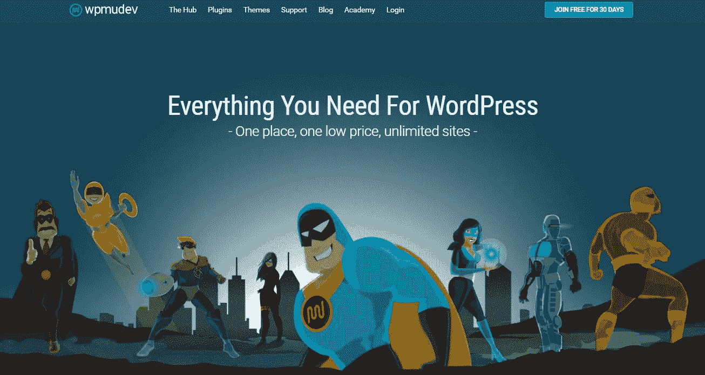

wpmudev

这个网站会给你一些全面详细的文章。他们的博客会给你一个清晰的概述，是免费的。然而，该网站会向你收取从 [wpmudev 学院](https://premium.wpmudev.org/academy/)学习他们课程的费用。除了教程之外，这个网站还有很多东西可以提供给 WordPress 用户，比如 100 多个免费的高级插件，主题，24X7 支持等等。一旦你上了他们的博客，意识到他们讲故事的有效方式，你自然会想参加他们的大师班，以便深入掌握这个话题。

## 6. [WinningWP](https://winningwp.com)

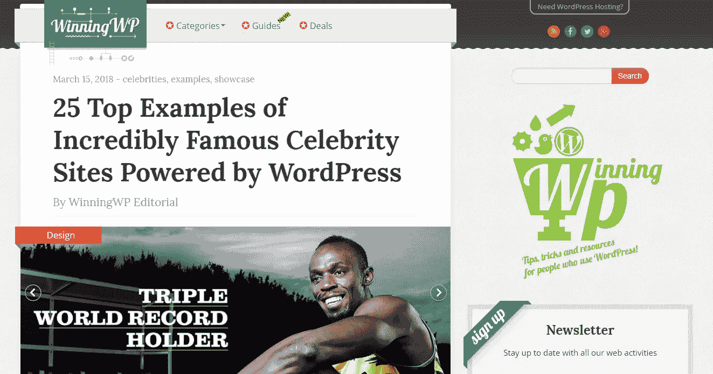

winningwp

这个网站比较符合 WP 初学者。他们有一个推荐主题和插件的列表，并提供了一些详细的评论。你也会在这个网站上找到一些独家交易。

## 7.[深入 WordPress](https://digwp.com/)

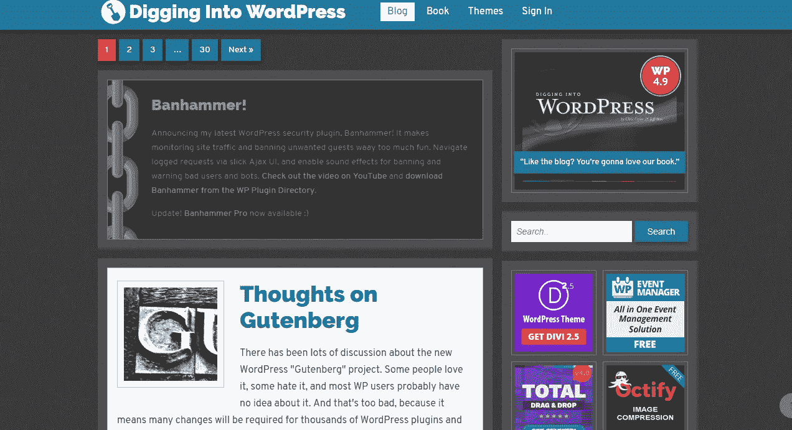

digwp

我最近偶然发现了这个网站，忍不住要提到它们。他们的网站设计与你会遇到的任何其他 WordPress 学习网站都非常不同。他们有很多有用的 WordPress 书籍，你一定要看看。

## 8. [WPSessions](https://wpsessions.com/)

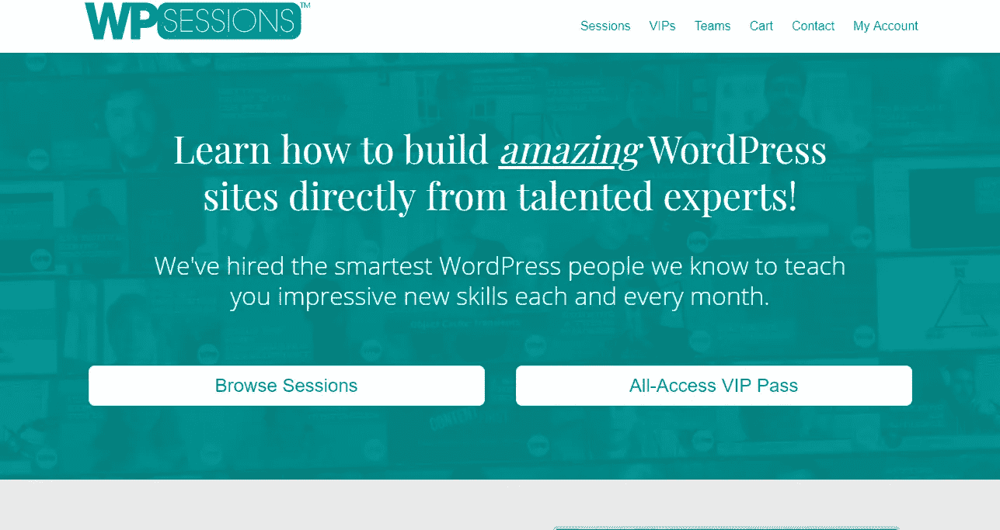

wpsessions

WPSessions 是克里斯马乐推荐的三个网站之一。该网站有一系列旨在提供端到端指导的课程。他们有免费的和收费的教程。他们的辅导课有克里斯·马乐、科里·米勒、皮聘·威廉姆森这样的人物，所以他们肯定是值得关注的。WPSessions 的亮点是他们可以直接向你展示 WordPress 专家的教程！

## 9. [SellWithWP](https://www.sellwithwp.com/)

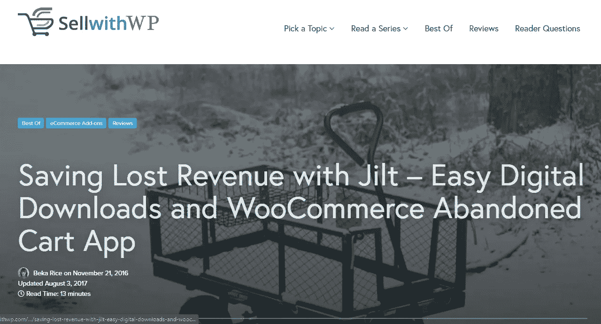

sellwithwp

尽管到今天为止，这个网站的博客数量相对较少。它的端到端教程真的很有帮助。由 Beka Rice 管理的文章绝对是最好的文章之一。批发市场系列确实是其中的佼佼者。顾名思义，该网站专注于 WordPress 上的在线销售，因此，像 WooCommerce，Easy Digital Downloads (EDD)等电子商务平台。是 SellWithWP 的主要焦点。

## 10.[约斯特](https://yoast.com/seo-blog/)

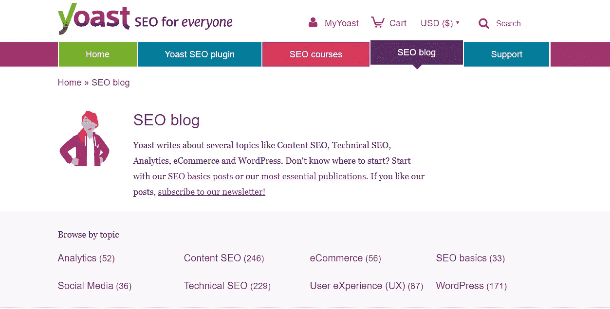

yoast

Yoast，WordPress 必不可少的 SEO 工具的提供者。我们无法想象在 WordPress 上发表一篇文章却没有得到许可。

他们的文章在 WordPress SEO 上无与伦比。他们还有课程。不仅仅是 SEO，他们关于分析和用户体验的文章也值得大力推荐。

## 11.[WP buff](https://wpbuffs.com)

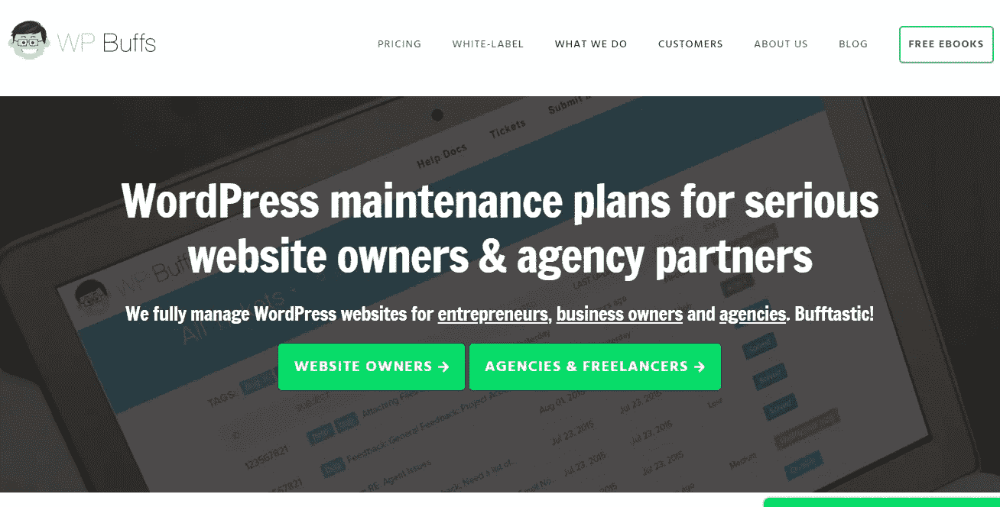

wpbuffs

在 WPBuffs 管理的其他服务中，他们的博客值得一提。他们的文章主要围绕 WordPress 站点优化、页面加载速度和安全性。他们甚至有一系列简短的免费电子书。

## 12.[高级 WordPress](http://www.advancedwp.org)

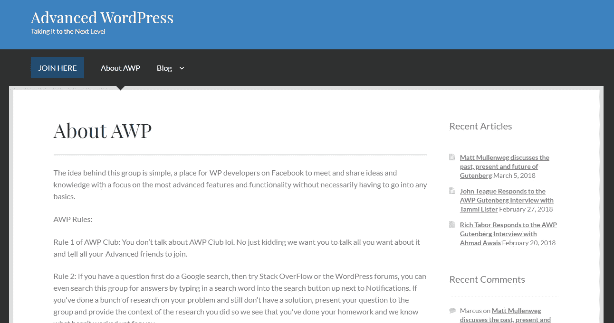

advancedwp

高级 WordPress facebook 群组是在 WordPress 上分享和收集知识方面最好的群组之一。以及获得一些快速帮助和建议。如果您正在寻找快速帮助、解决方案或建议，请访问该网站。

## 13。Codeinwp

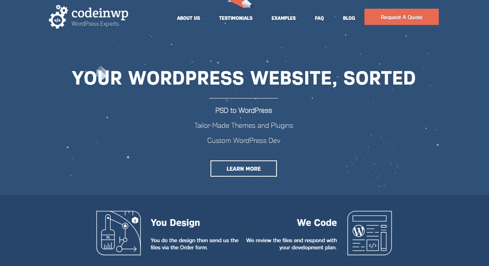

codeinwp

这个地方可能不是一个学习 WordPress 的好地方，而是一个有着有趣的、引人入胜的、信息丰富的新闻、插件、主题等文章的网站。这与 WordPress 有关。如果你正在寻找激励人心，鼓舞人心和知识渊博的文章阅读，那么这可能是正确的地方给你。

## 14.[WP-snippet](http://wp-snippets.com/)

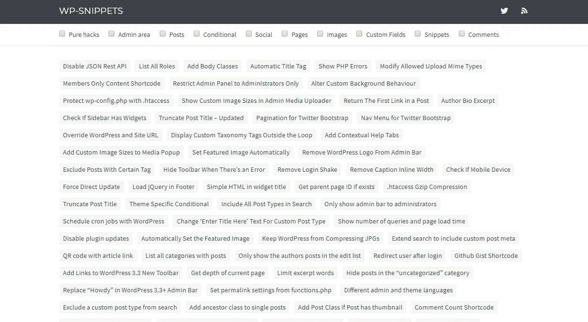

wp-snippets

这确实是一个有趣的网站，只发布 WP 定制的代码片段。很少有这种网站专门提供代码片段。由于他们没有合适的文档，他们推荐 WP 初学者来理解这个理论。

## 15. [WPKUBE](https://www.wpkube.com)

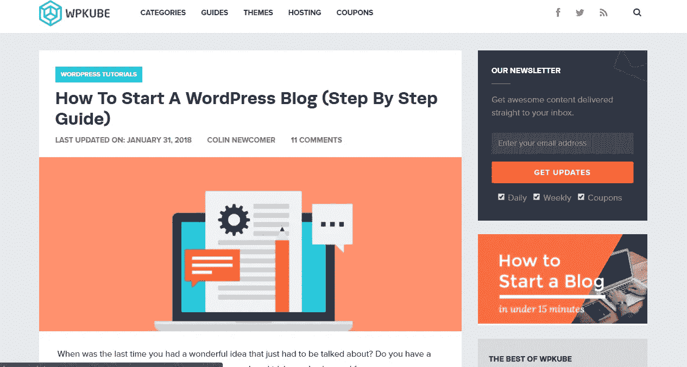

wpkube

每个 WordPress 资源都是独一无二的。WPKUBE 也是。虽然基本上与 WPBeginner 是一条线，但它在 WordPress 中有自己的处理方式。WPKUBE 与一些顶级 WordPress 社区有合作关系，可以在主题、托管、插件等方面给你高达 60%的折扣。尽管他们发表新文章的频率较低，但每篇文章的丰富性和深度弥补了这一点。

## 16. [LearnWoo](http://learnwoo.com/)

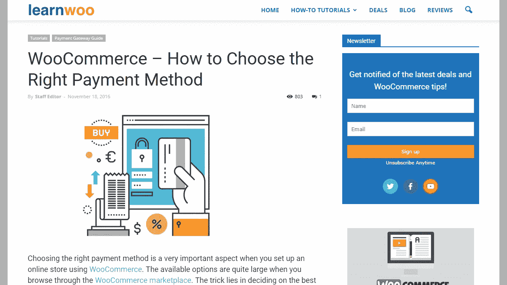

learnwoo

提到我们的宠物项目 learnwoo，我不禁有点偏颇。learnwoo 对于 WooCommerce 就像 WPBeginner 对于 WordPress 一样。它目前处于一个相对基础的阶段，但这并不意味着要发布一些高质量的内容。LearnWoo 专注于 WooCommerce。尤其是 WooCommerce 核心及其扩展。他们也有几个插件，主题，主机等独家交易。

希望你和我一样喜欢学习 WordPress。还要在评论区提到你最喜欢的 WordPress 学习平台！