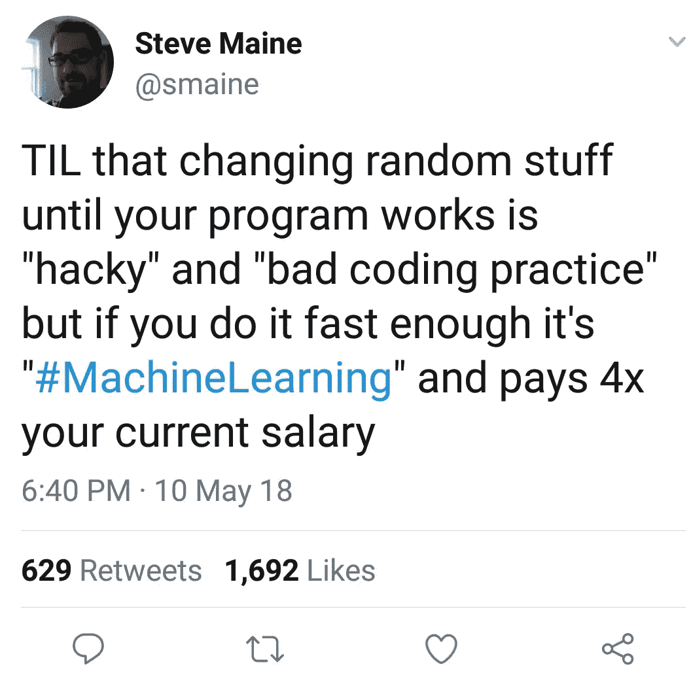

# 只有程序员才会懂的 15 个笑话

> 原文：<https://medium.com/hackernoon/15-jokes-only-programmers-will-get-b42873eba509>

## 1.我觉得这些书中有一本在误导我

## **2。我只需要学习如何变得更快**

## **3。机器学习如何工作**

## 4.完美的答案

## 5.这非常有帮助..

## 6.有时候，我会想，非技术类的朋友会不会好奇我的搜索历史…

## 7.保存代码的最佳方式

## 8.Javascript…

## 9.调试如何工作

## 10.Quora 太棒了

## 11.简而言之我的生活

## 12.不只是你，伙计…

## 13.这难道不是事实吗

## 14.活着是多么美好的时光

## 15.谢谢大家！

## *那都是乡亲们！*

## 附注:你在罗马尼亚找开发工作吗？[在这里抓住他们](https://www.ejobs.ro/locuri-de-munca/it-software/?setlang=en_&utm_source=medium&utm_medium=article&utm_campaign=bau_tacticals&utm_content=community)