# 来自汽车行业的 15 堂加密课

> 原文：<https://medium.com/hackernoon/15-lessons-for-crypto-from-the-car-industry-546b30d8dd11>

## 尽管其起源神话是关于财富生产的民主化，但今天的密码在很大程度上是不可访问的。要实现全部潜力，crypto 必须像汽车制造商一样:提供最大效用。

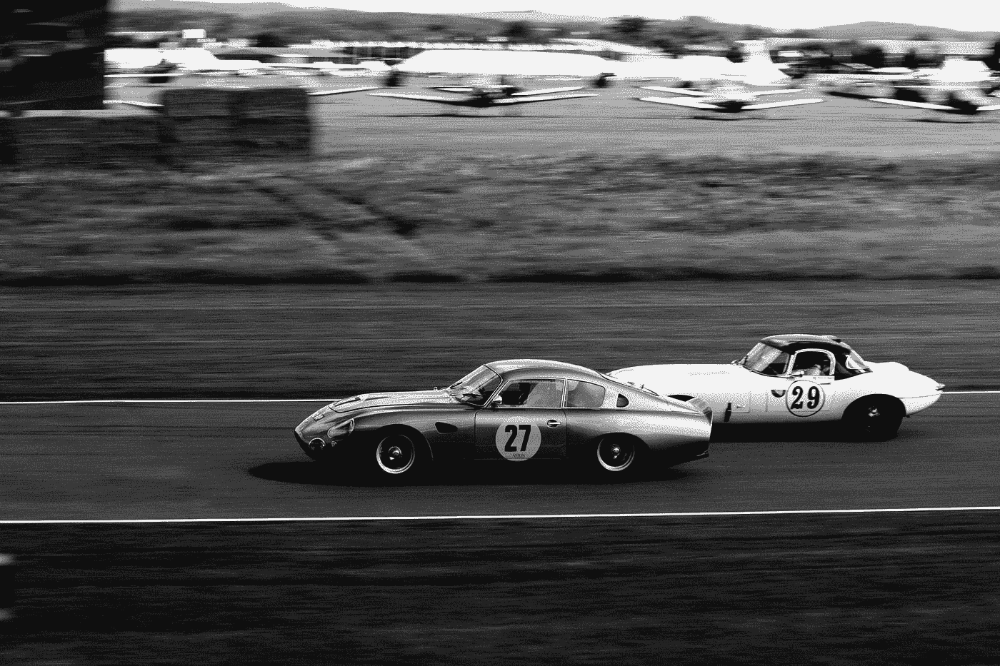

# 1.为了成功，加密必须对每个人都有意义

让加密变得“可访问”并不意味着为这个或那个新的加密手机制作精美的小册子。

Crypto 不需要更多的一页纸、信息图表和解释者视频来说明开始挖掘“数字资产”有多容易，“推出 ICO”有多容易，或者开立比特币基地账户和购买比特币有多容易。

> 可访问性是关于认识到加密需要普通人有非常容易的进入加密经济的切入点。

Crypto 最成功的 Cryptomobile 将为每个人**提供获取密码的简单方法，而不仅仅是花费密码**。

# 2.论文

## (A)普通人需要能够容易地获得容易兑换的密码；crypto 需要给人们这种功能。

## (B) Crypto 的成功在很大程度上取决于此。

## (C)换句话说，crypto 对普通人的需求远远超过普通人对 crypto 的需求。

# 3.今天的加密手机既复杂又昂贵！

观察今天的加密空间的每个人都可能同意 [*加密法律内幕*](https://cryptolawinsider.com/) 的观点，即今天的加密不适合新手:

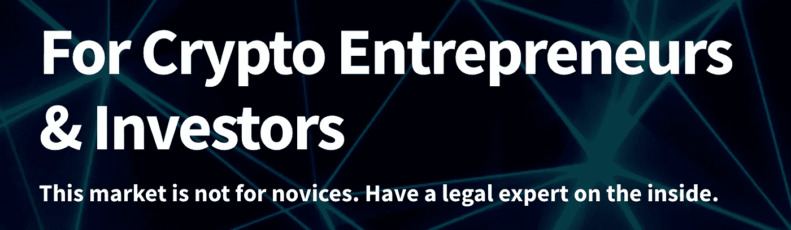

今天，要加入“加密崇拜”，你必须爬上陡峭的学习曲线，获得经验，并在智力决斗中展示技术诀窍。

即使你遵循了所有的入会仪式，你也永远无法登上密码的顶峰。这里是[执法人员更加好奇](https://medium.com/u/2e8de4ec5cc0#c2814665baf9)在所有这些色彩下发生了什么。

今天的情况是悲剧性的，因为它是如此容易避免。

从比特币白皮书开始，加密唯一需要做的“检验”就是“防止”所有系统和过程。与其假装成“智能合同”密码律师，[密码专家们应该保持警惕，集中精力避免愚蠢的地雷](/cleanapp/cryptos-killer-app-is-litter-ally-under-our-feet-1-of-5-eb064a6ab215)。

现在改还不晚；但是机会之窗正在迅速关闭。

# 4.加密手机可以&也必须更简单

每个人都应该看到一个正在突突前进，耗尽汽油，并不断被闯入(和[靠边](/cryptolawreview/against-smart-contracts-4a1f43133215))的加密手机是一个**大问题**。

今天，许多开发商正在努力向公众销售更清洁、更精简的加密手机。

但到目前为止，crypto 还没有失控的“无产阶级”畅销书 Crypto Model T、Crypto Camry 或 Crypto Civic。

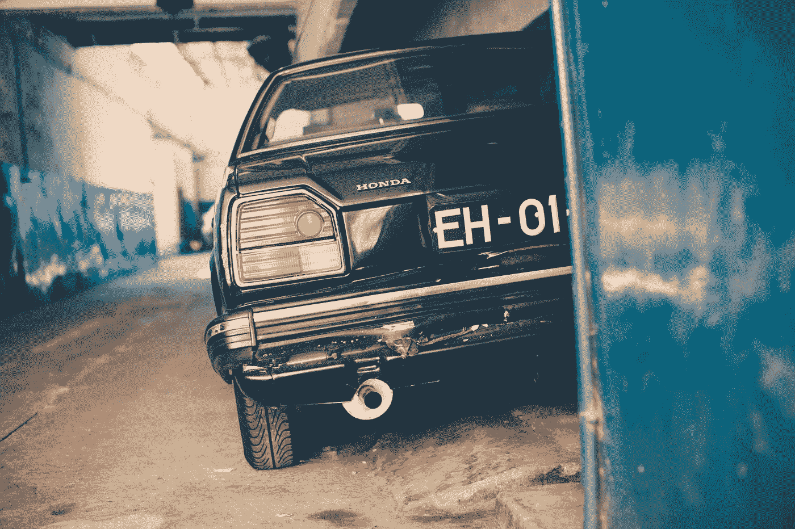

相反，Crypto 仍然非常专注于“Lambos”

Lambos 和 EarthRomers 很酷，但是 crypto 的全局扩展和[超效用](/cryptolawreview/what-is-blockchain-hyperutility-ade850f3034d)问题的解决方案是吸引*最大人数*的 Crypto 用例。

要成为*超实用加密应用*，用例必须满足三个简单的标准:

*   (1) **这是钥匙**(可下载的应用程序或硬件部件，如莱杰纳米)
*   (2)这里有一个关于刹车、开关、&齿轮如何工作的**快速入门**(这里有一个点击赚取密码的[，这里有取钱的方法)；](/cleanapp/cryptos-killer-app-is-litter-ally-under-our-feet-1-of-5-eb064a6ab215)
*   (3) **驾驶愉快**(享受赚取 crypto，并告诉你所有的朋友吧)！

任何比这更复杂的事情，你都是在为数百万人而不是数十亿人制造产品或服务。

> 世界上数十亿人需要采用加密技术。

这是实现这一目标的最快路线图。(*提示* : *这是一张真实的地图；比如说，一张* [*基于区块链的世界地图，以及人们获取用于映射的密码*](/coinmonks/https-medium-com-cleanapp-the-value-of-trashhash-69e331d86374) *。*)

# 5.学习驾驶

可以这样想:现在是 1905 年，我们正处于汽车世纪的开端。

每个人都能看到汽车的潜力。市场是狂热的、令人兴奋的、创新的，而且是分散的。然后，不同的价值主张开始呈现在世人面前:

*   **提供一个(Studebaker)** :汽车和“汽车市场不适合新手。在内部雇佣一名机械师。”定制您的汽车体验。我们是拥有“最高技术能力”的定制客车制造商，我们将满足您的每一个愿望。我们将[向每个不满意的车主](https://en.wikipedia.org/wiki/Studebaker)派遣一名机械师，并更换有缺陷的零件，不计成本。

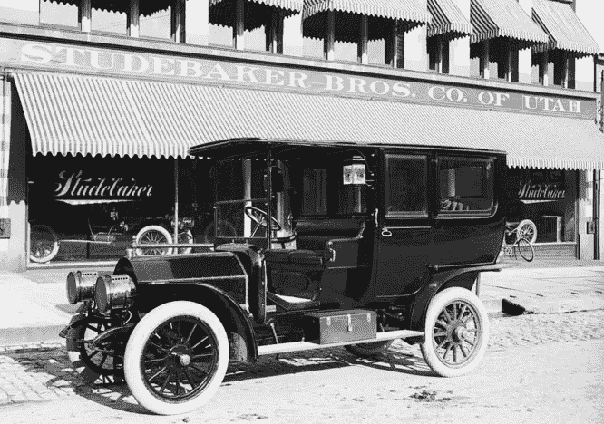

Studebaker limousine. Source: Wikipedia.

*   **优惠 B(福特)**:汽车和汽车**市场应该是给新手的！我们制造的汽车最大限度地减少了对内部机械师的需求。我们的汽车如此简单，你可以成为自己的机械师。你可以定制和“选择任何颜色，只要是黑色的。”我们的价值主张很简单:你的投资回报率是“额外的生产力”,因为你不必步行或驯服马匹；但投资回报也来自于你在 T 型车中通过载人或载货所获得的额外收入。**

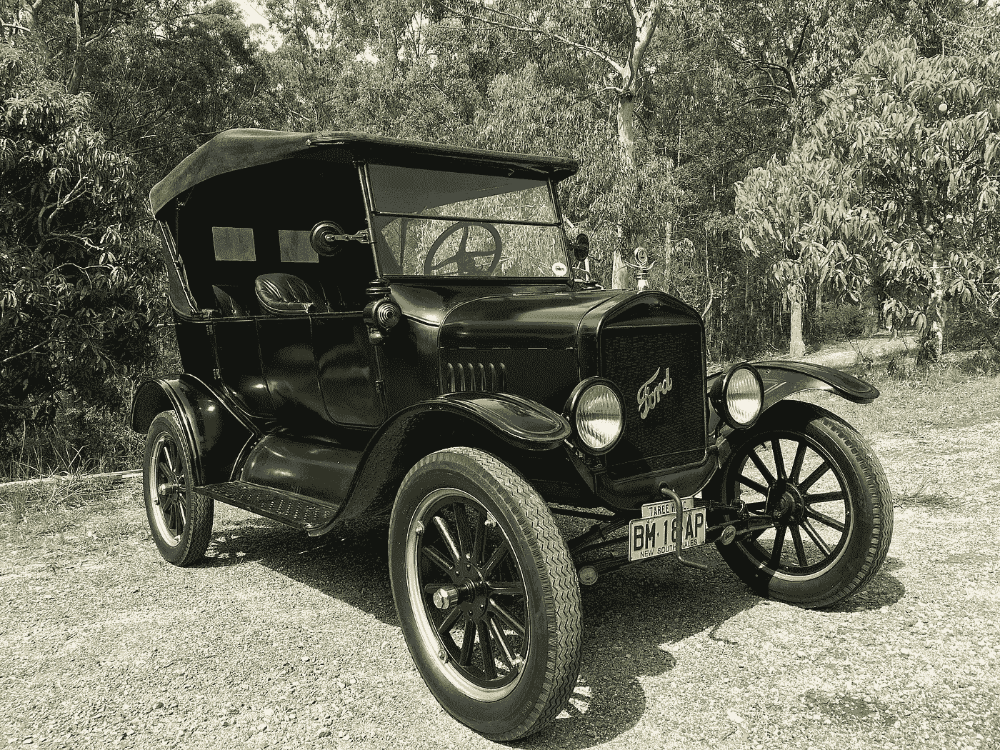

Ford Model T. Source: Wikipedia.

# 6.今天的秘密:很多学生，没有福特

以上两个提议并不相互排斥。当一个部门与另一个部门相辅相成，司机有丰富的选择时，这很好。竞争孕育创新，等等。

此外，我们理解许多声称“投资”和“收集/HODL”硬币的加密“收藏家”的抵制，他们认为这些硬币代表了 Studebakers **和** Fords 等的多样化投资组合。

> 但在我们看来，今天的 crypto 有很多 Studebakers，没有一个福特。

如果你不同意，如果你认为 crypto 有它的福特，请在下面的回复中告诉我们福特是什么。

请理解:

*   我们希望你是对的；我们想要惊喜；我们一直想了解新的候选人。
*   但如果你的 CryptoFord(不管是以太坊还是三一还是真理还是 X，Y，Z)不做上面的三步舞——(1)**键；** (2)快速**如何赚取密码**；**(3)**——你可能错了。****

****最接近福特的候选人是相对容易的[在以太坊](https://www.ethereum.org/token)创造自己的代币。但是即使这样也不能满足上面的第二和第三条标准。****

# ****7.Crypto 是一个豪华而复杂的学生助手****

****Crypto 可以继续做它正在做的事情，保持它的“健康增长”，就像 Twitter 通过不急于修复它认为“没有坏”的*来保持“健康的网络”*****

****事实上，定制客车制造商和专业机械师市场挺过了大萧条、一战和二战，以及最近的大衰退。这些服务提供商今天继续做得很好。****

> ****但是，老实说，你最后一次在路上看到斯图贝克是什么时候？****

****没错。****

****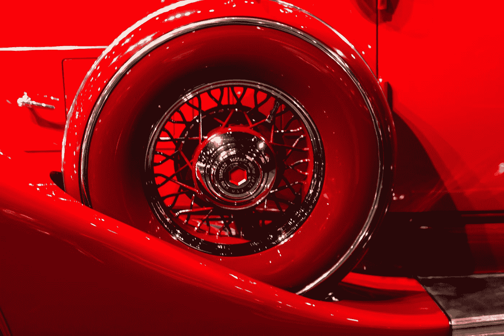****

****或者，crypto 可以意识到，尽管其采用曲线呈指数增长，但**的全球采用可以而且应该快得多**。****

# ****8.Crypto 需要识别其真正的竞争对手****

****大多数密码分析师承认，更快采用的一大障碍是缺乏一个共享的互操作性愿景，更不用说任何类似全面的内部加密互操作性标准了。****

****加密缺乏互操作性协议有许多技术原因。[但合作也存在人力和制度上的障碍](/cryptolawreview/is-stanfords-center-for-blockchain-research-legal-c1701bb0ac38)。加密是一个竞争非常激烈的领域。每个人都想利用他们认为的先发优势。****

> ****今天的内部加密小动作就像看一群朋友在激烈的*侠盗猎车手*游戏中对峙。****

****在游戏开始之前，每个人都认为他们会赢，因为他们完全控制了他们的加密手机。他们可以选择不同的皮肤，比如这个[军用迷彩包](https://www.gta5-mods.com/paintjobs/army-camo-pack-for-lamborghini-aventador)，让自己的兰博基尼 Aventador 更加“隐秘”****

********

****因为你可以对你的装备、武器和脚本进行几乎无限数量的修改，所以很容易开始相信你已经编写了管理你的比赛平台的规则。****

> ****在一天结束的时候，你可能已经赢得了一些对你朋友的战斗。但是赢得战争的人是《侠盗猎车手》的发行商。****

****从这个练习中得到的关键教训是，Crypto 最大的竞争对手不是其他加密团队；[甚至都不是 FAMGA](/@cleanapp/thank-you-for-a-great-bit-of-analysis-we-wanted-to-offer-a-few-immediate-thoughts-in-response-20ae30a078c5) 。****

****Crypto 最大的竞争对手是法律机构。Crypto 看不到这一点代表着 crypto 迄今为止错过的最大机会之一。****

# ****7.加密需要提高共同的期望****

****除了相互竞争之外，密码开发人员应该意识到他们也在与比另一群密码朋克更强大的力量竞争。****

********

> ****看到那些汽车后面跑道上的飞机了吗？****

****当谈到将人或物从 A 点运送到 B 点的速度时，制造和驾驶这些飞机的人看着#27，会想，“啊，多可爱啊。”****

> ****加密之间的竞争是正常的，但加密的采用-司机不应该只看方向盘上方和“引擎盖下”，以找出如何走得更快。****

****很多时候，能让性能提高几个数量级的突破是在完全不同的跑道上呼啸而过的。****

********

****看到它们的唯一方法是暂停假设，拓宽你的视野。****

********

# ****8.加密应该使用不同的基准****

****例如，通过参考量化基准(例如:每秒交易量)，加密竞赛者可以从远远超出通常的可比变量(“每秒加密交易量”与“每秒签证交易量”)中受益，而不是在某种绝对意义上相互竞争。****

********

****与其试图从一秒钟内挤出尽可能多的事务处理能力，不如重新思考事务的本质和结构，这样对加密开发人员更有好处。****

****这里有一个[的例子，它是针对加密的一个新的量化性能基准](/coinmonks/https-medium-com-cleanapp-the-value-of-trashhash-69e331d86374)。像这样的基准测试还有很多[。](/cryptolawreview/what-is-blockchain-hyperutility-ade850f3034d)****

# ****9.加密必须了解加密“消费者”的需求****

****今天的大型加密项目就像 B2B 操作系统:它们作为平台，其他第二层、第三层面向消费者的应用程序将在这个平台上开发。****

> ****比特币是“货币的 Unix”。以太坊是“加密的 Linux”IOTA 是机器经济的“FreeBSD”诸如此类。****

********

****这种方法给了开发团队非常需要的喘息机会，让他们从个人消费者对更高的交易速度、整体效用、更高的安全性等的需求中解脱出来。****

****但是这种方法也有缺点，即在加密操作系统的开发者和这些操作系统的最终用户之间产生了缓冲。****

> ****Crypto 应该停止在它自己的供应上变高；相反，crypto 需要了解非 crypto 人员需要 crypto 提供什么。****

****今天最大的需求领域是易于使用的应用程序，将普通人插入到加密经济中。所有的加密开发者都会从这样成功的终端用户应用中受益。所有的加密开发团队都有一个共同的责任来培育这样的最终用户应用。****

# ****10.加密平台购物是真实的****

****CleanApp 陷入 crypto 的方式和很多人了解 crypto 的方式差不多。****

> ****2015 年，我们开始为几个加密项目做法律机制，并开始就快速增长的加密项目、平台和可能性进行自我教育。****

****当我们开始看到越来越多的铃铛和哨子，那么多的 chrome，那么多的 Lambos 和 Maybachs，我们开始想知道——区块链会是[超实用](/cryptolawreview/what-is-blockchain-hyperutility-ade850f3034d) CleanApp 的关键吗？****

****反之亦然，CleanApp 是 crypto 拼命寻找的[【失踪杀手应用】](/coinmonks/https-medium-com-cleanapp-the-value-of-trashhash-69e331d86374)吗？****

****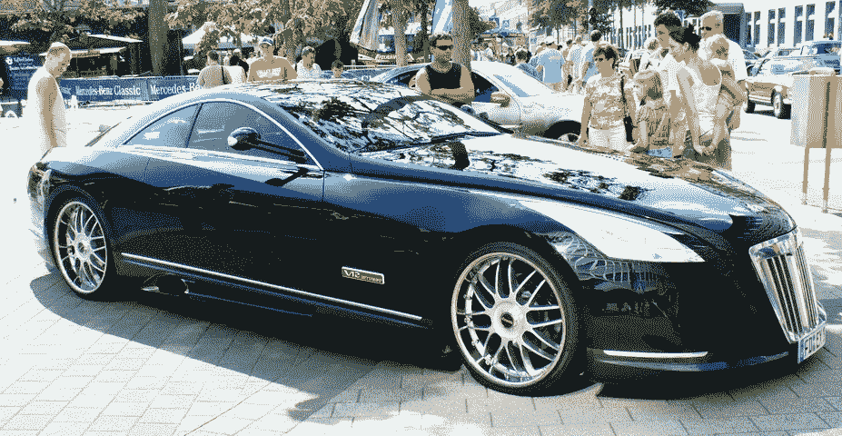****

****Maybach Exelero. [Source: Wikipedia](https://fr.wikipedia.org/wiki/Maybach_Exelero)****

****可以预见的是，我们对这两个问题的回答都是“是”——[全球废物、危险、事故报告流程将会是一套与真正的链外响应流程相集成的链上市场](https://cleanapp.io/wp-content/uploads/CleanApp.pdf)。它产生了显著的物质改善，每个人都变得更好，等等。等等。等等。****

> ****但那只是上下文。我们没有堵塞任何东西。这不是推销。是分析。这个故事的这一部分通过分享我们自己的加密平台购物经验来更好地讲述。****

****所以我们开始寻找。我们应该开始吸乙醚吗？我们该不该弄 en- [纠结](https://assets.ctfassets.net/r1dr6vzfxhev/2t4uxvsIqk0EUau6g2sw0g/45eae33637ca92f85dd9f4a3a218e1ec/iota1_4_3.pdf) -d？我们应该寻求同意吗？还是走向 [OmiseGO](https://en.wikipedia.org/wiki/OmiseGO) ？****

# ****11.加密“功能”必须成为标准****

****我们在研究早期注意到的一件事是，所有面向最终用户的加密平台都缺乏一个基本特征——**通过做对社会有益的工作来轻松获得加密的能力**。****

> ****对我们来说，对这个“特性”的需求就像汽车对安全带的需求一样明显。****

********

****作为一种小额金融形式，crypto 是激励生产对社会有益的物质服务([)的理想工具，如清扫街道、清理垃圾、公共区域维护、](/coinmonks/https-medium-com-cleanapp-the-value-of-trashhash-69e331d86374)等。)，跟踪输入，[，协调潜在的交易参与者](/cleanapp/cleanapp-whitepaper-bounty-5cbdace936d2)，并在这些底层流程上收获全局 I/O 分析的价值。****

> ****尽管像这样的应用程序有明显的价值和效用，但过去和现在都没有一个加密平台可以让这样的全球可扩展应用程序的开发变得容易。****

****以太坊很接近，但是，除了其他问题之外，以太坊的交易量/带宽限制意味着对应于实时输入的近实时回报在十亿用户规模(每天数十亿次交易)下几乎是不可能的。IOTA 似乎是一个可能的选择，目前我们正处于学习曲线中。****

> ****所以，在检查 Studebakers 和 Packards 时，我们注意到他们没有安全带，我们做了你会期望理智的人做的事情:我们向开发商索要安全带。****

****Crypto 的回应？**如果你想要安全带，那就造你自己的车吧！******

# ****12.不要将开发负担转移给用户****

****为了实现其全部潜力，密码需要继续允许超专业化。真正擅长机制设计的民间人士，需要专注于机制设计；真正擅长企业集成的人需要专注于企业集成。不是每个人都必须开发平台。****

> ****没有必要重新发明轮子。****

****但是解放开发者的唯一方法是保证他们在加密平台 Studebakers 和加密平台 Fords 之间有有意义的选择。****

****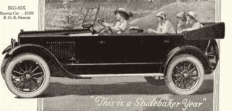****

****1920 Studebaker “Big-Six” Touring Car: **$2350******

************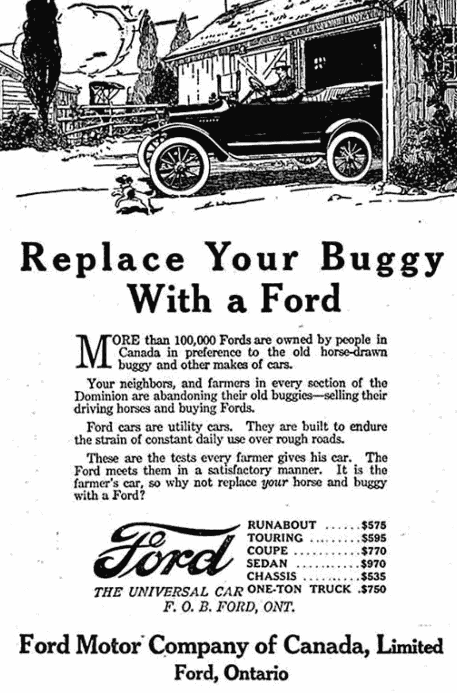****

****1920 Ford Model T: **$575******

# ****13.超效用=更高的收入****

****到 1924 年，福特已经卖出了第 10，000，000 辆汽车(相比之下，1924 年美国人口为 114，000，000)。****

****T 型车越来越便宜(1920 年为 575 美元，1924 年为 295 美元)，每个产品周期的质量都有客观的提高。****

> ****这种令人印象深刻的前所未有的增长的关键是什么？答:汽车提供了[物质超效用](/cryptolawreview/what-is-blockchain-hyperutility-ade850f3034d)。****

****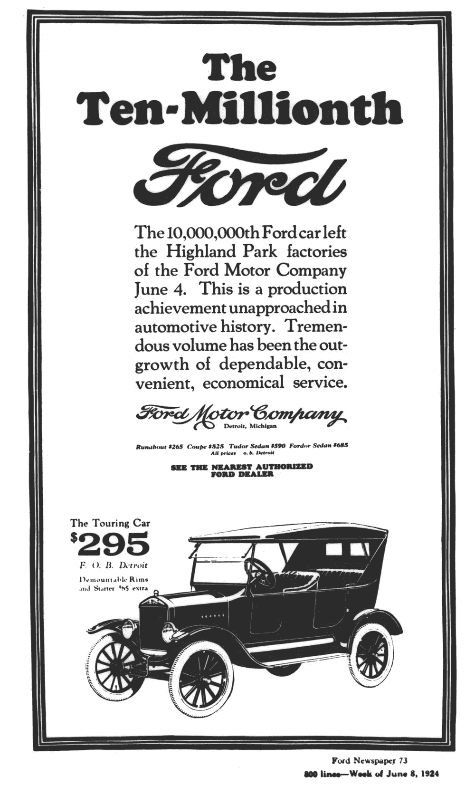****

****T 型车的主要卖点不是“经济”服务，也就是廉价的自己动手维护。****

> ****福特的一个明显卖点是购买 T 型车**会增加购买者的收入**。****

****请注意:不仅仅是“汽车”让个人生活更有效率，也让更广泛的经济效率收益成为可能。正是这一突破性的成就成就了福特 T 型车。****

****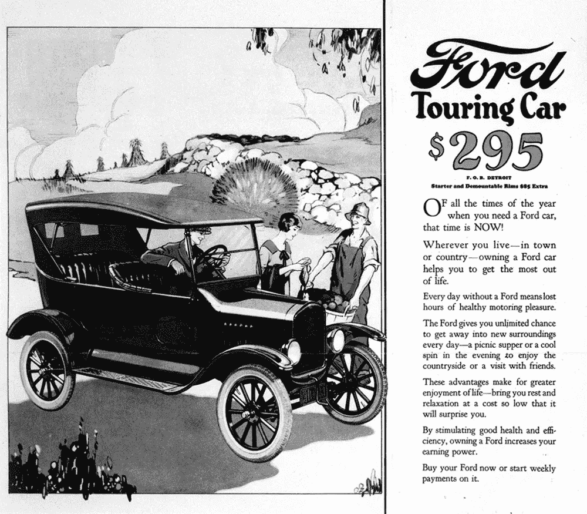****

> ****T 型车卖的是一个更健康、更有生产力、压力更小、更高效、更富裕的未来。****

# ****14.诚实面对风险和成本****

****每个超实用程序都像一把刀。它可以用来切苹果，或者切对手的轮胎。****

****在这方面，Crypto 从汽车行业得到的教训是一个对比:**什么不该做**。****

> ****从早期拆除公共交通网络的游说努力，到爆炸的福特 Pintos，再到最近的大众汽车排放丑闻，汽车业在透明度和商业诚信等道德规范上留下了一些粗糙的痕迹。****

********

****Crypto 需要承认，是的，T 型车杀了人。是的，T 型车开创了汽油时代，其后果现在对人类的生存构成了威胁。是的，T 型车引入了供应链和工厂流水线生产方式，这些方式被战士们用来制造可怕的大规模杀戮机器。****

********

****但教训不是停止制造刀具。回顾汽车行业的阴暗面，关键是要强调透明度的必要性，并向司机公开驾车的风险。****

> ****超效用应用程序可能会发现将生产成本外包给其他人更便宜。但正如人们在经济学 101 中所学到的，这些成本从来没有完全外部化。永远不会。****

****与其隐藏加密的风险和成本，不如公开加密的风险和成本。这是最小化系统风险和成本的最聪明的方法。****

# ****15.如果你建造它；他们会来的****

****分析开始时的一个关键前提是这样的:**除非新手也能使用 crypto，否则不会有值得谈论的未来 crypto**。****

> ****这意味着给新手们安全而简单的途径让*获得密码，而不是发明越来越简单的方法来购买密码*。****

****为**赚取加密**构建安全和超级有用的应用程序的加密开发者将书写 21 世纪的经济规则。****

****[ *更多分析免费提供*[*@ CryptoLawReview*](https://medium.com/cryptolawreview)]****