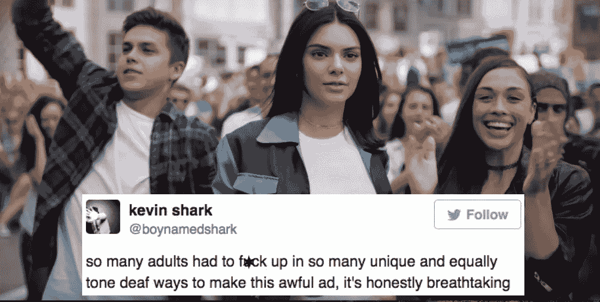

# 成名 15 分钟:如何修复创造者经济？

> 原文：<https://medium.com/hackernoon/15-minutes-of-fame-how-to-fix-creator-economy-fbcbcb10c5bd>

安迪·沃霍尔有一句名言:“在未来，每个人都会在 15 分钟内闻名世界。”现在的问题是，值得吗？

我 nstagram 在当代文化中建立了这个先例。2018 年，时尚品牌和有抱负的企业家仅仅依靠追随者和订户的参与来证明概念和推出新产品是一种常见的做法。

媒体公司正在推出融合现实与虚拟的体验:一个很好的例子是[炼油厂 29](https://medium.com/u/47057b17b8e2?source=post_page-----fbcbcb10c5bd--------------------------------) 的房间，庆祝不同流派创作者的沉浸式表演，以及洛杉矶的冰淇淋博物馆。餐馆老板肯定知道，可以拍照的室内装饰会吸引精通 Instagram 的客户。

29 Rooms in NY. Photographed by ***Lauren Spinelli for Time Out Magazine***

# 对于几乎每个平台来说，创作者都是最有价值的用户。

渴望尝试新事物，他们围绕自己独特的观点形成社区，增加社交网络的价值。流媒体平台:Youtube、Twitch 和 Patreon 通过引入不同的盈利策略来争夺创作者，从订阅到会员资格、徽章，以及帮助创作者销售商品。

[产品搜索](https://medium.com/u/b8b4445269d0?source=post_page-----fbcbcb10c5bd--------------------------------)，一个发现新产品的极客网站，最近推出了[制造商](https://blog.producthunt.com/a-new-space-for-makers-99b41e1a3444?ref=producthunt)；它有自己的解决方案，帮助各行各业的创意人员交流知识，共同创造事物。随着越来越多的小众社区开始认识到创作者的价值，一个问题出现了:

# **insta gram 这个拥有 10 亿活跃用户的平台，是怎么奖励创作者和社区影响者的？**

实际上，没有那么多。与 Twitch 和 Youtube 不同，Instagram 从来没有一个清晰透明的方式来回报他们的用户。

早期，广告公司发现了市场的空白，并充当品牌和创作者之间的中介。通过整合 Instagram 影响者的数据库，他们可以将这些影响者与那些没有时间或没有深入了解社交媒体的大品牌进行匹配。

## 杰夫·贾维斯最近在《大西洋月刊》上写道，“互联网的本质价值是对话，而不是内容”。

影响者的角色是开始对话，而不仅仅是产生内容。品牌渴望大量的真实性，这在一定程度上推动了[在中等影响者(拥有数千粉丝的人)中广泛使用机器人](https://digiday.com/marketing/wannabe-instagram-influencers-use-bots-appear-popular/)。随着观众越来越精明地发现直接赞助和无视文化的广告，许多这些交易适得其反。

The infamous Kendall Jenner ad

为了寻找替代方案，许多创意人员转向了新兴平台。也许你还记得 [Ello](/swlh/goodbye-instagram-hello-ello-45df3d8754ec) ，这款应用旨在根据创意人员的工作质量而不是 Instagram 上的赞数或人为增加的粉丝数来奖励他们。或者最近基于订阅的应用程序 [Vero](https://medium.com/u/70c16547a418?source=post_page-----fbcbcb10c5bd--------------------------------) 的重生，它承诺基于密友的推荐提供更真实的体验。

有一段时间，在媒体关注的推动下，这些应用程序获得了发展势头，它们渴望发现能够真正替代大公司 Instagram 和脸书的新产品。**然而，随着媒体炒作的结束，这些应用失去了吸引力和足够数量的追随者。**

# 创作者 vs 品牌权力之战

创作者发布他们非常关心的话题。

正如《时尚商业》所报道的，想要与品牌建立直接和真实关系的有影响力的人，在没有中介如代理的情况下，必须准备一场漫长的游戏。品牌希望他们在没有金钱回报的情况下参加活动、时装秀和穿衣服。对于微观影响者(拥有数千而非数百万的追随者)，情况更复杂。大品牌仍然希望他们进行无偿促销，并给予奖励，如地位评估和很少的礼物。

via @veronikaheibrunner

“我不能用一个包交税，”Veronika Heilbrunnerm 说，她是一个有影响力的人，拥有 15 万 Instagram 粉丝，并与顶级时尚品牌合作。尽管越来越多的人转向内容制作，期望获得金钱回报，但没有透明的平台来管理品牌与创意之间的直接关系。

# 智能品牌与客户合作

幸运的是，精通技术的品牌开始认识到客户的力量，并将他们纳入营销活动，而不是影响者。

快速成长的千禧美妆品牌 [Glossier](https://medium.com/u/873bb15eb0b8?source=post_page-----fbcbcb10c5bd--------------------------------) 的创始人艾米丽·韦斯说:“每个单身女性都是有影响力的人，这个想法非常激励我们。该品牌已经建立了一个具有代表性的计划，有超过 1000 名客户发布、撰写评论，当人们通过他们的个性化页面购买产品时，他们会收到货币佣金和产品信用的组合。

Each of the representatives gets a custom page

**用户对个性化和诚实的广告反应最好，就像朋友的推荐一样。**据报道， **Glossier 的**增长的 80%来自点对点推荐。这种趋势开始被大品牌认可。梅西百货公司的新营销策略虽然减少了促销活动，但让员工通过社交媒体渠道与客户交流。内容策略包括 Instagram 收购、顾问和产品概述。

# 杂志:奖励创作者的作品

到 2020 年，影响者营销预计将成为价值 50-100 亿美元的产业。因此，创造者的力量只会继续增长。

在 Round，我们认为应该有一个更好的地方，让创作者讲述他们的故事，加入社区，并与品牌建立持久的合作关系。**这就是我们创建杂志——基于兴趣的媒体空间的原因。**

你可以把它想象成一家数字出版社，它优先考虑创作者和板载品牌，以及分享他们价值观并渴望直接支持他们工作的小众媒体。

## 我们的价值观:

🎨没有广告和赞助的职位；

🎨按时间顺序馈送；

🎨没有粗略的商业档案或机器人；

🎨直接奖励和透明度

我们希望鼓励品牌以有意义的方式支持创作者，而不是仅仅在广告上砸钱而没有可衡量的结果。

我们的第一份杂志致力于女性表演者，并以不同流派的新兴艺术家为特色，从流行到摇滚和爵士乐，所有这些艺术家都在纽约工作和表演。在每份杂志中，我们的目标是为他们匹配志同道合的品牌和媒体，他们渴望支持他们的创意:帮助组织开幕式，赞助一个研究项目等。

👉我们邀请创作者和他们的粉丝成为 Dash 的一部分。留下您的电子邮件地址以获得邀请:[https://www.producthunt.com/upcoming/dash-by-round](https://www.producthunt.com/upcoming/dash-by-round)