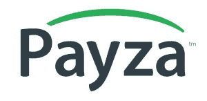

# 15 种最受欢迎的支付网关解决方案

> 原文：<https://medium.com/hackernoon/15-most-popular-payment-gateway-solutions-ad49342298b9>

支付网关是一种授权支付电子商务、网上零售、实体商业等的应用程序。它实际上相当于许多零售店中设立的物理销售点。

它加密机密信息，如信用卡和借记卡号码，以确保在客户和商家之间传递的数据是机密和安全的。

# 支付网关是如何工作的？

客户在网站或手机上下订单时，只需按下提交按钮或等效按钮即可到达支付网关，并在指定的空白处输入卡的详细信息。

客户的 web 浏览器对要在浏览器和 web 服务器之间发送的详细信息进行加密。这将通过 SSL(安全套接字层)加密技术来完成。然后，交易细节由商家转发到他们的支付网关。

然后，支付网关将交易信息转发给商户收单银行的支付处理器。处理器再次将交易细节转发给卡协会(如万事达卡、维萨卡)。发卡银行接收授权请求，并用响应代码提示处理器。

该响应由支付网关接收，并将该响应发送到网站，在该网站，该响应作为持续响应被启动，然后被转发回持卡人和商家。整个过程需要 2-3 秒来完成。所有批准的授权都由商家以批的形式提交给他们的注册银行，以启动结算过程。

最后，获得批准的资金将由收单银行存入商户的注册账户。

# 选择支付网关需要考虑什么？

作为一个[组织](https://www.vtnetzwelt.com/about-us/)，你的选择可以是根据客户在你的网站上的体验，通过现金流来进行网上销售。

在选择支付网关之前，需要考虑以下四个关键点:

*   **安全**

安全应该是您的首要任务。确保它至少应与 3D secure 集成，并符合 PCI 数据安全标准(PCI DSS)。

*   **支付时间**

把钱存入你的银行账户应该会花更少的时间。整合前检查支出是如何进行的？无论是每周一次还是每两周一次。

*   **网站集成的便利性**

在您签名之前，请确保集成是简单的，或者它可以轻松地为您的平台开发定制的解决方案。

*   **多币种**

如果您的客户也来自国外或使用不同的货币，那么您的支付网关应该处理跨货币、地区、平台和替代支付解决方案的支付。

# 15 种最受欢迎的支付网关解决方案

# 1.贝宝

PayPal 成立于 1998 年 12 月，目前在全球 200 多个市场提供服务。目前，它在包括 Braintree、Venmo 和 Xoom 在内几个平台上拥有超过 2.37 亿的活跃账户持有人。

Paypal 允许商家和消费者以 100 多种货币进行交易，资金可以以 56 种货币提取，并在他们的 Paypal 注册账户中保留 25 种货币的余额。

Paypal 服务于 200 多个市场，在不同的国家有不同的定价模式。2017 年交易量达到 76 亿笔。

# 2.亚马逊支付

[Amazon Pay](https://pay.amazon.com/) 是亚马逊旗下的在线支付处理服务。这项服务于 2007 年推出。

十年后的今天，它已经在 8 个国家提供服务。亚马逊支付专为希望为买家提供顺畅购物体验的在线零售商和卖家而设计。

亚马逊按照基于交易和基于边界的方式收费。国内处理费为 2.9%，授权费为 0.30 美元+税，跨境处理费为 3.9%，与授权费相同。

A-Z 担保和保护计划。众所周知，亚马逊在信息安全方面实施了非常严格的协议。它的系统拥有引以为豪的安全设置，还包括欺诈检测和商户保护。

# 3.阿德延

[Adyen](https://www.adyen.com/) 是一个流行的开源支付解决方案，其基础设施符合安全性、完整性和稳定性的最高标准。

同时，该平台的冗余和无状态面向服务的架构(SOA)确保了最大限度的正常运行时间，并使用户能够在几个物理托管位置接受支付。

Adyen 拥有 5000 多名客户，是一家私人控股公司。Adyen 收取的处理费为 0.12 美元，支付方式费在美国为 0.25 美元。不同的卡，不同的国家有不同的收费。

Adyen 使用丰富的数据来增加收入，并提供全方位的移动支付功能，使您的服务更具吸引力。其中包括所有主要的卡方案和移动钱包，如 Apple Pay 和 Android Pay。

# 4.斯克里尔

Skrill 是一个相对较新但非常成功的英国支付服务，专为企业和个人设计。使用它，无论您身在何处，您都可以进行国际交易并支付产品和服务的费用，而且只需使用带有专用应用程序的移动设备即可。

Skrill 支持多种支付交易选项，如信用卡、现金和电子邮件交易。你所需要做的就是在网上注册并利用这些服务。

目前，Skrill 支持 30 多种不同的货币，可以在全球范围内为您的产品和服务找到目标买家。

# 5.种类

[Stripe](https://stripe.com/) 旨在方便重复计费，同时支持和处理在线资金交易，为任何企业提供功能齐全的财务管理工具。

它也属于一个流行的生产力软件家族，并带有一套开放的 API 来帮助您将其连接到您的商业生态系统的其余部分。

条带订阅将您的所有客户信息保存在文件中，使您可以轻松续订订阅或升级会员计划，而不必担心是否符合 PCI 标准和政策。

借助 Stripe 的开放式 API，您可以与领先的市场和第三方软件建立强大的联系，接触新的受众，并最大限度地实现更新。

Stripe 还可以让你在计划中建立和整合试用期，或者提供优惠券来帮助你设计和完善你的策略。

# 6.帕尤

[PayU](https://corporate.payu.com/) 是一家印度支付处理公司的产品，是最简单的支付解决方案之一，旨在填补复杂服务提供商留下的空白。

专家社区也喜欢 PayU，因为它的最佳转换率(广受好评的 12%)，接受超过 45 种支付方式(网上银行，8+银行 EMI 的，6 钱包，美国运通，Rupay，国际卡)，以及 PayuBiz 的 API 和 SDK，这些有助于将该平台连接到任何网站，应用程序或相关的第三方系统。

PayU 提供了一个单一的集成解决方案，允许用户在其运营的所有地点开始接收本地付款。国际商家可以将其作为支付服务提供商，并开始在所有 16 个市场接收支付，潜在消费者超过 22 亿。

PayU 提供 250 多种本地支付方式和多种货币选项，允许其用户联系所有客户，即使是没有信用卡的客户，并能够管理当地市场的复杂性，同时从中受益。

# 7.2 结账

[2CheckOut](https://www.2checkout.com/) 是另一个功能齐全的支付处理解决方案，出现在所有类似的顶级列表和分类中。

原因并不缺乏，因为著名的美国网关使商家能够接受来自世界各地买家的移动和在线支付，而不用担心延迟和安全性。

在上市的 16 年中，2CheckOut 服务了 5 万多家商户，建立了 300 多项独特的防欺诈规则，并达到了 1 级 PCI 合规性。它支持 8 种不同的支付类型、87 种不同的货币、15 种语言，并在 200 多个全球市场运营。

由于该平台的支付卡行业(PCI)数据安全标准，在 2Checkout 中输入的任何交易都保证是安全的。

# 8.授权。网

【Authorize.Net】T2 的零售和服务环境最需要一个灵活的网关解决方案，像他们的订单管理实践一样工作。

它的开发是为了帮助商家在本地和在线商店销售更多产品，这就是它如何覆盖全职员工的工作，存储和组织数据，并帮助您打击欺诈，而无需不断检查和审查。

该平台的客户信息管理器(CIM)使用户能够在 Authorize 上标记和存储其客户的敏感支付信息。

对于支票支付，Authorize.Net 提供了一种独家的、完全集成的电子支票支付方法，直接通过用户的网站或 Authorize.Net 虚拟终端接受和处理来自银行账户的支付。

# 9.佩扎

[Payza](https://www.payza.eu/) 是世界上最快、最简单的在线转账解决方案之一，专为私人和专业用途而设计。

您可以使用它在全球范围内发送和接收付款，实现移动设备的安全转账，并为客户的支付数据提供强大的保护。

Payza 现在包括广泛的比特币和 Altcoin 服务。这意味着成员可以在法定货币之间交换、添加、提取和发送比特币；而且 Payza 卡的所有者可以使用 Altcoin 添加的资金来加载预付卡，并将 Altcoin 转换为美元，可以在网上、商店或从大多数 ATM 机中提取。

目前，Payza 支持 25 种货币，它可以实现便捷的交易。这项服务现在为全球超过 1500 万用户提供服务，而且这个数字还在继续增长。

# 10.安全支付

对于那些希望提高转化率和交叉销售的人来说，SecurionPay 是一个非常值得推荐的系统。

基本上，SecurionPay 是市场上最可靠的支付解决方案之一，因为它旨在通过提供快速、简单和直接的交易方式来提高转化率。

简单的支付表单以及记住用户和他/她的卡细节的选项允许快速支付过程。

它还配备了各种安全功能，以保护用户免受黑客和其他在线攻击。

# 11.BlueSnap

[BlueSnap](https://home.bluesnap.com/) 支持电子商务、移动和网站开发支付，以及面向商家和零售商的专用支付处理器。

这意味着您可以将它与所有领先的市场和购物车平台集成，实现直接支付，或者利用它为 SaaS、发票游戏等构建独特的桌面和移动应用程序。

该系统支持 110 种支付类型，100 种货币和 29 种不同的语言。它在 180 个国家全面运行，并自动连接到收单银行的全球网络(一体化支付平台)，以确保每个用户的最佳转换率。

# 12.比特币支付

[BitPay](https://bitpay.com/) 在实现此类支付的网关中拥有独特的领先地位，是一种全新支付处理方法的创始人和支持者。

如果你属于越来越多的接受比特币支付的企业，你绝对应该看一看。

虽然大多数支持信用卡的交易处理系统征收 2%至 3 %的费率和费用，但 BitPay 将所有用户的费率降至固定的 1%。

# 13.SagePay

为了保持领先地位， [SagePay](https://www.sagepay.co.uk/) 采用了独特的面对面支付方法(移动、无线和非接触式)来补充一系列在线支付工具、发票支付和电话支付工具。

所有支付页面都可以定制和定制，以符合品牌规范，并受到高级防欺诈机制的保护，无需额外费用。

资金通常会在 2 个工作日内转入银行账户，数据会自动保存，以便在您的其他 Sage 账户上分发。

凭借超过 15 年的积极市场参与，这家曾经规模很小的英国初创公司成长为世界上最可靠的支付和金融处理服务提供商之一。

# 14.布伦特里

通过 [Braintree 的](https://www.braintreepayments.com/)集成，用户可以进入覆盖 40 多个国家和 130 多种货币的全球市场，同时享受结算和欺诈保护等其他好处。

使用 Braintree 的嵌入式用户界面，用户几乎可以在下一个好主意出现的同时开始接受支付。这个 UI 是一个时髦的现成的支付 UI，可以在应用程序或网站中接受卡甚至 PayPal。

# 15.红衣主教商务

有了 [CardinalCommerce](https://www.cardinalcommerce.com/) ，商家和金融机构可以通过其基本的消费者身份验证完全控制他们的身份验证策略。其身份认证功能可增加销售额和利润，并有助于提升整体消费者体验。

CardinalCommerce 最出名的是其通用钱包，该功能通过单一集成提供对多个数字钱包的访问，如 PayPal、亚马逊支付、万事达卡 MasterPass 和 Visa Checkout。

# 结论

通过选择一个具有强大 API 的，你可以定制一个支付表单来很好地配合你的网站的外观和感觉，并在你的网站上接受支付。

无需将客户重定向到外部网站进行支付。你的客户可以随时随地在他们想要的任何设备上支付(如果你找到一个在移动设备上也能很好工作的支付网关)。

此外，具有透明定价和额外功能的支付网关，如“记住我”选项、交叉销售、一键支付、重复支付等，对您的转化率和销售数量有积极影响。

# VT Netzwelt 如何帮助您？

选择您喜欢的支付网关，简化接收付款的过程，剩下的交给我们。

凭借十年的经验，我们提供端到端解决方案，实现支付与您的商店的无缝集成。

此外，我们是全球为数不多的 [Magento 开发公司](https://www.vtnetzwelt.com/services/magento-development-company/)之一，在一个团队中提供 Magento 认证开发人员、认证开发人员 Plus、认证解决方案专家和认证前端开发人员的技能。

在打造您的 Magento 商店时，我们不仅仅是满足您的需求:我们对您未被注意到的问题和痛点负责。

有兴趣了解更多。[向我们的 Magento 专家请求回电](https://www.vtnetzwelt.com/contact-us/)。