# Ionic 应用开发者必备的 15 种资源

> 原文：<https://medium.com/hackernoon/15-must-have-resources-for-ionic-app-developers-b97b14e36413>

无论你是专业人士还是业余爱好者，在网络上寻找合适的资源来构建 Ionic 应用程序可能会非常耗时，更不用说令人沮丧了。在移动应用程序领域，信息和内容很快就会过时，这就是为什么保持更新至关重要。

从教程到播客，这个列表涵盖了你所有的 Ionic 应用需求。

# 离子代码示例:

# [密码笔](https://codepen.io/)

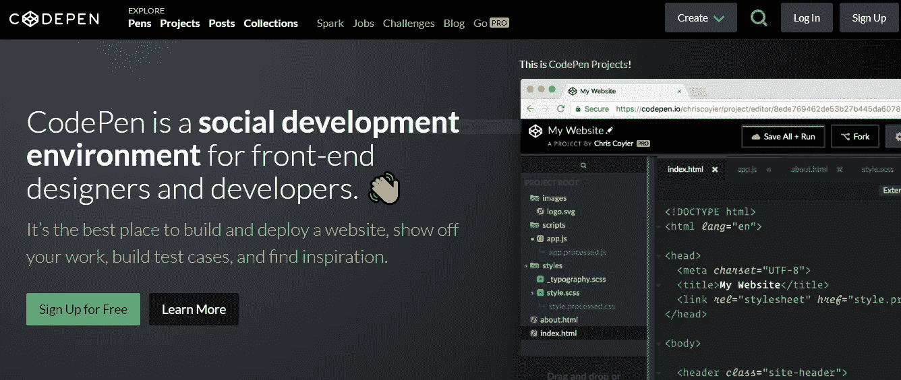

谁说开发者没有社会性，谁就错了。这个社区是为开发人员和前端设计人员创建的，用于共享、搜索、创建和展示他们的工作。重点是 HTML、CSS 和 JavaScript，当你在浏览器中编写代码时，你可以看到代码的结果。

# [JSFiddle](https://jsfiddle.net/)

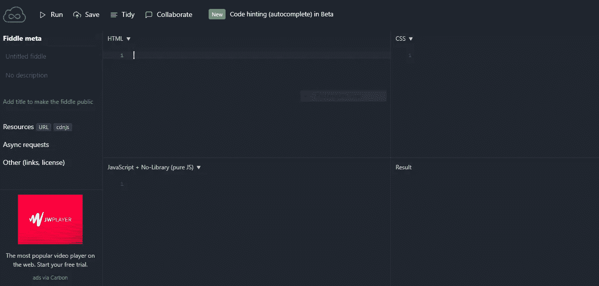

更简单，更少“社交”，这是一个简单明了的网站(主页是你写代码的地方——没有任何技巧或奢侈),同样专注于 HTML、CSS 和 JavaScript。运行您的代码，保存它，甚至在您正在构建的任何项目中与其他人协作。

# [JSbin](http://jsbin.com/?html,output)

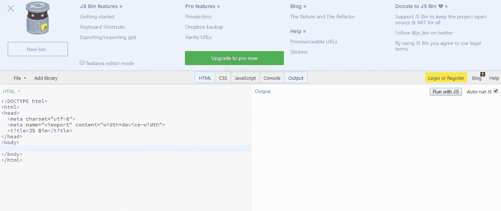

这是一个很好的实验和动手学习的工具。这是一个代码共享网站，它的重点有两个:教授 web 语言如何工作，以及复制导致问题的错误。

# 离子教程:

# [Udemy](https://www.udemy.com/)

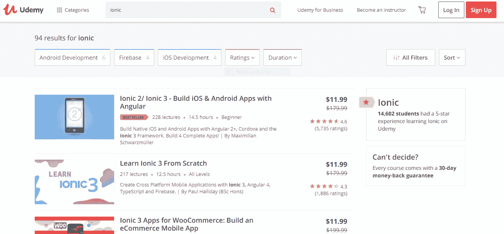

你可能知道，Udemy 是一个基于视频的学习中心，有很多关于技术和编码的课程，包括 Ionic app。Ionic 的一些最佳资源包括关于 Ionic 4 的[速成课程和 Heartstone API & Angular](https://www.udemy.com/ionic-4-crash-course-with-heartstone-api-angular/?ranMID=39197&ranEAID=Fh5UMknfYAU&ranSiteID=Fh5UMknfYAU-NA6wXHhpWTiK8nerVH_P_g&siteID=Fh5UMknfYAU-NA6wXHhpWTiK8nerVH_P_g&LSNPUBID=Fh5UMknfYAU) ，Ionic 3 的 WooCommerce 应用(用于构建电子商务应用)，以及[学习如何设计 Ionic 应用](https://www.udemy.com/design-ionic-apps/?ranMID=39197&ranEAID=Fh5UMknfYAU&ranSiteID=Fh5UMknfYAU-7cQDIuAODcNXDkAK0paXUQ&siteID=Fh5UMknfYAU-7cQDIuAODcNXDkAK0paXUQ&LSNPUBID=Fh5UMknfYAU)。

# [GitHub 离子教程](https://ccoenraets.github.io/ionic-tutorial/)

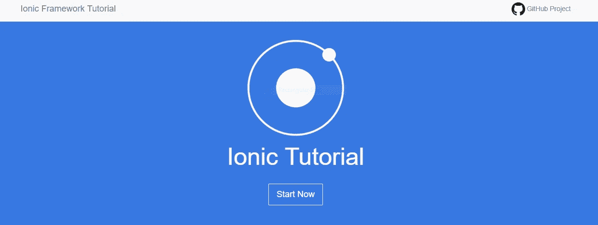

这是 GitHub 提供的关于构建 Ionic 应用程序的详细教程的一站式商店。它简明而全面，尽管对于初学者来说，它假设你已经掌握了 HTML 和 JavaScript 的工作知识。

# 书呆子

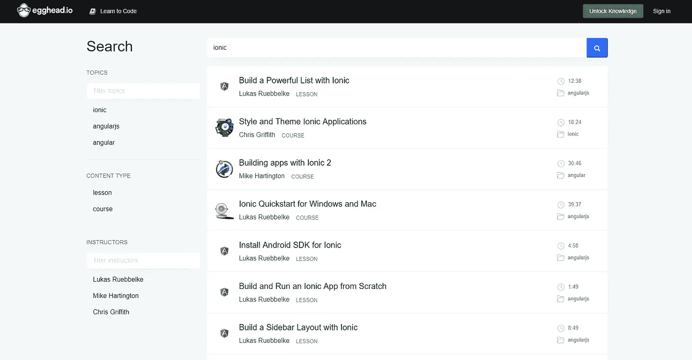

egghead 是通过视频教程学习的顶级网站之一，它提供了一系列广泛的课程，这些课程不会浪费时间——它们直截了当地告诉你你需要学习的细节(让你尽快回到编码)。Egghead 完全面向开发人员。

# 离子故障排除:

# [堆栈溢出](https://stackoverflow.com/)

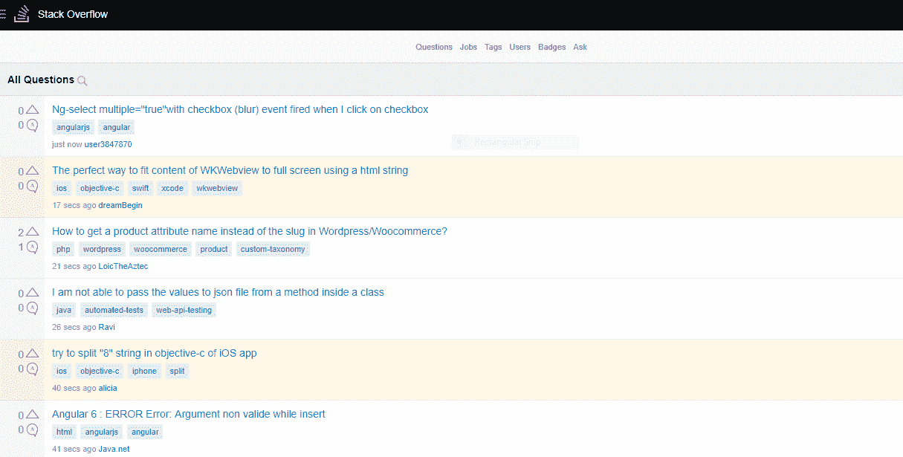

primo 开发人员在线社区，在这里您可以提问、回答、分享信息和知识，以及搜索工作。问题和答案的范围从基础到深入和高水平，所以可以肯定的是，你会在 Ionic app building 上找到你正在寻找的任何材料。

# [GitHub](https://github.com/)

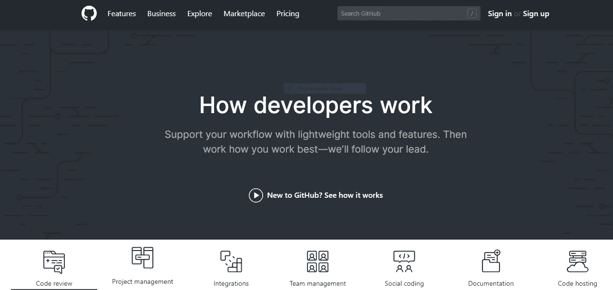

作为管理项目和开发团队的优秀工具，GitHub 是共享和审查代码、跟踪过去和当前项目以及整个团队沟通的关键。

# 爱奥尼亚社区:

# Reddit

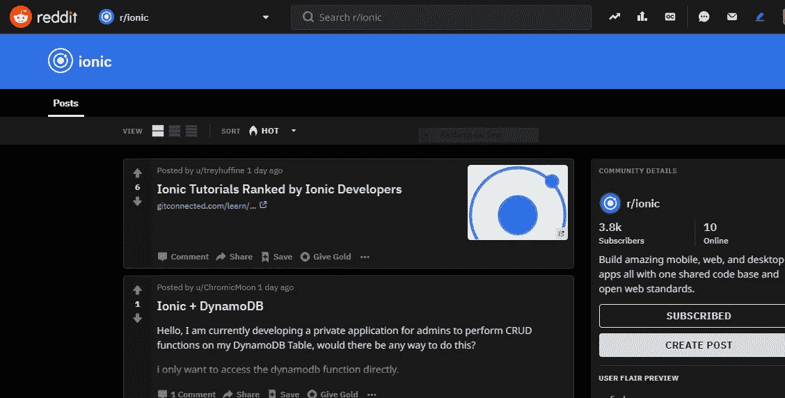

Reddit 作为一个整体并不是什么新东西，但这三个子网站可能是。它们对于寻找新资源非常有用，对于在 Ionic 应用社区中提问/回答问题也非常有用。

[**r/ion**](https://www.reddit.com/r/ionic/)

[**r/gamedev**](https://www.reddit.com/r/gamedev/)

[**r/javascript**](https://www.reddit.com/r/javascript/)

# 会议:

# [离子框架](https://www.meetup.com/topics/ionic-framework/)

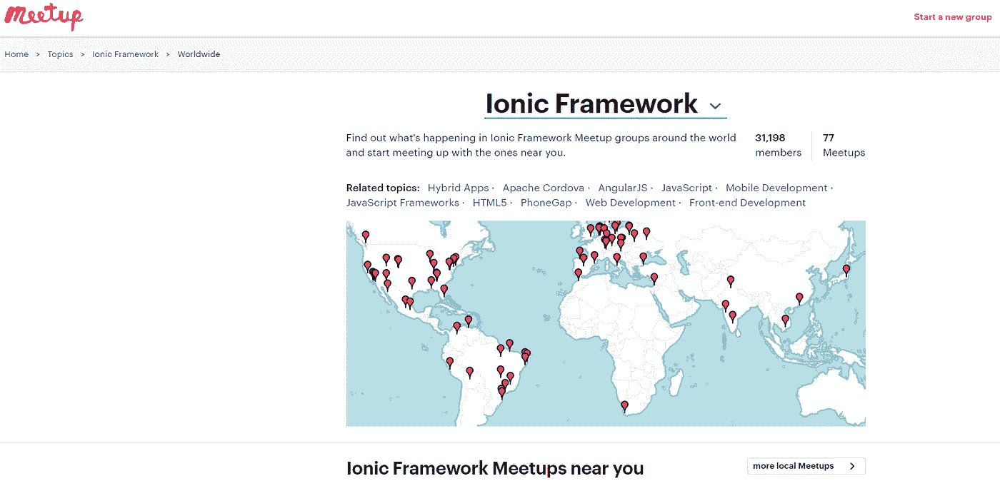

您搜索世界各地所有离子会议的登陆点。加入香港的开发者伙伴，学习一些代码，或者前往巴塞罗纳参加 [AngularBeers](https://www.meetup.com/AngularJS-Beers/) 。基于位置进行搜索，甚至查看你周围发生的事情(以及相关主题)。

# 博客:

# [中等](/)

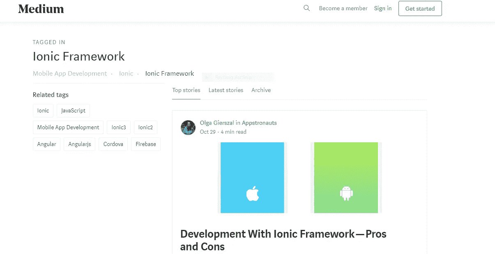

媒介不仅仅是作家和有创造力的人的专利。有大量关于技术和开发相关主题的文章，其中许多都充满了深刻的见解、数据和视觉效果。看一看 [Ionic 与 React Native](/react-id/ionic-framework-hybrid-app-vs-react-native-4facdd93f690) 之间的比较，或者[改变第三方角度组件的行为](https://blog.angularindepth.com/changing-the-behavior-of-a-3rd-party-angular-component-91f84fb9af28)。

# [黑客正午](https://hackernoon.com/)

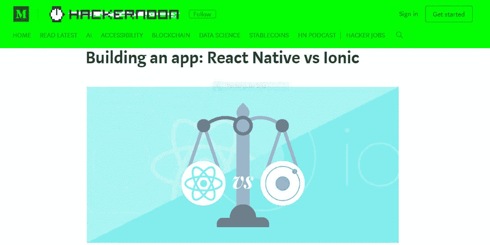

作为一份值得特别关注的媒体出版物， [Hackernoon](https://medium.com/u/4a8a924edf41?source=post_page-----b97b14e36413--------------------------------) 专门刊登关于软件的文章——汇集了各种背景类型的文章作者，在一个干净的地方，你可以很容易地找到与你的 Ionic 应用程序相关的一切。他们还有一份频繁的、有见地的时事通讯。

# [离子博客](https://blog.ionicframework.com/)

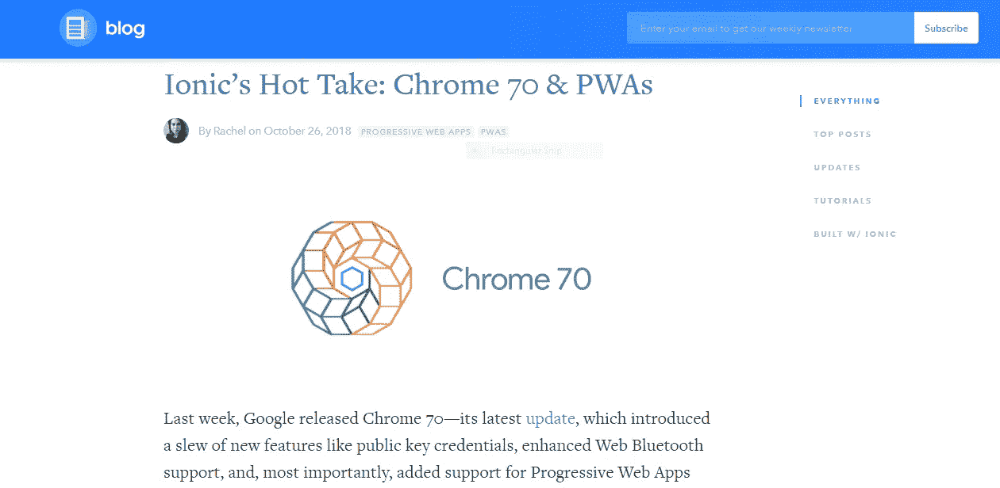

爱奥尼亚官方网站的官方博客。在这里你可以找到 Ionic 对行业实践、新闻、框架的看法，以及对使用 Ionic 的应用的研究。

# 播客:

[**下注网络**](https://blog.ionicframework.com/announcing-ionics-new-podcast-bet-on-the-web/)

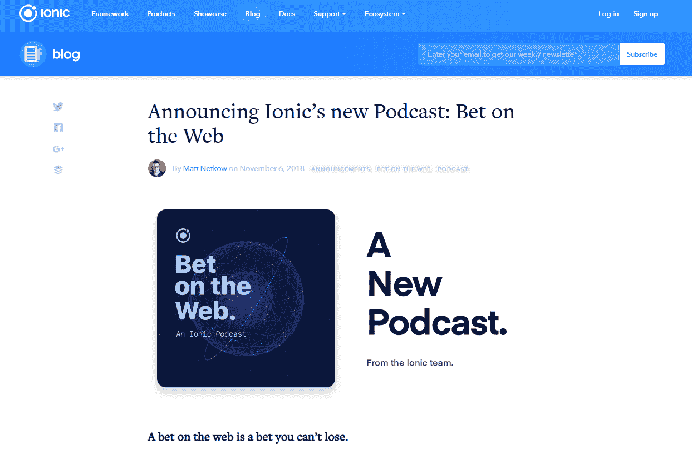

这个全新的播客包括访谈、跨平台混合开发介绍以及关于混合与原生的常见问题。而且这还只是前三集。每集从 17 分钟到 41 分钟不等，所以根据你的时间有很多种选择。很快还会有一个动作丰富的管道，包括企业架构、前端安全和更多最好的 Ionic 相关主题。

# [离子显示](https://itunes.apple.com/gb/podcast/the-ionic-show/id1075949378?mt=2)

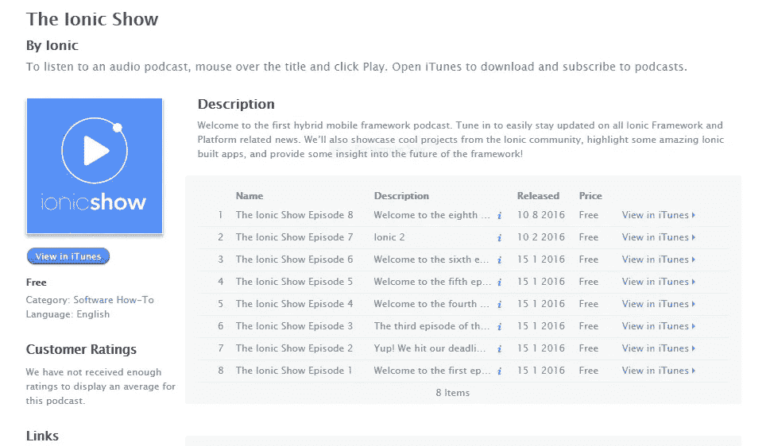

关于 Ionic 软件的 8 集免费播客。这不是无聊的内容，但它很轻松，容易听，涵盖了像 Ionic 1.0 和 2.0 这样的主题，也有嘉宾发言人。此外，他们提供了播客的完整时间表报告，包括提到的每个链接。

# 准备，就位，开始

对于所有 Ionic 应用程序开发人员(现有的和有抱负的):我们预计这个列表已经为您提供了一些构建应用程序的可靠资源，并将开始寻找更多针对你们每个人的资源。

看看 [Ionic 开发者如何使用 Appsee](https://www.appsee.com/docs/ios/ionic?cpnid=701b0000000Wd7c&utm_source=medium&utm_medium=link&utm_campaign=15_ionic_resources&utm_content=ionic) 来改进他们的移动应用。

