# 在线商店应该使用的 15 个 Shopify 主题

> 原文：<https://medium.com/hackernoon/15-shopify-themes-you-should-use-for-online-store-33b34f6bdd9>

我相信，Shopify 是经营网上商店的最佳选择之一。这是一个被许多在线商家成功使用的电子商务工具。所以今天，我决定把这篇文章献给[高级购物主题](https://www.templatemonster.com/shopify-themes.php?aff=hackernoon)。赶快在电子商务市场获得一席之地吧——从这个集合中选择一个模板，在 Shopify 上创建您的企业！

# 建筑材料响应 Shopify 主题

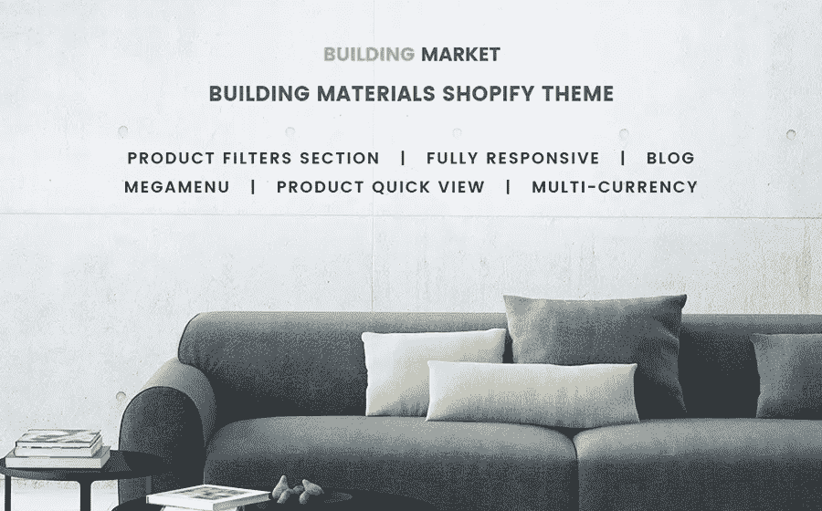

[**细节**](https://www.templatemonster.com/shopify-themes/building-materials-responsive-shopify-theme-64828.html?aff=hackernoon)

这是销售建筑材料或家具的优质设计的一个很好的例子。该模板在任何设备上都可以很好地工作。有大量的字体图标和谷歌字体。

主要特点:

*   高级主题选项；
*   替代模块布局；
*   评论系统；
*   跨浏览器兼容性；
*   下拉菜单；
*   专业的 24/7 支持。

# Neha —多功能购物主题

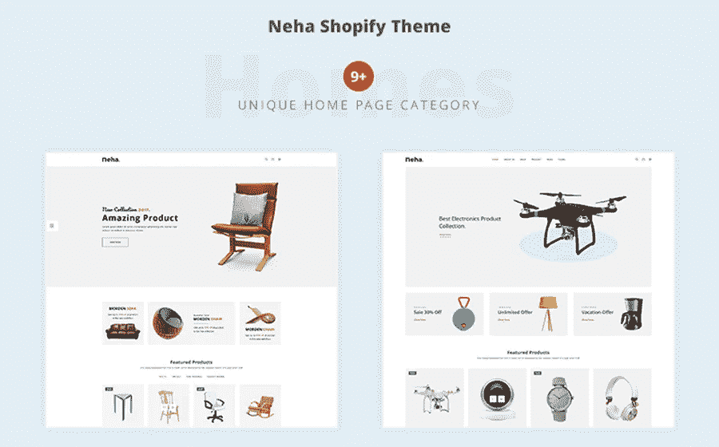

[**详细信息**](https://www.templatemonster.com/shopify-themes/neha-multipurpose-shopify-theme-67888.html?aff=hackernoon)

N aha 是一个融合了现代性和多功能性的 Shopify 模板。你一定会喜欢 9 个以上创意设计的主页。干净的代码和独特的设计。

主要特点:

*   主题颜色选项；
*   自举；
*   带有图像的大菜单；
*   Ajax Cart
*   内置愿望清单；
*   10+页脚部件；
*   谷歌分析；
*   短码。

# 东西—家具购物主题

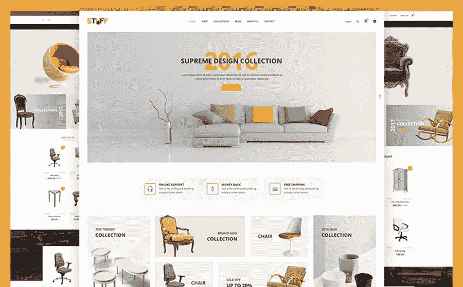

[**详细信息**](https://www.templatemonster.com/shopify-themes/stuff-furniture-shopify-theme-70198.html?aff=hackernoon)

每个主题元素都可以在任何设备上正确显示。所有这些都由高度的搜索引擎优化来补充。因此，您的商店将能够在搜索结果中获得最高的位置。

其他功能:

*   Ajax
*   自举；
*   3+独特的滑块；
*   产品和集合分类；
*   谷歌分析；
*   多个横幅；
*   产品和集合分类；
*   易于安装。

# 多功能购物主题

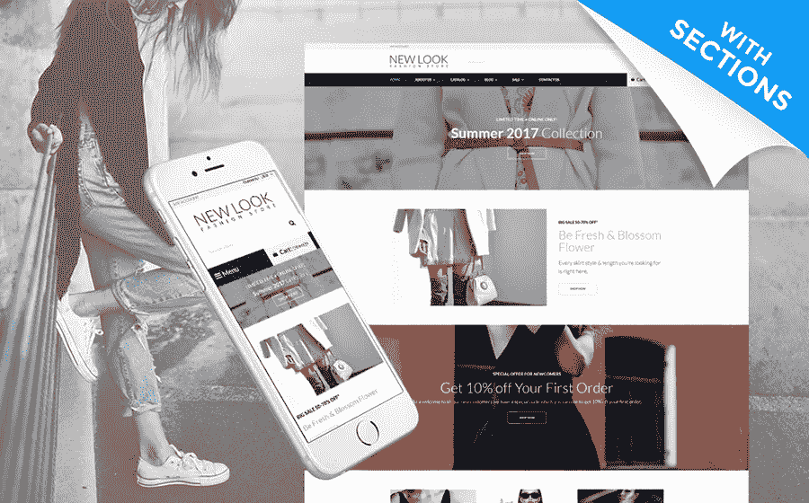

[**细节**](https://www.templatemonster.com/shopify-themes/web-development-responsive-shopify-theme-63842.html?aff=hackernoon)

该模板绝对适用于任何类型的在线商务。有七个独特的网站设计选项和许多不同类型的页眉、页脚和菜单布局。

附加功能:

*   评论系统；
*   自举；
*   排序选项；
*   有效的语义编码；
*   跨浏览器兼容性；
*   谷歌地图；
*   社交选项；
*   工具提示。

# 旧单位。—古董店 Shopify 主题

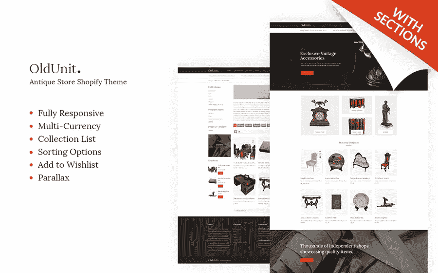

[**详情**](https://www.templatemonster.com/shopify-themes/oldunit-antique-store-shopify-theme-66976.html?aff=hackernoon)

这是你的古董店最方便的响应主题。由框架 Bootstrap 3 提供支持，它有一个基于 HTML 5 的现代代码。平滑滚动和快速加载。

您可以在下面看到的其他功能:

*   下拉菜单；
*   谷歌网络字体；
*   社交选项；
*   语言支持；
*   预订表格；
*   订阅时事通讯。

# 烟草商店 Shopify 主题

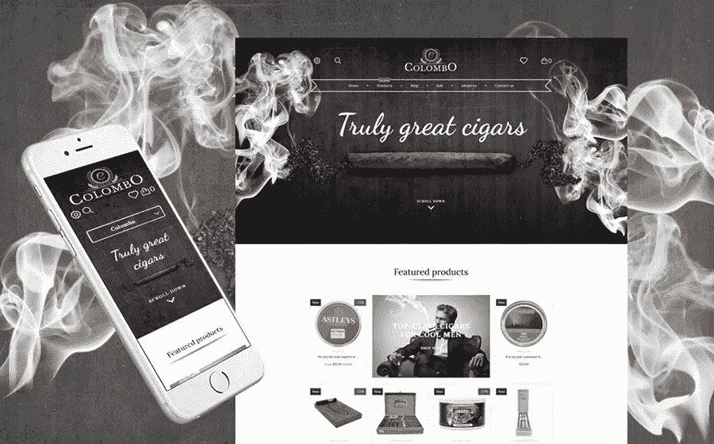

[**细节**](https://www.templatemonster.com/shopify-themes/tobacco-responsive-shopify-theme-62199.html?aff=hackernoon)

烟草商店，像这篇评论中的许多其他 Shopify 模板一样，有一个干净和响应的设计。得益于此，你的网上商店在任何屏幕上都将看起来非常酷和自信。代码是结合当前 web 开发的趋势编写的。

主要特点:

*   替代模块布局；
*   评论系统；
*   包括库存照片；
*   跨浏览器兼容性；
*   多语种；
*   下拉菜单；
*   文档。

# 安全设备购物主题

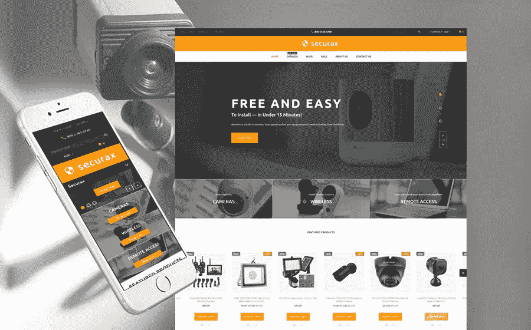

[**详细信息**](https://www.templatemonster.com/shopify-themes/security-responsive-shopify-theme-62168.html?aff=hackernoon)

该模板非常适合销售安全设备。通过添加必要的商品类别和子类别，你可以尽可能方便地制作一份大型菜单。质量代码和平滑过渡效果。

附加功能:

*   滑块；
*   包括库存照片；
*   视差；
*   主题颜色切换器；
*   产品徽章；
*   Ajax Cart
*   排序选项；
*   有效的语义代码。

# 管道供应购物主题

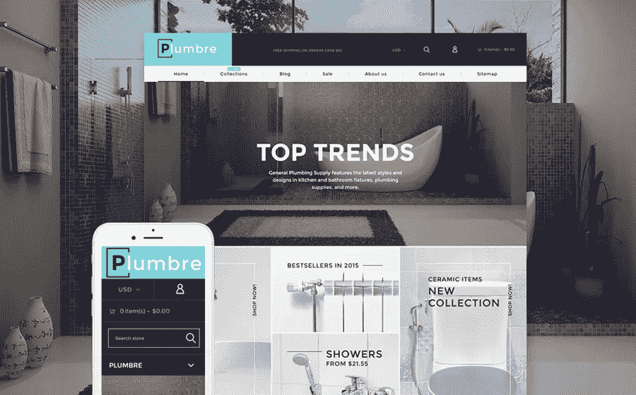

[**详细信息**](https://www.templatemonster.com/shopify-themes/plumbing-responsive-shopify-theme-61388.html?aff=hackernoon)

这个管道和建筑零件 Shopify 主题包括许多优质组件。有了它，您可以手动构建个人页面布局，并为您的在线商店创建独特的设计。界面干净清晰。

主要特点:

*   视差；
*   自举；
*   网格系统；
*   多种货币；
*   在线聊天；
*   有据可查；
*   联系方式；
*   登录表单。

# 轻公司 Shopify 主题

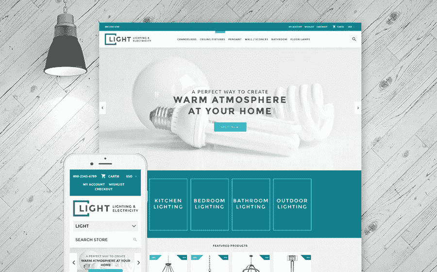

[**详细信息**](https://www.templatemonster.com/shopify-themes/lighting-electricity-responsive-shopify-theme-62005.html?aff=hackernoon)

使用此模板，您可以为照明和电力公司创建有效的销售页面。此外，该模板包括一整套图像和插图。有一个可以理解的文档。其他特性:

*   高级主题选项；
*   评论系统；
*   Favicon
*   谷歌地图；
*   社交选项；
*   HTML 5；
*   博客；
*   用户注册。

# 太阳能购物主题

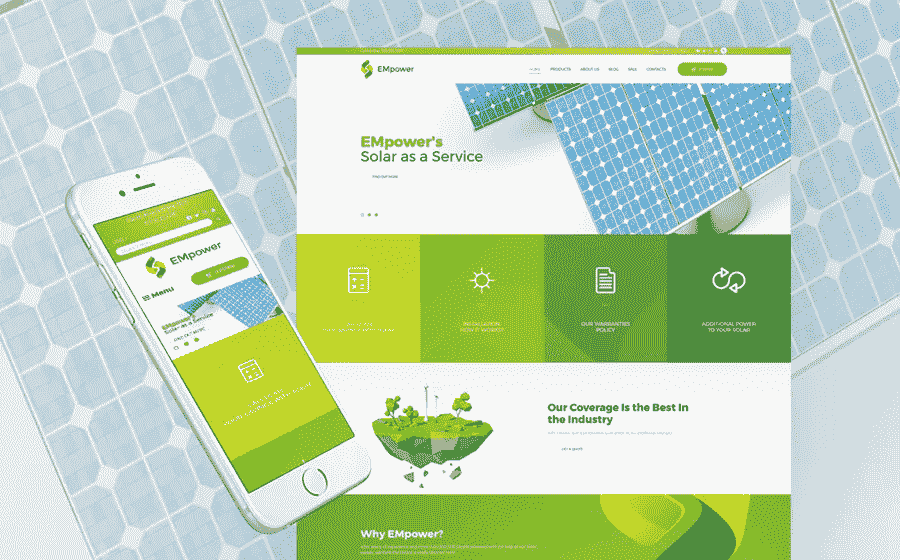

[**详情**](https://www.templatemonster.com/shopify-themes/solar-energy-responsive-shopify-theme-58455.html?aff=hackernoon)

你关心环境吗？建立你自己的能源相关网站，扩大你的客户群。事实上，EMpower 甚至可以加快非商业项目的网站创建过程。在谷歌的高职位是有保证的。

主题的特点:

*   替代模块布局；
*   评论系统；
*   跨浏览器兼容性；
*   定制模块；
*   网格系统；
*   多语种；
*   搜索表单。

# 药店购物主题

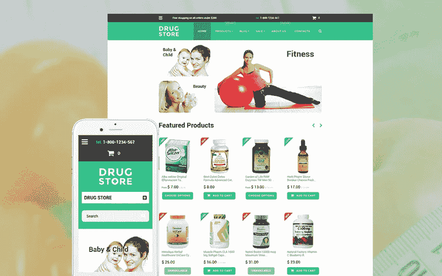

[**细节**](https://www.templatemonster.com/shopify-themes/57948.html?aff=hackernoon)

这个主题非常适合药房网站的开发。使用大量的短代码，您可以非常快速地从头开始创建一个网站，而无需编写一行代码。

主要特点:

*   高级主题选项；
*   跨浏览器兼容性；
*   自定义页面模板；
*   在线商店/商店功能；
*   谷歌网络字体；
*   有据可查；
*   搜索引擎友好。

# Nokshi —手工和工艺电子商务购物主题

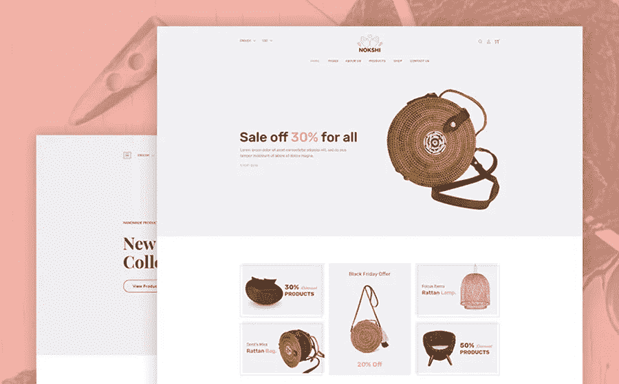

[**详细信息**](https://www.templatemonster.com/shopify-themes/nokshi-handmade-craft-shopify-theme-70255.html?aff=hackernoon)

Nokshi 是 Shopify 模板，专门用于销售各种手工产品的商店。您的客户将轻松浏览您的网站，并快速找到任何产品。要做到这一点，你可以清晰地组织一个包含不同类别产品的大型菜单。

附加功能:

*   4 个不同的主页；
*   产品徽章；
*   主题颜色选项；
*   4+标题；
*   Ajax Cart
*   简讯弹出窗口；
*   证明。

# tmart——极简多用途购物主题

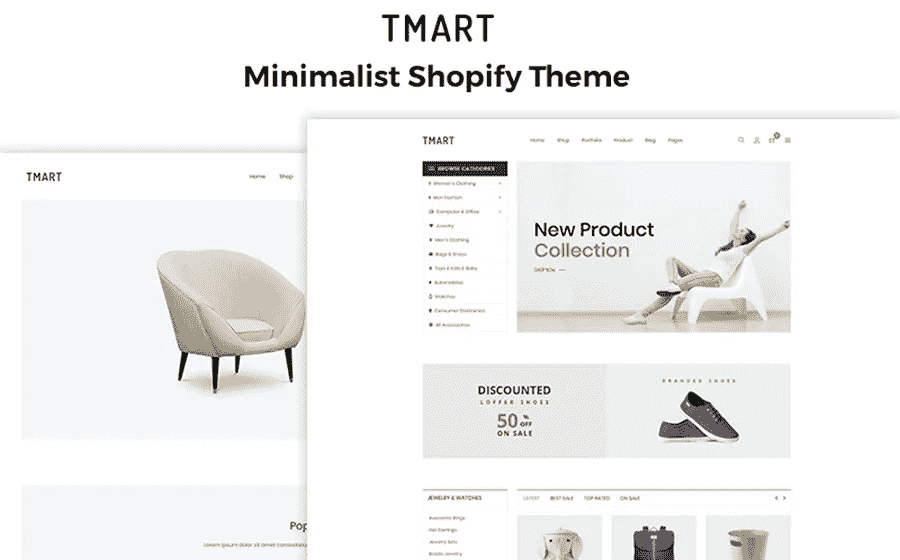

[**详细信息**](https://www.templatemonster.com/shopify-themes/tmart-minimalist-shopify-theme-70254.html?aff=hackernoon)

在这里，我们有一个更高级的电子商务购物主题。这个多功能主题是专门为极简主义者设计的。购物车和所需产品列表在 Ajax 上工作。

其他功能:

*   11 个家庭版；
*   自举；
*   SEO 友好；
*   商店页面布局；
*   8+独特的滑块；
*   快速查看产品；
*   团队成员；
*   联系方式。

# 汽车零件购物主题

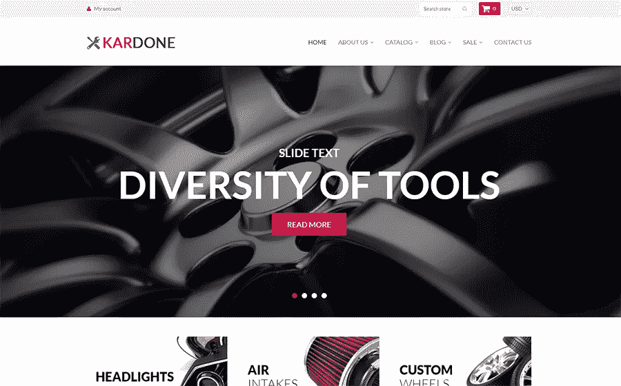

[**详细信息**](https://www.templatemonster.com/shopify-themes/auto-parts-responsive-shopify-theme-62439.html?aff=hackernoon)

简单而高质量的主题设计将让您在高水平上展示您的汽车业务。该模板支持新闻简报订阅。你也可以使用谷歌地图和联系方式，或者开一个博客。

附加功能:

*   4 个有分区的现成商店；
*   Shopify 可视化构建器；
*   多语种；
*   Ajax Cart
*   产品传送带；
*   愿望清单；
*   登录表单。

# 花园家具——家具与室内设计主题

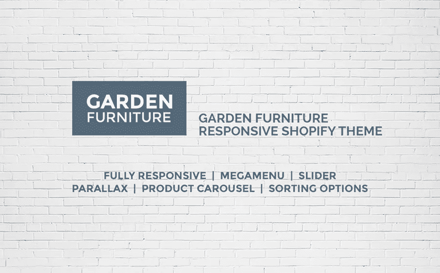

[**详情**](https://www.templatemonster.com/shopify-themes/garden-furniture-shopify-theme-59042.html?aff=hackernoon)

该模板非常适合室内设计工作室、家具店或装饰店。有了它，你可以很容易地通过管理面板配置你的网站的所有组件。为了方便联系你，有一个方便的联系方式。

主要特点:

*   评论系统；
*   跨浏览器兼容性；
*   下拉菜单；
*   谷歌地图；
*   社交选项；
*   工具提示；
*   有据可查。

# 最后一句话

如果你需要一个网上商店的一体化解决方案，Shopify 是你的最佳选择。如果你有任何使用 Shopify 的问题或经验，请在下面的评论中告诉我。