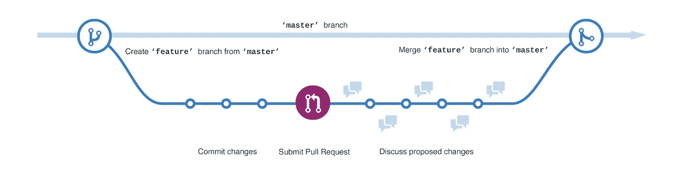

# 增强 Github 流量的 15 个技巧

> 原文：<https://medium.com/hackernoon/15-tips-to-enhance-your-github-flow-6af7ceb0d8a3>

我从事软件开发已经有 10 年了，在这个过程中，我有机会在几个开源项目上合作，也在许多非开源项目上工作，在这些项目中，我们使用 Github 作为我们的版本控制库，在大大小小的团队中工作。

在我的旅程中，我根据项目遵循了不同的工作流程，今天我想与您分享我认为对于构建和维护适用于任何项目的高质量软件来说是有效和实用的工作流程。

高质量软件的属性有很多:健壮性、可测试性、弹性、模块化、可维护性、可用性、安全性、性能、可伸缩性等等，这取决于你正在构建的应用程序的类型。在这篇文章中，我将主要关注以下特征:

*   好的文档:自述文件、文档站点和变更日志。
*   定义良好的编码标准和约定。
*   使用 semver 进行正确的版本控制。
*   自动化测试:不要太多，关注功能性非回归测试。
*   开发者快乐，当然！

为了实现这一点，我提出了一个实用的 Github 流程，利用开源工具来帮助简化和自动化实现这一目标所需的许多任务。

如果你正在做一个开源项目，你想发布你的项目 Github，这是事实。Git 和 Github 已经从根本上改变了 OSS 的开发方式，它们分别成为了版本控制的事实上的通用语言和协作的权威场所。

Github 提出的官方工作流程被称为 Github flow T1，并在他们的网站 guides.github.com/introduction/flow T2 T3 上有很好的记录，大多数开源项目都遵循这个略有不同的工作流程。

Github 工作流程非常灵活，因为它不会告诉您如何发布和记录变更，在接受拉请求时使用什么合并策略，使用什么工具，遵循什么提交标准或在接受拉请求前审查什么，这取决于您，这很有意义，因为没有适合每个团队需求的通用解决方案。

以下是根据我的经验提出的建议:

我主要(几乎完全)从事 JavaScript 工作，我将提到的许多工具都是 JS 生态系统的一部分，然而，这些原则适用于任何语言。

# 通过 Github 项目对您的问题进行优先排序并跟踪您的进度

2016 年 9 月，推出了项目功能。它是一个工具，允许你创建看板风格的板来组织、优先化和跟踪你在仓库和组织层面的工作。如果你使用 Github issues，我强烈建议你利用这个特性来更好地组织和交流项目的优先级和当前的工作。您可以通过以下链接了解更多信息[help . github . com/articles/tracking-the-progress-of-your-work-with-project-boards](https://help.github.com/articles/tracking-the-progress-of-your-work-with-project-boards/)

# 使用标签对您的问题进行分类

Github 提供了强大的过滤功能。如果你正在做一个开源项目，你希望人们在你的项目上合作，并且为开发者提供良好的使用体验。通过标记您的问题，开发人员将能够更容易地浏览问题列表，节省他们的时间，并允许他们以更少的输入摩擦做出贡献。

# 利用 Github 模板处理拉取请求和问题

花时间为你的问题和拉取请求编写 Github 模板肯定会有回报；这将迫使或至少帮助开发人员以标准的方式报告错误和请求特性，并提供解决这些问题所需的所有信息。

在 blog.github.com/2016–02–17-issue-and-pull-request-templates[了解更多信息](https://blog.github.com/2016-02-17-issue-and-pull-request-templates/)

**错误报告的一些通用指南**:

提交问题之前，请检查您是否已完成以下步骤:

*   确保您使用的是最新版本
*   使用搜索功能来确保以前没有报告过该错误

错误报告应包含以下信息:

*   总结:简短的描述。
*   重现步骤:你是如何遇到这个 bug 的？复制它的说明。
*   预期行为:你期望它如何表现？
*   实际行为:它实际上是如何表现的？
*   参考:链接到任何相关的门票或信息来源。
*   如果可能的话，附上 bug 的可视化文档。截图、视频和/或动画 gif。

**拉动请求一般准则**:

*   请确保没有现有的拉请求试图解决提到的问题。
*   在问题跟踪器上检查相关问题。
*   重要的变化应该首先在问题上讨论。
*   让我们知道你正在解决这个问题。
*   在一个话题分支发展，而不是大师。
*   提供有用的拉取请求描述。
*   遵循项目提交指南。
*   写好你的公关描述。
*   链接到描述中的 Github 问题。

# 使用命令行

游戏机是你的朋友。根据我的经验，如果你使用开源技术，学习从命令行与 Github 交互是对你时间的最好利用。有许多不错的图形用户界面，但是，没有一个能提供命令行的灵活性。还有一些工具可以让生活变得更加简单，让开发人员更加高效，这些工具只适用于命令行:

*   **hub** 是 git 的命令行包装器，让你更好地使用 GitHub。无论您是开源的初学者还是有经验的贡献者，hub 都可以让您更容易地从命令行获取存储库、导航项目页面、派生 repos 甚至提交 pull 请求。【hub.github.com 
*   tj/git-extras 是一组 git 实用程序，比如 repo summary、repl、changelog population、author commit percentages 等等。[github.com/tj/git-extras](https://github.com/tj/git-extras)

# 遵循严格的提交消息标准，进行限定范围的提交

始终为您的项目定义并遵循清晰的提交消息标准，一些通用准则是:

*   将每个修复作为单独的更改提交。
*   提供有用的提交消息。
*   在第一行提供一条简短的提交消息(50-100 个字符)。查看`gitk`或`git log --oneline`的输出可能有助于您理解原因。
*   在提交消息的正文中引用 git 问题。

此外，我强烈建议您调整消息范围，以便更好地生成变更日志。当您确定消息范围时，您的变更日志可以提供更多信息。AngularJS 提交约定和 changelog 生成就是一个很好的例子[gist . github . com/Stephen parish/9941 e 89d 80 e 2 BC 58 a 153 # generating-changelogmd](https://gist.github.com/stephenparish/9941e89d80e2bc58a153#generating-changelogmd)

# 定义编码风格标准并配置预提交挂钩

定义编码标准并通过预提交钩子来执行它们对于编写可维护的代码来说是必不可少的。通过遵循这些标准，您可以确保所有代码看起来都是一样的，不管是谁编写的，这有助于接管和维护其他人编写的代码。

我推荐的设置是更漂亮和标准的，然而，这是一个偏好的问题，还有许多其他的，你也可以配置一个自定义的，只要你遵循一个编码标准，你就会受益。

[typicode/husky](https://github.com/typicode/husky) 是一个配置预提交钩子的好工具。

# 对拉取请求配置自动化测试和检查

针对每个拉取请求的自动化功能测试、安全性和代码风格检查是非常可取的，您不希望手动进行。可以快速配置 TravisCI 这样的持续集成服务器，在每次提交 pull 请求时自动对主题分支运行这些测试，并且可以配置 Github，防止开发人员合并没有通过这些测试的 pull 请求。如果这些自动化测试失败，Github 将在 pull 请求上显示一条消息，让请求者修复它们。

在 docs.travis-ci.com/user/pull-requests 了解更多信息

# 保护您的主分支并要求代码审查

Github 为你提供了保护主分支免受直接提交、强制推送和重置的可能性。在项目中与他人合作时，这一点非常重要。此外，为了将代码合并到主文档中，您希望将代码审查作为必需步骤。通过在每个存储库的“设置”选项卡上进行配置。

通过保护 master 和执行代码审查，您可以放心，不需要的代码不太可能出现在 master 中，团队中没有人会影响其他人修改 master git 历史或推送未审查的代码。

# 粉碎你的拉动请求

这是一个激烈的辩论:合并 vs 壁球 vs rebase。我认为壁球合并是最好的方法，原因如下:

*   事实上，并不是所有的开发人员都知道如何在 master 的基础上正确地调整 pull 请求。许多开发人员会简单地将 master 合并到他们的更改之上。Squash merge 去掉了那些对以后构造 changelog 无用的合并消息，并给 git 日志增加了噪音。
*   不是所有的贡献者都会遵循提交指导方针，squash merge 允许控制到达主分支的提交消息。

为了成功地遵循挤压合并工作流，有必要将每个拉取请求限定在特定的功能、错误修复或琐事的范围内。

# Semver、Github 标签、版本和自动变更日志

版本控制在软件中非常重要，尤其是在开源项目中，很多项目都依赖于你的软件。语义版本控制将使每个人的生活更加轻松，因为他们只需查看版本号，就可以准确地知道何时添加了重大更改，或者新版本是否包含新功能或错误修复。

给定主要版本号。小调。补丁，增加:

*   主要版本当您进行不兼容的 API 更改时，
*   当您以向后兼容的方式添加功能时，次要版本
*   当你做向后兼容的错误修正时，补丁版本。

预发布和构建元数据的附加标签可作为主标签的扩展。小调。补丁格式。

除了更改 package.json 版本之外，为每个版本生成一个 git 标记也是一个不错的做法。

在 semver.org 了解更多信息。

传统的提交规范建议在提交消息之上引入标准化的轻量级约定。这种约定与 SemVer 相吻合，要求软件开发人员在提交消息中描述他们所做的消息、特性、修复和重大变更。

通过引入这种约定，我们创建了一种通用语言，使得跨项目边界调试问题变得更加容易。

conventionalcommits.org[。](https://conventionalcommits.org/)

TravisCI 可以帮助实现这一过程的自动化【docs.travis-ci.com/user/deployment/releases 

你可能也会发现这些包很有用[Dominique-mueller/automatic-release](https://github.com/dominique-mueller/automatic-release)，[semantic-release/semantic-release](https://github.com/semantic-release/semantic-release)。

# 使用标签挂钩自动部署

没有必要使用发布分支作为建议的 Git 流。您从 git 标签中取出部署工件；在这个链接中，你将了解到更多关于如何使用 TravisCI[docs.travis-ci.com/user/deployment/heroku](https://docs.travis-ci.com/user/deployment/heroku/)将 git 标签部署到 heroku 的信息。非常简单，只需要将 tags 属性设置为 true。您可以使用任何其他 CI 服务器完成相同的行为。

对于开发环境，您可以设置 hook 来部署最新的主提交，对于特性环境，没有太长的活动分支是可以的，您可以为每个 PR 请求提供短暂的测试环境，但是，这更复杂，也不是真正需要的。

# 在您的聊天室设置 Github 流频道

这是从一个地方跟踪 Github 存储库活动的一种非常方便的方式，这个地方是你和你的团队交流的理想场所。这些是关于一个或几个主题室的简单通知流。但是你可以在你的聊天室里做更多的事情，2013 年 Github 创造了这个术语 **ChatOps** ，你可以在这里了解它[youtube.com/watch?v=NST3u-GjjFw](https://www.youtube.com/watch?v=NST3u-GjjFw)

# 自动化依赖关系更新

保持依赖关系最新是一项耗时且重复的任务，非常适合自动化。幸运的是，有许多工具可以帮助您保持依赖关系的更新，方法是在您的项目上自动创建最新版本的拉请求，您的自动化非回归测试将针对该拉请求运行，如果它通过，一旦您合并它，您的代码将继续正常工作。对重大版本变更要小心，总是要仔细检查。

有几个工具可以帮到你，它们是 [greenkeeper.io](https://greenkeeper.io/) 和【david-dm.org】T2

# 通过扩展增强您的 Github UI 体验

开源开发者已经构建了许多有用的扩展来增强你的 Github 体验，这里有一个列表，你可能会觉得有用。

*   [GitHub 头像](https://github.com/anasnakawa/chrome-GitHub-avatars) [ [chrome](https://chrome.google.com/webstore/detail/avatars-for-GitHub/pgjmdbklnfklcjfbonjfkdhaonlfogbb) ] —在 GitHub 新闻提要中显示头像。
*   [GitHub Awesome Autocomplete](https://github.algolia.com/)[[chrome](https://chrome.google.com/webstore/detail/GitHub-awesome-autocomple/djkfdjpoelphhdclfjhnffmnlnoknfnd)][[Firefox](https://addons.mozilla.org/en-US/firefox/addon/GitHub-awesome-autocomplete/)]——为 GitHub 搜索框添加即时搜索功能。
*   [GitHub Categoric](https://github.com/ozlerhakan/categoric)[[chrome](https://chrome.google.com/webstore/detail/GitHub-categoric/gbfpmfhnfmobaichcfnhdobencecomhg)]—对你的混合 GitHub 通知进行分类。
*   [GitHub Hovercard](https://github.com/Justineo/GitHub-hovercard)[[chrome](https://chrome.google.com/webstore/detail/GitHub-hovercard/mmoahbbnojgkclgceahhakhnccimnplk)][[Firefox](https://addons.mozilla.org/en-US/firefox/addon/GitHub-hovercard/)]—整洁用户/回购/发行 GitHub 的 hover card。
*   [GitHub 等距贡献](https://github.com/jasonlong/isometric-contributions)[[chrome](https://chrome.google.com/webstore/detail/isometric-contributions/mjoedlfflcchnleknnceiplgaeoegien?hl=en&gl=US)][[safari](https://github.com/jasonlong/isometric-contributions/blob/master/safari/isometric-contributions.safariextz?raw=true)]——渲染你的 GitHub 贡献图的等距像素艺术版。
*   [GitHub 链接器](https://github.com/octo-linker/chrome-extension) [ [chrome](https://chrome.google.com/webstore/detail/octo-linker/jlmafbaeoofdegohdhinkhilhclaklkp) ] —将包或 bower 文件中的依赖项链接到它们的 GitHub 页面。
*   [GitHub octo tree](https://github.com/buunguyen/octotree)[[chrome](https://chrome.google.com/webstore/detail/octotree/bkhaagjahfmjljalopjnoealnfndnagc)][[safari](https://github.com/buunguyen/octotree#install-on-safari)][[Firefox](https://addons.mozilla.org/en-US/firefox/addon/octotree/)][[opera](https://addons.opera.com/en/extensions/details/octotree/)]—以树形格式显示 GitHub 代码。
*   [GitHub 自拍](https://github.com/thieman/GitHub-selfies)[[chrome](https://chrome.google.com/webstore/detail/GitHub-selfies/ldnpkdnkgkogfnahcnldaedcoadjbkbl)]——在 GitHub 上给你的推送请求和评论添加自拍。
*   [GitHub Stars Tagger](https://github.com/artisologic/GitHub-stars-tagger)[[chrome](https://chrome.google.com/webstore/detail/GitHub-stars-tagger/aaihhjepepgajmehjdmfkofegfddcabc)]—直接在 GitHub 上将标签添加到您的星级存储库中。
*   [Github NPM 中心](https://github.com/zeke/npm-hub) [ [chrome](https://chrome.google.com/webstore/detail/npm-hub/kbbbjimdjbjclaebffknlabpogocablj) ] —探索 NPM 对 Github 回购的依赖性
*   [Github vscode-icons](https://github.com/dderevjanik/Github-vscode-icons)[[chrome](https://chrome.google.com/webstore/detail/Github-vscode-icons/hoccpcefjcgnabbmojbfoflggkecmpgd)]在存储库浏览器中显示 vs code-icons。

你可以在 [GitHub 浏览器扩展](https://github.com/showcases/GitHub-browser-extensions)上看到更多。

Kikobeats/awesome-Github 提供了更多工具来改进 Github 流程。

# 持续学习和改进

Github 和开源软件开发实践在不断地快速发展，通过遵循 Github 公告和您的社区标准和实践，跟上最新的实践和工具。youtube 上的 GitHub 培训和指南频道是一个很好的资源。[youtube.com/githubguides](https://www.youtube.com/githubguides)

**关于我:**

我是软件工程师和顾问，开源技术栈和分散应用的支持者；我担任过几个工程领导角色，并且是 BlockchainCR 的联合创始人，BlockchainCR 是一个研究和开发区块链应用程序的社区中心。在[github.com/eoscostarica](https://github.com/eoscostarica)的 EOS 爱好者和 OSS 贡献者。

*本文原载于* [https://gaboesquivel . com/blog/2018/15-recommendations-to-enhance-your-github-flow/](https://gaboesquivel.com/blog/2018/15-recommendations-to-enhance-your-github-flow/)