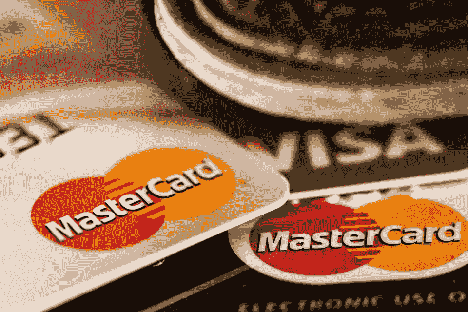

# 2018 年 4 月 16 日:神秘领域最大的故事

> 原文：<https://medium.com/hackernoon/16-04-2018-biggest-stories-in-the-cryptosphere-b804101581c2>

**1。马耳他正在制定指导方针，以确定 ico 何时成为证券**

马耳他金融服务管理局(FSA)，该国主要的金融监管机构，发布了一份[咨询文件](https://www.mfsa.com.mt/pages/readfile.aspx?f=/Files/Announcements/Consultation/2018/20180413_FITest.pdf)，概述了一份指导方针[，以确定通过 ico 筹集的资产何时是证券](https://www.coindesk.com/malta-proposes-test-to-define-when-icos-are-securities/?utm_content=bufferc748e&utm_medium=social&utm_source=twitter.com&utm_campaign=buffer)，何时不是。该文件涵盖了一个可能的金融工具测试，这将属于马耳他的虚拟金融资产法(VFAA)。该国希望得到公众的反馈。之前在 2017 年 11 月发布另一份[讨论文件](https://www.mfsa.com.mt/pages/readfile.aspx?f=/files/Announcements/Consultation/2017/20171130_DiscussionPaperVCs.pdf)时也采用了相同的流程。然后，反馈被用于创建当前测试的方法。测试分为三个阶段。首先，它决定 DLT 资产是否是虚拟资产(实用工具令牌)。在那种情况下，它不受 VFAA 法规的约束。第二阶段将涉及可在二级市场交易的资产，因为欧洲金融监管者的定义将适用于它们。如果代币符合描述，那么它必须遵循金融工具市场指令(MiFID)的规定。另一方面，如果它不符合描述，那么令牌将属于 VFAA 的潜在法规。

**2。三星考虑将区块链纳入运营**

电子巨头三星正在考虑使用区块链技术来改善其供应链，特别是对其货物的管理和跟踪。考虑到三星是世界上最大的芯片制造商，这对区块链来说是一件大事。子公司三星 SDS Co .的区块链负责人 Song Kwang-woo 分享了这一消息。他接着说，运输成本将减少 20%。SDS 负责开发该系统，该系统将由三星电子使用。文书工作和文件成本将显著降低。这项创新技术还有助于缩短产品上市和发货之间的时间，这将提高该公司的竞争力。

**3。万事达卡正在研究区块链的身份数据管理**

万事达卡已经向美国专利商标局(USPTO)申请了[专利](http://pdfaiw.uspto.gov/.aiw?PageNum=0&docid=20180101684&IDKey=883F5BF2B7E6&HomeUrl=http%3A%2F%2Fappft.uspto.gov%2Fnetacgi%2Fnph-Parser%3FSect1%3DPTO2%2526Sect2%3DHITOFF%2526u%3D%25252Fnetahtml%25252FPTO%25252Fsearch-adv.html%2526r%3D1%2526p%3D1%2526f%3DG%2526l%3D50%2526d%3DPG01%2526S1%3D20180101684.PGNR.%2526OS%3Ddn%2F20180101684%2526RS%3DDN%2F20180101684)。该应用程序是[为一个总部设在区块链的系统，这将允许它收集和接收身份数据](https://www.coindesk.com/mastercard-eyes-blockchain-fighting-fake-identities/)，同时解决在其系统中使用假身份的问题。每个实体都有一个“数据文件”，一个公钥和一个“地理管辖区”与之相关联。将有一个层次结构，因为这些实体将是从属的，而上级实体将确保他们有数字签名。只有某些节点能够在网络上提交数据，因为区块链不是公开的。这样做是为了避免数据受损。该公司认为，该系统可以取代目前用于验证身份的应用程序。

**4。区块链剧本帮助政府掌握技术**

一份旨在帮助政府掌握创新技术的[区块链行动手册](https://www.actiac.org/act-iac-white-paper-blockchain-playbook-us-federal-government)已经由美国技术和工业咨询委员会(ACT-IAC) 发布[。非营利教育团体认为有必要更加清晰。区块链的迅速采用意味着政府了解它的实际运作方式及其潜力是非常重要的。最终，纳税人也能从它带来的效率中获益。该文件包括一个五阶段路线图。各机构收到了“初步评估”、“组织准备”和“技术选择”方面的指导方针。此前，美国联邦政府启动了多项旨在调查区块链的项目。](https://www.forbes.com/sites/astanley/2018/04/15/new-blockchain-playbook-helps-governments-embrace-the-tech-and-cut-through-hype/#5941d4497abd)

> 这是由 BlockEx 为您带来的新闻综述。

> 要在您的邮箱中收到我们的每日新闻综述，请在此注册:[*【http://bit.ly/BlockExNewsRoundup-Updates】*](http://bit.ly/BlockExNewsRoundup-Updates)