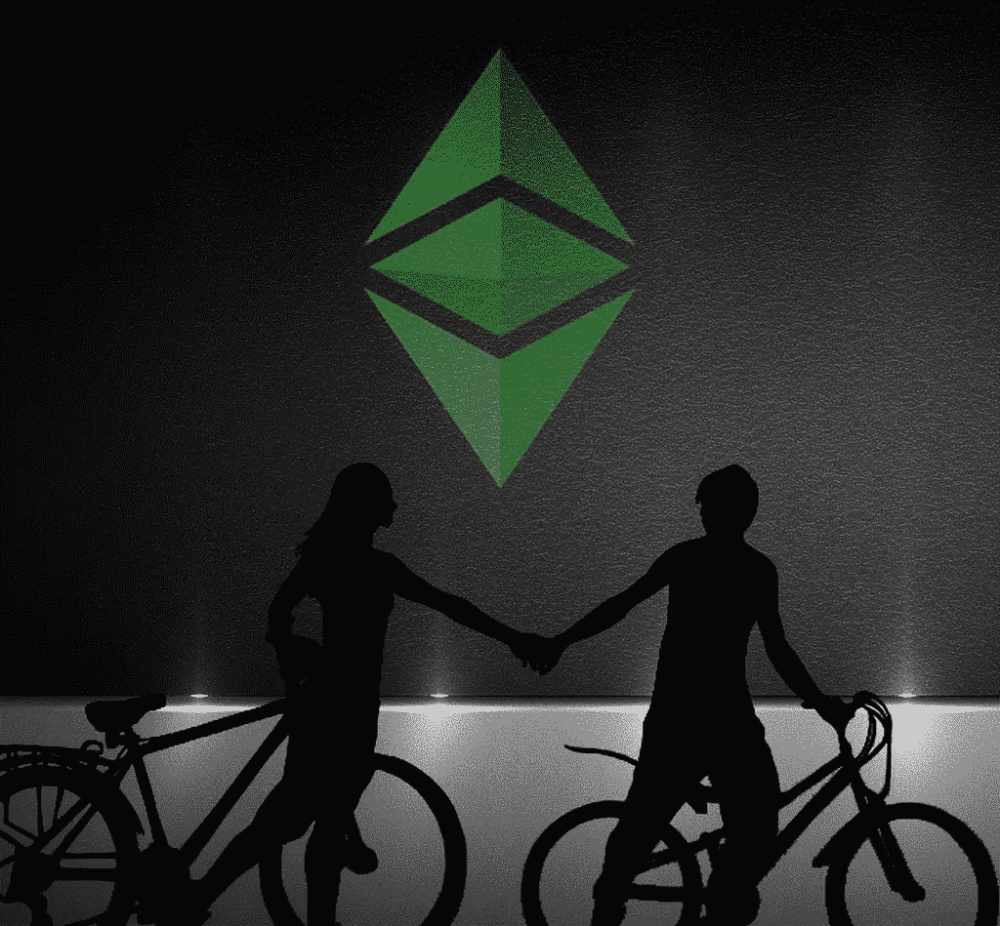

# 2018 年 5 月 16 日:神秘领域最大的故事

> 原文：<https://medium.com/hackernoon/16-05-2018-biggest-stories-in-the-cryptosphere-3efe27022249>

## 通过 BlockEx

**1。共识小组成员被 Bitlicense 赶出纽约**

北海巨妖的首席执行官 Jesse Powell 和 Shapeshift 的首席执行官 Erik Voorhees[讨论了他们是如何被 Bitlicense](https://www.coindesk.com/bitlicense-refugees-kraken-shapeshift-ceos-talk-escape-new-york/) 的过度监管赶出纽约的。Voorhees 抱怨说:“我们这里离自由女神像只有两英里，没有许可证你不能在这个州卖猫。这就是这里发生的事情的荒谬之处”。鲍威尔认为，美国“真的失败了”，因为它让这种行为在州一级而不是国家一级受到监管。他指出，国家虚拟货币法案给日本的产业带来了清晰的前景，以及由此带来的加密业务的繁荣。然而，两人都指出，加密业务往往是高度移动的，而不是与任何一个位置相关联。用户还可以使用 VPN 等变通方法来访问他们可能无法合法获得的服务。

**2。企业以太坊联盟公布区块链标准**

500 强集团周三发布了一个共同的技术规范。这将有助于连接整个以企业为中心、基于以太坊的计划的开发工作。该组织将公司与以太坊专家联系起来。他们的目标是[“定义能够以业务速度处理最复杂、要求最高的应用程序的企业级软件。”](https://entethalliance.org/)该组织非常重要，因为它与以太坊社区合作，帮助机构参与以太坊的革命性发展。

**3。比特币面临跌破 8K 美元的风险**

比特币价格从周六开始小幅上涨，但现在已经瓦解。现在它有跌破 8000 美元大关的风险。比特币现在已经跌破 50 天移动平均线。传统上，纽约的共识会议是该行业最大的会议之一，加密货币出现了反弹，但本周迄今为止似乎并非如此。

> 本新闻综合报道由 [BlockEx](http://bit.ly/BlockEx_) 为您带来。

> *要想在你的邮箱里收到我们的每日新闻综述，请在这里注册:*[*http://bit.ly/BlockExNewsRoundup-Updates*](http://bit.ly/BlockExNewsRoundup-Updates)