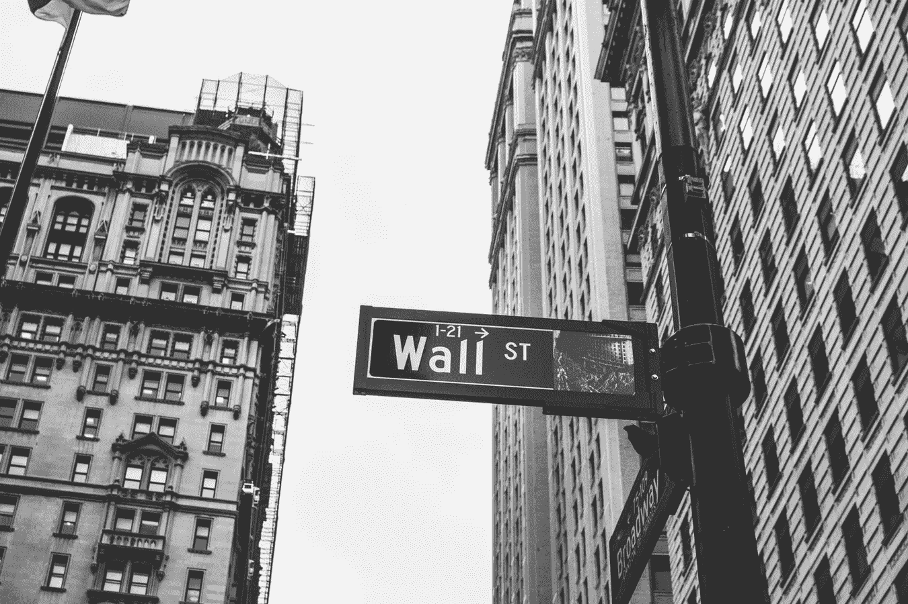

# 2018 年 10 月 16 日:神秘领域最大的故事

> 原文：<https://medium.com/hackernoon/16-10-2018-biggest-stories-in-the-cryptosphere-e8826db0070f>

通过 BlockEx

**1。富达为机构投资者的加密投资提供了便利**

富达投资公司宣布[成立富达数字资产服务公司](https://www.cnbc.com/2018/10/15/fidelity-launches-trade-execution-and-custody-for-cryptocurrencies.html)。现在，机构投资者投资加密货币将变得更加容易。金融服务公司处理超过 7.2 万亿美元的客户资产，拥有 2700 万客户，这一事实证明了这一消息对 crypto 的重要性。富达的公司将为加密货币提供托管服务，并代表投资者在各种交易所进行加密交易，包括对冲基金和家族理财室。该公司董事长兼首席执行长阿比盖尔·约翰逊解释说，公司希望为投资者投资比特币等“数字原生资产”提供便利。虽然其他公司已经开发或推出了类似的产品，但富达是首批正式提供数字资产存储服务的华尔街公司之一。

**2。卢旺达推出区块链支持的钽跟踪器**

作为旨在获取无冲突矿产的倡议的一部分，[卢旺达今天宣布启动世界上第一个由区块链支持的钽追踪系统](https://uk.reuters.com/article/rwanda-blockchain/rwanda-hosts-first-tantalum-tracking-blockchain-idUKL8N1VM3W9)。该国的“矿业老板”希望这个与英国区块链初创企业 Circulor 和矿业精炼企业电力资源集团(PRG)合作进行的项目能够打消投资者的疑虑。PRG 在卢旺达和马其顿都有业务。卢旺达矿业、石油和天然气委员会首席执行官 Francis Gatare 强调了展示该国以更符合道德的方式开采矿产的重要性。矿工希望减少威胁，而区块链的追踪能力可以帮助他们做到这一点。钽:电子工业中用于制造电话等产品的一种元素。

**3。香港监管机构正在研究加密法**

香港证券及期货事务监察委员会(SFC)正在研究发布监管框架，以适用于在香港开展业务的加密货币交易所。该政府机构的主席 Carlson Tong Ka-shing 肯定地说，这将增加对投资者的保护。他还补充说，考虑到互联网已经导致了一个更加无国界的世界，对这个不断增长的行业实施禁令将是不明智的。最好的办法是制定一些规章制度，以便给这个行业带来更多的安全。证监会在处理这种情况时十分小心，因为其管辖权只涵盖证券，因此，从法律角度来看，它可能受到“技术上的限制”。包括 BitMEX 和 Circle 在内的伦敦加密交易所都对这一消息表示欢迎。人们承认，在该市经营的公司目前不受监管，他们将积极主动地与政府合作。

> 这是由 [BlockEx](http://bit.ly/BlockEx_) 为您带来的新闻综述。

> 【http://bit.ly/BlockExNewsAndUpdates】[*要想在你的邮箱里收到我们的每日新闻综述，请在这里注册*](http://bit.ly/BlockExNewsAndUpdates)