# 看啊！我们为你准备了 16 种资源来建立一个更好的创业公司

> 原文：<https://medium.com/hackernoon/16-resources-to-build-a-better-startup-12db06977068>

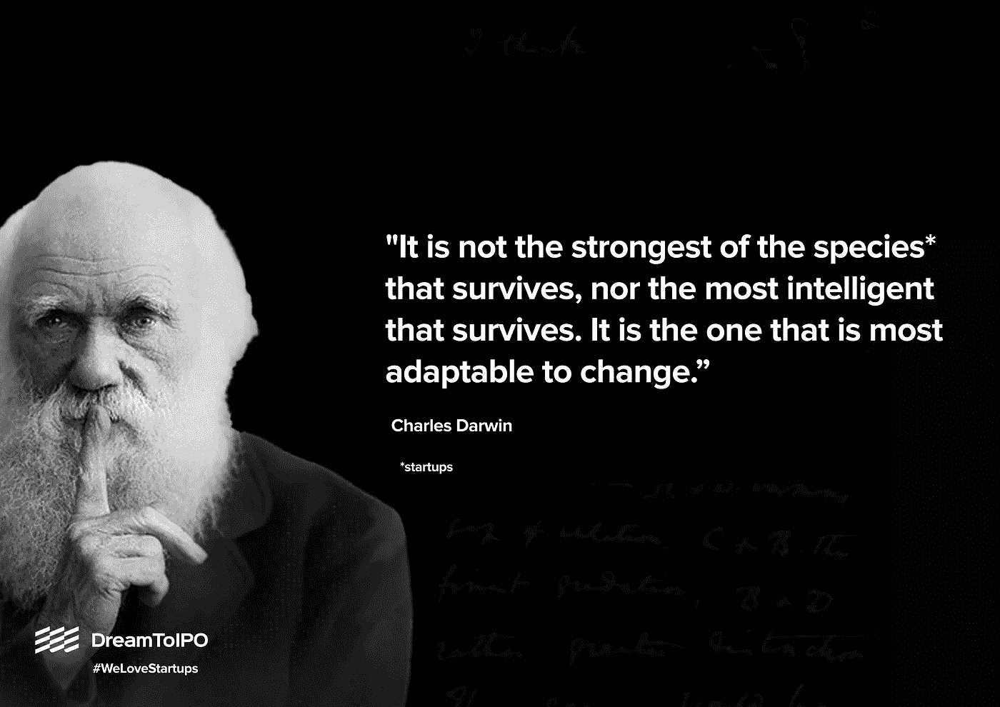

希望对你有帮助-

# ***1。变得真实***

**来自 Basecamp 的《变得真实》**虽然它讲述了创业的复杂世界，但并不令人信服。

从开发一个 web 应用程序到建立一个创业公司，再到将它扩展到一个组织，这本书涵盖了创业公司的方方面面。

获取本书 [***此处***](https://basecamp.com/books/getting-real) 。

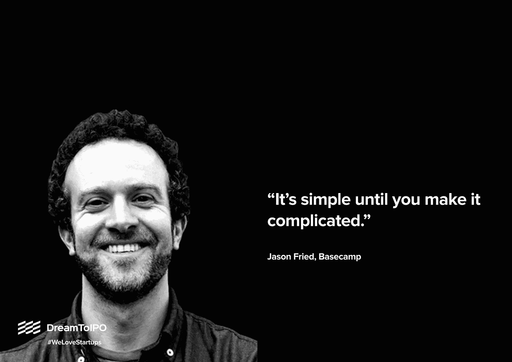

为什么这本书如此重要？听听这本书背后的大脑-

> 《变得真实》包含了简单的见解、逆向观点和非常规的软件设计方法。这不是一本技术书或设计教程，这是一本思想书。任何从事网络应用的人——包括企业家、设计师、程序员、高管或营销人员——都会在这本书里找到价值和灵感。”

# **②*。返工***

另一颗来自大本营的宝石。

**返工**将**变得真实**的对话带到了下一个层次。这本书将重新点燃你肚子里的火，戳破创业公司周围的每一个泡沫。

抢你的副本[这里 。](https://basecamp.com/books/rework)

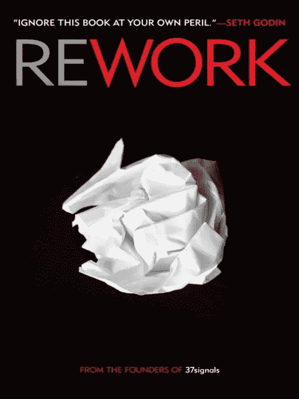

创业文化中的一些大腕强烈推荐返工。这就是 ***马克·库班，联合创始人 HDNet*** ， ***达拉斯小牛队*** 老板对**返工**的看法——

> “如果让我在投资读过《返工》的人和拥有 MBA 学位的人之间做出选择，我每次都会投资《返工》。每位企业家的必读书目。”

# 3. ***塞思·戈丁***

塞思·戈丁应该在商学院被阅读和学习，这是我们 DreamToIPO 的信念。

从赛斯键盘里出来的每一个字，都充满了对创业公司和创业者的共鸣。

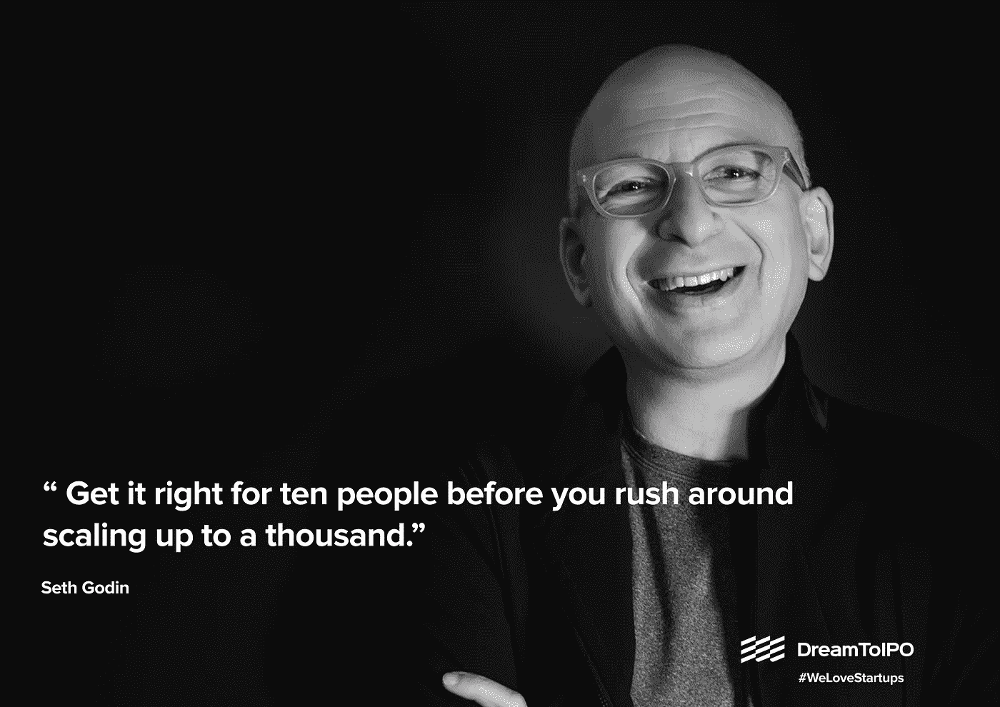

如果你还没有从 Seth 的大量书籍和一个[伟大的博客库](http://sethgodin.typepad.com/seths_blog/)中学习建立一个更好的创业公司的微妙催化剂，你可以从这里开始-****创业的四个要素。****

# *****4。*间隙空隙****

**Gapingvoid 身兼数职。从休·麦克劳德的餐巾纸中萌发出来的 Gapingvoid 承诺**“通过草图转移业务”**。**

**事后看来，你会觉得他们的素描滑稽、古怪、轻盈。[研究并抓住这些漫画隐藏的信息](/dreamtoipo/can-a-mere-cartoon-be-your-startup-muse-ea804379ca00)，你会理解创业文化的危险和伟大，以及提供改变生活的解决方案的快乐。**

**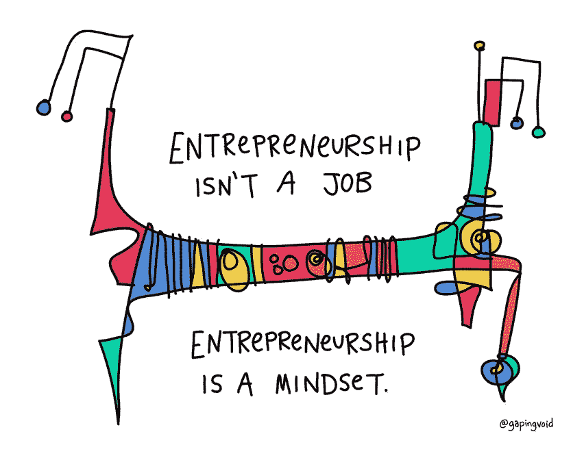**

**[Image Courtesy](https://www.gapingvoid.com/blog/)**

**潜入 Gapingvoid [的世界深处**这里**](https://www.gapingvoid.com/blog/) **。****

# *****5。埃隆马斯克*****

**埃隆·马斯克是一个压倒性的人物。他不仅仅是一个企业家，还是我们世界上最大问题的征服者。**

**研究麝香总是好的，但要确保你有一个好的资源。我们的选择是蒂姆·厄本。为什么？**

**让我们听听蒂姆的意见-**

> ***“2015 年，我接到了埃隆·马斯克的电话。不是你期望发生的事情。接下来，我花了六个月的时间深入了解了埃隆和他的公司，并写了四篇关于我的发现的长文***

**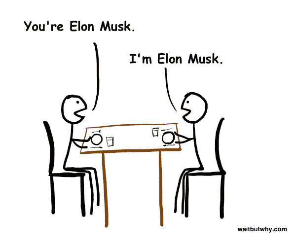**

**Have you ever visualized this avatar of Elon? Image Courtesy- [Waitbutwhy.com](https://waitbutwhy.com/)**

**蒂姆是诚实的。他不是试图分析或批评马斯克努力的专家。作为一个局外人，蒂姆深入伊隆的世界，他的文章让我们有机会了解伊隆的****为什么、何时、做什么以及如何做。******

*****在这里** **获取蒂姆的所有作品** [**。**](https://waitbutwhy.com/2017/03/elon-musk-post-series.html)***

# *****6*。安娜生命信息图:******

***看腻了？让我们和安娜·维塔尔一起喘口气。***

***通过图标和微型副本，安娜描绘了一些成功的初创公司，创始人和企业家最激动人心的旅程。***

***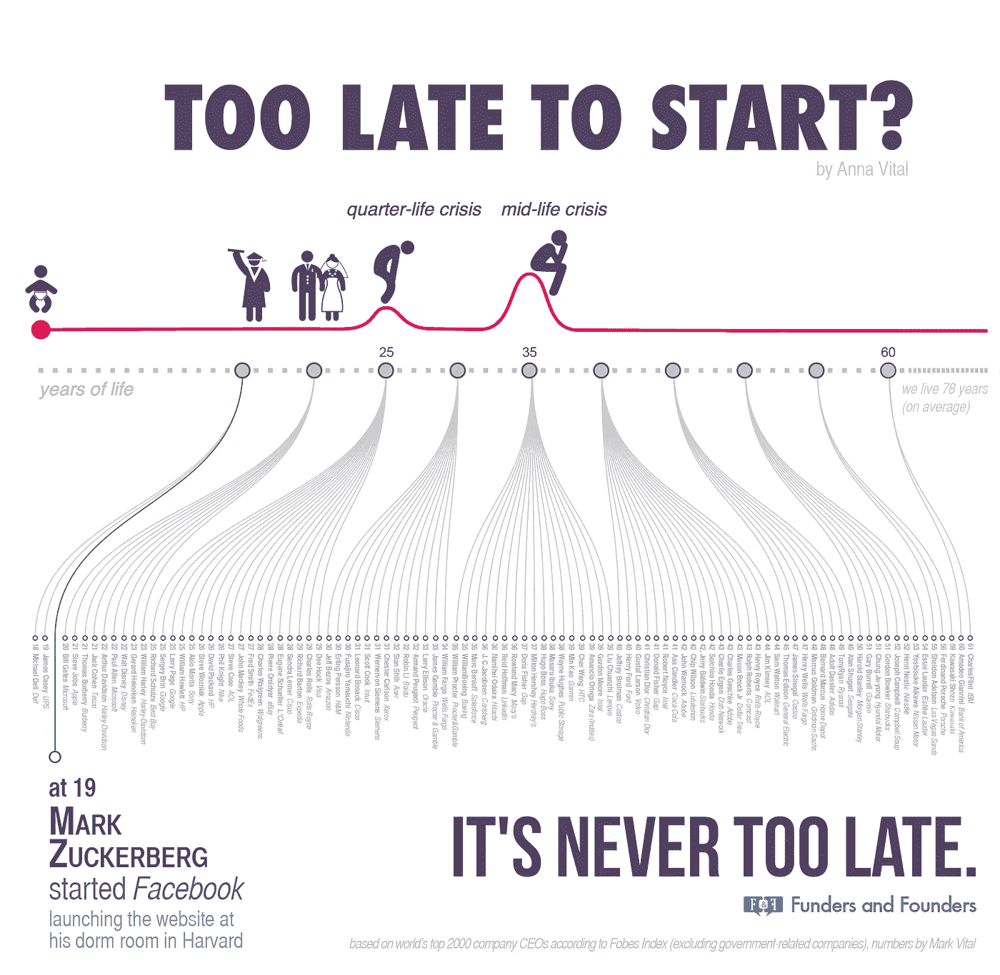***

***[Image Courtesy](https://blog.adioma.com/timeline-infographic-of-founder-age/)***

*****潜于** [**此处**](https://in.pinterest.com/bitwiz/anna-vital/?lp=true) & [**此处**](https://blog.adioma.com/author/anna-vital/) **。*****

# ******7。对讲机博客******

***当创业不再是一个时髦词，而是我们词汇的一部分时，对讲机就出现了。***

***这是大多数科技创业公司艰难维持的地方。但是，不是对讲机。***

***他们做对了什么？他们是如何将一个简单的聊天机器人扩展成一个可扩展的业务，让脸书这样的巨头相形见绌的？***

***我们很幸运，Intercom 坚持不懈地与我们一起记录他们的见解、过程和学习成果-***

***在这里 & [**找到你的答案**](/intercom-inside/ask-me-anything-intercom-ceo-and-co-founder-eoghan-mccabe-92a8bc0f5711) **[**在这里**](https://blog.intercom.com/) 。*****

# ******8。加里·维纳查克******

***加里不适合胆小的人。都不是创业公司。***

***他可能不会帮你打造像对讲机这样的产品，但他会在你最糟糕的时候帮你振作起来。***

***如果你能经受住他毫不掩饰的自我推销，创业路上的美好一课就等着你。***

***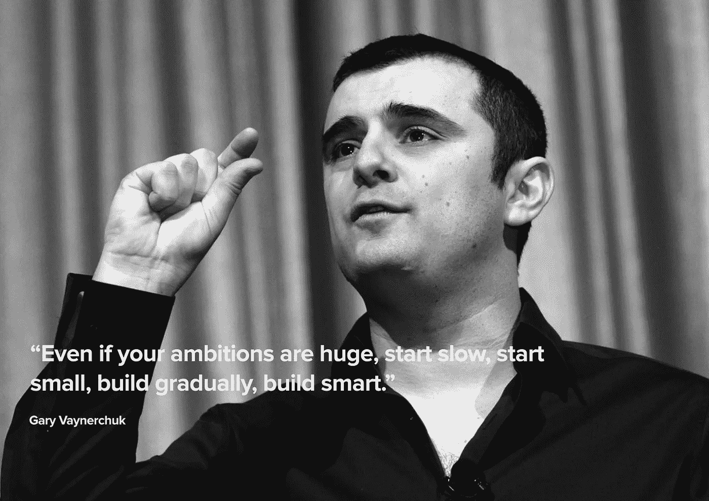***

***消费和过滤加里的内容是一项艰巨的任务。***

*****你可以从** [**这里的**](https://www.youtube.com/watch?v=b9so1vvLgkQ&t=296s) **开始。*****

# ******9。杰夫·贝索斯致股东的所有信件:(1997–2017)******

***当创业不是一个时髦词的时候，亚马逊就在那里。当创业是一个流行语的时候，亚马逊是所有创业公司最大的竞争对手之一。***

***现在有数十亿的资源试图理解亚马逊大规模增长背后的秘密。我们不会把你拖到那里，而是把帝国背后的人的话留给你。***

***亚马逊首席执行官杰夫·贝索斯在致股东的年度信中分享了他的渴望、抱负和洞察力，以提升他们的游戏，成为每个在线客户的头号目的地。***

***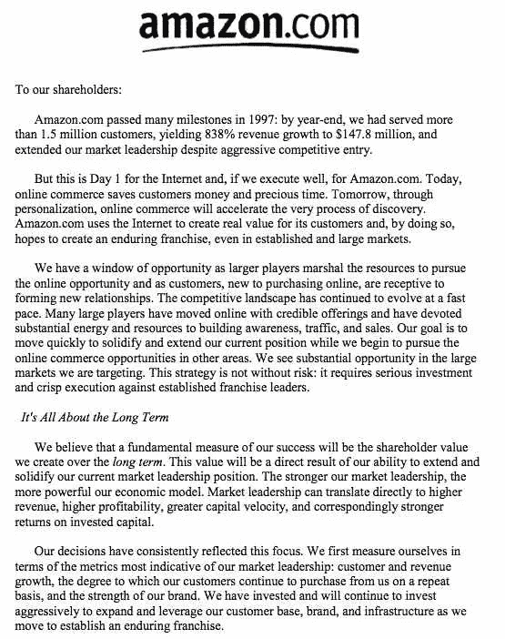***

*****得到全部** [**这里**](https://wordsofward.files.wordpress.com/2017/04/jeff-bezos-compilation-of-amazon-shareholder-letters-1997-2016-final.pdf) **。*****

# *****10*。新优步 CEO 达拉·科斯罗萨西的信******

***从成功到生存，创业公司是一个完整的圈子。我们的资源也是如此。***

***如果杰夫的一系列信件有助于你理解一个组织的伟大梦想，那么新优步首席执行官达拉·科斯罗萨西(Dara Khosrowshahi)写给员工的信将把你带到创业公司的不确定世界，内部混乱和努力纠正一切或从头开始。***

***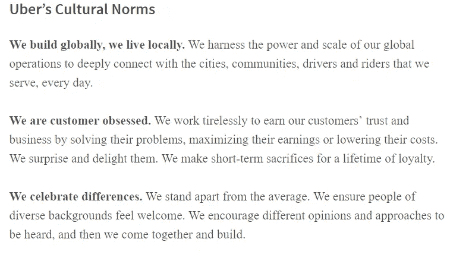***

## ***现在读一下。***

# *****11*。尤瓦尔诺亚哈拉里图书:******

***尤瓦尔·诺亚·哈拉里写到了我们，智人，从历史到未来。***

***他对优等种族的出现和他们未来的冒险的出色表现对今天采取的措施提出了疑问。***

***现在，你的创业公司在哪里？答案就在诺亚的新书《德乌斯人》中，该书对智人的未来进行了大胆预测。***

***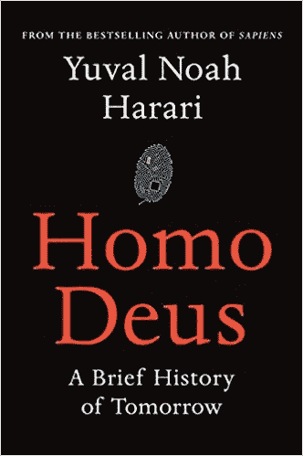***

***你的科技创业公司有能力改变世界。如果这更多的是一个警告而不是一线希望呢？ 因此，我们最好试着了解陷阱，今天就采取负责任的步骤，不要急于求成，而是为了更好的未来开发更好的应用和业务。***

***未来的科技创业公司愿意超越销售漏斗，追逐投资者吗？***

## ***在这里探索。***

# ******12。MailChimp******

***MailChimp 可能不是你著名的创业公司之一。他们甚至不在硅谷运作。但是，如果我们研究 MailChimp 的历程，我们会发现一个杰出的产品和一个强大的核心创业公司，释放一切以产生影响。***

## ***现念。***

# ******13。样式参考线******

***我们常常不明白初创公司是如何玩游戏的。他们带来了哪些微妙的变化，他们做得对吗，对他们进行全面的研究肯定会帮助你建立一个更好的创业公司。***

***和我们站在一条战线上？如果我们帮你打开现实生活中一些最成功的创业公司的模式库、代码标准文档和内容风格指南的储存库，会怎么样？***

## ***听起来不错？现在潜入。***

# *****14*。*乔布斯传*****

***史蒂夫·乔布斯是创业界的偶像。凭借不懈的创新，他为未来的企业家树立了极高的标准。***

***在 DreamToIPO，我们最初对史蒂夫·乔布斯的看法是我们可以从这位伟人身上学到的。沃尔特·伊萨克森关于这位传奇创新者的传记是一笔巨大的财富。***

***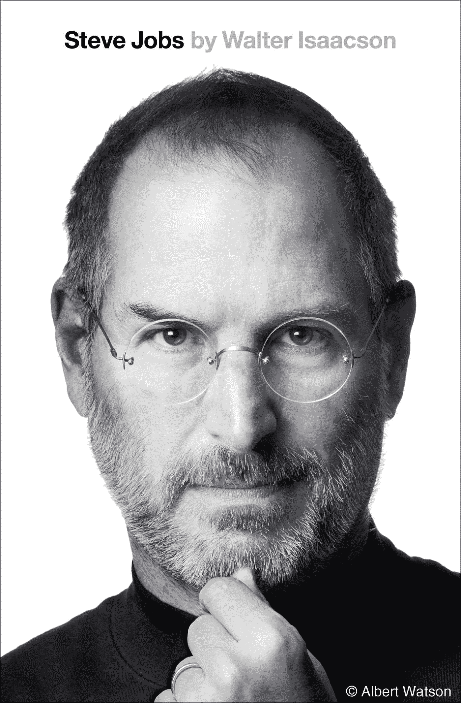***

## ***点击此处获取您的副本。***

***它令人叹为观止，带我们领略了游戏规则改变者史蒂夫·乔布斯的旋风之旅。这是每个企业家在开始建立伟大企业的旅程之前必须学习的。***

# ******15。保罗·格拉厄姆******

***保罗·格拉厄姆是撰写创业文章的老智者之一，他对创业文化的深刻理解甚至在今天仍然具有现实意义。他写的每一篇文章都是未来创业公司创始人的瑰宝。***

***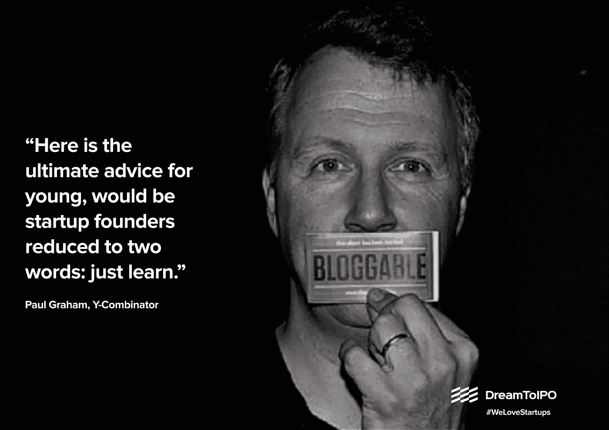***

## ******刷掉你的启动推理*** [***这里***](http://www.paulgraham.com/startupideas.html) ***。******

# *****16*。信号与噪声******

***我们承认我们对基地营的人有偏见。除了创造伟大的产品，他们还分享自己的见解和信念。***

***如果你喜欢他们的书，你会更喜欢他们的中等姿态，在那里他们不断地接受一些创业世界的最大神话，从“痴迷超过喧嚣”到“同步工作”。***

***Jason Fried & Co .是完善你对创业的定义并建立一个有意义的公司的最终目的地。***

## ***从[这个](https://m.signalvnoise.com/lets-bury-the-hustle-9d8aee8ffe1a)开始。***

## ***诚实的坦白***

***我们并不承诺你会用我们的资源建立下一个大的创业公司，打破现状或建立下一个运动。我们也不保证它是创业公司的最佳资源。***

***但是，我们的资源将帮助您对您的工作有更好的想法，找出当前的任务，设想更大的图景，并投入重要的努力。***

***你喜欢这个列表还是发现它令人沮丧？我们错过了什么？***

***与我们分享您的每一个反馈。***