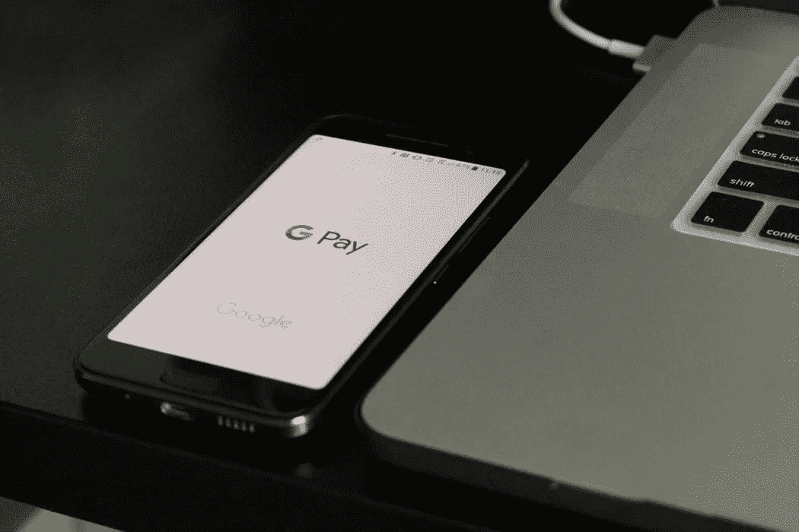

# 2018 年 8 月 17 日:神秘领域最大的故事

> 原文：<https://medium.com/hackernoon/17-08-2018-biggest-stories-in-the-cryptosphere-4342b15b6bf2>

通过 BlockEx

**1。加州法官命令被告用密码支付保释金**

在被指控入侵旧金山一家游戏公司的计算机网络后，法官命令被告[用加密货币](https://www.coindesk.com/california-judge-orders-accused-hacker-to-pay-bail-in-crypto/)支付保释金。该信息通过美国检察官办公室官方网站上发布的[新闻稿](https://www.justice.gov/usao-ndca/pr/hacker-charged-illegally-accessing-computer-network-bay-area-company)共享。马丁·马西被指控非法进入 25000 个账户。他还试图出售获得的信息，给公司造成了 324，000 美元的损失。治安法官科利现在要求他支付 75 万美元的保释金。此外，助理地方检察官亚伯拉罕·西蒙斯[认为](https://padailypost.com/2018/08/15/federal-courts-now-accepting-cryptocurrency-for-bail/)法官能够接受替代资产，如房地产，这意味着这可能不是第一次使用加密来保释。

**2。不到一半的加密货币有实际效用**

Invest in Blockchain 进行的一项[研究](https://www.investinblockchain.com/top-cryptocurrencies-working-products/)显示[前 100 种加密货币中只有不到一半有实际用途](https://www.independent.co.uk/life-style/gadgets-and-tech/news/bitcoin-top-cryptocurrency-best-investment-shitcoin-ico-a8494396.html)。只有 40 个符合要求。用于评估每个令牌状态的标准包括项目状态、路线图、发布历史，以及创作者承诺的功能和实际交付的功能之间的比较。当评估一个 ICO 时，评估它的效用是很重要的。例如，BlockEx 最近进一步增强了其令牌 [DAXT](https://daxt.io/) 的效用。以前，要参加在 BlockEx Markets 平台上发布的 ico，需要此证书。现在，DAXT 也可以用来支付上市费用。

**3。Google Play 上仍有加密挖掘应用**

我们之前[报道过](/swlh/27-07-2018-biggest-stories-in-the-cryptosphere-96c2a377b65f)Google Play 决定禁止 Play 商店中的加密挖掘应用。唯一被排除在路边的应用是那些管理采矿硬件的应用。还提到苹果采取了类似的立场。然而，据[报道](https://thenextweb.com/hardfork/2018/08/17/google-cryptocurrency-mining-apps/)称，开发者仍在开发应用程序，然后在平台上发布。一个例子是 JSEcoin，一家英国区块链的初创公司，本周早些时候在 Play Store 上推出了它的产品。尽管提供手机加密挖掘作为其服务之一，但其上市仍获批准。然而，在这篇文章之后，JSEcoin 应用程序被删除了。然而，其联合创始人兼首席技术官约翰·西姆(John Sim)表示，商店中仍有类似的应用程序。

> 这是由 [BlockEx](http://bit.ly/BlockEx_) 为您带来的新闻综述。

> 要想在你的邮箱里收到我们的每日新闻综述，请在这里注册:[*http://bit.ly/BlockExNewsAndUpdates*](http://bit.ly/BlockExNewsAndUpdates)