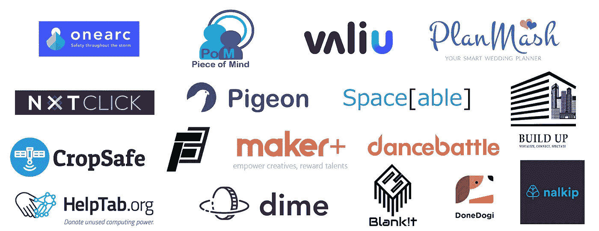

# 17 家国际创业公司诞生于黑客马拉松

> 原文：<https://medium.com/hackernoon/17-international-startups-born-from-hackathons-3609d85804b5>

每年在世界各地都有成千上万的黑客马拉松在进行，但是这些项目之后会发生什么呢？尤其是那些赢了的？

通常，他们得到奖励，团队继续前进。但每年，AngelHack HACKcelerator 项目都会从世界各地的黑客马拉松比赛中挑选获胜项目，并推动它们通过一个为期 12 周的虚拟加速器项目。

下面的初创公司经历了这一旅程，展示了世界各地正在兴起的创新理念。从都柏林一个革新农业技术的年轻创始团队，到深圳一家可能解决电力不足地区电力问题的初创公司，等等。在 2018 年 11 月 1 日于旧金山举行的 [AngelHack 全球演示日](https://globaldemoday.io)上，来看看这些初创公司的演示吧。

# [一角钱，啦](https://dimedrop.io/)

总部位于洛杉矶的初创公司 Dime 是一个数字体育联盟，篮球运动员注册为区块链令牌，这些令牌是唯一、可交易和不可替代的金融资产。这些资产通过具有以太奖金的锦标赛式的联盟来增长和发展。

[了解更多](https://dimedrop.io/)

# 都柏林的 crop safe

来自都柏林的初创公司 Cropsafe 开发了一个在线平台，使用卫星图像和机器学习来准确检测和预测作物中即将发生的疾病和污染。

[了解更多](https://cropsafe.io/)。

# [北京太空城](http://spaceable.co/)

来自北京的 Spaceable 正在连接一个全球网络，允许用户找到或制作工作空间，通过简单的订阅在所有位置提供更多的灵活性和自由。

[了解更多。](http://spaceable.co/)

# 班加罗尔 NXT click

NXTClick 是一个智能平台，使用计算机视觉在离线广告和数字信息之间架起一座桥梁。

[了解更多。](http://nxt.click/)

# [圣地亚哥纳尔基普](https://www.nalkip.com/)

Atatwo 是一种基于小型企业预付系统创建有效奖励活动的新方法。他们使用加密货币使用户能够赚取现金，并将其用于真实的产品。

[了解更多。](https://www.nalkip.com/)

# [墨西哥城布兰克米亚](https://www.blankit.com.mx/)

BlankMIA 是一个智能医疗助理，是一个基于网络和云的平台，具有物联网组件和数据分析。

[了解更多。](https://www.blankit.com.mx/)

# [瓦柳，波哥大](https://www.valiu.co/app/steps/calc)

Valiu 是一个实时计算汇率的平台，允许用户向国外汇款，使用区块链技术提供最佳市场汇率。

[了解更多。](https://www.valiu.co/app/steps/calc)

# [塞浦路斯 help tab](https://helptab.org/)

来自塞浦路斯的 Helptab 是一个基于浏览器的捐赠平台，使用密码挖掘技术向有价值的事业捐赠。

[了解更多。](https://helptab.org/)

# [深圳基金会](http://foundation.energy/)

Foundation 是一个现代配电和管理系统，为智能村庄的发展提供基础设施。

[了解更多。](http://foundation.energy/)

# [科伦坡普兰马什](http://www.planmash.com/)

PlanMash 是一款智能婚礼规划应用程序，它使用机器学习来根据新人的档案建议最合适的婚礼计划和婚礼供应商。

[了解更多。](http://www.planmash.com/)

# [创客+，深圳](https://www.linkedin.com/company/makerplus/)

深圳创业公司 Maker+是一个迷你微信应用程序，允许设计师将他们的设计上传到产品上。用户将能够通过该应用程序购买上述设计。

[了解更多。](https://www.linkedin.com/company/makerplus/)

# [华盛顿的一片心意](https://www.pieceofmindsystems.com/)

帮助阿尔茨海默氏症/痴呆症患者并防止他们迷路的地理定位服务。

[了解更多。](https://www.pieceofmindsystems.com/)

# [首尔 Donedogi](https://www.rocketpunch.com/companies/popcoo)

一个可共享的血库，确保狗可以在需要时获得输血，降低狗主人的成本

[了解更多。](https://www.rocketpunch.com/companies/popcoo)

# 西雅图 one arc

OneArc 是一项在紧急情况下向用户提供其所在区域最新信息的服务，并能够向附近的人请求帮助。

[了解更多](https://www.linkedin.com/company/onearc/)

# [集结，斋浦尔](http://www.buildup.services/)

通过使用 AR 和 VR，building 通过可视化架构和工程为用户和建造者提供了正在开发的项目的视角。

[了解更多。](http://www.buildup.services/)

# [鸽子，奥斯汀](https://www.linkedin.com/company/pigeon-communications/)

Austin startup Pigeon 是一个智能实时通信平台，支持商业生产力和跨语言通信。

[了解更多。](https://www.linkedin.com/company/pigeon-communications/)

# [跳舞吧，SF](http://dancebattlenow.com/)

DanceBattle 平台利用人工智能创建了一个用户社区，他们在舞蹈比赛中竞争。

[了解更多。](http://dancebattlenow.com/)