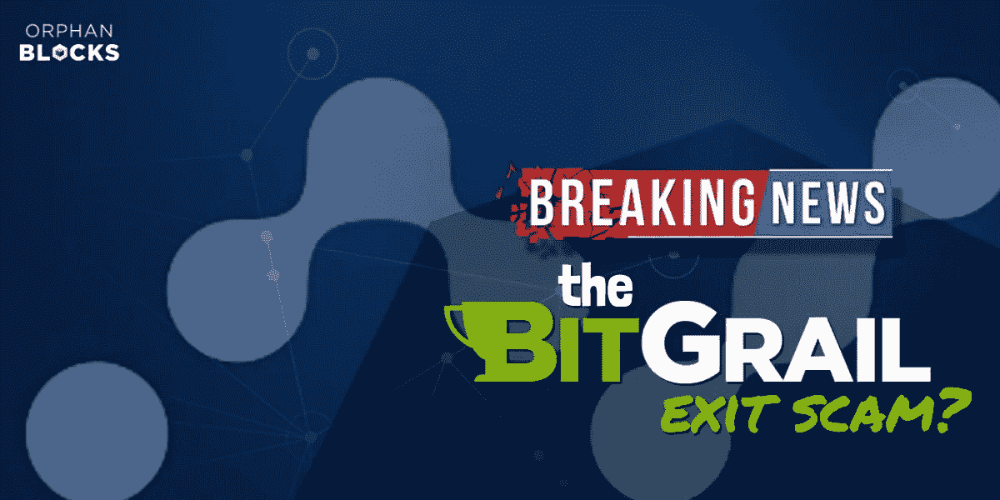
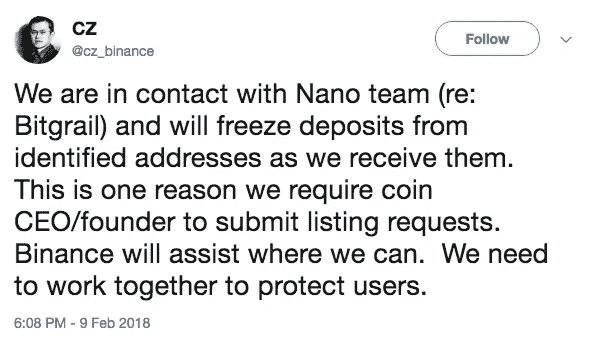
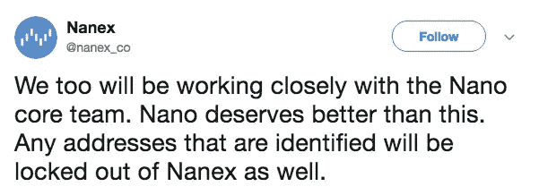
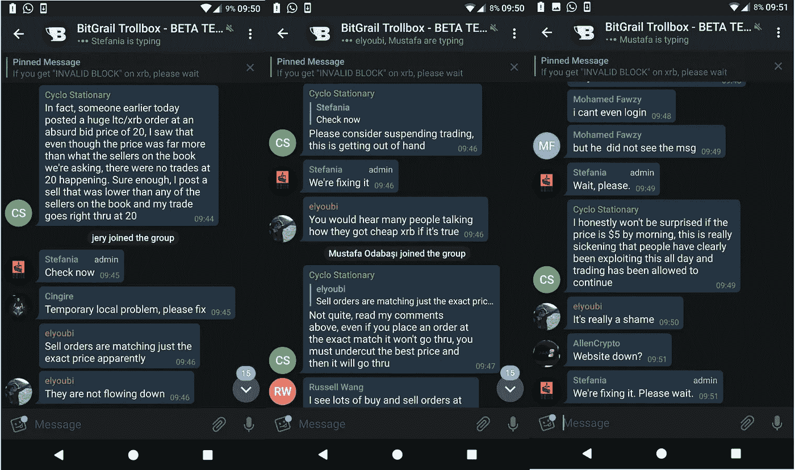
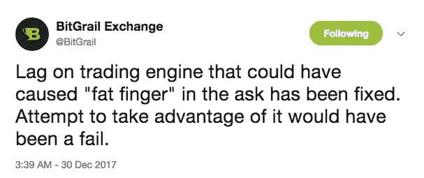
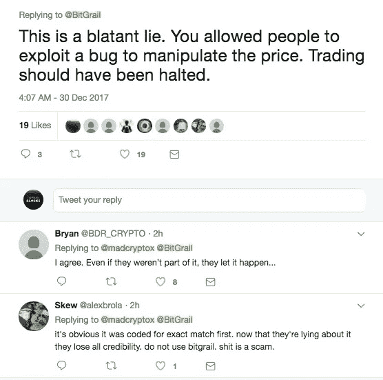

# 1700 万 XRB 被盗，这对四面楚歌的加密货币意味着什么…

> 原文：<https://medium.com/hackernoon/17m-xrb-stolen-and-what-this-means-for-the-beleaguered-cryptocurrency-a21af8f088a>

> “Bitgrail S.r.l .通知其用户，内部检查发现了未经授权的交易，导致 1700 万纳米的短缺，这笔金额构成了 Bitgrail S.r.l .管理的钱包的一部分。”

坏消息经常三番五次传来，陷入困境的加密货币 **Nano** ( *最近从 RaiBlocks* 更名而来)的支持者昨晚遭受了又一次致命打击，当时**比特币交易所宣布他们损失了 1700 万 XRB** ，并立即停止所有交易。

紧随其后的是价格从 37.62 美元的历史高点暴跌，以及节点的[问题，这之前被归咎于 BitGrail 和 Mercatox(几个月前 Nano 可用的唯一交易所)的无能，但结果证明是 Nano 软件中的实际问题。](https://www.cryptocipher.net/2018/01/18/xrb-raiblock-thursday-failure-launch/)

**测试用户耐心的几周…**

自 2015 年开始运营的意大利加密货币交易所 Bitgrail 在过去几周一直在测试其用户的耐心，一系列措施使得用户越来越难以将 XRB 从该交易所撤出。

取款一度受阻，归咎于软件故障。后来，据宣布，交易所[将要求关闭所有非欧盟账户，并提交所有其他账户的 KYC 文件](https://themerkle.com/bitgrail-forces-extra-eu-users-to-close-their-accounts/)以便退出。Bitgrail 只打算把 BTC 而不是 XRB 记入用户账户，这敲响了警钟。

有一段时间，人们天真地怀疑，随着 Nano 收购 Kucoin，并在不久后赢得币安投票批准上市，BitGrail 只是在推迟撤资，因为他们知道自己的大部分业务将被更大的交易所夺走。

**目前的打法状态如何？**

*   BitGrail 的所有者 Francesco Firano(人称“炸弹客”)在 twitter 上宣布，BitGrail 不能向其所有客户退款。比特币钱包只有 400 万纳米。
*   Francesco 指责 Nano 开发者不同意他的建议，更改分类账并向所有损失金钱的人退款。他声称损失是由于 Nano 软件的错误。
*   Nano 开发者[通过发布官方声明回应](https://twitter.com/nanocurrency/status/962096137929883648)，确认他们不会遵从 Francesco 的建议。他们通知了执法当局，并公布了[他们与弗朗西斯科](https://www.dropbox.com/s/3g38y67luolfvqs/Colin_ZS_Bitgrail_chat_log.pdf?dl=0)的个人聊天记录，包括这份谴责声明:

> 我们现在有足够的理由相信，在相当长的一段时间内，Firano 一直在误导 Nano 核心团队和社区关于 BitGrail 交易所的偿付能力。

*   Bitgrail 还宣布他们已经报警，称这将导致资产冻结，这是他希望避免的。
*   Nano 开发者表示，即使他们接受了 Francesco 关于改变分类账的建议，也不可能改变交易的历史。
*   **币安**和 **Nanex** 最近都宣布他们将冻结已确认地址的存款，以试图解救被盗资金:

**对所发生事情的可能解释…**

[Telegram](https://t.me/orphanblocks) 群中的许多用户在 12 月购买时提到了 BitGrail 的一个问题。有报道称，用户正在利用 BitGrail 竞价匹配引擎中的一个错误来获得便宜的 XRB。

尽管网站上的聊天对话框显示，一些用户提到如何利用黑客攻击来使他们的订单在系统上得到匹配，但交易还是停止了。BitGrail 回复了这条消息:

然而，用户似乎对这个答案并不满意:

许多用户认为，不是交易所的钱被盗，而是几个月来 BitGrail 的无能让人们提取了比他们合法购买的更多的 XRB。

这个理论是一个更合理的解释，解释了为什么弗朗西斯科在过去几周让 XRB 撤军变得如此困难。我们可以试着推测可能发生了以下情况:

*   用户利用 BitGrail 交易所的缺陷，将存款翻倍或翻倍，并允许订单以远低于现货价格的价格成交。
*   BitGrail 发现他们冷钱包里的 XRB 少了(注:他们的冷钱包，理论上应该是黑客更难攻击的！)和恐慌。
*   BitGrail 向 Mercatox 发送资金，以使 XRB 疯狂地试图收回资金…
*   …但是 XRB 的价格暴跌打乱了这个计划，迫使他们采取一系列措施来防止用户退出。即将推出的 XRB 对库科恩和币安使他们的工作更加艰难。
*   最终，Francesco 找到了 Nano 的开发者，目的是强迫他们改变账本，以此作为最后的手段。

**这件事的反响**

首先，也是最重要的一点，很多在 Bitgrail 上购买了 Nano 的人要么因为不称职要么因为无法提现而离开，他们已经失去了**所有的钱**。Nano 和 Bitgrail 交易所都已经通知了相关当局。BitGrail 钱包里还有 400 万纳米，所以一旦法律途径用尽，部分退还客户余额应该是可能的。

与此同时，Reddit、4chan 和其他社区的用户正在创建线索和[资源](https://github.com/harwoodleon/bitgrail-hack-resources)来动员社区、[追踪丢失的资金](https://www.reddit.com/r/nanocurrency/comments/7wiimg/the_stolen_nanos_are_on_mercatox_and_they_can/?st=JDGSHQ95&sh=394ac55d)或为未来的法庭日期提供不利于弗朗西斯科的证据。

失去的 XRB(1700 万)是 133，248，289 的总 Nano 供应量的 12.75%。

**Nano 软件是否存在致命缺陷？尽管弗朗西斯科的说法与此相反，但情况似乎并非如此。**

**这是不是让对 Nano 的 51%攻击更容易操作了？**很少有人相信 Francesco 对事件的说法——不可能所有 12%的供应都被一个用户窃取，而且社区在这个问题上似乎没有任何缺乏信任的地方。

然而…

*   Nano 明确向用户推荐了 BitGrail，作为一个可以购买 XRB 的交易所，用户会认为这是对这个陷入困境的交易所的认可。
*   Nano 还提供了自己的时间和专业知识来解决问题，并帮助 BitGrail 运营他们的交易所，进一步巩固了上述印象。
*   Nano 将理所当然地声明不对 BitGrail 的劣质代码和实现负责。

然而，对于那些在“黑客攻击”中损失了数千美元的人来说，这没有什么意义。现在，愤怒的矛头指向了弗朗西斯科和比特圣杯，但是由于诉诸法律是唯一的选择，纳诺可能会发现自己成了愤怒的受害者的目标。

从他们对 BitGrail 的推荐(这已经出现在官方电报上)，到他们花在修复 BitGrail 问题上的时间和精力，因为没有足够快地修复节点问题并推迟币安上市，到他们简单地拒绝接受 Francesco 的建议并修复分类账，所有这些都会被那些迫切希望他们的资金返回给他们的人选中。

纳米有几个选择。他们表示，从技术角度来看，第一个选项(更改分类账)是不可能的。这个选项是有先例的…道黑逼以太坊做了硬叉，追回损失的资金。在上个月的 NEM 黑客事件中，该交易所介入，退还损失的资金，将 NEM 从类似的境地中解救了出来。即使这是可能的，Nano 也必须保持坚定…在巨大的压力下屈服将是他们作为去中心化加密货币的声誉上的一个难以置信的污点。

在交易所层面污染硬币似乎是一种选择，但大多数人认为，被盗资金已经进入比特币混合器和 Monero，因此早已消失。

最后，他们可以简单地忽略这个问题——这似乎是该团队选择的路线，正如他们的官方声明所证明的那样，他们将所有责任归咎于弗朗西斯科和比特圣杯。实际上，他们在说“看，这都是 BitGrail 的错，我们对此无能为力”。这是最好的行动方案，但是当然会引起很多支持和持有硬币的人的愤怒，他们受到了这次失败的影响。

短期内，Nano 的价格又遭受了一次打击，这对那些以 30 美元左右的 ATH 投资的人来说是一颗苦乐参半的药丸，但谢天谢地，他们没有因此失去所有的钱。

许多互联网评论员认为，这是 Nano 的“MtGox”或“DAO”时刻，他们将经受住这场风暴，并最终因此变得更好。我们同意，也许你甚至可以考虑在硬币以折扣价交易时装载，因为这个不幸的故事！

通过电报加入我们:[https://t.me/orphanblocks](https://t.me/orphanblocks)
或者在推特上关注我们:[https://twitter.com/orphanblocks](https://twitter.com/orphanblocks)

声明:Orphan Blocks 的一些作者拥有少量的 Nano。