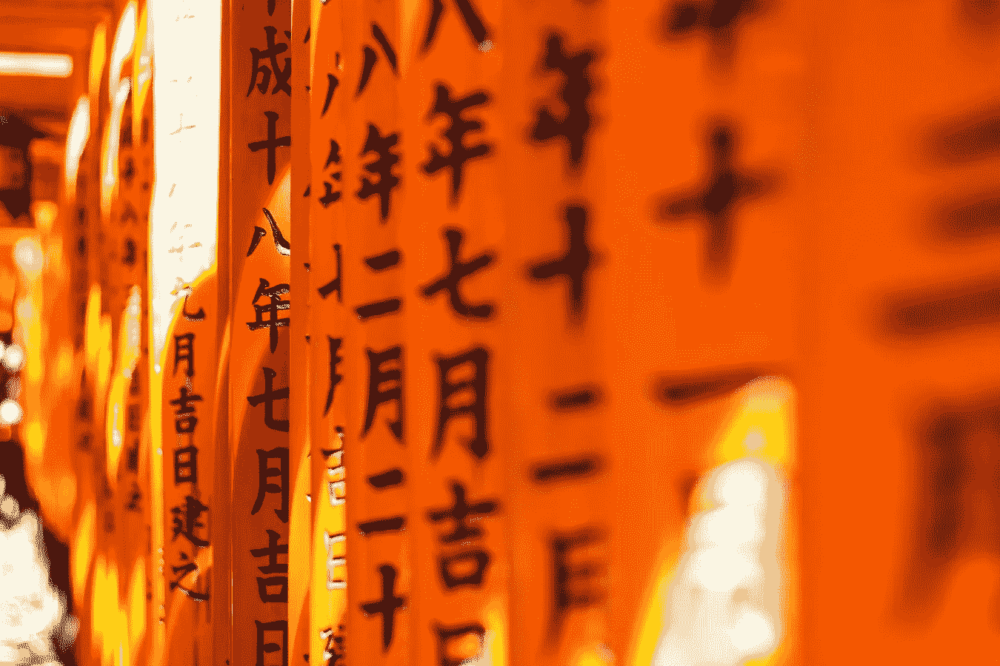
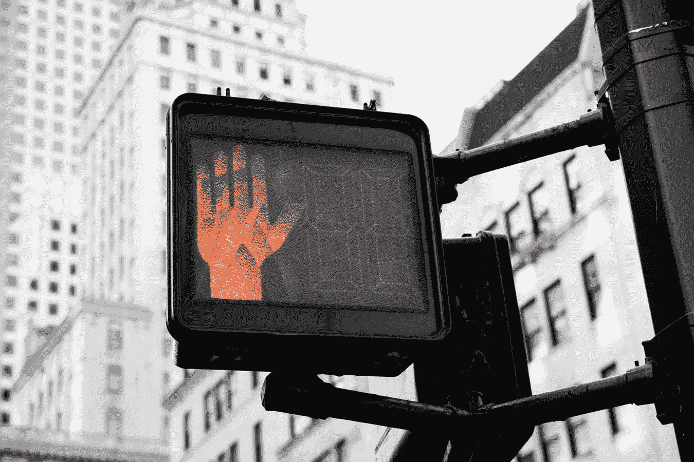

# 2018 年 9 月 18 日:神秘领域最大的故事

> 原文：<https://medium.com/hackernoon/18-09-2018-biggest-stories-in-the-cryptosphere-843e9953829e>

通过 BlockEx

**1。中国政府支持的基金投资与日元挂钩的稳定货币**

早在 4 月份，我们[报道了雄安全球区块链创新基金](https://hackernoon.com/09-04-2018-biggest-stories-in-the-cryptosphere-bd2219de4304)，这是一家中国政府支持的区块链基金。当时，16 亿美元被分配用于投资初创公司。30%的金额由政府自己提供。据[报道](https://www.scmp.com/business/companies/article/2164575/hong-kong-listed-grandshores-raising-hk100m-digital-token-fund)，Grandshores Technology 希望通过一个数字代币基金筹集 1 亿港元(1274 万美元)，发行一种与日元挂钩的稳定硬币。Grandshores Technology 由姚永杰间接控制，姚永杰也是雄安全球区块链的创始人合伙人。这些基金以人民币计价，将向居住在中国境外的投资者募集资金。姚认为，在未来的三到五年内，将成为主流，这也是他目前专注于投资和加密初创公司/项目的原因。

**2。美国监管机构呼吁“无害”方法**

美国商品期货交易委员会(CFTC)主席 J. Christopher Giancarlo 认为[监管机构在处理 crypto 时应该采取‘无害’的方法](https://www.cnbc.com/2018/09/14/do-no-harm-in-regulating-cryptocurrencies-but-be-vigilant-cftc.html?__source=facebook%7Ccrypto+)。他支持自己的说法，提到当互联网在几十年前诞生时，由于政府没有实施积极的监管，它能够蓬勃发展。他现在呼吁对 crypto 做同样的事情。吉安卡洛在上周新加坡峰会期间接受美国消费者新闻与商业频道采访时分享了他的想法。然而，应该指出的是，他没有忽视欺诈和操纵的风险，这些问题经常出现在外汇和贵金属交易中。事实上，监管机构表示，在这种情况下，监管机构需要保持强硬的态度。尽管如此，就政策制定而言，他认为在做决定时保持适度和充分知情是很重要的。

**3。美国国家标准协会将在下一次论坛上讨论区块链**

美国国家标准协会(ANSI)在其网站上[宣布](https://www.ansi.org/news_publications/news_story?menuid=7&articleid=d7ebed90-b6c6-449c-af9f-1acfbc355adb)在下一次法律问题和联合成员论坛，即 2018 年世界标准周上，讨论的主题将是区块链和人工智能(AI)。ANSI 是一个美国的“私人非营利组织，监督各种事务的自愿共识标准的发展”。在这次活动中，[将有可能讨论道德和法律问题](https://cointelegraph.com/news/american-national-standards-institute-to-address-blockchain-at-upcoming-forum)，以及区块链实际上如何被雇用。与会者名单还将包括来自各个行业的专家，包括医疗保健、交通运输和食品安全。ANSI 以前为 C 语言制定了国际标准 ANSI C 和第一个计算机编程语言标准 FORTRAN 66。

**4。区块链可以帮助社会应对环境问题**

世界经济论坛 [(WEF)与服务网络普华永道](https://www.coindesk.com/blockchain-can-help-solve-swathe-of-environmental-issues-says-wef-study/)合作，撰写了一份[报告](https://www.pwc.com/gx/en/sustainability/assets/blockchain-for-a-better-planet.pdf)，探讨区块链如何帮助解决我们社会必须应对的环境问题。该文件于上周在全球气候行动峰会上发布。例如，区块链支持的平台可以帮助分散能源和水等自然资源的管理。它还可以通过改善供应链带来更大的可持续性。可以肯定的是，这项技术已经有助于提高透明度。例如，今年年初，我们[报道了](https://hackernoon.com/29-01-2018-biggest-stories-in-the-cryptosphere-acd08a271e4b)世界自然基金会决定采用区块链技术打击非法捕鱼和金枪鱼捕捞奴隶。区块链如何拯救地球也是区块链峰会的热门话题之一。在这里，讨论了它如何给各种行业带来更多的透明度。这份报告得出了同样的结论。普华永道英国合伙人 Celine Herweijer 指出，即使到目前为止关注的焦点是金融服务业，区块链也可以帮助改善环境。

> 本新闻综合报道由 [BlockEx](http://bit.ly/BlockEx_) 为您带来。

> 要想在你的邮箱里收到我们的每日新闻综述，请在这里注册:[*【http://bit.ly/BlockExNewsAndUpdates】*](http://bit.ly/BlockExNewsAndUpdates)