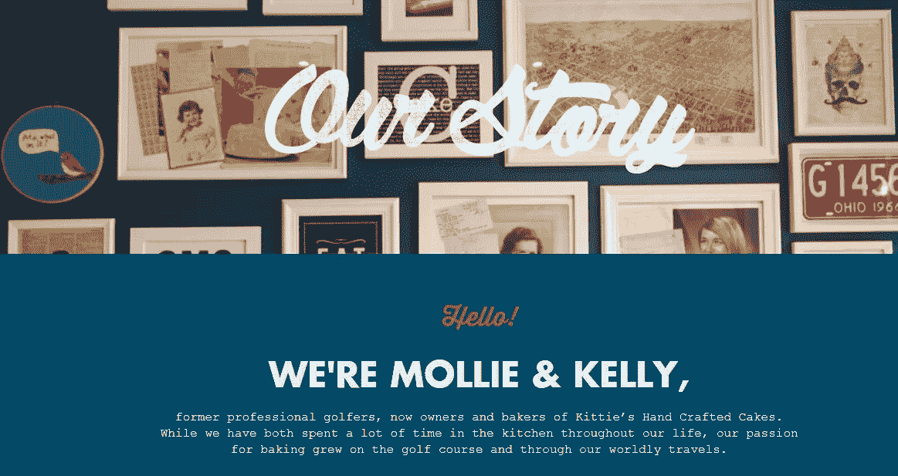

# 18 个独特而成功的关于我们的网页设计例子

> 原文：<https://medium.com/hackernoon/18-unique-and-successful-about-us-page-design-examples-f95f676b8ec1>

“关于我们”页面展示了公司的价值和故事。这 18 个独特而成功的“关于我们”页面范例会给你更多的设计灵感。

一个有效的“关于我们”页面不仅仅是用品牌标志、公司和团队信息填充页面，或者分享公司的理念。你需要将团队和产品作为一个整体来考虑，以呈现一种充满个性的独特风格，让你的设计在用户心目中脱颖而出。

如果你不确定如何设计一个有效的“关于我们”的页面，看看这 18 个例子，找出是什么让它们起作用。

# 这里有 10 个实用技巧，可以帮助你设计一个吸引人的“关于我们”的页面:

*   告诉用户你是做什么的。
*   创建清晰的信息布局。
*   添加位置和数据以获得更多真实性。
*   展示公司的成就，增强用户信任。
*   展示团队和个人成员的真实照片。
*   使用明显的 CTA，让用户容易使用你的产品。
*   不要包含没有实用价值的冗长信息。
*   以独特的方式呈现信息。
*   用时尚的设计给人留下好印象。
*   保持你的布局简洁明了。

# 10 个独特而吸引人的“关于我们”页面实例

# 1.网站(全球资讯网的主机站)

[https://www.website.com/about-us/](https://www.website.com/about-us/)

简洁的布局和简单的设计更能吸引用户。这个“关于我们”页面以灰色调为主，它清楚地向我们展示了公司的品牌故事、价值和真实数据支持。此外，当你向下滚动页面时，蓝色的 CTA 会很突出。

# 2.星巴克

【https://www.starbucks.com/about-us 号

星巴克的“关于我们”页面非常简单。他们的哲学挖掘了人类的情感:“我们确保我们所做的一切都尊重这种联系——从我们的承诺到世界上最高品质的咖啡。”左边的老图突出了它的悠久历史(第一家星巴克店成立于 1971 年)。此外，点击右边的链接将展示具体的公司信息和文化。虽然整个页面没有很多文字，但是产品有效地嵌入了人们的意识。

# 3.Tumblr

【https://www.tumblr.com/about 

Tumblr 的“关于我们”页面是标准化的，在一个标志后面有引人注目的旋转图像。图片下面是具体的网站数据:当前博客和帖子的总数。最新推荐发布的帖子在页面底部突出显示。这对于保持用户在网站上是非常有效的。

# 4.萨尔萨

[https://www . salsa jeans . com/en/about-the-brand/about-us-pg14 . html](https://www.salsajeans.com/en/about-the-brand/about-us-pg14.html)

莎莎是一家网上服装店。“关于我们”页面有一个 2.5 分钟的视频，提供公司信息并传达商店的优秀工艺。由于视频对人类更有吸引力，这种“关于页面”的设计更有可能让用户留在网站上并增加转化率。

# 5.思想作品

[https://www.thoughtworks.com/about-us](https://www.thoughtworks.com/about-us)

每个“关于我们”的页面都是为了让用户了解公司和他们的工作。这个页面确实做到了这一点。团队照片告诉参观者，真正的人——而不是机器——是公司背后的驱动力。信息布局做的很顺利，分享公司理念，运营方式。为了增加可信度，还展示了公司领导层的照片。页面底部的最新消息有助于让读者关注网站。

# 6.奥多奥

https://www.odoo.com/page/about-us

你希望用户更多地了解你的公司吗？你想要他们的信任吗？展示你的成就，但不要过火。低调地展示你的成就，可以鼓励用户信任你，从而提高转化率。这正是奥多在“关于我们”页面上所做的。

# 7.苏尔寿

【https://www.sulzer.com/en/about-us 

“关于我们”页面必须易于导航。它必须简洁地提供有用的信息，不包含任何废话。苏尔寿通过一种巧妙的排版方法做到了这一点，这种方法利用图片文本链接来呈现公司信息。要查看详细信息，用户只需点击。如果他们不需要这些信息，他们就干脆忽略它。通过为用户提供选择，苏尔寿的“关于页面”变得更加有效。。

# 8.凯蒂的蛋糕

[https://www.kittiescakes.com/story](https://www.kittiescakes.com/story)

我们喜欢复古设计的暖色和有趣的插图，更不用说它与传统布局技术的兼容性。

Kittie's Cakes 的“关于我们”页面充满了简单但极其愉快和有趣的插图。这些富有想象力的图画不仅时尚，还增添了个人风格。复古的配色方案和丰富的结构页面让用户在浏览有用信息的时候到处都有惊喜。

# 9.Dropbox

[https://www.dropbox.com/about](https://www.dropbox.com/about)

这些信息以动画的形式展示出来，色彩鲜明，个性鲜明，给人留下深刻的印象。文字排版以黑红为主。由于红色散发出一种温暖的氛围，象征着重要的内容，这种配色方案非常适合。

# 10.羽毛和石头

[http://featherandstone.co/fine-art-wedding-photographer/](http://featherandstone.co/fine-art-wedding-photographer/)

这个“关于我们”的页面因手绘插图而与众不同。羽毛和石头很大程度上依靠这些插图来表达他们的独特性。由于他们提供婚纱摄影服务，这是一个辉煌的设计匹配。

# Dribbble 上的 8 个最佳“关于我们”界面设计

# 关于页面

# Auri 关于页面

# DGiT —关于美国设计

# 数字代理关于页面

# 达斯汀-普特南

# IIoT 公司关于美国网页动画的网站

# 纳米比亚公园关于我们网页

# 展开-关于页面

现在，是时候让你设计一个时尚有效的“关于我们”页面了。你只需要一个简单易用的原型工具来帮助你完成它。

[Mockplus](https://www.mockplus.com/) 是一个简单易学的 web 原型工具，用于创建 web 项目、免费项目、定制项目、应用项目等等。无论你在布局设计还是页面滚动方面需要帮助，你都会发现[用 mock plus’200 内置组件创建一个互动页面](http://doc.mockplus.com/?cat=23)很容易。如果你想连接你的整个产品设计工作流程，可以试试 [Mockplus iDoc](https://idoc.mockplus.com/?hmsr=cherry) ！这是一个面向数字产品团队(包括设计师和工程师)的在线设计协作工具。

结论

“关于我们”页面可以成就或毁灭一个商业网站。想要给用户留下好印象，需要非常认真的对待。我们希望这篇文章能帮助你设计出最好的“关于我们”页面，让你得到你想要的结果。