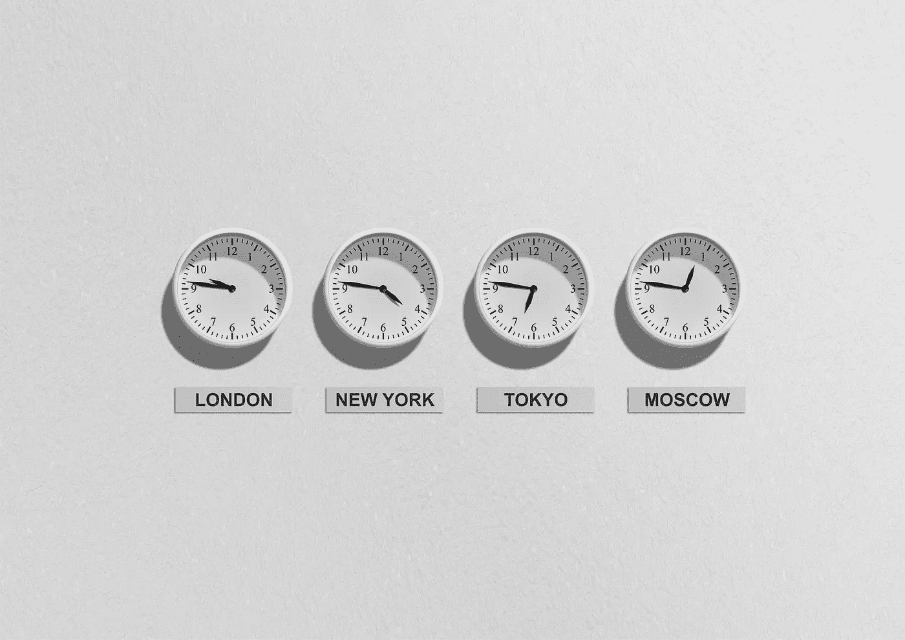

# 2018 年 19 月 1 日:神秘领域最大的故事

> 原文：<https://medium.com/hackernoon/19-01-2018-biggest-stories-in-the-cryptosphere-9274d35e7902>

**1。圣保罗的基础设施很快就可以用加密货币支付**

巴西圣保罗州[正在考虑发行自己的加密货币](https://www.coindesk.com/sao-paulo-wants-pay-infrastructure-cryptocurrency/)，这种货币将被称为 Buildcoin。这笔钱将用于支付对基础设施系统进行可行性研究的工程费用，这是大型建设项目所必需的。此举将允许州和同名城市吸引更多投资者到该市，因为政府将能够支付独立研究的费用，并获得熟练的工程师。此外，这将降低成本，提高透明度和速度。财政部长 Hélcio Tokeshi 表示，圣保罗正在密切关注被视为创新来源的区块链技术和加密货币。甚至美国总统唐纳德·特朗普的前非正式顾问也表示，加密货币可能是投资基础设施的解决方案。这似乎违背了[巴西先前禁止](https://www.reuters.com/article/brazil-bitcoin/brazil-regulator-bans-funds-from-buying-cryptocurrencies-idUSL1N1P71DV)本地投资基金进行加密货币投资的举措。

**2。摩根士丹利将为客户清算比特币期货**

金融服务公司摩根士丹利决定开始清算其客户的比特币期货。首席财务官兼执行副总裁 Jonathan Pruzan 于 1 月 18 日周四宣布了这一决定。然而，该公司并不是第一家提供这项服务的公司，因为高盛集团(Goldman Sachs Group Inc .)此前表示，它将为其客户清算 Cboe 和 CME 发行的比特币期货。由于机构投资者表现出越来越大的兴趣，比特币基地甚至向他们推销其比特币基地托管产品。这也可能导致加密货币价格上涨。

**3。华尔街创建全球加密货币数据馈送**

洲际交易所(ICE)正在开发[一个全球加密货币数据馈送](https://news.bitcoin.com/wall-street-creates-global-cryptocurrency-data-feed/),应该会在 2018 年 Q1 奥运会前上线运行。ICE 的新登陆页面写道:

> “我们的加密货币数据馈送在 ICE Consolidated Feed 上提供，让您可以访问交易最活跃的数字货币的实时、日终和历史数据。”

[洲际交易所公司](https://www.theice.com/index) (ICE)是[旗下许多交易所](https://www.finextra.com/pressarticle/72246/ice-launches-cryptocurrency-data-feed)的所有者，比如纽约证券交易所(NYSE)以及在新加坡和荷兰的子公司。该公司是总部设在亚特兰大的财富 500 强企业。另一方面，它的合作伙伴 Blockstream 是一家私营公司。它还更加关注比特币的核心应用，如侧链，以及比特币相关项目的融资。

**4。法国和德国将在 G20 峰会上联合提议比特币监管**

法国和德国都将在 3 月份于阿根廷举行的下一届 G20 峰会上提出帮助监管比特币的提案。法国财政部长布鲁诺勒梅尔周四表示

> “我们将对与比特币相关的风险进行法德联合分析，并提出监管建议，这些建议将在 3 月份阿根廷举行的 20 国集团(G20)峰会上作为联合建议提交给我们的 G20 同行，”

Le Maire 还告诉记者,对公民进行加密货币教育并保护它们的责任在于政府。这些话是在本周早些时候比特币跌至 1 万美元以下之后说的。许多人都对加密货币保持警惕，但这可能是首次采用跨国方法。

> 要想在你的邮箱里收到我们的每日新闻综述，请在这里注册:[http://bit.ly/BlockExNewsRoundup](http://bit.ly/BlockExNewsRoundup)

 [## 加密货币-黑客正午

### 在黑客正午阅读关于加密货币的文章。黑客如何开始他们的下午？

hackernoon.com](https://hackernoon.com/tagged/cryptocurrency)