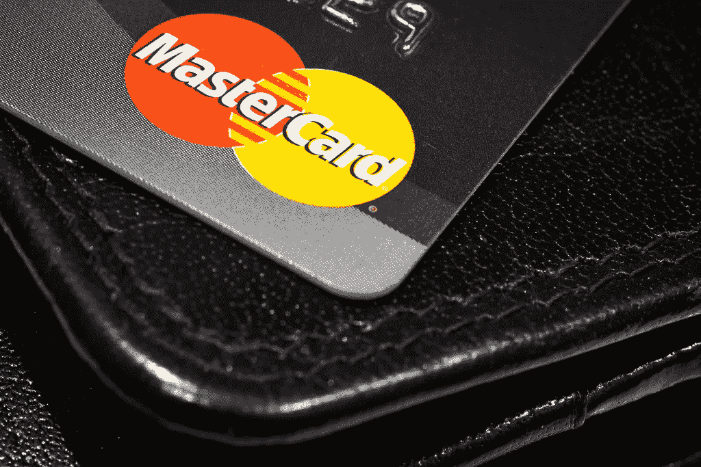

# 2018 年 3 月 19 日:神秘领域最大的故事

> 原文：<https://medium.com/hackernoon/19-03-2018-biggest-stories-in-the-cryptosphere-6ef62c98ce40>

**1。英国央行行长向 G20 保证加密资产，比特币紧随其后**

英国央行行长马克·卡尼和金融稳定委员会(FSB)主席[已经给参加 G20 峰会的财长和央行行长们写了一封信](https://www.reuters.com/article/us-g20-regulations-carney/g20-watchdog-focuses-on-rules-review-holds-fire-on-cryptocurrencies-idUSKBN1GU0SF)。日期为 3 月 13 日的[文件](http://www.fsb.org/wp-content/uploads/P180318.pdf)称加密资产不代表风险。它告诉读者，金融稳定委员会已经调查了这一现象，并不认为加密资产是一种风险，尽管有波动性。这一消息可能是比特币增长的原因之一，在撰写本文时，比特币的交易价格为 8500 美元。我们之前[也报道过](/@BlockEx/21-12-2017-biggest-stories-in-the-cryptosphere-18b9f66e1211)关于卡尼声明比特币不代表对金融稳定的威胁，他的立场似乎没有改变。他暗示，将于明年接替他的继任者将专注于重新评估现有的法规，而不是制定新的法规。

**2。万事达卡对加密货币保持开放**

金融服务巨头万事达卡对国有加密货币的想法持开放态度。在接受英国《金融时报》采访时，该公司亚太区联席总裁阿里萨克(Ari Sarker)表示，该公司将乐于帮助简化这种加密货币的采用。这位高管发表上述言论之际，许多国家都对其央行发行的数字货币表示了兴趣。万事达卡将有利于监管机构支持的加密货币，而不是匿名发行。萨克接着说，他们目前正在日本和新加坡测试一项计划，该计划将允许使用他们的卡提取比特币现金；涉及严格的了解你的客户(KYC)和反洗钱条例。

**3。英国政府将调查加密货币可能存在的风险**

初级财政大臣约翰·格兰表示，英国政府将对比特币等加密货币可能带来的风险展开更深入的调查。这一决定是受加密货币日益流行的刺激。更多的正面词汇被用于区块链，它被视为一项具有巨大潜力的技术。该分析将与英格兰银行和 FCA(金融行为监管局)合作进行。然而，为中国打造金融科技中心声誉的愿望意味着，严格的监管预计不会出台。

**4。北方信托提升其区块链系统**

金融机构北方信托公司(Northern Trust Company)正在[与会计师事务所普华永道(PwC)合作开发一种工具，允许私募股权基金审计员利用存储在该机构私人区块链上的数据。这将有助于节省大量时间，因为客户将不再需要等待报告。尽管该系统已经运行了一段时间，但新功能是最近才推出的，目的是吸引更多的客户。此外，IBM 区块链平台](https://www.coindesk.com/northern-trust-and-pwc-launch-instant-blockchain-audits/)[正被](https://coinjournal.net/northern-trust-pwc-blockchain/)用于网络维护，该平台基于开源的 Linux Foundation Hyperledger Fabric。最后，加密和密钥管理用于交易的可伸缩性和安全性。

> 本新闻综合报道由 [BlockEx](http://bit.ly/BlockEx_) 为您带来。

> *要想在你的邮箱里收到我们的每日新闻综述，请在这里注册:*[*http://bit.ly/BlockExNewsRoundup-Updates*](http://bit.ly/BlockExNewsRoundup-Updates)