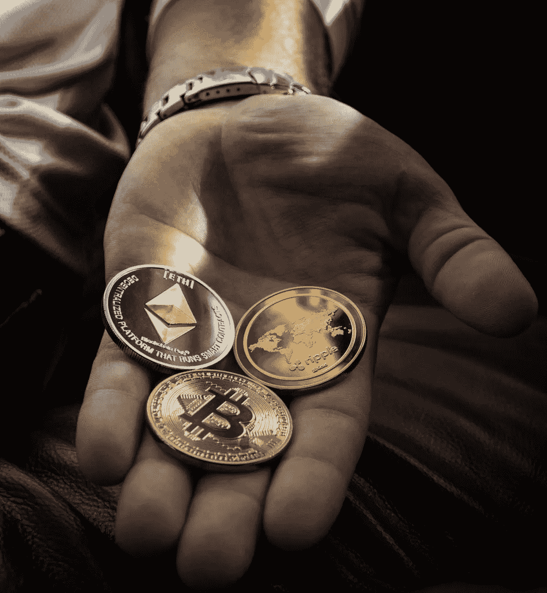

# 2018 年 7 月 19 日:神秘领域最大的故事

> 原文：<https://medium.com/hackernoon/19-07-2018-biggest-stories-in-the-cryptosphere-5c66ec60b123>

通过 BlockEx

**1。美国政府机构将推出区块链监管沙盒**

消费者金融保护局(CFPB)希望通过[推出监管沙箱](https://www.coindesk.com/us-consumer-finance-watchdog-opens-regulatory-sandbox-to-blockchain/)来推动区块链和其他金融技术创新。这一倡议是由代理负责人米克·马尔瓦尼宣布的。CFPB 希望帮助公司开发基于这些新技术的产品和服务。“加密货币、区块链平台、其他私人货币和个人小额贷款都将受到政府机构的调查。在未来，他们甚至可能会考虑替代目前的信用评分系统。

**2。瑞士不想失去它在加密项目上的地位**

最近，加密货币项目已经离开瑞士，这促使瑞士监管机构确保制定有利于加密行业的法律。由于更友好的银行体系，瑞士的业务正被列支敦士登、直布罗陀和开曼群岛等国家抢走。与传统银行业相比，密码行业仍然只占很小一部分。然而，成百上千的人被雇佣，人们相信这个行业在未来几年只会增长。瑞士国家银行(SNB)的 Thomas Moser 提到了加密货币公司如何努力开设银行账户，并希望央行干预，但被重定向到金融市场监管机构 FINMA。更友好的法规肯定会有助于“外流”。

**3。基于区块链的“提案评估系统”将在韩国推出**

韩国行政区永登浦区启动了一项基于区块链的“提案评估系统”，该系统将使行政程序更加公平和透明。得益于新技术，实现智能管理将成为可能。总体而言，评估提案流程将变得更加可信。各个领域将得到改进，“包括实时结果披露、举行提案审查会议和公布谈判结果”。评估委员会将在他们对区块链的决定上数字签名，然后这些决定将被实时上传到永登浦区办公室的主页上。

**4。俄罗斯将维持针对加密矿工和持有者的现有法律**

据[报道](https://cointelegraph.com/news/russia-crypto-miners-and-holders-will-be-regulated-under-existing-laws)，加密货币的开采者和持有者将受到国内税收法规的监管。杜马金融市场委员会主席阿纳托利·阿克萨科夫透露，今年晚些时候将通过一项关于数字金融资产和加密货币的法案。他们不会从特别税收计划中受益。已经存在的俄罗斯税法将对加密货币矿商和持有者实施。然而，还不能排除将来建立一个单独系统的可能性。目前，个人将支付所得税，而法律实体将根据业务类型进行支付。

> 这是由 [BlockEx](http://bit.ly/BlockEx_) 为您带来的新闻综述。

> 要想在你的邮箱里收到我们的每日新闻综述，请在这里注册:[*http://bit.ly/BlockExNewsAndUpdates*](http://bit.ly/BlockExNewsAndUpdates)